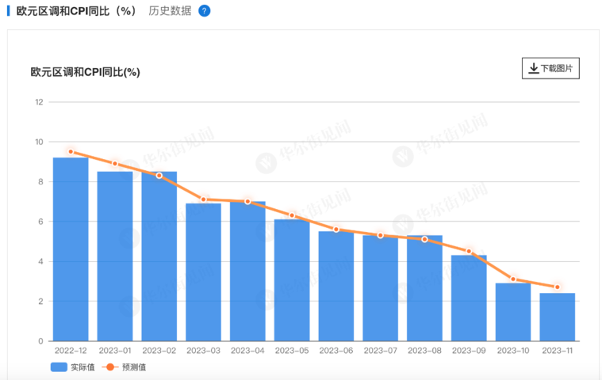
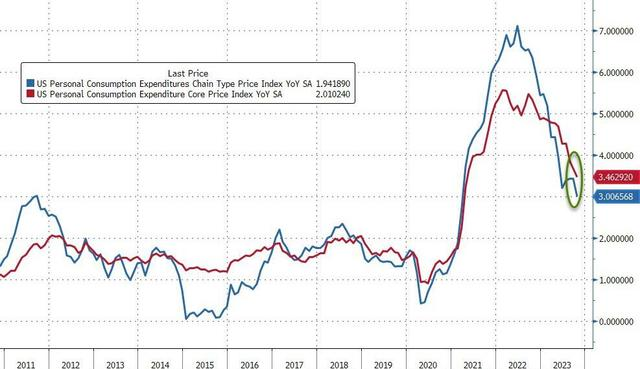

# 市场赌降息的“底气”：通胀跌的太快了

似乎就在昨日，各大财经媒体连篇累牍地报道全球通胀高企。但未来，情况似乎要来一个“180度大转弯”。

10月，多国通胀数据低于预期，较年初峰值明显下降。最新的数据更是引人注目：11月份的欧元区通胀数据跌至2.4%，远低于10.6%的峰值，这一跌幅超出了市场共识。

对比媒体调查的经济学家预测，10月有53%的通胀数据数据低于预期，包括英国、欧元区、美国、墨西哥、澳大利亚等地，另有25%的数据符合预期。

在许多国家，能源价格的下行是推动通胀下降的主要因素。例如，在欧元区，能源通胀连续两个月下跌超过11%，而英国10月份的能源通胀更是降至-15.7%。

即便剔除食品和能源因素，许多国家的核心年度通胀（不包括食品和能源）也低于预期，其中就包括美国、英国、印尼和日本。

_（美国10月份剔除食物和能源后的核心PCE物价指数同比增速，从9月的3.7%回落至3.5%）_

11月的初步数据显示，这一趋势愈加明显。78%的数据低于预测，例如意大利11月通胀率意外下降至0.7%，远低于欧洲央行2%的目标水平。此外，比利时已连续两个月出现通缩。

穆迪分析的高级经济学家Kamil Kovar指出，在欧元区：

“人们可能很快就会谈论通胀过低，而非过高。”

去年以来，在通胀不断超预期的背景下，政策制定者接连上调通胀预测。以英国央行为例，其在过去两年的多份货币政策报告中，都调整了2024年最后一个季度的平均通胀预期。2022年8月，这一预测值为1.4%；今年2月，这一预测值被上调至2.1%；在11月最新一份报告中，这一预测值被进一步上调至3.4%。

一些经济学家认为，央行可能还会坚持一段时间内高息政策。原因在于他们依然担忧强劲的工资压力，同时也不希望融资条件过早放松。

**尽管如此，市场似乎已经提前行动，预计主要央行可能提前降息。**

Hargreaves Lansdown 的高级投资和市场分析师 Susannah Streeter
警告说，如果通胀持续低于预期，央行最终可能会适应市场预期：

“央行此前在通胀预期上的误判并非首次，尽管最初有所抵抗，但他们最终还是慢慢地调整政策以符合市场预期。”

