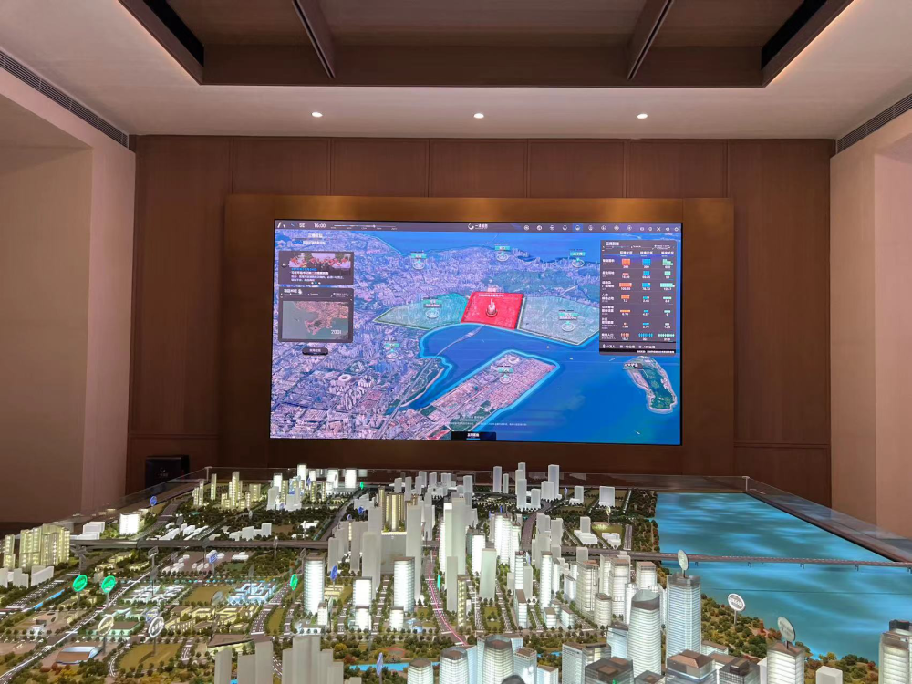

# 深圳楼市新政首周，豪宅仍在冷却期，销售：买房抽豪华游轮8天7夜游

就在上周，深圳进行了一线城市中最大的楼市调整：一是二套房首付比例降至4成，二是取消总价750万元的“豪宅线”认定标准。

外界看来，这些变化将对深圳楼市带来实质性的影响。

“新政出来后，豪宅市场没有太明显的变化。虽然客户整体到访量有所增加，但实际的成交量并未明显体现出来。”一位深圳豪宅市场的资深从业人士张宗向记者表示，豪宅市场还需更多的信心提振。

近日，九派财经实地走访深圳多个豪宅片区了解到，本该直接刺激的豪宅市场并未如预期般活跃起来，整体反应相对冷淡，两大利好新政或仍需时间发酵。

**新政市场反应平淡：开发商加速去化，持续“花式”促销**

外界普遍看来，取消“豪宅线”标准的价格限制，又叠加上二套房首付下降的利好，会迅速刺激深圳的豪宅市场。然而，实际情况似乎还未表现出如此趋势。

前海作为粤港澳湾区前沿核芯、高端金融产业、建设城市新中心，在过去的几年里，这个片区被公认为深圳的新兴豪宅板块，屈指可数的住宅产品一度备受追捧。

招商地产今年新推的招商一湾臻邸便位于前海前湾。11月30日，九派财经走访该楼盘发现，作为招商准豪宅产品线的一湾臻邸，今年7月开盘，目前仍处于顺销阶段。

_深圳豪宅楼盘。涂梦莹｜摄_

“目前整体去化率约在5成左右。”一位现场楼盘销售透露，本轮新政后，楼盘到访客户有所增加，一周整体成交3-4套左右。“这段时间出现了新的预定，部分客户有购买实力，但可能资金还没有回笼。”

相较于此前，一湾臻邸的去化情况似乎稍显颓势。据九派财经了解，住宅相对稀缺的前湾片区，总共入市两个住宅盘，即2021年入市的前海天境花园、润峯府，分别推出1003套住宅、743套住宅均在开盘当日售罄。而上述楼盘备案均价超11万元/平，一湾臻邸均价则在10万元/平左右。

与一湾臻邸相隔两公里的深铁前海时代，将在年底推出第三期住宅项目。据现场项目销售人士称，从5月份预热至今，项目整体到访客户大概在1000多左右。但他透露，上述客户并不完全属于住宅产品客户。

“去年比较火的时候，全款客户都占了一半多。上周新政后，整体没太多变化，今年（销售预期）不太好预测。”该人士表示。

当日，九派财经走访其他片区楼盘项目同样发现，新政利好落地后，一定程度上吸引了部分客户到访，但实际成交并未因此有明显的提升，观望情绪较为浓重。

为此，一些开发商也在加速去化库存，通过提供优惠措施来吸引购房需求。有媒体报道，深圳南山绿景白石洲项目推出部分“一口价”房源，活动时间为11月23日-30日，部分房源较原总价减少100万元。其中，以126平方米户型为例，优惠后相当于打了9折。

在走访过程中，九派财经同样了解到，一些楼盘项目提供“花式”促销活动。其中，招商一湾臻邸推出了“挚友计划”，在12月10日前全款到账业主可以报名参与抽奖——豪华游轮8天7夜游。据一湾臻邸介绍，这次游轮船票价值4万元，航线经过深圳、香港和越南。

**进入买方市场：整体房源过剩，政策实现需要过程**

张宗在深圳从事豪宅销售工作有近十年，见证过豪宅市场的起伏和变化。然而，今年他感受到了一个更明显的市场氛围——买方市场的到来。

“年初以来，（豪宅）市场情况比去年还差一些，豪宅挂牌量上升了许多。”张宗透露，在整体供应量增加的情况下，购房客户的选择性增强，他们变得更加保守，并且更加愿意进行价格比较。

保守还体现在大多数人不愿意“加杠杆”。“从去年开始，很多购房客户都选择全款付款，贷款的意愿不高。”张宗认为，实际上，这次利好新政对很多有实力的客户来说，并不算是一个很明显的激励因素。“他们的购买意愿更多地取决于个人情况和需求。”

一个越来越明显的趋势是，多数深圳豪宅业主下调预期售价，进一步“自降身价”。

2023年下半年，某头部地产公司内部人士陈敏感觉到，深圳二手房挂牌量越来越多，特别是豪宅大平层的价格出现明显回落。“此前，深圳豪宅市场的供应量相对较少，需求量还算比较大，这使得豪宅的价格一直保持在高位。”陈敏认为，这种现状开始明显转变。

近日，据媒体报道，深圳蛇口片区豪宅盘双玺花园一套328平方米户型，10月成交价达5500万元，但11月同户型仅4700万元成交，直降800万元。深圳中原研究中心数据显示，11月，深圳湾、香蜜湖、科技园、前海等豪宅片区，挂牌均价出现下跌。其中，房价最贵的深圳湾片区，挂牌价一度跌破20万元/平方米——这一价格已经保持数年。

陈敏认为，豪宅市场的购买者大多是高净值人群。“他们的资金流动性较强，之前更关注的是豪宅的品质、地段以及投资回报，而不是政策的短期优惠。”

在易居研究院智库中心研究总监严跃进看来，目前，深圳豪宅市场出现了一些降价现象，这可以被解释为房源过剩。如果这种情况持续存在，市场不会立即反弹。市场需要至少两三年的积累才能逐渐恢复，这需要一定的时间。

“整体预期还是相对较好的。”严跃进表示，长远来看，市场形势肯定会开始发生变化，政策实施也需要一个过程来产生效果。“如果后续能够促进二手房市场好转，将对豪宅市场产生支撑作用。”

（文中采访对象张宗、陈敏均为化名）

**九派财经记者涂梦莹**

**编辑 郭梓昊**

【来源：九派新闻】

