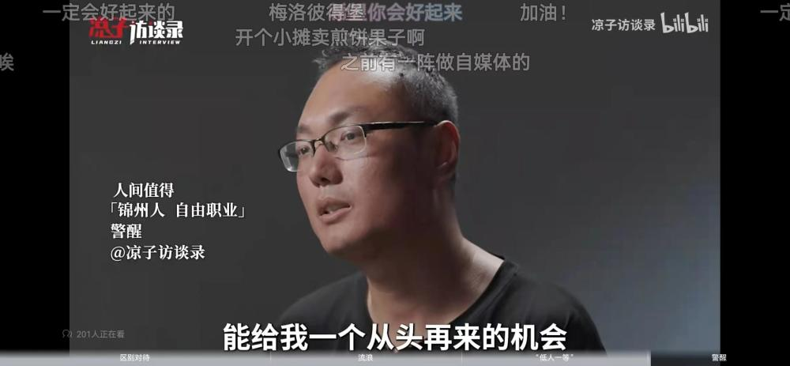
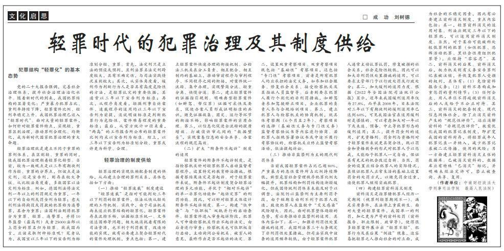

# 被轻罪前科“拦住”的人生

登上视频节目之后，于洋受到了许多骂声，他说自己早有心理准备，“我不是想抱怨，抱怨也没有用，只是想用我的故事去提醒别人一下。”

2023年11月9日，于洋接受一档网络节目访谈，面对镜头，他抛出了一个问题：“现在的犯罪成本到底有多高？”——不能考公等等只是最基本的，工作机会的限制，才是最直接和显见的代价。

以于洋的经验，因为在9年前被判处过10个月有期徒刑的轻罪，无法出具“无犯罪记录证明”，他不能从事正规的外卖、快递、保安等行业，身患糖尿病的他也干不了工地上的重活，只能靠接一些管理松点的岗位以及摆摊卖棉袜度日。即使如此，相比于同岗位的其他人，于洋获得的收入也更低，同事们一个月到手八九千元，而他的实际收入只在4千元左右，“你说我心里能不难受？”

 _▲于洋访谈节目截图_

第13届全国人大代表、广东律师协会会长肖胜方早就注意到了这个问题。2021、2022年，他曾两次提交《关于我国刑法增设成年人犯轻罪之前科消灭制度的议案》，在该议案中，“前科报告制度致使犯罪人就业困难”被加粗标黑。肖胜方指出，根据最高人民法院历年工作报告，最高人民法院近五年年均被判处刑罚的犯罪人高达120万人，如果数量如此庞大的人群无法正常融入社会，“这无疑对我国和谐社会建设产生阻滞作用。”

**窘迫：**

**“一年被辞退十几次”**

前科人员就业有多难？于洋举了自己近一年的经历做例子，今年8月2日：他前往北京面试某买菜平台的工作，花700元租电动车，因为有犯罪记录被拒绝；9月1日，他又前往某食品厂从事小时工，干了一天之后被领导辞退，正常160元的日薪，于洋只收到100元。

被辞退、被拒绝，于洋说自己已经习惯了，“我一年被辞退十几次。”在他看来，公众普遍对犯罪记录可能造成的影响认知有限，除了保安、教师、公务员这些有明确规定前科人员不得从事的工作外，实际上，绝大多数普通工作都不接受有过犯罪记录的人，“只要企业做背调，一定能查出来。”

作为资深“北漂”，于洋对北京的就业市场很熟悉。2007年初中毕业后，他从东北老家前往北京务工，那时摆在面前的选择和机会很多，比如中日友好医院的保安，就是和于洋一样的打工者们眼中的香饽饽，“2012年那会儿，一个月有3000块钱，还有伙食补助。”

但有前科以后，一切都发生了变化。出狱后的前两年，虽然底薪收入不高，但于洋还能找到其他赚钱门路，那时外卖、同城配送正在快速增长，直到2017年左右，这些行业也开始收紧用人标准，“无犯罪记录证明”成为挡在他面前的一道坎。

2019年，再次回到北京务工的时候，于洋听说中日友好医院的保安工资涨到了4000元，每个月的餐补也涨到了800元，但这份工作和他已经没了关系，他可以选择的只有个别管理比较松的保安岗位，月薪2500元，每天餐补8元。

于洋这些年做过很多努力，他去过海南、山东、广东、浙江、上海，发现无论在哪，对无犯罪记录证明的要求都一样严。他也试过去工地、当群演，但因为罹患糖尿病，工地上的重体力活他干不了，而当群演也只能从事最底层，一天100元不包吃住的那一类，那些待遇稍好一些的剧组，都要求群演持有演员证，而演员证则需要无犯罪记录证明。

摆在于洋面前的路还有两条，自己做些小生意谋生，又或者找个体户老板打零工。前一条路，于洋尝试过，但失败了，还折损了家里给他的几万块钱创业钱。至于后一条路，于洋摸索了很久，在最近终于迎来转机，一位个体户老板愿意给他工作机会，让于洋暂时有了稳定的收入。

**犯罪：**

**改变人生的100元**

对于自己的犯罪事实，于洋并不避讳。那是2014年，于洋和一个朋友组织十数人进行献血，并从献血的营养补助费中抽取介绍费。

《新京报》曾经报道过这个案件，在当时的报道中，在法庭上于洋供认自己知道献血有营养补助费，觉得有利可图。2014年6月，于洋失业之后，得知某社区准备组织义务献血，遂与“社区管事儿”的商议，他组织想献血的人，对方将补助的钱给他。对方表示献血者要本人持献血证、签字才能把钱领走，需要十六七个人，于洋答应了。

_▲《新京报》对该案的报道_

此后，于洋开始找献血者，并和朋友商量如果社区把补助款都给了献血者，他们怎么把钱拿回来以及如何分账——这次义务献血的补助费是每名献血者500元，献血后，于洋拿50元，剩下的由介绍人抽成，最后到献血者手里只有二三百元。公诉机关认为，应以非法组织卖血罪追究于洋等人的刑事责任。

于洋告诉红星新闻记者，彼时他并没意识到自己的行为触犯了法律，“就挣了一人50块钱，一共100块钱就被抓了。”在他看来，自己是通过正规的社区、采血机构进行献血，直到上了法庭，于洋才明白问题出在抽取介绍费这个环节，“我当时不知道，但是无知不代表无罪，我犯罪了我认，承担我应该承担的后果。”

而他没有想过，10个月的有期徒刑仅仅是“赎罪”的开端，刑期结束之后，犯罪前科带来的影响逐步显现，于洋失去了很多正常就业的机会。

_▲于洋治疗糖尿病的药物_

在接受网络节目访谈以后，于洋收到了很多留言，有网友称自己没有犯罪记录，一个月也只能赚到3500元左右，并以此驳斥于洋“矫情”。对于这些言论，于洋曾经试过逐一回应：“他们的3500，是在老家或者三线、四线城市，是他们选择了3500，他们还有机会去争6000、7000、8000，3500是他们的底线，但3500是我在北京不管怎么努力也只能达到的上限，这就是区别。”

**警醒：**

**伴随一生的代价**

节目上，于洋没有对自己的容貌、声音进行任何遮盖、处理，直面镜头，坦白了自己犯过的罪，也介绍了自己有前科后的生活。于洋告诉红星新闻记者，实际上，节目组方面曾经多次向他建议最好打码等，都被他拒绝了，“就求一个真实，骂我就骂我。”

视频节目中，于洋将讲述的核心放在犯罪成本上，他说希望通过自己的故事警醒更多的人，不要触犯法律的红线，“我感觉我去劝人别犯罪，可能比警察劝更有效果一点。”

作为前科人员，他理解公众和用人单位的“偏见”，“你会让一个罪犯给你送外卖、送快递吗？你家大门口的保安有前科你会有安全感吗？”但另一方面，他希望社会能给前科人员中那些希望改过自新的人一个机会。

于洋的故事和经历，并不是孤例。2022年7月，最高人民法院举办披露了一组数据：2013年至2022年，全国杀人、绑架抢劫等严重暴力犯罪下降逾三成，2021年法院判处的刑事案件中，近85%以上为三年以下刑期的轻刑案件。有媒体将这组数据解读为中国“轻罪时代”来临。

针对我国的犯罪形势，肖胜方指出，如今，我国具有犯罪前科的人群庞大，但其中大多数人犯罪的主观恶性并不明显，多数为过失犯罪或较轻的经济犯罪。

肖胜方认为，虽然上述轻罪犯罪人的社会危害性不大，但他们在回归社会后都会被打上“罪犯”的烙印，“犯罪前科将会伴随他们一生。”

**专家：**

**应考虑构建轻罪前科消灭制度**

轻罪与重罪，该如何界定？在最高人民检察院主办的《检察日报》2022年11月2日刊登的《轻罪治理与司法路径选择》一文中指出，虽然我国刑法没有关于重罪和轻罪的概念和区分，但在刑法中存在“犯罪较轻的”和“处刑较轻的”、犯罪未遂、犯罪中止等规定，可以作为我国轻罪案件划分的考量因素。我国学界和司法实务界普遍将三年有期徒刑作为轻罪与重罪的分水岭。

肖胜方介绍称，现行《刑法》在1979年通过时是“重罪入刑”，但随着刑法修正案的不断增加，打击轻罪的范围不断扩大，刑法条文也不断地增加新的罪名。

在他看来，公民一旦具有犯罪前科，不管是犯重罪还是轻罪，曾经犯罪的标签将伴随犯罪人的终身，对其往后的求职、事业乃至家庭生活都会产生巨大的影响。

肖胜方接到过不少与犯罪前科相关的生存困难的群众求助，比如一名来自河北某市的群众称，自己曾因触犯刑法被法院判处一年有期徒刑，缓刑二年的刑罚，回归社会后，在求职过程中屡屡被拒之门外，家庭生活窘迫。

还有一名群众给肖胜方写信求助，说自己曾因容留卖淫罪被判处一年有期徒刑，在刑满释放回到家乡时，等待她的是父老乡亲的冷眼，甚至连儿女往后的入户、就读、就业等生活都因为她的前科记录而受到影响。肖胜方告诉红星新闻记者，自从提交相关议案以后，自己经常收到类似的求助信，每次阅读这些信，他都感觉心情沉重。

肖胜方指出，根据最高人民法院历年工作报告，最高人民法院近五年年均被判处刑罚的犯罪人高达120万人。他认为，数量如此庞大的人群无法正常融入社会，“这无疑对我国和谐社会建设产生阻滞作用。”他也因此强调，刑罚应该注重惩罚和教育相结合，惩罚的目的是使违法者改造为好人，而不是将其推向社会的对立面。

针对这一问题，作为第13届全国人大代表，肖胜方两度提交《关于我国刑法增设成年人犯轻罪之前科消灭制度的议案》。在他看来，前科消灭制度有利于预防犯罪，“如果轻罪犯罪前科能被消失，则意味着这些人回归社会后不会再被社会孤立、抛弃，他们不会再因为具有犯罪前科而找不到工作，受到歧视。这类人群会将犯罪前科的消灭视为社会给他们的一次改过自新的机会，绝大多数人都会抱着感激之心来回馈社会，而不是报复社会，这对于社会的发展和稳定也十分有利。”

红星新闻记者留意到，今年8月25日，最高人民法院主办的《人民法院报》，刊登了文章《轻罪时代的犯罪治理及其制度供给》，讨论如何构建轻罪前科消灭制度。在该文章中，提出了几点关于构建该制度的具体内容，包括明确其适用对象为三年以下的轻罪犯，但对性犯罪、恐怖活动犯罪、黑社会性质组织犯罪等保持“零容忍”；规定前科消灭的后果，包括免除前科报告义务，前科不再构成加重惩罚的量刑情节，任何企业、用人单位不得歧视前科消灭后的人或给予不公正对待等。

 _▲《人民法院报》相关文章_

值得注意的是，该文章还提出了前科消灭制度的配套制度建设，要求在应消灭前科产生的“规范性评价”外，还需消解前科的“非规范性评价”。优化我国的犯罪记录制度，扩宽我国前科封存，将轻罪成年人犯罪记录一并纳入，减少犯罪记录被二次传播、使用的风险等具体措施。

作为长期关注这一话题的法律从业人士，肖胜方则强调，在构建前科消灭制度的过程中，有三大要件需要注意，首先是所受刑罚须已经执行完毕，其次要经过一定的考验期，且在考验期内，具有犯罪前科的人需要符合法定条件，“只有经过司法机关的批准，才能消灭其犯罪前科。”

在采访的最后，肖胜方呼吁，由于轻罪犯罪人员数量庞大，针对这一人群的相关制度建设，应当引起各方重视及关注，尽快推动落地。

红星新闻记者 周炜皓

编辑 张寻 责编 任志江

