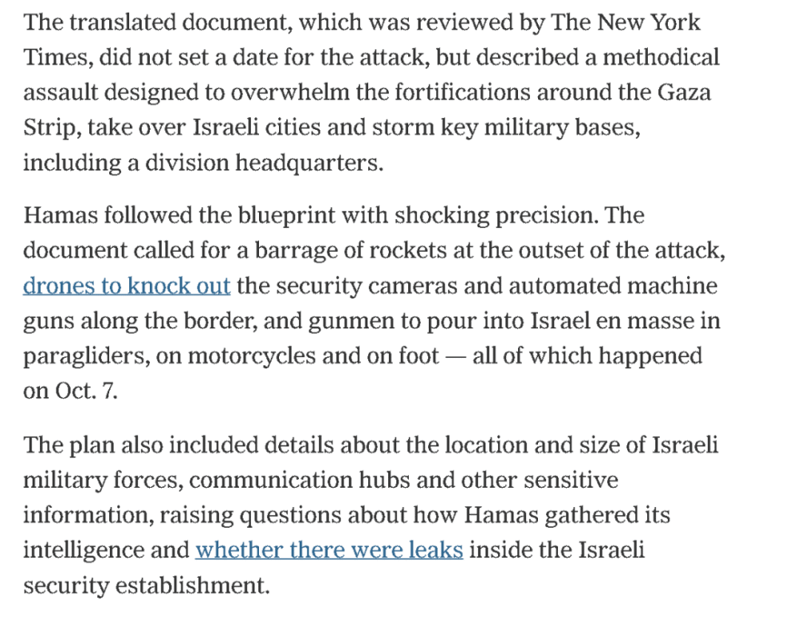
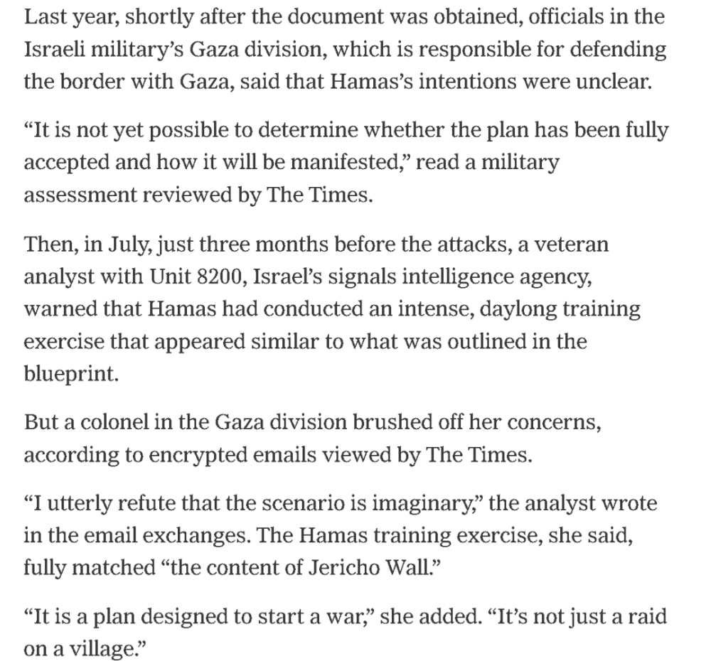

# 重磅：美媒曝光了一个让以军极其尴尬的内幕！

“以色列早在1年多前就知道哈马斯的袭击计划了”，美国《纽约时报》在一篇揭示哈马斯为何能在今年10月7日成功突袭以色列的重磅报道中这样写道。

“而哈马斯也用让人震惊的精确度，执行了这项袭击计划”。

国际舆论——包括以色列国内的舆论，普遍怀疑在今年10月7日哈马斯对以色列发动造成大量人员死亡的突袭之前，以色列军方早就知道哈马斯的计划，近日美国《纽约时报》的一篇报道，拿出了一份足以让以军尴尬的“实锤”证据。

_《纽约时报》报道截图_

在这篇标题为“以色列早在一年多前就知道哈马斯袭击计划”的报道中，《纽约时报》的记者表示，他们看到了一份40多页、代号为“耶利哥之墙”的文件，上面清楚地记录着哈马斯准备对以色列发动袭击的军事行动计划。

该报还特别强调说，尽管这份行动计划并没有给出日期，但哈马斯在今年10月7日的袭击中以“让人震惊的精确度”执行了这项计划。因为10月7日这天哈马斯采取的所有行动——从起初用火箭弹发起袭击，到用无人机打掉监控摄像头和隔离墙的机枪，再到哈马斯武装人员用滑翔伞、摩托车和步行冲入以色列，都与去年以色列军方截获的“耶利哥之墙”行动计划中的内容一致。

不仅如此，这份哈马斯一年前的行动计划中，还详细记录了以军的位置和规模，以军的通讯站点，以及其他的以军敏感信息。《纽约时报》称，哈马斯如何获得这些以军重要情报也是一个大问题，特别是以军内部是不是有人在泄露这些情报。

_《纽约时报》报道截图_

当然，《纽约时报》在这篇重磅报道中最为关注的一个问题还是：这份早在1年前就已经被以军获得，而且还在以军和情报机关的指挥层那里传阅过的哈马斯的行动计划，到底是怎么被忽视掉的。

根据该报的说法，其中最主要的原因是，以军的专家们认为哈马斯“没有能力”去执行计划中所列出的那种“规模”和“野心”的行动计划。

其中，以军在加沙地带的部队曾在去年评估这份哈马斯的行动计划时认为，以军无法判断哈马斯制订这个行动计划的目的是什么，也无法判断这个计划是否被采纳。

但在今年7月的时候，以军一名女性情报分析人员曾一度警告说，哈马斯正在进行全天候、高强度的军事训练，而且训练的内容看起来与“耶利哥之墙”计划中的内容很相似。

然而，《纽约时报》记者看到的以军内部的加密邮件记录却显示，以军加沙部队的一名上校并没有理睬她的警告，以至于这名情报分析人员不得不再次警告说：“我绝不认为（哈马斯会发动袭击）这一场景只是一种想象。”

“这个计划可是为了发动一场战争而准备的，而不是洗劫村庄”，她在邮件中写道。

 _《纽约时报》报道截图_

此前，根据《纽约时报》的报道，以军的官员其实曾私下里承认，倘若以军更加重视哈马斯发动袭击前已经出现的那些危险信号和情报，并及时将大量军事力量调往相应地区，以色列就能抵挡甚至完全阻止10月7日哈马斯袭击的发生。

但最终人们看到的是，以军对于哈马斯在那天发动袭击竟然没有准备。对此，《纽约时报》认为，这可能是以色列建国75年的历史上最严重的误判之一。

最后，《纽约时报》称，以军和以色列的情报部门，拒绝就此事置评。

耿直哥

