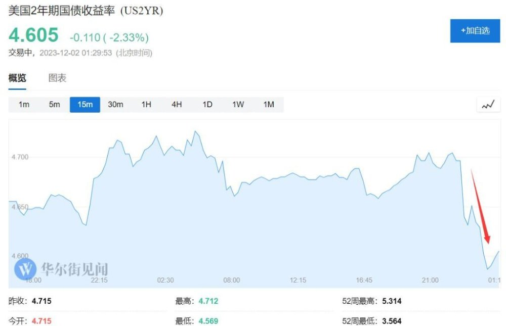

# 鲍威尔给降息泼冷水：判断何时宽松为时尚早，准备需要时进一步紧缩

最近市场对美联储明年降息的预期高涨，而美联储高官一再给很快转向宽松的期望泼冷水。

美东时间12月1日周五在亚特兰大文科女性学院Spelman
College参加对话活动时，鲍威尔在事先准备的演讲稿中重申美联储决策者在谨慎行事，称联储官员仍准备如有需要就进一步收紧货币。他说：

“到目前为止，美联储正在谨慎推进，因为紧缩不足和紧缩过度的风险正变得更加均衡。”

“现在就断定我们的立场已经达到足够的限制性、或者猜测政策何时可能宽松，还为时过早。”

“如果适合，我们准备进一步收紧政策。”

和本月初美联储货币政策会议后的言论有所不同的是， **本次** 鲍威尔 **评价，联储的紧缩行动已经让政策利率“深入”（well into）限制性区域**
。而 **本月初** 会后的新闻发布会上，他只是 **说，货币政策的立场是限制性的** 。

鲍威尔本次评价称通胀已经回落，核心通胀仍太高。他说，美联储将坚守承诺，维持限制性水平的利率，直到通胀处于朝2%回落的正轨。近期出现的核心通胀进展必须延续下去。

在问答环节，谈到国会，鲍威尔说，美联储决策者总是面临来自国会议员的压力，议员要求联储支持这种或那种财政政策，但他告诉议员，联储不那样做才是至关重要。他表示，为了确保自身的独立性，联储必须远离政治。鲍威尔还说，为了确保议员了解美联储在做什么，他和同事现在花在国会上的时间比以前多。最终是由国会制定任务授权的。

鲍威尔在讲话中并未提到最近的股债大涨，而是置于更长期的时间段内评论了金融环境。他说：“到目前为止，供需的正常化对通胀下降发挥了关键作用，过去两年，货币政策和整体金融环境的大幅收紧起到同样的作用。”

被问及从新冠疫情中吸取到什么教训，鲍威尔回答，需要数年时间才能进行全面评估。现在回顾起来，经济的强劲增长速度比人们预期的要快得多。
**疫情爆发以来美国的经济表现出众** 。鲍威尔说，经济的表现一再让联储和预测者吃惊，美联储的紧缩去年看起来似乎都没什么效果，但
**现在，紧缩的影响正在显现** 。

鲍威尔表示，联储的货币政策处于遏制经济的限制性水平， 因此，正确的做法是“让数据告诉我们事实是什么”，以及联储的紧缩是足够还是需要做得更多。
**让数据揭示什么是合适的路径** 。他并 **未提及数据会不会告诉联储何时应降息** 。

谈到美元，鲍威尔表示，美联储重视美元在全球的作用。“我们非常关注国际经济流动。”他意识到，这方面的重要性比他任联储理事时认为的高得多。鲍威尔称“美元是世界储备货币”，全球金融危机期间以及新冠疫情期间使用的常备互换额度“对缓解金融压力非常重要”。

谈到贫富差距，鲍威尔说，过去五十年，美联储已注意到贫富差距加剧，并且收集了大量的数据。对待这种不平等，美联储能起到的一个积极作用是，贯彻住房的公平贷款法律。归根结底，掌握解决贫富差距主要工具的不是美联储，而是国会。美联储的第一要务是确保银行“安全稳健”。

鲍威尔说，美联储并没有针对特定群体的工具。联储的促进充分就业这一使命就有包容性的定义。决策者在制定政策框架时采用了包容的视角。

被问及如何解决通胀波动大时，鲍威尔说，美联储的底线是必须恢复价格稳定，价格稳定是经济的基石，联储的工具只有利率和资产负债表。他说，
**我们正处于不造成大量失业就实现 2% 这一通胀率的正轨** 。评论称，这等于鲍威尔在说，美联储处于实现软着陆的正轨。

谈到人工智能（AI），鲍威尔说，联储确实不知道，随着时间推移，AI会对经济有怎样的影响。问题在于AI是会帮助就业还是取代劳动力。长期来看，新技术会提高生产力，短期内它可能干扰就业市场。最近联储请了六到八名专家讨论AI，他们对于AI会不会提振经济存在分歧。此外，AI工具可能对银行系统有系统性的影响。
**现在判断AI总体的影响为时过早** 。

谈到消费，鲍威尔对消费者支出的前景持谨慎乐观的态度。他说，美国消费者的消费强劲程度和强劲持续时间都让人意外。从联储掌握的数据看，GDP增长在放缓。

对于劳动力参与率，鲍威尔说美联储没有这方面的具体目标，联储愿意看到劳动力参与率进一步上升。 他指出，鉴于人口老龄化，劳动力的这一数据自然会下降。
但任何一年都可能发生变化。他说，劳动力参与率尚未完全恢复到新冠疫情前的水平。

同样打压降息预期 周五鲍威尔讲话后债市反应和周四截然相反

鲍威尔讲话前一日，两名美联储官员已经在周四的表态中打压降息预期。

美联储“三把手”、任内永久拥有FOMC会议投票权的纽约联储主席威廉姆斯表示，美联储的政策利率处于、或接近峰值，预计货币政策将在相当一段时期内维持在有限制性的状态。美联储是否降息将取决于美国经济和通胀的演变。如果通胀顽固地居高不下，价格比他预计的更持久，美联储可能还需进一步紧缩。

鸽派官员、明年拥有美联储货币政策委员会FOMC会议投票权的旧金山联储主席戴利表示，现在根本“没有考虑”降息的可能性。美国货币政策处于良好的状态，美联储应当保持耐心和警惕。现在判断美联储是否已完成本轮加息周期还为时尚早。现在宣布美联储抗通胀胜利还言之过早。美国不会在可预见的未来发生经济衰退。

戴利和威廉姆斯讲话当天，三日连降的美国国债收益率盘中加速回升，基准十年期美债收益率一度升超10个基点，脱离两个月低位，对利率敏感的两年期美债收益率未继续逼近四个月低位。

不过，鲍威尔周五讲话后，美国国债走势和周四截然相反，价格盘中反弹，收益率跳水。十年期美债收益率下破4.30%后刷新日低，回吐周四的多数升幅，两年期美债收益率下破4.60%，刷新五个月低位，日内降幅扩大到10个基点以上。

BMO Capital
Markets的策略师在新近报告中指出，11月全月，美国国债大涨的优异表现不仅反映了美联储在恢复价格稳定和劳动力市场供需平衡方面取得进展，还表明，联储决策者承认本轮加息周期很可能结束。投资者已经很快开始讨论联储何时首次降息，而联储官员的表态还在对着干，试图传递降息不会很快列入议程这种讯息。

