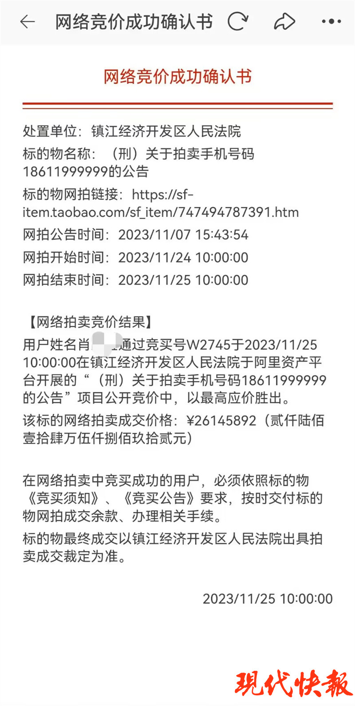
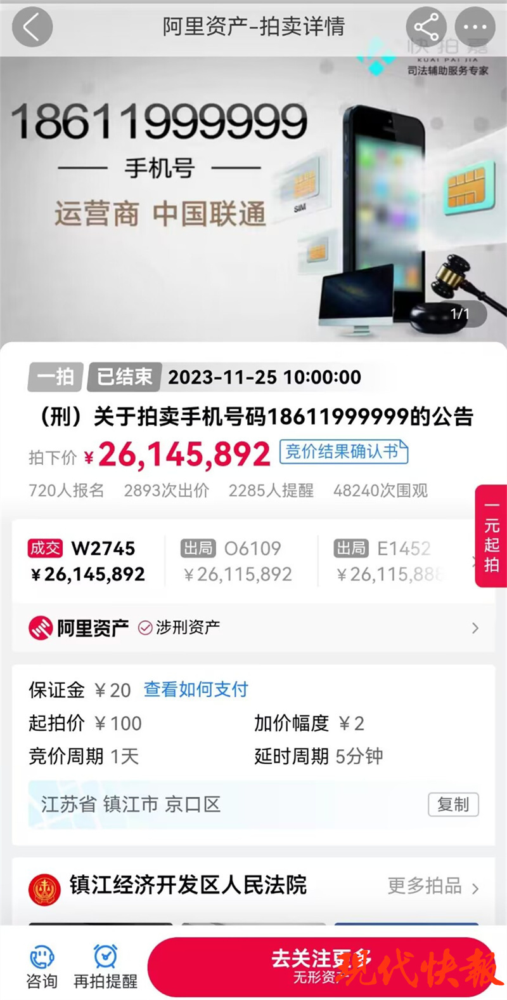
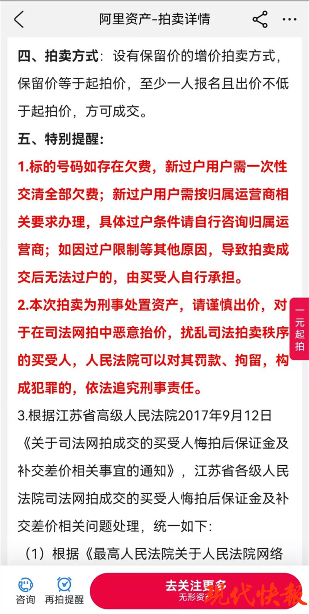

# 2614万元拍下“尾号6个9”的手机号未付尾款，买家称拍错了

现代快报讯（记者
曹德伟）11月25日，江苏镇江经济开发区法院一个手机尾号为“999999”的靓号经过24小时拍卖后，拍出了2614.5892万元的“天价”。根据公告时间，买家需在12月3日前交付尾款，现代快报记者多方了解获悉，截至最终期限，买家并未付款，并称自己“拍错了”。

网络竞价成功确认书显示，以最高价胜出的是一位肖姓竞买人。根据公告要求，竞得者应于12月3日前缴纳拍卖尾款。但现代快报记者了解到，截至最终期限，该竞得者并未交纳尾款，并在法院联系时，明确拒绝支付尾款，称其拍错了。

根据《最高人民法院关于人民法院网络司法拍卖若干问题的规定》条款，司法网拍成交后，买受人悔拍的，其所缴纳的保证金不予退还。此外，重新拍卖的价款若低于原拍卖价款，所造成的差价、费用损失及原拍卖中的佣金，由原买受人承担。

肖姓竞得人悔拍行为扰乱了司法拍卖秩序，将面临何种处罚？现代快报记者将继续关注。

（校对 张静超）

