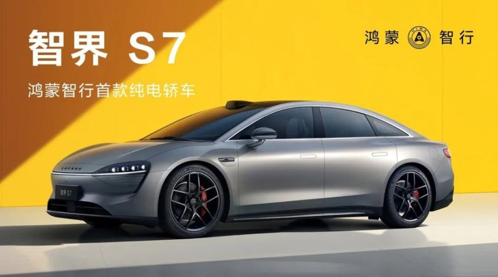
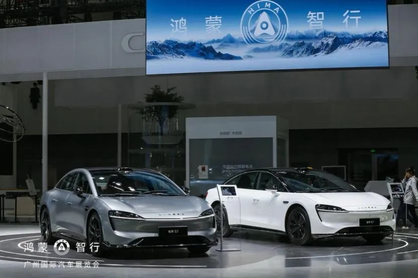

# “亲儿子”扩容，华为汽车夺嫡之争来了

华为不造车，但华为智能汽车解决方案，正在渗透越来越多的车企。

11月27日下午，华为常务董事、智能汽车解决方案BU董事长余承东表示，自9月中旬发售以来，华为和赛力斯共同打造的问界新M7已经收获了超过10万份大定订单。

实际上，在进入汽车领域后，华为的汽车业务就迎来了迅速扩容，除了问界，还先后与北汽极狐、广汽埃安、长安阿维塔等品牌达成合作。但不同于问界的大卖，其他几家合作车企在销量上并没有收获到明显的“华为赋能”，因此，业内戏称只有问界才是华为的“亲儿子”。

不过现在，“亲儿子”阵容也扩容了。11月28日，鸿蒙智行首款轿车S7正式发布。余承东表示：“智界S7是鸿蒙智行首款纯电轿车，在产品定义、ID设计、用户体验等领域由华为深度赋能，首发多项华为黑科技，开启智慧出行新篇章。”

 _图片来源：鸿蒙智行_

智界是华为智选与奇瑞合作的品牌。在此之后，华为与江淮、北汽合作的品牌和车型也将陆续面世。

12月2日，江淮汽车发布公告，宣布了与华为终端有限公司签署《智能新能源汽车合作协议》。从协议内容来看，江淮汽车负责产品开发和生产制造，华为终端负责销售，双方共建服务体系。

按照余承东的说法，江淮与北汽的两个“界”的产品已在开发过程中。

此外，华为今年注册了多个运输工具类商标，包括游界、致界、霄界、鸿蒙界、筑界、享界、揽界等十余个。

显然，作为“亲儿子”中的长子，问界的成功为华为在汽车市场打下了坚实的基础，短短两年时间，问界已经跻身造车新势力销量排行榜前列。有数据显示，11月，问界汽车销量为1.88万辆，位列新势力汽车销量排行榜第四位，超越了零跑和蔚来，逼近第三名小鹏汽车。

尽管除了问界所代表的鸿蒙智行模式（原智选车模式），华为在智能汽车领域所提供的另外两种合作模式下的合作伙伴表现天差地别，但这并不妨碍华为获得众多汽车品牌的青睐，尤其是在新能源汽车上表现平平的品牌。

不过，华为在汽车领域的“亲儿子”数量猛增，未来如何平衡多家合作品牌之间的关系，也将成为华为的主要工作之一。毕竟在智界S7发布的同时，“赛力斯被华为抛弃”的说法就不绝于耳。华为当然不会放弃问界，但对于吃瓜群众而言，“后宫争宠”“九子夺嫡”这样的戏码，在任何一个领域都大有看头。

**华为“大联盟”呼之欲出？**

如今华为在汽车行业的影响力有目共睹，11月28日，由于余承东在发布会现场表示已经向赛力斯、奇瑞、江淮、北汽几个合作伙伴发出投资新公司邀请，并表达了希望一汽集团加入。

这使得当日与华为相关的汽车板块尾盘拉升，不仅赛力斯、江淮汽车、长安汽车、北汽蓝谷都在当日股价大涨，被喊话的一汽集团旗下，一汽解放、一汽富维也双双涨停。

至此，“华为概念”在汽车行业已然形成了独特地位，问界尤其是新M7对此功不可没。在新M7大卖之前，华为对汽车企业的加持程度一直饱受质疑。

这是因为在此之前，除了赛力斯的问界之外，其他汽车企业与华为的合作，并没有达到预期效果。

目前，华为在智能汽车领域共有三种合作模式，分别是零部件供应模式（提供标准化模块）、HI模式（提供全栈集成解决方案），以及鸿蒙智行的智选车模式，其中鸿蒙智行模式是“含华量”最高的模式。

_图片来源：鸿蒙智行_

在11月28日的发布会上，余承东再次介绍了这三种合作模式，并强调“帮助车企造好车，帮助车厂卖好车，是我们坚定不移的方向”。

与华为达成第一种合作模式即零部件供应模式的车企众多，合作车型早已超过百款。而另外两种模式，华为则远远不止是零部件供应商。

早期除了问界选择的是鸿蒙智行模式外，北汽极狐、广汽埃安、长安阿维塔均选择了HI模式。从目前情况来看，极狐品牌前11个月累计交付2.15万辆，余承东在今年4月表示双方的合作将升级为智选车模式；阿维塔前十月累计销量1.76万辆，日前阿维塔12上市，宁德时代董事长曾毓群、余承东，以及长安汽车董事长朱华荣共同站台，才实现了上市6天大定突破1.5万辆，后续能否再现新问界M7的奇迹仍未可知；而广汽埃安于今年3月，将与华为的合作从HI模式改为了零部件供应模式。

对比问界新M7上市两个多月收获超过10万份大定订单的成绩，似乎很难界定华为赋能到底行不行，但至少截至目前，鸿蒙智行的智选车模式，已经得到了销量上的验证。

这足以给华为和车企双方信心，开启更多的合作。因此赛力斯、奇瑞、江淮、北汽均进入了鸿蒙智行“家族”。不过，目前在华为商城的鸿蒙智行选项下，只有智界和问界旗下车型，极狐并没有纳入其中。

_图片来源：华为商城截图_

而作为华为鸿蒙智行的第二个品牌，智界的表现对于华为而言同样意义非凡，能否复刻问界的成功，再造一个智能新能源品牌，对华为未来在汽车领域的走向势必产生重要影响。

**谁的“含华量”更高‍‍‍‍**

作为华为与奇瑞合作的智选车品牌，智界还是避开了问界的锋芒。目前问界在售的车型均为SUV，智界S7则是华为智选车的首款轿车。智界S7能否大卖，将是对华为鸿蒙智行模式“造星”能力的一次验证。

日前上市的智界S7一共提供4个版本，售价为24.98万-34.98万元，起售价较预售时下调8200元。根据官方信息，智界S7搭载了华为ADS2.0高阶智驾系统、全新一代HUAWEI
DriveONE动力平台、华为途灵智能底盘、HUAWEI
xMotion智能车身协同控制系统等华为的技术或功能，“含华量”较高。同时，该车还是首款搭载HarmonyOS4鸿蒙系统的车型。

余承东在发布会上表示，智界S7的规格比特斯拉Model S、奔驰EQE等都要高，但是价格却和特斯拉Model
3一个水平。此外，智界S7搭载的全新DriveONE 800V碳化硅高压动力平台和华为途灵智能底盘，也是余承东推荐的重点。

这也让市场上多了许多比较的声音，尽管华为已经在车型上对问界和智界进行了差异化布局，但关于二者的“含华量”高低仍被反复讨论，智界的所有卖点，几乎都围绕在华为赋能的“黑科技”。因此，网络上已经有了关于问界是“长子”，智界却是“嫡子”的讨论。

受此影响，赛力斯股价一度剧烈波动。

但对于初出茅庐的智界而言，却是大大的利好，关注度大幅提升。据官方介绍，目前智界S7的订单量已经突破2万辆。

实际上，智界S7的前脸采用了和问界M9相同的家族式设计语言——这是华为智选车旗下的产品，第一次在外观层面进行联动。在智能车时代，除了机械结构外，整个产品流程里，都是华为鸿蒙系统包括智驾、智舱、智控等多个层面的贯穿。

在鸿蒙智行模式下，华为除了深度介入产品的定义研发和设计外，也依托自身渠道销售。所以“含华量”的高低，也被客户视作购买车型的重要参考之一。在华为各大门店，咨询车辆哪些部分配备华为技术的问询层出不穷。

华为显然更希望鸿蒙智行的各个品牌和产品系列能够打出抱团优势，在市场上形成完善的产品矩阵。

按照余承东的规划，华为车BU业务要在2025年实现盈利，扭转此前他所说的“车BU是华为唯一亏损的业务”这一情况。而要实现这个目标的前提是，智选车和HI模式下累计销量达到100万辆。

以目前的情况来看，这一目标仍旧不易实现。“最能打”的问界，今年累计销量也还没有突破10万辆。而且，根据赛力斯产销快报，公司前三季度每卖出一辆车亏损额达到1.68万元。

同样的问题也存在于智界，据余承东透露，“公司内部为这款车型的定价吵得不可开交，目前四个版本的售价都是亏损的。”‍‍

随着华为“造车朋友圈”扩大，鸿蒙智行旗下品牌在车市中或将形成一股不可忽视的“新势力”。但新的商业模式和格局下，究竟会带来更大的发展空间，还是难以平衡的内耗，尚未可知。而盈利问题能否通过不断扩容的华为“大联盟”解决，同样是华为在汽车领域急需解决的另一个难题。

平安证券认为，华为在汽车行业中的存在感日益增强，其他车企与华为合作的意愿相比之前也更强，选择拥抱华为的智能车技术，新公司发展潜力大，长期看其营收规模将达到千亿级别。

无论当前是不是赔本赚吆喝，华为对汽车市场的影响都将持续下去，至于这千亿级别最后能够成就多少“真金白银”，则将决定华为“大联盟”未来是一呼百应还是各自为营。

作者：郑宇

