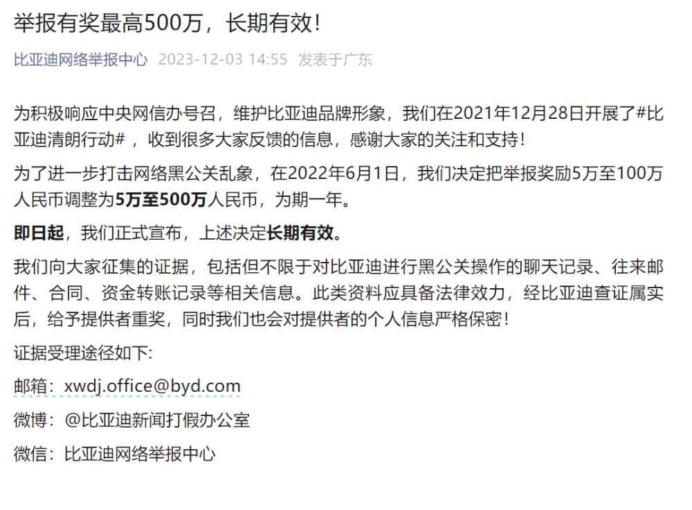
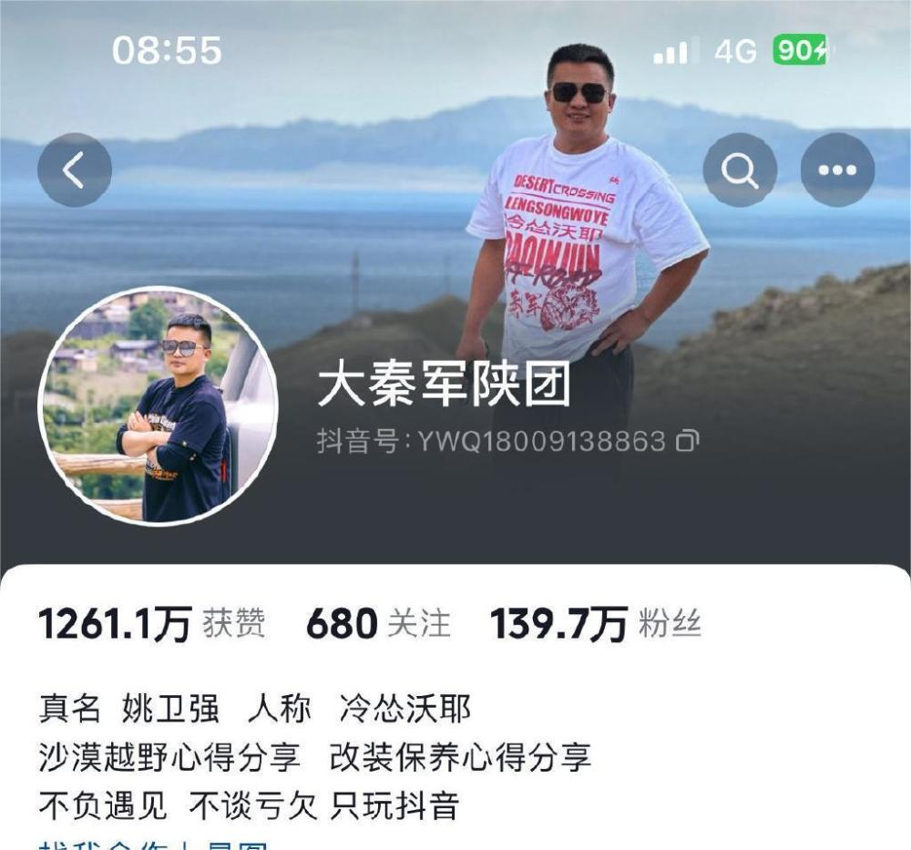
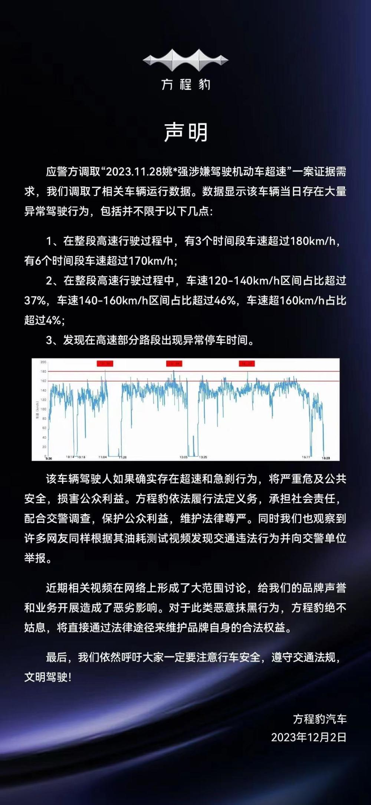

# 比亚迪：网络黑公关举报奖励最高500万，长期有效

鞭牛士 12月3日消息，今日，比亚迪网络举报中心发文称，举报有奖最高500万，长期有效。

公告称，在2022年6月1日，比亚迪决定把举报奖励5万至100万人民币调整为5万至500万人民币，为期一年。

即日起，比亚迪正式宣布，上述决定长期有效。

近日，有百万粉丝的大V博主发布视频对比亚迪旗下的方程豹汽车进行了油耗测试，视频中显示方程豹汽车油耗高达18升，引发网友热议。

随后，方程豹官方发文回应，调取了此前车评博主相关车辆的运行数据，数据显示该博主测评车辆当日存在大量异常驾驶行为。

