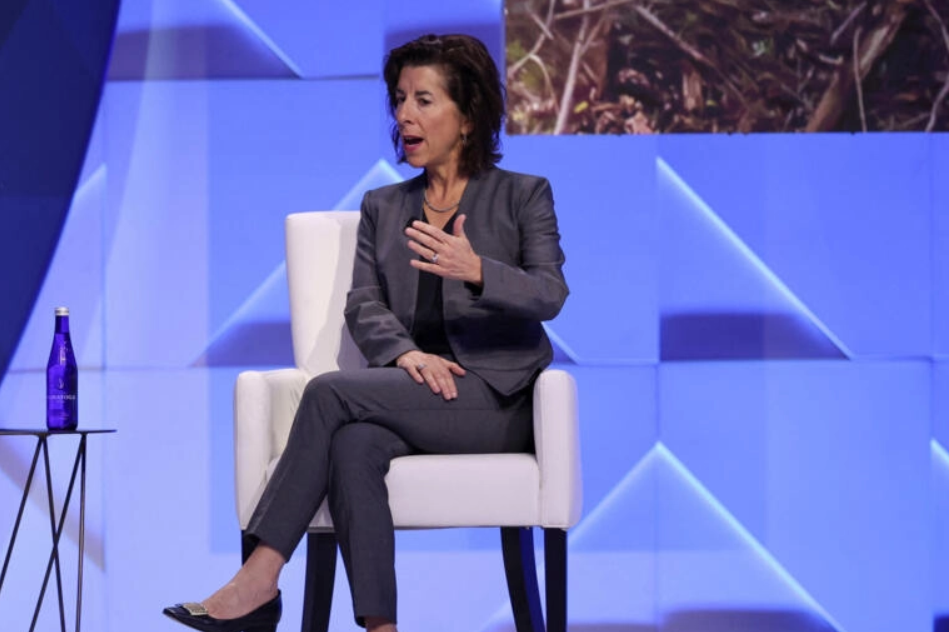

# 美商务部长声称：绝不能让中国在尖端半导体领域赶上美国

美国商务部长雷蒙多在美国当地时间12月2日强调，为了确保中国无法在尖端半导体领域赶上美国，美国商务部在这方面需要更多资金。

据彭博社报道，雷蒙多当天在加利福尼亚州西米谷举行的里根国防论坛上说：“我们不能让中国获得这些芯片。我们将拒绝向他们提供我们的最尖端技术。”

为了实现这一目标，雷蒙多说，美国国会需要向负责管理美国出口管制的商务部工业与安全局，提供更多资金。她强调，美国公司需要适应美国制定的国家安全优先事项，包括商务部针对半导体出口商品实施的出口管制。

雷蒙多也点名美国芯片制造商英伟达。她指出，英伟达是开发最新一代人工智能所需的最先进芯片的专业公司，他们研发出了一款性能略低于美国商务部设定的出口限制的半导体，以便向中国出口。她表示，这就是企业运作的模式，但这可能适得其反。路透社早前引述消息人士和分析师报道，为应对美国扩大出口管制措施，英伟达已经为中国市场推出了三款定制新芯片产品。

雷蒙多说，"我知道在座有一些半导体公司的总裁可能不太高兴，因为他们可能会失去了赚钱机会。但这就是生活，保护我们的国家安全比短期收入更重要"
。雷蒙多说，"从长远来看，与我们合作捍卫我们国家的国家安全是值得的。"“如果你围绕特定的切割线重新设计芯片，使他们能够进行人工智能项目，我第二天就会去调控它。”

雷蒙多表示，华府必须思考如何加强管制，并与盟友一起执行，确保美国在人工智能和先进半导体设计领域领先世界。雷蒙多说："美国在人工智能和先进半导体设计方面是全球领导者，
这要归功于美国的企业，也要归功于我们的公共部门的投资，让我们领先中国数年。我们不能让他们迎头赶上。"

美国在10月公布新措施，阻止中国、伊朗和俄罗斯等国家接收英伟达等公司设计的先进人工智能芯片。雷蒙多也认为，与中国进行沟通有助于确保美中两国关系稳定，但在国家安全问题上，美国必须睁大眼睛，保持警惕。

中国国家领导人上月与美国总统拜登会谈时指出，美方在出口管制、投资审查、单边制裁方面不断采取针对中国的举措，严重损害中方正当利益。中国的发展是以创新驱动的，打压中国科技就是遏制中国高质量发展，剥夺中国人民的发展权利。中国的发展壮大有内生逻辑，是外部力量阻挡不了的。希望美方严肃对待中方关切，采取行动，取消单边制裁，为中国企业提供公平、公正、非歧视的环境。

来源丨法新社、彭博社、联合早报

编辑丨段晓卿，深圳卫视直新闻主编

