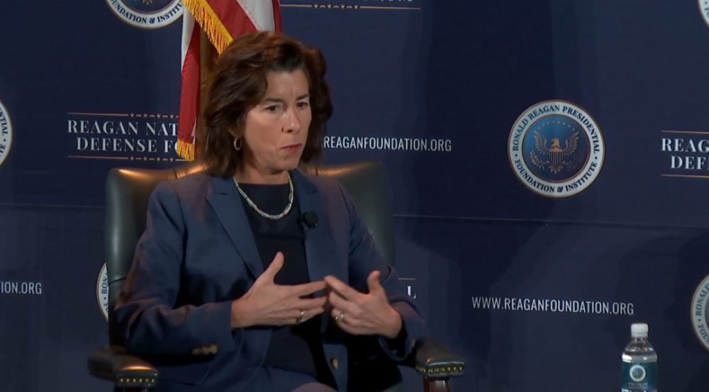

# 要钱！美媒：雷蒙多声称美商务部需更多资金防中国在尖端半导体领域赶超

“雷蒙多说，美国商务部需要更多的资金来阻止中国在尖端半导体领域赶超”，当地时间12月2日，美国彭博社发出这样的消息，引发外界关注。值得注意的是，报道称，美商务部长雷蒙多在最新表态中还点名了美国芯片企业英伟达。

“我们不能让中国得到这些芯片。”据彭博社报道，雷蒙多当日在加州西米谷举行的里根国防论坛上声称，“我们要阻止他们得到我们最尖端的技术。”

 _雷蒙多2日在加州西米谷举行的里根国防论坛上发言 图自美媒_

报道说，雷蒙多声称，为实现这一目标，美国国会需要向负责美国出口管制的商务部工业和安全局提供更多资金。
**“我有2亿美元的预算（计划）。这（仅）相当于几架战机的成本。拜托，”她继续说** ， **“如果我们是认真的，就让我们为这项行动提供它所需的资金。”**

彭博社称，雷蒙多还努力劝说称，美国企业需要适应有关美国国家安全的优先事项，包括美商务部对半导体产品实施的出口管制。“我知道，当我这么做的时候，听众中有些芯片公司的首席执行官（CEO）对我有意见，原因是有收入损失。”她辩解说，“（但）这就是生活。保护我们的国家安全比短期收入更为重要。”

报道称，雷蒙多还点名被外界传闻“面向中国市场设计芯片”的美知名芯片企业英伟达，声称如果该公司采取某种措施重新设计一款芯片，让中国能够实施人工智能项目，“我第二天就会采取控制措施。”她进一步渲染老调重弹的“国家安全”问题，声称与中国的沟通有助于稳定两国关系，但“在国家安全问题上，我们必须对威胁睁大眼睛”。

美方频繁拿芯片等议题炒作涉华“威胁”，而雷蒙多点名的这家美企高管也不止一次就涉华问题表态。“英伟达首席执行官警告称，对华芯片战将对美国科技造成‘巨大损害’”。英国《金融时报》今年5月就曾刊出对英伟达公司CEO黄仁勋的采访，他在受访时警告说，拜登政府对华半导体技术实施的出口管制导致公司“束手束脚”，无法在其最大的市场之一中国开展销售，“美国必须谨慎行事。中国是科技行业一个非常重要的市场。”对于美国政府不断祭出针对中国芯片的出口限制，今年早些时候，英伟达首席财务官科莉特•克雷斯还表示，从长远来看，禁止向中国销售人工智能芯片将导致美国芯片行业永久失去机会。

此外，《环球时报》11月10日发布题为“华盛顿和英伟达之间不该是‘猫鼠游戏’”的社评称，美国对华的芯片出口管制措施是没道理的，它不仅对中国利益有害，也对美国利益有害，已经有越来越多的人看到这一点，并希望华盛顿作出调整。而美国政府的表现把正常、正当的交易都搞得胆战心惊的，在市场上制造出了一种肃杀氛围，受其影响的美国企业当然不止英伟达一家，英伟达只是受害者中的一个代表。中美终究要回到合作的正道上，英伟达的例子鲜活地证明了互利共赢的纽带是多么强大。华盛顿要做的不是“补漏洞”，而是应该抬眼看一看，中美的共同利益究竟有多么宽阔，它足以容下两国的共同发展。是选择做大蛋糕，还是跟自己较劲，华盛顿其实完全可以不用那么纠结。

来源：环球网/张晓雅

