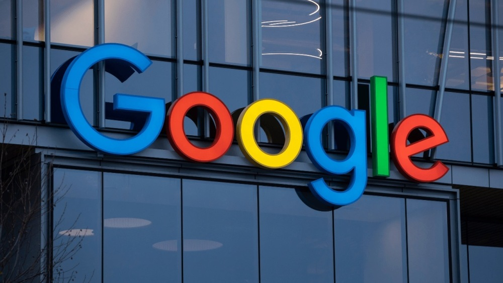

# 谷歌也追不上OpenAI？谷歌宣布推迟人工智能大模型Gemini的发布

**划重点：**

  * _1_ 谷歌宣布推迟人工智能大模型Gemini的发布，这凸显出其在追赶OpenAI时面临的艰巨挑战。
  * _2_ Gemini在某些方面的表现可与GPT-4相媲美，但在部分非英语任务中表现不佳。
  * _3_ OpenAI据称最近取得了新突破，Q*项目为该公司开发出更好的大模型带来了希望。

腾讯科技讯
据国外媒体Information报道，援引两位知情人士透露，谷歌已悄悄将其对话式人工智能大模型Gemini公开亮相的时间推迟到明年1月份，以期该模型能与OpenAI的GPT-4展开竞争。

一位知情人士说，谷歌首席执行官桑达尔·皮查伊（Sundar
Pichai）最近决定，取消原定于下周在加州、纽约和华盛顿举行的一系列Gemini发布活动，原因是该公司发现这款模型在某些非英语任务中表现不佳。谷歌还没有公布发布会的具体情况，但这本应是该公司今年最重要的产品发布活动。此前，为了尽快赶超OpenAI，谷歌几乎耗尽了计算资源，还合并了两个大型团队。

长期以来，拥有20万名员工的谷歌一直被认为是人工智能领域的领导者。然而，这次推迟发布突出显示了要赶上不到800人的OpenAI所面临的挑战。

谷歌很少在感恩节和年底之间推出新的重磅产品，但该公司打算为Gemini破例，因为这可以说是其十年来最重要的举措。知情人士表示，在华盛顿举行的Gemini发布活动旨在向政策制定者和政界人士展示这项技术，他们越来越多地讨论涉及人工智能的潜在监管。

据知情人士透露，皮查伊和其他高层一直对OpenAI的ChatGPT及微软针对生产力软件推出的Copilot功能保持高度关注。这些大语言模型技术已被众多公司广泛应用于自动化软件编码、报告总结、营销活动生成及专门应用程序构建等多个领域。

上个月，皮查伊在一次公开活动中证实了早前关于Gemini的报道，明确表示谷歌将“全力推出具有竞争力的Gemini
1.0，并确保其在技术上处于领先地位。”谷歌发言人没有立即对本文置评。

Gemini是谷歌耗时一年研发的成果，旨在与OpenAI的GPT-4一较高下。但ChatGPT背后数百万客户所提供的宝贵数据不仅助力OpenAI跟踪产品质量，更为其持续改进提供了有力支撑，而谷歌则错失良机。

目前，谷歌已研发出多个版本的Gemini以应对不同复杂程度的任务。外部开发者已经测试了该模型的较小版本，根据参数数量或计算量进行了测试。但据参与这项工作的人士说，谷歌仍在紧锣密鼓地完善Gemini的主要版本。一个大模型通常由多个相互协作的较小模型组成。

Gemini团队面临的一个关键挑战在于，确保初级模型与GPT-4一样好，甚至更好。一位知情人士说，谷歌在某些方面已经达到了这个标准，但该公司仍在进行改进，因为它希望这项技术在多种语言中都能在全球范围内正常运行。模型开发人员在处理模型时经常测试模型的功能，但是在这些测试过程中，他们经常会错过某些技术限制的情况。

与此同时，OpenAI在对GPT-4进行重大方面也面临着不小的挑战。有消息称，该公司已悄悄放弃了今年早些时候正在开发的名为Arrakis的新模型。不过，OpenAI据称最近在名为Q*的项目上取得了突破，这让该公司看到了开发更好大模型的希望。在经历了首席执行官山姆·奥特曼（Sam
Altman）被解职又复职的风波后，该公司仍在努力从几近内爆的局面中恢复过来。（编译/金鹿）

