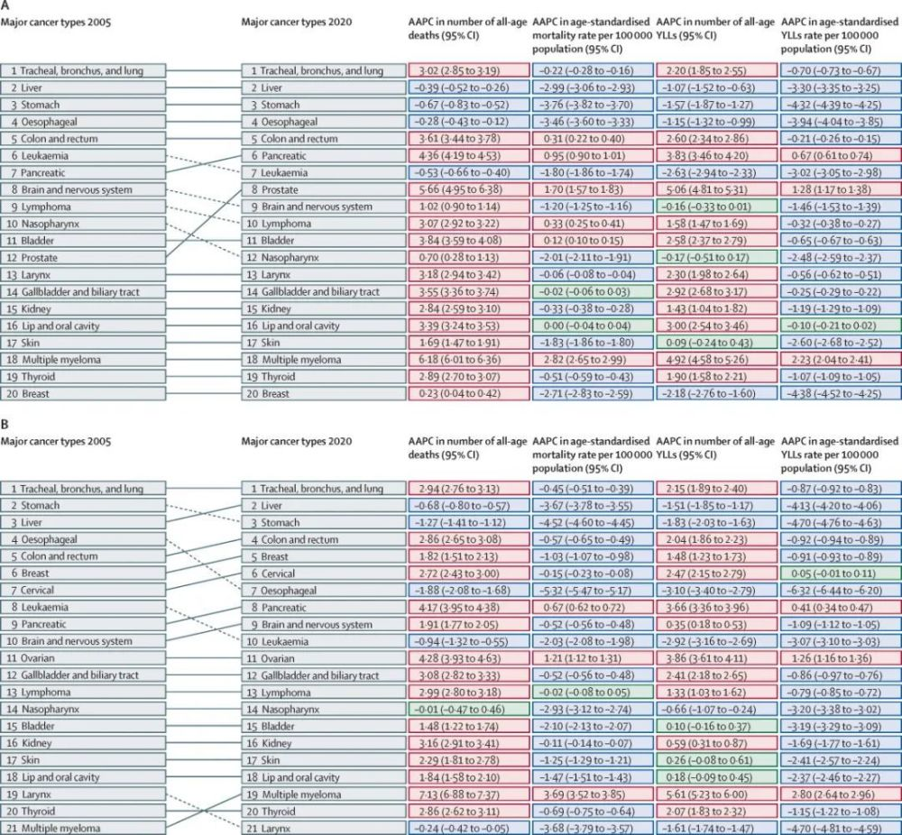
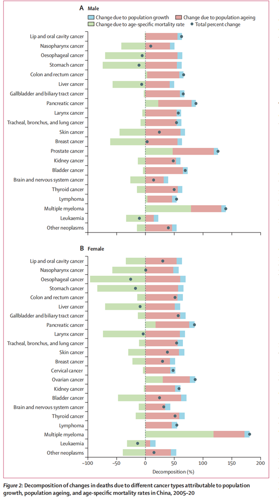

# 2005-2020年中国癌症疾病负担报告：肺癌、肝癌和胃癌仍是前三位死因

**背景**

癌症是中国人口的主要死因，提高癌症患者五年生存率、降低包括癌症在内的重大慢性病过早死亡率是《“健康中国2030”规划纲要》和《中国防治慢性病中长期规划（2017－2025）》的重要目标，本文旨在利用全国死因监测系统数据，分析中国2005年至2020年间全国及各省癌症死亡及癌症负担。

**方法**

癌症相关死亡数据来自全国死因监测系统，本研究估计了总癌及23种癌症的死亡率、早死寿命损失年（Years of life lost,
YLLs）及其平均年度变化百分比（Average annual percent changes,
AAPC），并采用2020年中国普查人口进行标化，分性别、城乡和年龄等维度展示了2005年至2020年间中国及31个省的癌症死亡及早死疾病负担趋势。采用死亡数变化原因分解方法，分析年龄别死亡率、人口老龄化及人口增长对2005-2020年间全国及分省不同癌症死亡数变化的贡献程度。

**结果**

研究估计，2020年中国癌症相关死亡人数239.78万，相比2005年增加了21.6%，其造成的早死疾病负担为5659.90万人年，增加了5.0%。
**2020年我国男性前五位死因依次为肺癌、肝癌、胃癌、食管癌和结直肠癌**
，死亡率分别为75.05/10万，38.31/10万，27.84/10万，18.18/10万和14.63/10万；
**女性前五位死因依次为肺癌、肝癌、胃癌、结直肠癌和乳腺癌**
，死亡率分别为33.19/10万，13.54/10万，13.33/10万，11.29/10万和8.21/10万。男性结直肠癌、胰腺癌、前列腺癌、淋巴瘤、膀胱癌和多发性骨髓瘤，女性胰腺癌、卵巢癌和多发性骨髓瘤的标化死亡率呈上升趋势，其他癌种标化死亡率呈下降趋势。

图1：2005–2020年中国分性别不同癌症类型死亡顺位变化

**与2005年相比，2020年我国男性和女性中近4/5的癌种死亡人数增多，死亡人数增加最主要因素是人口老龄化，其次是人口增长。**
由于胰腺癌和多发性骨髓瘤，以及男性的前列腺癌和女性的卵巢癌年龄别死亡率的上升所导致的这些癌症类型的死亡数增加值得关注。

图2：2005–2020年中国因人口增长、人口老龄化和年龄别死亡率导致的不同癌症类型死亡变化的分解分析

癌症早死疾病负担的顺位在城市地区和农村地区存在差异，2020年城市男性前五位早死疾病负担依次为肺癌、肝癌、胃癌、结直肠癌和食管癌：农村男性前五位依次为：肺癌、肝癌、胃癌、食管癌和结直肠癌。城市地区女性前五位早死疾病负担依次为肺癌、结直肠癌、胃癌、肝癌和乳腺癌；农村地区女性前五位死因依次为肺癌、肝癌、胃癌、结直肠癌和乳腺癌。

城市地区，男性和女性几乎所有类型癌症的年龄标化YLL率（除男性前列腺癌和女性多发性骨髓瘤外）均呈现显著下降。而农村地区，超过一半的癌症标化死亡率和标化YLL率呈增长态势。

分解分析结果显示，2005–2020年间，城市地区约3/4的癌种死亡人数增加，农村地区约4/5的癌种死亡人数增加，主要归因于人口老龄化，其次是人口增长或年龄别死亡率的上升。

各年龄组癌症死因顺位也有较大差异。2020年，0–19岁年组，癌症死因顺位前三位依次为白血病，脑和神经系统癌，肝癌；20–39岁组，男性中肺癌上升至第三位，女性中乳腺癌上升至第一位，宫颈癌上升至第三位；40–59岁组，男性死因顺位依次为肝癌，肺癌和胃癌，女性依次为肺癌，乳腺癌和宫颈癌；60–79岁组，男性和女性前三位死因均为肺癌，肝癌和胃癌；在80岁以上的男性中前三位死因为肺癌，胃癌和肝癌，女性中前三位死因为肺癌，胃癌和结直肠癌。
**各省份的死亡率排名存在一定差异，肺癌或者肝癌在30个省份排名居首。此外，在部分经济发达省份，结直肠癌以及胰腺癌的标化死亡率的快速增加也值得关注。**

**解释**

从2005年到2020年，中国的癌谱和死亡负担逐渐向高收入国家转变，城市和农村仍存在较大的差异。过去二十年来，中国在癌症防控方面做出了巨大努力，但需要对肺癌和其他呈上升趋势的主要癌症的防控进行重点关注。

团队介绍：本项研究由中国疾病预防控制中心慢病中心和首都医科大学合作开展。中国疾病预防控制中心慢病中心殷鹏研究员为通讯作者，中国疾病预防控制中心慢病中心齐金蕾副研究员和首都医科大学公共卫生学院李梦龙博士生为共同第一作者。

*中文解读由作者团队提供，仅供参考，所有内容以英文原文为准。

