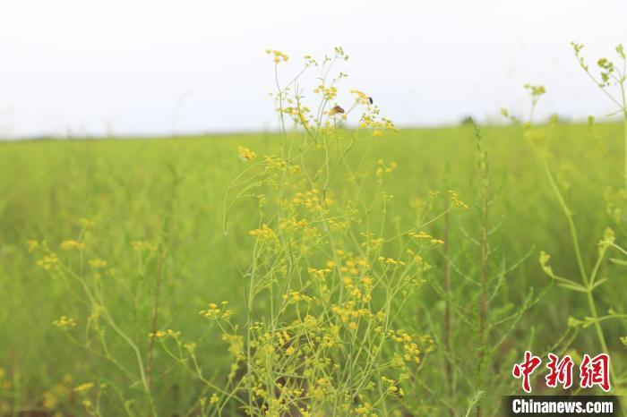
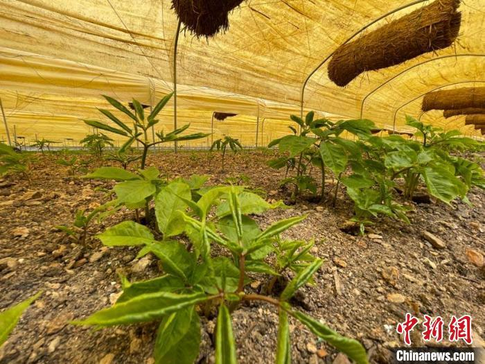

# “中药涨得太贵，不敢给患者开”

秋冬季节，多种呼吸道疾病“来势汹汹”，不少人“盯”上了具有化痰止咳平喘功效的川贝。

但由于近年来国内中药材价格进入上行周期，如今的川贝价格也让不少人为之一惊。“想买点川贝放到家里用来蒸雪梨，结果要10元一克，现在这么贵了吗？”

为何川贝等中药材价格上涨如此厉害？

**01**

**中药材价格翻倍，医生称不敢给患者开**

“现在川贝（松统）市场价5600元/公斤，炉贝会便宜些，每公斤也要4700元。”安徽亳州以盛产中药材而闻名，近日，亳州某中药材批发商杨女士向记者表示。

记者在中药材天地网搜索发现，前几年，川贝（松统）的价格多维持在每公斤3000多元，今年价格不仅涨至4000多元，部分月份高达5000元以上。以亳州药市为例，8月份川贝（松统）报价一度高达5200元，现在虽有所回落，但也维持在5000元。

 _亳州药市上，松统（四川）川贝价格图。截图自中药材天地网。_

相较一直处于价格高位的川贝，杨女士称，“浙贝涨幅更为明显，现在每公斤180元，较去年涨了几十块。”“不仅是浙贝，亳州中药材市场里，1000多种中药材中，几百个品种价格都出现了上涨。”杨女士补充道。

据相关行业协会6月发布的报告，在安徽亳州、河北安国、四川成都、广西玉林等几大中药材批发交易市场，相比去年同期，有超200个常规品种涨幅高于50%，25个常用大宗药材涨幅超200%，个别品种甚至涨价4至9倍。

这波中药材涨价，北京某中医院皮肤科医生深有体会。
**“酸枣仁、黄芪等中药材涨价比较厉害，像治疗失眠焦虑的酸枣仁，都不敢给患者开。就这一味药，仅开1付（30克），都要31元，7付需要两百多元。如果患者用量大的话，价格更贵。”**

猫爪草也是涨幅居前的中药材品种之一。10月底，小金（化名）出于治疗肺结节的需求，去当地药铺抓药，就被猫爪草的价格“刺了一下”。

“医生称，药房的猫爪草0.85元一克，这意味着，不到一个月，猫爪草一克涨了0.35元。”小金表示，“上回21付药，不加猫爪草花了400元左右，这次若加上猫爪草，可能要近1000元。”

从中药材天地网监测数据看，这几个月，猫爪草涨势尤为迅猛。安国药市上，一季度每公斤还停留在85元至90元，进入10月份，每公斤已涨到420元。上述医生提到的酸枣仁，2022年下半年以来，价格一路飙升，如今价格维持在每公斤八九百元。

**02**

**中药材涨价为何这么“凶”？**

今年以来，当归、党参、柴胡、甘草、白术、猫爪草等常见中药材价格出现明显涨幅，引发广泛关注。

此前中药材酸枣仁每公斤涨至千元，就被人调侃，“本来是治失眠的，看完价格更睡不着了。”近期，河南周口冯塘乡一药材种植户收割白术时，被百余人哄抢，当事人也提到，今年白术收购价格较高。

为何这波中药材上涨如此之“凶”？在杨女士看来，这里面既有部分中药材减产、日常养生保健需要，亦有人为操作等因素。

以当归为例，2022年由于当归减种叠加天气原因，使得当归产量大幅减少。 **市场供不应求下，导致今年当归价格持续攀升。**

**价格周期性循环以及下游消费需求复苏亦是重要影响因素。**

亳州市中药饮片产业促进会此前提到，周期规律影响下的旺销期，往往购销活跃，货源紧缺致药材价格上扬，个别品种出现暴涨。本轮中药材市场价格的普遍上涨正处周期性的高点位。“而近年来中医药在国内外的认可度和应用范围不断扩大，也导致中药材的需求量持续增加。”

_资料图：柴胡花开。曾令刚 摄_

市场需求增加下，受制于部分中药材种植困难、供应链短缺、药材质量标准提升等因素，导致中药材供应不足以及成本上升，进而推高中药材价格。

此外，不管是记者近期采访的药材批发商，还是各地相关协会此前发布的报告中，都指向一个因素： **资本涌入炒作。**

“资本缺乏投资渠道，从而促使大量业内外资本流入农产品炒作，特别是中药材领域，人为造成货源垄断价格暴涨。”中康科技中药大数据中心首席分析师贾海彬表示，而一些金融和投资机构也趁势而入，开展供应链金融、仓单质押，甚至“加杠杆”为囤货炒作提供便利。

河南禹州市是中国四大药都之一。禹州药业商会会长贾少伟接受媒体采访时还曾透露，受炒作资金影响的药材有一个共同特点——产地集中。他以猫爪草为例进行解释，猫爪草主产于河南淮滨一带，别的地方产量非常小。炒作资金从产地购买囤货后，便可以很大程度上影响中药材定价。

为此，中国中药协会7月发布的倡议书中就明确，坚决反对、也绝不以任何形式参与到哄抬和操纵药材价格、投机炒作等扰乱药材市场秩序的不正当乃至违法行为中去。

**03**

**疯涨之后，中药材市场能迎来“降温”吗？**

常见中药材价格上涨，会推高中成药原料成本。但医疗机构药品招标采购价格和终端价格短期内难以调整，导致药企在原料采购、生产销售中“两头受挤”。

记者注意到，多家药企在投资者互动平台上表示，中药材价格持续上涨，对公司生产成本有一定压力。康美药业还提到，受国内中药材原料价格持续上涨以及产地减产等多重因素影响，在医疗机构采购价格不变的情况下，公司中药饮片销售毛利同比下降。

面对原材料价格上涨带来的成本压力，药企也纷纷采取经济批量进货、加大战略性采购储备、建立药材种植基地等措施。

_资料图：西洋参在“隔热棚”里生长。苍雁 摄_

但如亳州市中药饮片产业促进会所说，原材料价格走高下，不仅会使生产企业产能下滑，为中药质量下降埋下隐患，从大的层面讲，还会使中药饮片价格上涨，加重医保基金负担，资本炒作更是会导致供求和需求严重失衡。随着中药材逐渐产新，市场供求比例严重失调，中药材价格指数随时面临急剧下降，最终导致中医药全产业链受到严重冲击。

康美·中国中药材价格（日）指数显示，2023年8月份升至高点以后，该指数震荡下滑，截至12月3日，指数已较8月份高点下跌约6.8%。

随着近月跌价品种增加，有分析称，
**“这也是在提醒业内，即使是市场普涨，下跌风险也依然存在，一旦产能过剩，需求又没有大的提振，市场终归会回到正常行情。”**

在贾海彬看来，随着国家高度重视中药材价格暴涨问题，短期内中药材价格“失控”态势有望得到遏制。但如果不解决产业链结构失衡问题，中长期来看，中药材价格仍将大幅波动。

为应对这个困局，贾海彬认为，还须尽快建立全国统一的中药产业大数据中心，进一步发挥市场调控作用。同时，建立不同需求维度质量标准，需求端加速与产销对接，配套服务也需快速落地。

从相关行业协会倡议来看，
**加快建设中药材战略储备库，打造中医药指数发布平台，鼓励企业建立中药材种植基地，延伸中药产业链，以及加强对中药材市场的监管等，也成为“破局”之道。**

编辑：臧赫

责编：宋方灿

