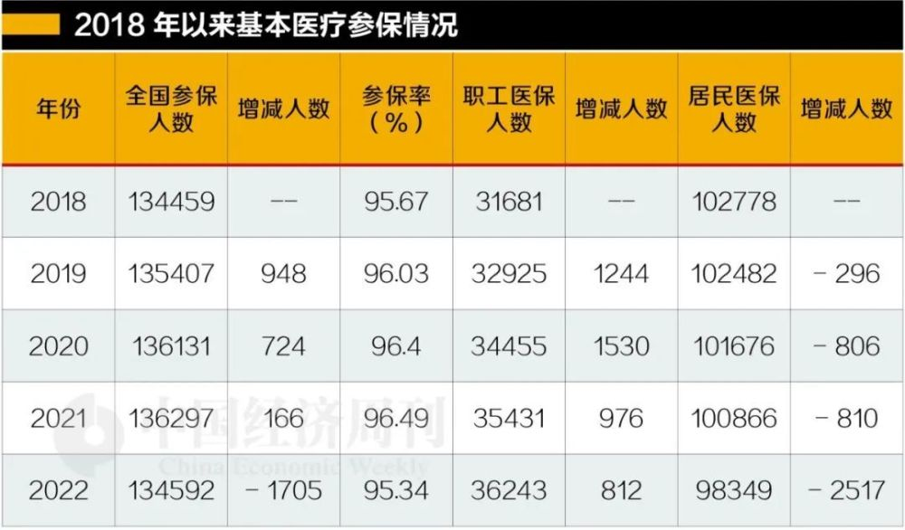

# 居民医保一年减少2517万人，参保人数为何下降？

“居民医保作为一种医疗保险，确保了农民在面临重大疾病时可以得到及时、有效的医疗待遇，确实起到了一定的作用，但是这份保障的价格让农民们感到负担重重。”中国人民大学劳动人事学院教授杨立雄表示，现在农民增收很难，而医疗保险增长幅度又过快，“这是最大问题。”

《中国经济周刊》 记者 王红茹｜北京报道

根据国家医保局发布的《全国医疗保障事业发展统计公报》显示，2022年全国基本医疗保险参保人数为13.46亿人，相比上一年少了1705万人，其中职工医保增长812万人，而居民医保则少了2517万人。

尽管看起来2517万人占参保总人口比例不高，但绝对值规模却足够大。据国家医保局有关司负责人接受媒体采访介绍，2022年，我国基本医保参保率稳定在95%以上。由于参保质量提升、参保数据去重等原因，2022年居民医保参保数据为98349万，虽较上年数据表面上有所下降，但由于重复参保等情况显著减少，真实的总体参保人数实际上还略有增加，基本医保参保大盘保持稳定。

**居民医保参保人数下降2517万人**

据国家医保局发布数据，2022年底，全国基本医保参保人口高达13.46亿人，占总人数的95.34%，基本实现了医疗保险全民覆盖。但值得注意的是，2022年的参保人数比2021少了1705万人，尤其是居民医保下降了2517万人。

社会各界都在关注基本医保参保数据的变化情况，国家医保局就此问题回应如下：

一是部分原来参加居民医保的群众转为参加职工医保，基本医保参保数据呈现“居民降、职工增”的趋势，越来越多的群众参加职工医保。5年来，居民医保参保数据从102778万下降到98349万，职工医保参保数据从31681万增加到36243万，特别是2022年职工医保参保数据增加达812万。

二是群众重复参保等情况减少，更真实地反映了参保情况。国家医保局成立以来，持续开展异地就医直接结算工作，群众在多地重复参保的需求明显降低，重复参保数据显著减少，再加上规范参保统计口径等因素，累计减少超过4000万数据。尤其是2022年全国统一的医保信息平台上线后，全国医保数据全面互联互通，异地就医结算更加便捷，重复参保数据减少的现象更加明显。

同时，中国社会科学院人口与劳动经济研究所副研究员华颖认为，“不能排除部分居民因缴费负担而放弃参保缴费。”

《中国经济周刊》记者采访发现，在当下的农村，的确存在弃保情况。

家住河南省西平县人和乡的单身村民王帆舟今年52岁，他坦言已经3年没有缴过医保了。

“4年前我母亲脑溢血在漯河医院看病治疗花了3万多元，医保异地只报销了1万多，报销程序还很麻烦。由于我母亲得的是高龄间歇性癫痫症，于是就回家保守治疗，回家不久人就走了。”王帆舟认为自己身体健壮，很少得病，于是果断停缴了医保。

“我先后经历了一阳和二阳，但都是在村里的小诊所花五六十元钱买了3天的药治好的。所以断缴居民医保，对于我来说，影响不大。”王帆舟说。

河南中部某乡镇一位乡长向《中国经济周刊》记者提供了一组数据：该乡2022年参加医保人数是49676人，2023年参加医保人数是47886人，参保人数下降3.6%。

在中国人民大学劳动人事学院教授杨立雄看来，居民医保参保费用对于农村的一般家庭，确实是一个负担。

“居民医保作为一种医疗保险，确保了农民在面临重大疾病时可以得到及时、有效的医疗待遇，确实起到了一定的作用，但是这份保障的价格让农民们感到负担重重。”杨立雄向《中国经济周刊》记者表示，现在农民增收很难，而医疗保险增长幅度又过快，“这是最大问题。”

**如何看待医保费用持续上涨？**

“我们在调查中也发现，一些低收入家庭确实反映逐年增长的医保缴费造成家庭支出的负担。”华颖说。

医保费用持续上涨。2003年新农合建立之时，个人缴费标准仅为10元。此后便呈阶段性上涨，到了2015年为120元、2018年为220元、2022年为350元、2023年为380元。

华中师范大学副教授王超群测算，从2003年新农合建立之时到2023年，20年时间里，个人保费增长了38倍，年均增长19.78%。按照这个趋势，2024年，居民医保费用很可能超过400元。

如果按一个5口之家来计算，根据2023年个人最低缴费标准，一年所需要缴纳的居民医保费用就是1900元。对普通农民来说，这笔钱不是个小数。

如何看待农村居民医保费用持续上涨？华颖对《中国经济周刊》记者表示，这个问题需要辩证来看。一方面，提高缴费标准是为了更好地保障居民的疾病医疗。因为筹资水平直接决定着医保待遇，要真正解除居民的疾病医疗后顾之忧，就必须将筹资水平提升到能够具备这种保障能力的水准上。

“我国的居民医保从低水平起步，经过近20年的发展，筹资水平在提升，医保待遇水平也在同步提升，这是相辅相成的一体两面。因此，为了使居民的疾病医疗有更好的保障，在逐年提高居民个人缴费的同时，政府对居民医保的补助标准也在同步提高，从2003年的20元/人增长至2023年的不低于640元/人。”华颖说。

国家医保局有关司负责人近日专门就基本医保参保情况接受媒体采访表示，近年来，国家持续加大对居民医保的补助力度，2022年财政补助居民医保6355.77亿元，相当于居民医保参保人人均享受646元财政补助。

华颖表示，应当看到居民医保筹资机制存在着与个人可支配收入脱钩及管理粗放的缺陷。目前居民医保筹资采取按照人头缴纳定额且等额的保费，会出现低收入家庭负担偏重的现象，而每年的缴费标准调整并非基于基金支出需求的测算，也没有依据居民可支配收入等明确的关联指标。这使得居民医保筹资标准缺乏自动调整机制，个人缴费额也缺乏清晰的预期，导致参保动员困难，增加管理经办的难度与成本。

华颖测算了个人缴费标准占人均可支配收入之比，发现目前负担最重的农村低收入组的缴费负担，是负担最轻的城镇居民高收入组的20多倍。即使目前近10亿参保者中有超过1亿人都在接受参保资助，定额缴费也正日益成为低收入群体难以承受的负担，持续下去将导致更多的居民抵触参保。同时，这一筹资机制限制了有能力且理应承担更多义务的中高收入者缴费的提升，制约保障水平的提高。

杨立雄从宏观层面分析了居民医保人数下降的主要原因：近几年经济形势严峻，在此大背景下，农民增收也更为艰难，“再加上我国的收入分配并不均衡，东西部收入差距较大，如果居民医保缴费仍不断增高，会导致一部分农民弃保。”

**现行居民医保对大病保障仍存不足**

记者采访发现，还有部分参保人员认为参保不划算，甚至参加了居民医保也基本上不报销。

河南村民王小强今年28岁，前不久刚在漯河市源汇区大刘镇某村祖传痔瘘专科做了瘘管手术，在那里住了十几天，总共花了2000多元。

“我之所以选择到那个偏僻的农村去看病，就是冲着人家祖传几代的口碑和价格低才舍近求远而去的。”王小强说，他在去治疗之前，特意到漯河市某医院肛肠科咨询了一下，需要住院治疗一个多月，费用大概一万七八，居民医保报销以后，自费部分也得一万左右。

记者采访一些村民、村干部均认为，目前医保受益面太窄，住院报销比例太低，不解决问题。

村民之所以不缴费，一方面认为参保缴费300多元，不生病参保浪费了钱；另一方面，生了大病医保报销不了太多，“自己交的钱给别人用了，很亏。”

针对这种观点，华颖解释说，社会保险解决的是生活中的后顾之忧，而不是市场上的直接对价交易，它强调的是人人为我我为人人，是通过群体互助共济的方式来化解个体生活中难以避免的风险，因此，直接计算个人缴费与医疗支出是不当的，“因为什么时候生病、家庭成员中谁生病、生多大的病，都是难以预料的，参加医保就是要将这种不确定的风险分散出来，一旦得病而不致影响正常生活。”

对参保者而言，不生病是最好的状态，“没有人会因为参保了而想生病，理想的状态是参保了不担心生病，这就需要大家参与，通过共建实现共享。”华颖说。

事实上，记者采访的诸多学者均认为，现行居民医保制度虽然在基本医疗保险之外还建立了大病医疗保险制度，但对大病的保障仍存在着不足。

“城乡居民一旦得了大病易陷入生活困境。大病意味着更高的医疗费用甚至灾难性医疗支出，对大病的保障的确是解决人们疾病医疗后顾之忧的重点。”杨立雄说。

华颖表示，在筹资总体规模有限的情况下，向大病倾斜资源有合理性。从国际经验来看，一些国家医保待遇给付重点也呈现向两端倾斜的特点，即前端体检、疾病筛查等预防措施，以及后端大病慢病的治疗。“通过积极推进疾病预防措施、倡导健康的生活方式，不仅可以从根本上促进参保人健康，而且可以防止疾病的发生从而降低医疗支出。”

针对现行居民医保还不能真正全面解除居民疾病医疗的后顾之忧，华颖建议，“我们需要改革筹资机制，同时不断提高保障水平，最终基于个体家庭收入的一定比例承担筹资义务、确定自付封顶线，以此真正化解灾难性卫生支出风险，给参保者提供清晰、稳定的医保预期。”

**如何多措并举提高居民医保参保率**

进一步提高医保参保率的政策建议很多，有专家提出最好是实行强制参保。这种强制参保的方式，是与职工医保强制要求企业参保一样，居民医保要求所有未参加职工医保的居民参加居民医保。鉴于几乎所有居民家庭都有银行账号（包括农民的农商银行账户），因此强制是有技术保障的。

杨立雄并不认同强制医保的做法，“强制参保的方式完全不可行，即便农民有农商银行账户，在不经允许的情况下，也不能擅自扣除他们的费用”。

华颖也不认同这种做法，“强制参保的前提是缴费负担的合理化，即有能力的高收入者多缴费，低收入者少缴甚至免除缴费”。

华颖提出了两个稳定居民医保覆盖面的举措：一是从按人头定额缴费转向与收入关联型缴费制，即遵从医保筹资公平性原则，根据参保人或参保家庭可支配收入的水平来确定其缴费水平；二是不断提高医疗保障水平，给予参保居民更多获得感。

杨立雄从制度改革层面阐述了自己的看法，他认为，当前形势下，保险制度可能并不适合中国的农村地区，“社会保险本身是工业化的产物，即便西方国家在充分就业的情况下，也会有极少数的人不会通过劳动力市场去参与保险，而我们国家多数农民只是分了一小块田地，自己有一点收入，让他们参加保险有点勉为其难。”

“虽然一年只缴一次，但有些人根本就缴不起，积极性当然不高。义务教育如果去收费，很多人就上不起学。所以，对待农村医疗保险，就应该像义务教育那样，规定最基本的医疗免费由国家兜底。如果一些农民觉得最基本的医疗不够，可以自己去参加社会保险。”杨立雄说。

（文中王帆舟、王小强均为化名）

责编 | 姚坤

