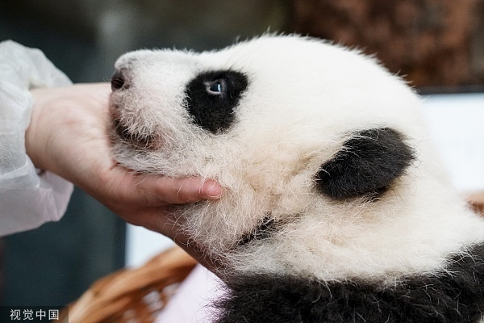

# 旅俄大熊猫幼崽选名，“喀秋莎”暂时领先

（观察者网讯）据塔斯社和俄新社报道，莫斯科市政府网站当地时间12月3日发布消息称，24小时内，已有超过10万人参与为莫斯科动物园大熊猫幼崽选名的投票活动，“喀秋莎”暂时领先。

_莫斯科动物园大熊猫幼崽出生满两月时的照片。图自视觉中国_

据悉，有10个名字可供选择，其中两个俄语名为喀秋莎、玛莎，8个中文音译名分别是莫莫、小乌拉、小莫、珍珠、爱民、红星、白桦和金顶。

从目前的投票数据来看，“喀秋莎”这个名字领先，有27%的人投票给它；“莫莫”这个名字也很受欢迎，21%的人支持这个名字；名字“玛莎”目前排名第三。

根据中国的传统，大熊猫在出生后百天就要取名。当地时间12月2日，莫斯科市长索比亚宁宣布起名活动启动。

据微信公众号“中国驻俄罗斯大使馆”消息，中国大熊猫保护研究中心今年8月30日发布消息说，俄罗斯当地时间8月24日凌晨，旅俄大熊猫“丁丁”首诞幼崽，这是在俄罗斯出生的首只大熊猫幼崽。

索比亚宁当时在社交媒体上发文说，大熊猫“如意”和“丁丁”于2019年来到莫斯科。今年春天，成年的“如意”和“丁丁”开始相互接触，中国大熊猫繁育专家专程前来监督其孕育生产过程。此次大熊猫幼崽降生是俄中两国专家共同努力的结果，对俄罗斯和世界自然保护界来说都具有里程碑意义。

报道显示，目前，大熊猫幼崽已经长出了第一颗牙齿，开始爬行并积极探索周围的世界。据介绍，该大熊猫幼崽目前重6公斤，鼻尖到尾根的长度为60.5厘米。

**本文系观察者网独家稿件，未经授权，不得转载。**

