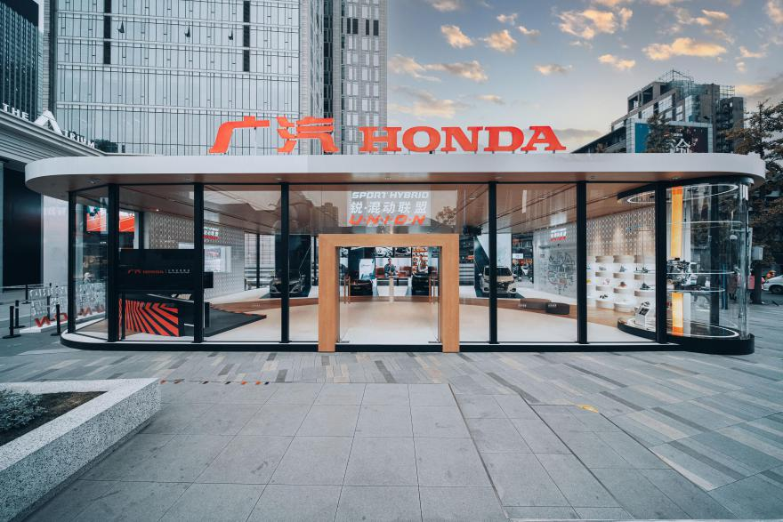
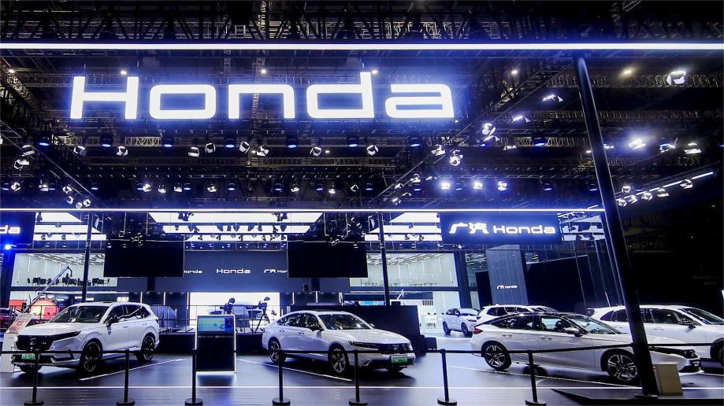
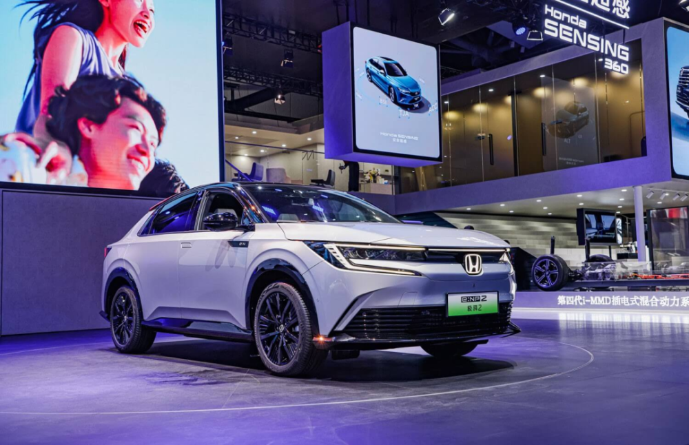
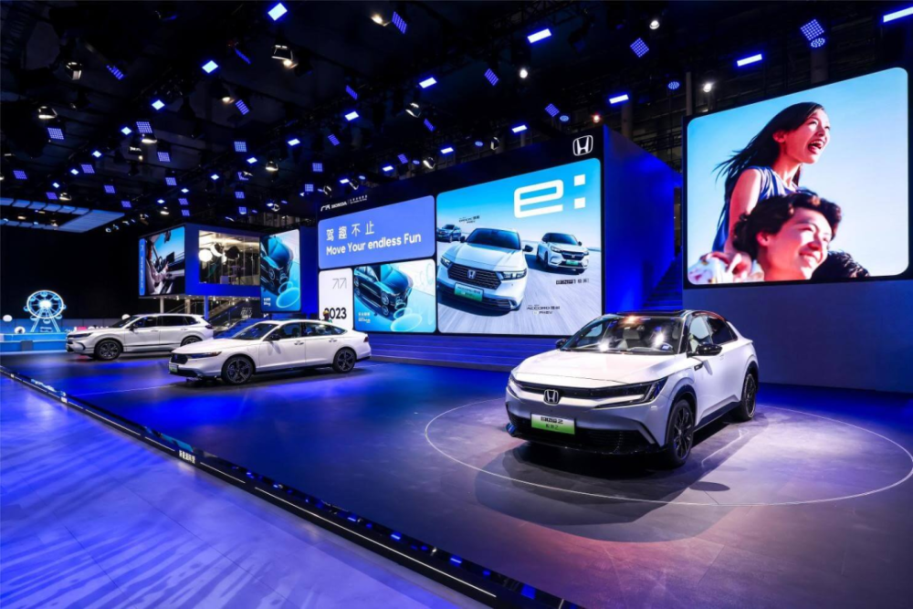
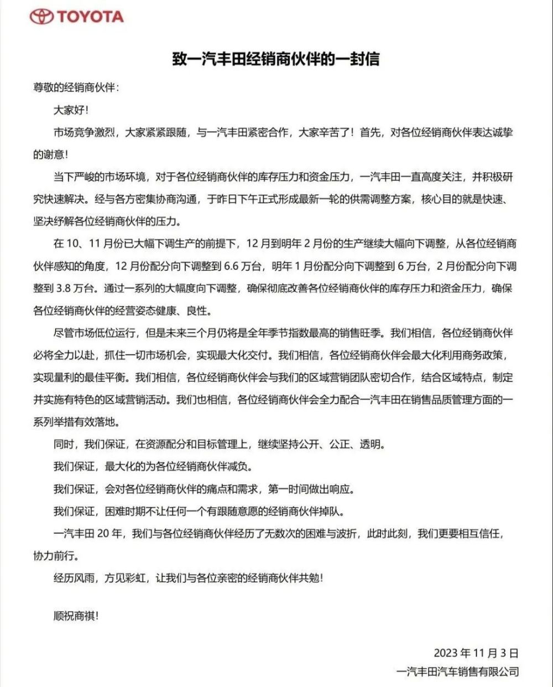
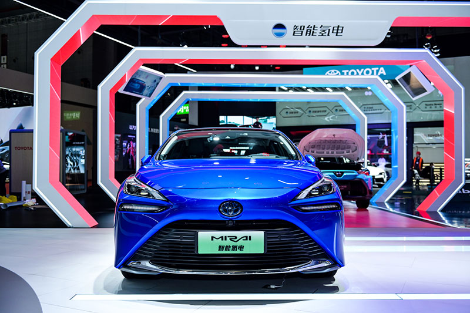
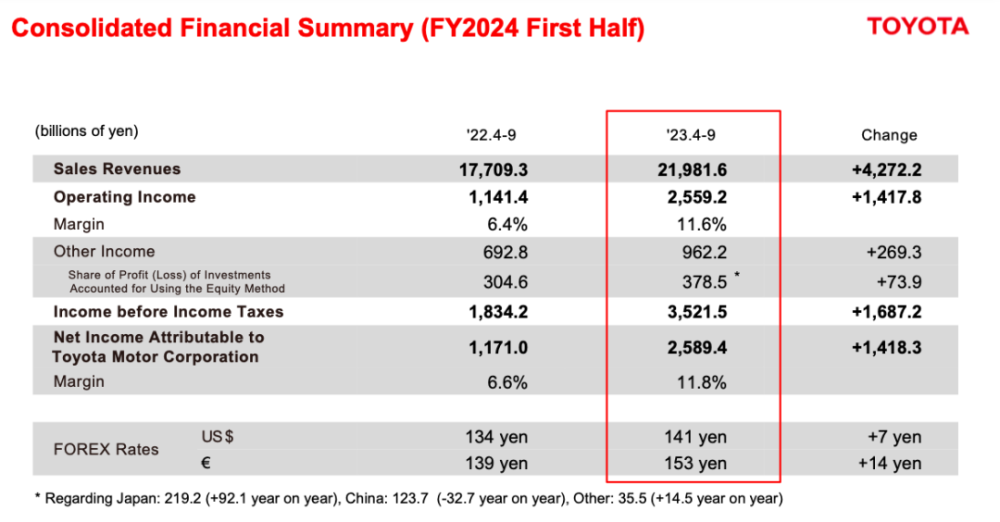

# 日系车不香了？广汽本田入华25年来首次大规模裁员，丰田工厂持续减产

作者｜王磊 楚门

**涉及人数占总数7%**

活的最滋润的“两田”，开始传递寒气。

12月3日，日本第二大汽车制造商本田宣布，将解雇中国合资企业——广汽本田公司 **约900名合约工** 。

几乎同一时间，一汽丰田称，停止部分其位于中国天津工厂的生产。

过去几年，日系车在中国市场的份额不断扩大，丰田凭借精益生产模式，更是成为“ **最会赚钱的车企** ”。“两田”在中国的成功，也见证了中国汽车产业的崛起。

如今时过境迁，曾经这些凶猛无比的日系品牌，不得不向现实妥协了。

**史上首次大规模裁员**

企业再困难也不裁员，似乎是日本本土企业约定俗成的传统，在当地的企业文化里，裁员也不会是优选项。

当然，这个传统只适用于日本本土。针对广本这次裁员，本田方面表示，被裁的员工均为 **合同工** ，慎重考虑后，与劳务公司终止人员派遣协议。

对于涉及的劳务派遣人员，广汽本田将依法依规、及时地 **提供经济补偿** ，并积极协助相关人员再就业，并优先考虑与被解雇员工的合作。

虽然是第三方派遣的员工，但本次裁员是本田汽车自1998年与中国广州汽车公司合资成立广汽本田 **25年以来，第一次大规模的压缩裁员** 。

而本田给出的理由也是“名正言顺”。主要因为中国的纯电汽车市场崛起，给本田的传统燃油车市场造成了冲击，相应地 **产量出现了减少**
，因此派遣合同也随之终止。

另一方面本田为了迅速转向电动车市场，调整生产线，对生产线进行改造，以降低成本和提高效率，这些被裁掉的员工，大都是 **燃油车生产线** 的相关人员。

但目前本田并没有透露哪些车型的产量会被削减。企业效益不好， **裁员降薪往往是最简单直接的降本措施**
，而第一刀大都会先砍在不是“自家人”的劳务派遣人员身上。

有意思的是，就在前不久，广汽本田刚刚结束了其一年一度的粉丝共创汽车文化节日第四届躁梦节。这次活动的主题，就是广汽本田要开启新千万智电新时代。

之所以叫新千万智电时代，是因为广汽本田在国内市场达成了 **累计销量1000万的成绩**
。智电时代不言而喻，就是广汽本田面临全面转型，在国内市场加快电气化的转变。

广汽本田作为国内的主流合资汽车品牌，已经成立了25年，曾经也推出过不少市场上爆款的车型，比如雅阁，飞度等，也正是凭借着这些车型的热销，才让广汽本田实现了超千万的销量成绩。

但这些只是过去，如今本田在国内的销量也开始大幅下滑。2023年1-10月，本田在全球售出320万辆汽车，而占总销量30%的中国市场销售额则较去年同期
**下降近五分之一** ，减少了18.5%。

**丰田也开始减产**

不单是广汽本田的日子不好过，丰田在华的合资企业广汽丰田，不久前也开启了一波大规模的裁员，被裁掉的员工主要是劳务派遣人员， **人数大概在1000名左右**
，主要是生产线上的作业工人， **正式员工同样不在裁员计划内** 。

当时丰田给出的原因是，国内市场的价格下调和销量下滑，导致利润降低。“这是正常阶段性调整，对象为部分劳务派遣员工，不涉及正式员工。”

除了裁员，减产也成了丰田必须的选择。据路透社报道，一汽丰田已对其位于 **天津的工厂部分生产线进行暂停** 。

目前，一汽丰田在天津共有一汽丰田汽车有限公司、一汽丰田汽车有限公司技术研发分公司、一汽丰田发动机（天津）有限公司等多家子公司。

其中成立于2003年8月的一汽丰田汽车有限公司，是丰田在国内最大的整车制造基地， **年产能62万辆**
，负责生产威驰、卡罗拉、亚洲狮、奕泽、卡罗拉锐放、皇冠陆放等车型。

而一汽丰田发动机（天津）有限公司，则负责生产 **TNGA** 1.5/2.0/2.5L、1.2T、NR1.5L、ZR-HV/PHEV1.8L等发动机。

对于停产的原因，丰田官方给出的回答是 **对生产系统进行优化** ，“考虑到车型的老化和车身类型等构成的变化，对生产系统进行优化”。

不过官方并没有指出具体暂停的是整车工厂还是发动机的生产。

丰田官方发言人表示，与中国一汽合资的天津生产基地的停产是计划中的举措，丰田正在根据车型构成的变化调整生产。

但日本时事通信社报道称，丰田在中国面临的竞争激烈加剧，这次停产是其应对 **燃油车销售疲软** ，而进行的重大生产调整的一部分。

在这次停产之前，一汽丰田曾于11月发布了《致经销商伙伴的一份信》，称将通过减产的方式帮助经销商 **缓解库存和资金压力** 。

据悉，为了缓解库存压力，一汽丰田在10月、11月已经大幅减产的情况下，宣布从今年12月到明年2月 **继续大规模减产**
。12月丰田的生产配额将下调到6.6万台，而明年1月和2月则分别下调到6万台和3.8万台。

当时一汽丰田内部人士表示，减产是根据当前市场竞争环境的选择，并表示他们的绝对库存并不高，在1.1个月左右，但“ **市场价格下探太严重**
，销售端尽量减少经销商库存车资金成本，缓解经销商收益压力。”

除了在国内减产，丰田也在其他地区的市场做了调整。据报道，丰田在加拿大的工厂已经停止生产，同时在美国也计划裁员数千人以应对销售下滑和成本压力。

**日系车，真的衰败了吗？**

2023年1-10月份，日产汽车在中国区含乘用车和轻型商用车两大事业板块在内的销量为62万辆，数字虽然仍然可观，但已经同比 **暴跌33.1%**
，至此已连续15个月同比下滑。

从丰田到本田再到日产，这三大“日系金刚”在进入电气化时代后，都不同程度遇冷。

对于仍以燃油车型为主力的日系车来说，只能眼看着自己的市场份额被中国品牌所蚕食，此前宣布退出中国市场的广汽三菱，其产能被广汽埃安接收，就是最好的例证。

就连东风日产乘用车公司制造总部专职副总部长、广州风神汽车有限公司总经理魏建彬也表示，合资企业在新能源的布局上 **确确实实晚了**
，没有赶上中国汽车市场的变革。

事实上，无论是生产端还是销售端，日系车都有不小的压力。公开数据显示，今年1-10月，一汽丰田的累计零售销量为65.18万辆，同比仅 **微增0.8%**
，此前官方定下的2023年销量目标则是102万辆，想要完成这个目标压力很大。

而减产和停产，是丰田在面对市场需求变化之下，不得不作出的应对调整。与此同时，这两年日系车在国内的光环，似乎随着新能源时代的到来也开始消散。

销量下跌、份额减少、唱衰之声此起彼伏，日系车是真的不行了吗？如果从国内市场看，确实如此。但放眼全球市场，日本的车企还是挺能赚钱的。

以丰田为例，上月初丰田公布的2024财年Q2财报显示，丰田汽车销售收入为 **11.43万亿日元**
，约人民币5566亿元，较上年同期的9.22万亿日元增长24%，净利润达到622亿元人民币。

作为对比，同样是国内汽车标杆的比亚迪，前三季度营业收入4222.75亿元，实现净利润213.67亿元，营收接近丰田的八成，而净利润却只有丰田的三分之一，净利润率水平也远低于丰田。

不夸张的说，丰田汽车一家的净利润就相当于多家中国汽车企业的利润之和。再看一组数据，2023年3月-9月，丰田全球产量与销量均 **突破500万辆**
，又创下了历史新高。

此外，丰田还重申了2024全年1138万辆的销量预期，但丰田也很实际的将纯电动汽车的销量预期，从此前的20.2万辆下调至12.3万辆。

虽然丰田这个全球第一大汽车制造商，在电动化转型上依旧平平无奇，但从财报数据来看，丝毫不影响丰田的赚钱能力。

这么来看，日系车更容易用燃油车赚钱，但市场终不可逆，新能源车普及终将到来，日系车还能笑多久？

