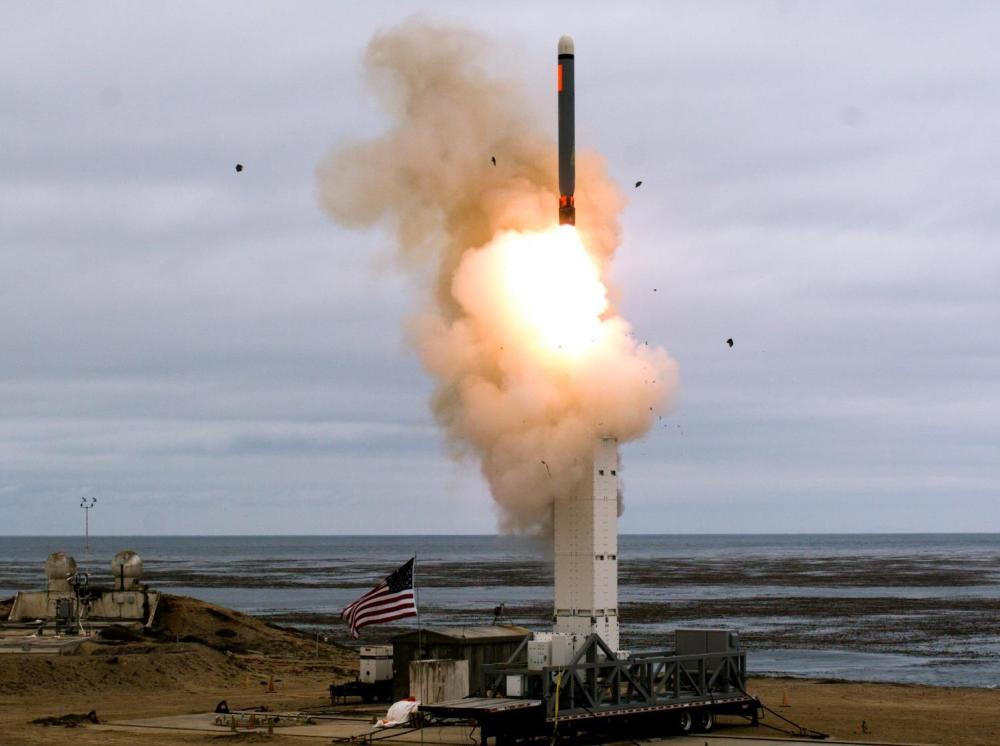

# 曝美军计划明年在印太部署中程陆基导弹，系《中导条约》失效后首次

【文/观察者网 熊超然】当地时间12月3日，《日经亚洲》（Nikkei
Asia）援引一名美国官员的消息称，美国军方计划于2024年在“印太地区”部署中程陆基导弹，这将是自冷战结束以来，美国在该地区建立的首个“武器库”，“目标加强对中国的威慑”。

美国太平洋陆军发言人罗布·菲利普斯（Rob
Phillips）向《日经亚洲》概述了这一计划，并透露正考虑的选项包括SM-6导弹的陆基版和战斧巡航导弹，这些导弹的射程在500公里至2700公里之间。不过，他并未提供可能部署导弹的地点和时间细节。

同时，这也将是自2019年《中程导弹条约》（《中导条约》，INF）失效以来的首次部署行动，该条约于1987年由美国和苏联签署，禁止两国开发和拥有射程在500公里至5500公里之间的陆基导弹。

_资料图：美国发射中程陆基导弹 图自兰德公司网站_

据报道，卡内基国际和平研究院高级研究员安基特·潘达（Ankit
Panda）说，美国陆军将把中程导弹部队主要派往美国领土关岛，并寻求在紧急情况下向亚洲盟国作出更多的前沿部署。

潘达说：“这些导弹将永久部署在该地区的美国领土上，主要是关岛。盟国可能愿意在危机中轮换部署，但这在很大程度上取决于未来的政治动态。”

《日经亚洲》认为，关岛已成为美国在西太平洋军事行动的战略要地，此处距离中国大陆4000公里，而这些中程导弹部队可以在紧急情况下从关岛迅速部署到美国的亚洲盟国。

报道还声称，“为应对台海危机或南海危机”，美国将需要能够打击这些关键水域或中国大陆目标的导弹，这意味着存在在所谓的“第一岛链”附近扩大部署的可能性。

不过目前，因担心在可能发生的危机中成为解放军的直接目标，日本和菲律宾表示不愿接纳美国的这些新导弹。白宫新闻秘书卡琳·让-皮埃尔（Karine Jean-
Pierre）今年1月曾表示，美国没有向日本部署新型陆基导弹的计划。

此外，菲律宾总统马科斯此前也曾言之凿凿地称，菲律宾会继续在中美之间保持平衡，如果未来台海发生战事，美国不能利用在菲律宾的军事基地对中国采取“进攻行动”，这一点他今年4月底已向中方作出过保证。

《日经亚洲》称，美国陆军正将重点从中东反恐战争转移到应对中国和俄罗斯，并声称中俄两国也在研发高超音速导弹，这种导弹射程达2700公里以上，以高速的不规则轨迹飞行，很难被反导系统击中。报道还渲染，在美国受到《中导条约》约束的时候，中国则在不断扩大其中程导弹武器库。

“美国打算推进陆基导弹的部署，以威慑中国的军事行动。机动敏捷的导弹比船舰或飞机更有可能避免被发现和遭到敌人打击，它们也不需要跑道或港口，灵活性更强。”报道援引美国战略与国际问题研究中心高级顾问马克·坎西安（Mark
Cancian）的话声称，“中国导弹将威胁到美国在西太平洋的海军基地”，美国需要类似能力，以在不让军舰和战机冒险的情况下打击中国的基地。

而美国跨党派智库新美国安全中心（CNAS）高级研究员雅各布·斯托克斯（Jacob
Stokes）则炒作渲染称，在涉及台海和南海的紧急情况下，空中、海上、太空和网络领域将比陆基资产更重要。

斯托克斯说声称：“这主要是因为相关地区的海洋地理位置。作为联合部队的一部分，地面部队可以发挥有用的作用，特别是通过操作陆基导弹和导弹防御系统，但美国地面部队在东亚地区的相对价值与专注于其他领域的部队不相称。”

11月30日，针对有关“美方宣称将在亚太地区部署新中程陆基导弹”的问题，国防部新闻局局长、国防部新闻发言人吴谦大校回应指出，美国推动在亚太地区部署中导是一个危险的动向，将严重威胁地区国家安全，严重破坏地区和平稳定，中方坚决反对并将予以坚决反制。他同时强调，台湾问题纯属中国内政，不容任何外来干涉。中国解决台湾问题，是任何人、任何势力都无法阻挡的。

**本文系观察者网独家稿件，未经授权，不得转载。**

