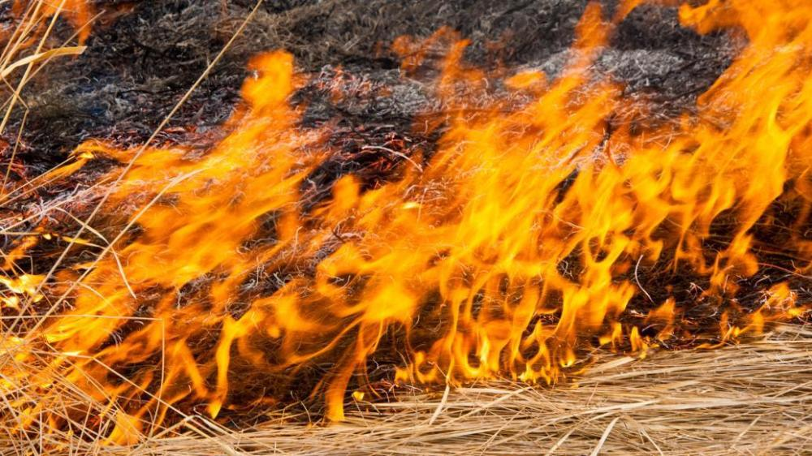

# 禁烧秸秆致稻田虫害加重？多省份正争取或已实行有条件焚烧

近年来，禁止秸秆焚烧政策对改善大气质量发挥了积极作用，但也被认为带来了农作物病虫害加重、化肥农药用量增加等问题。目前，已有浙江、广西及湖南长沙和衡阳等多地探讨或实行了允许有条件焚烧秸秆的政策，包括争取允许发病稻田秸秆有条件田间焚烧等。

澎湃新闻注意到，今年3月27日，农业农村部科技教育司召集黑龙江、江苏、河南、湖南和长沙等省、市相关人员以及部分生态环境、农学、植保等专家专题研讨了秸秆问题。5月中下旬，农业农村部、生态环境部组成调研组赴湖南、湖北、浙江、安徽等八个省份开展秸秆综合利用与禁烧工作调研。

**浙江：争取“允许发病稻田秸秆有条件焚烧”入法**

据浙江省政府网站11月30日消息，浙江省农业农村厅近期答复省十四届人大一次会议刘慧琴、余震代表《关于水稻白叶枯病的发生情况和防控建议》称，近年，受秸秆禁烧、抗病品种弱化、气候复杂多变等多重因素影响，
**浙江省水稻白叶枯病发生趋重，发病面积逐年增加** ，2022年全省发病面积25.17万亩次。

答复称，浙江省水稻育成品种所利用的水稻抗白叶枯病基因资源多样性不够，水稻抗白叶枯病新品种较少。目前，浙江省农业农村厅已将水稻白叶枯病抗性指标列入品种审定标准，积极推动水稻抗白叶枯病品种选育。各地植保部门积极推广种子消毒处理技术措施预防水稻白叶枯病，但受噻唑锌等主治药剂防治效果不佳影响，白叶枯病防控效果仍不够稳定。

浙江省农业农村厅表示，浙江省秸秆禁烧政策对改善大气质量发挥了积极作用，但也带来了一些农作物病虫草害防控的影响，如水稻白叶枯病等发生危害加重、化肥农药用量增加等。
**5月22日，浙江省农业农村厅与生态环境厅专题会商允许发病稻田秸秆有条件田间焚烧事宜。**
浙江省生态环境厅反馈会办意见，指出秸秆露天禁烧对空气质量仍有较大影响，暂无修订《浙江省大气污染防治条例》的计划，并继续加强秸秆综合利用和露天禁烧监管。

关于下一步工作措施，浙江省农业农村厅表示，将优化秸秆禁烧管理机制。《浙江省农作物病虫害防治条例（修订）》已进入立法调研程序，浙江省农业农村厅将积极配合省人大农委开展立法调研工作，
**争取将“允许发病稻田秸秆有条件焚烧”作为一项应急处置措施列入《浙江省农作物病虫害防治条例（修订）》**
。同时，继续加强与生态环境部门沟通，完善秸秆焚烧政策。

**湖南湘江新区：开展秸秆有序焚烧研究**

据湖南湘江新区管委会网站消息，湖南湘江新区今年4月10日印发的《关于全力做好2023年 “三农”
重点工作加快推进乡村振兴示范新区建设的实施意见》提出，“开展秸秆有序焚烧研究。”

据中国农业大学新闻网转载的第一财经客户端报道，湖南长沙市委、市政府今年2月20日在正式印发的“2023年长沙市委一号文件”中已提出“开展秸秆有序焚烧研究”。

据长沙市人大代表建议查询服务平台消息，长沙市农业农村局今年7月28日在答复长沙市十六届人大二次会议肖定代表《关于扛牢粮食安全责任，从虫口夺粮，将秸秆由禁烧调整为有序焚烧的建议》时透露，长沙市农业农村局组织相关专业人员深入田间进行调研，调取了2017年至2022年水稻虫情调查统计数据，统计结果显示：2022年二化螟越冬基数为平均每亩6612.6头，比全面禁止露天焚烧秸秆政策发布前一年（2017年）的418.45头增加了14.8倍；各区县
**二化螟（俗称钻心虫）越冬基数均较2017年增加10-100倍不等**
，最高丘块亩均虫量达到10万头以上。近五年第四代二化螟发生面积和发生程度均呈现逐年大幅增加趋势，长沙市2022年第四代二化螟发生面积48.3万亩，较2017年的6.3万亩增加了7.6倍。《2021年全国农业有害生物抗药性监测报告》中也指出，湖南中南部地区二化螟种群对阿维菌素和氯虫苯甲酰胺处于中等至高水平抗性。面对二化螟频发重发态势和较高的抗药性，
**种植户不得不增加防治频次和农药使用量**
。根据长沙市植保植检机构《农药使用情况统计表》及《农药械实际用量表》显示，2017年全市双酰胺类农药使用量为6.43吨，2021年增长到35.34吨，5年内增加了近5.5倍。

长沙市农业农村局在答复中透露，
**2023年3月27日，农业农村部科技教育司召集黑龙江、江苏、河南、湖南和长沙等省、市同志以及部分生态环境、农学、植保等专家专题研讨秸秆问题**
。从其他省农业部门和农学、植保专家反馈情况来看，与长沙市反馈情况基本相似。

不过，长沙市生态环境局在答复肖定代表《关于扛牢粮食安全责任，从虫口夺粮，将秸秆由禁烧调整为有序焚烧的建议》时则表示，目前，长沙市暂不具备“分区管制，有序焚烧”条件。
**5月中下旬，农业农村部、生态环境部组成调研组赴湖南、湖北、浙江、安徽等八个省份开展秸秆综合利用与禁烧工作调研**
，强调要“以用促禁、以禁促用”，将秸秆禁烧和综合利用工作有机结合，进一步加大政策支持，破解秸秆高效利用技术难题，强化秸秆还田监测，推进秸秆利用企业市场化，实现“还田要科学，离田要高效”的目标。在长沙市调研座谈会上，调研组认为长沙市非农业大市，秸秆“烧与不烧”并非长沙市农业生产的主要矛盾，明确指出：一是长沙市环境空气质量尚未达到国家二级城市标准要求，PM2.5浓度排名在全国31个省会城市以及省内市州均靠后，又处于大气污染传输通道，秸秆焚烧对上下游城市空气质量可能会造成影响，不赞同长沙市现阶段开展秸秆有序焚烧（实验）工作。

长沙市农业农村局在前述答复中表示，为全面掌握秸秆还田或移除、秸秆有序焚烧对农作物病虫害、农作物草害、下一季作物耕种、当季作物生长和产量，以及对土体、水体、大气、温室气体等生态环境的影响，拟向市生态环境局沟通，共同选定在部分区域开展相关试验研究。长沙市生态环境局在答复中也表示，后期，长沙市生态环境局将积极争取省生态环境厅的支持，配合市农业农村局对拟牵头开展的秸秆焚烧试验开展大气污染实时监测，科学评估秸秆焚烧对大气环境带来的影响。

**广西：在合适条件下组织秸秆限时禁烧区有序焚烧**

长沙市农业农村局在前述答复中透露：2023年2月28日至3月2日，长沙市蓝天办、长沙市农业农村局、湖南农业大学相关人员赴广西贵港市进行了考察学习。贵港市执行《广西秸秆露天禁烧区划定和综合利用指导方案》，在合适条件下组织秸秆限时禁烧区开展有序焚烧。

长沙市农业农村局表示，查看广西生态环境厅发布的通报，对比贵港市执行秸秆有序焚烧4年来，空气质量优良天数比率由2017年的84.9%提升到2022年的93.2%；PM2.5含量由2017年的42微克/立方米下降到2022年的27.1微克/立方米。纵向比较，
**贵港市空气质量确有好转，原因是多方面的，但同时也说明有序焚烧秸秆未对空气质量带来明显的负面影响** 。

浙江省农业农村厅在前述答复中也提到，为推动优化完善秸秆禁烧机制，将积极研究国内外相关政策，学习借鉴广西、湖南衡阳市等兄弟省市的先进经验。

澎湃新闻注意到，广西污染防治攻坚战领导小组办公室2019年1月印发《广西秸秆露天禁烧区划定和综合利用指导方案》，规定在合适条件下组织秸秆限时禁烧区开展有序焚烧。即，由生态环境部门对计划有序焚烧日期前后空气质量进行预测，预测空气质量为优或者良且符合下列条件之一：风速大于2级且小于5级；未来一天有冷空气或未来8小时后有小雨及以上量级的降雨；受冷空气（日降温幅度在6℃以上）影响的当日或次日；经研判确定有利于秸秆焚烧烟气扩散和清除的天气等，可以组织。同时，明确要分区域分时段实施。根据风向预报，优先安排相对于主城区影响较小的下风向区域。时间上一般选择上午10点到下午5点之间大气边界层较高（500米以上）的情况下进行焚烧。

从2023年10月15日起施行的广西《贺州市秸秆露天禁烧和综合利用条例》规定，禁止在秸秆全时禁烧区和限时禁烧区禁烧的时段内露天焚烧秸秆，但经检疫确需焚烧的病虫害秸秆除外。县（区）人民政府农业农村主管部门应当及时对病虫害秸秆进行检疫，确需露天焚烧的，由乡镇人民政府、街道办事处组织就地焚烧并报告县（区）人民政府生态环境主管部门。

从2022年3月1日起施行的湖南《衡阳市农作物秸秆露天禁烧和综合利用管理条例》也规定， **禁止露天焚烧秸秆，但经检疫确需焚烧的病虫害秸秆除外**
。市、县（市、区）人民政府农业农村主管部门应当及时对病虫害秸秆进行检疫，确需露天焚烧的，由乡镇人民政府、街道办事处组织就地焚烧，并报生态环境主管部门备案。

此外，从2022年8月14日起施行的云南省临沧市《镇康县农作物秸秆露天焚烧和综合利用管理办法（试行）》也规定，做好农作物秸秆露天焚烧管理，经检疫确需焚烧的病虫害农作物秸秆除外。

