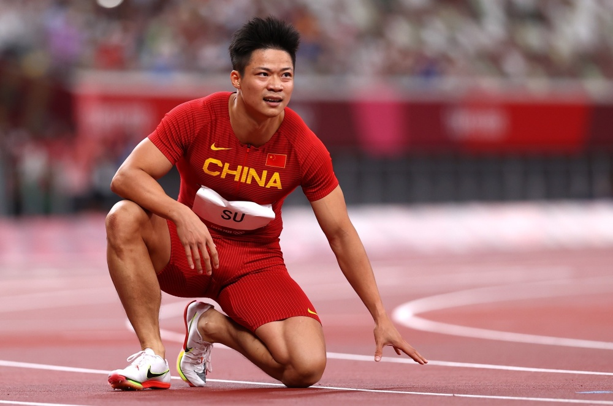
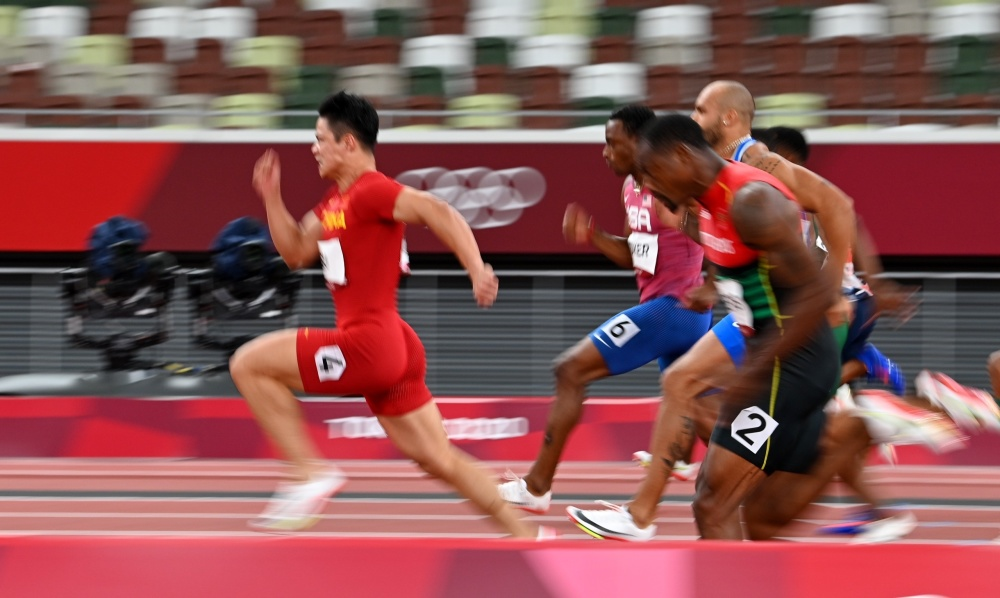

# 继续冲击巴黎奥运梦！苏炳添：我想坚持到2025年

半年前，当苏炳添宣布自己提前结束2023赛季时，这位34岁的老将强调自己并不会停下备战巴黎奥运会的逐梦脚步。

如今，已经重回训练场约1个月时间的苏炳添，正在兑现自己的承诺。

12月4日，苏炳添在接受采访时公开透露，自己的身体情况已经比宣布提前结束赛季时好了很多，自己正在通过训练量和训练强度来检验身体状况。

他依旧期待着获得巴黎奥运会的参赛资格，并希望能够坚持到2025年的大湾区全运会，“我在逐步进行挑战，但首先要让自己坚持下来。”

_苏炳添_

**身体状况越来越好**

即便在刚刚过去的赛季没有参加太多重要比赛，并且因为身体原因提前结束赛季，34岁的苏炳添依旧是中国田径的标志性人物。

正因如此，每当苏炳添在过去两个多月的时间里出现在公众场合，媒体记者总会问到他的身体状况，以及对于巴黎奥运会的备战打算。

**“现在整体的状态，比当时好了非常多。但还是一直要保持和保养，通过训练量和训练强度来检验自己目前的身体状况。”在接受媒体采访时，苏炳添透露自己的身体正在越变越好。**

在东京奥运会上演百米9秒83的巅峰后，苏炳添就一直饱受伤病困扰，此前接受央视采访时，苏炳添表示自己曾两次遭遇新冠肺炎的冲击，运动机能受到了影响。

“钟南山院士对我进行了指标筛查。没有问题，比正常人还正常。但训练中不舒服的感觉还是存在……发力时肌肉力量提不上来。”他彼时表示。

今年年初的室内赛季开始时，苏炳添在瑞典哥德堡室内赛男子60米决赛中还跑出过6秒59，赢下了新赛季的第一个冠军。但按照苏炳添的说法，在那场比赛前，他的身体就出现了不适的症状。

回国后，在医学专家和训练团队的建议下，苏炳添最终选择了放弃2023赛季，全力调整好身体状态。

过去几个月的恢复过程中，苏炳添并没有远离田径。由他领衔并参与建设的广东省速度能力研究重点实验室在7月份正式揭牌，他也和自己的团队通过比赛搜集青少年的短跑数据，希望发掘更多田径人才。

 _苏炳添在东京奥运会上拿出了精彩表现。_

另一方面，潜力新星陈冠锋也在这个赛季开始跟着苏炳添的团队一起训练，苏炳添也更多地担当起了导师的角色。

到了11月，苏炳添在身体恢复到理想状况之后，就提前开始进入冬训备战。11月下旬，在“苏炳添速度挑战赛”系列活动中，他透露自己已经恢复训练了三周时间，但还没恢复到较好的状态。

如今时间又过了两周，苏炳添转而用“目前状况很好”来总结自己的训练情况，这无疑是一个积极的信号。

**目标：巴黎奥运和大湾区全运会**

34岁的苏炳添坦言，恢复训练其实只是第一步。对他而言，冲击巴黎奥运会的前路并不平坦。

今年10月，世界田联公布男子百米最新世界排名，过去一个赛季几乎没有参加比赛的苏炳添积分清零，“苏炳添世界排名消失”的话题也冲上了社交媒体热搜。

**单项世界排名是基于运动员过去一个赛季的总积分而定，因长期休赛导致积分被清零的情况并不鲜见。但积分清零，也意味着志在冲击巴黎奥运会资格的苏炳添必须重新起跑。**

根据国际奥委会在去年年底公布的巴黎奥运会田径项目资格获取方案，50%的席位将通过在达标期内达到竞赛项目参赛标准的方式获取，男子百米达标成绩为10秒；另外50%的席位则将通过排位期内的世界田联排名确定归属。

除10000米、马拉松、竞走以及综合项目外，所有个人竞赛项目的奥运达标期和排位期均为2023年7月1日至2024年6月30日。

_苏炳添还将继续冲击巴黎奥运梦想。_

**根据目前的情况，苏炳添想要参加巴黎奥运会，就必须在2024年上半年参加10场比赛，积攒5个有效积分，从而达标奥运积分，或者需要在达标期内再次跑进10秒大关。**

“目前还没有一个明确的比赛计划，而且明年的赛程还没有完全出来。”苏炳添强调不能急于一时，“教练组还有团队的想法是不要着急，目前包括我自己也好，中国男女4X100米接力也好，大家都还没有获得巴黎奥运会的资格，都在很紧张地备战。”

尽管比赛计划还没有最终确定，但在苏炳添明年的计划里，已经有一场比赛不得不全力以赴，那就是明年5月的巴哈马世界接力比赛，“这场比赛关系到我们中国接力队能不能直接获得奥运资格，所以对我们团队来说非常重要。”

至于像2025年大湾区全运会这样更远的未来，苏炳添表示自己要做的就是坚持。

“我自己现在一直在坚持。虽然我到时已经36岁了，但还是很希望能够参加。因为对于一个运动员来说，如果有一场大型比赛在自己的家乡举行，自己又能够参与，如果还能获得冠军，那是一件多么好的事情。”

很多年里，从突破10秒大关到创造9秒83的亚洲纪录，苏炳添一直在坚持，而如今他的脚步还将继续。

“先让自己能够坚持下来，然后让自己有资格参加2025年的比赛，再去争取能够获得单项的资格，再去想更多的名次问题。”怀抱着脚踏实地的心态，苏炳添准备好了迎接一个个挑战。

