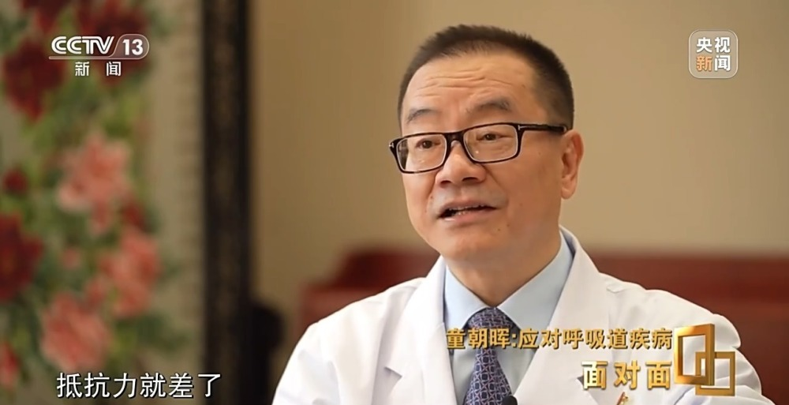
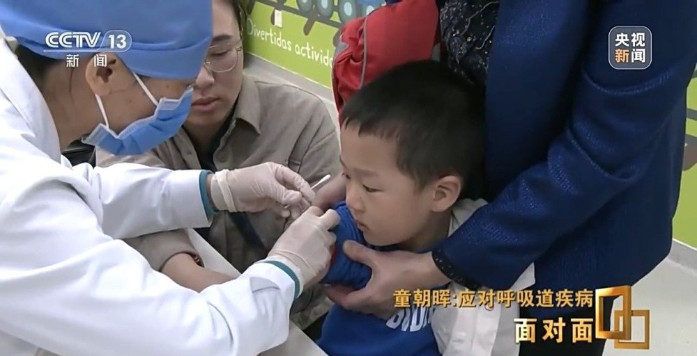
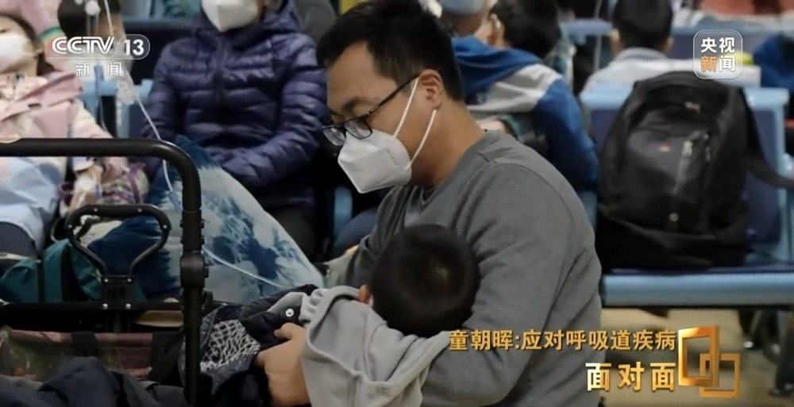
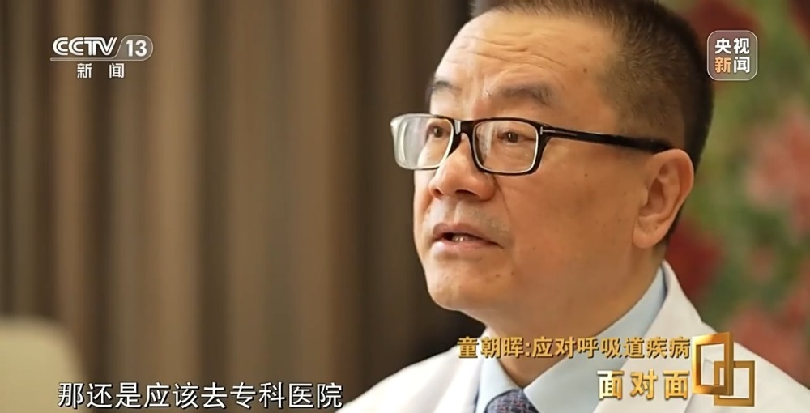
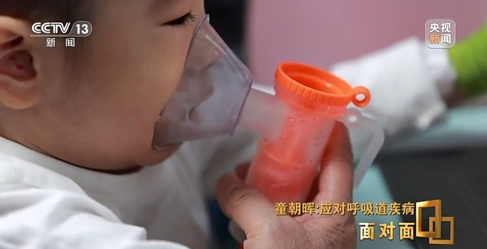
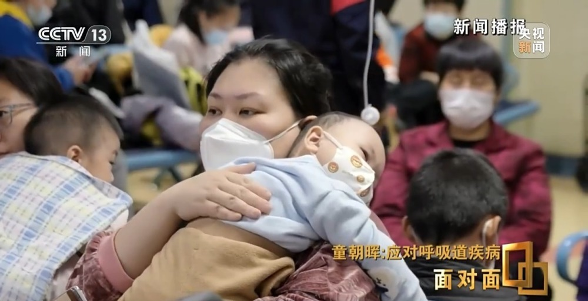
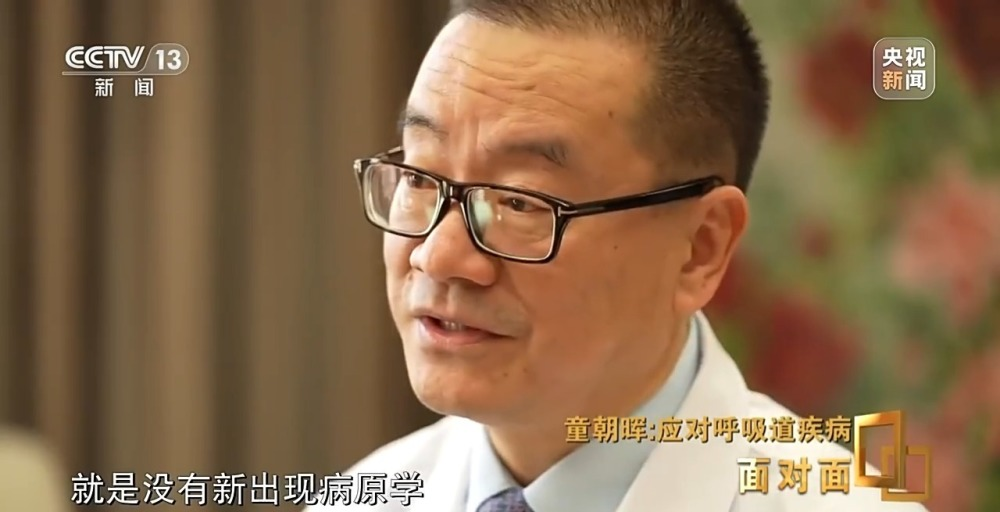
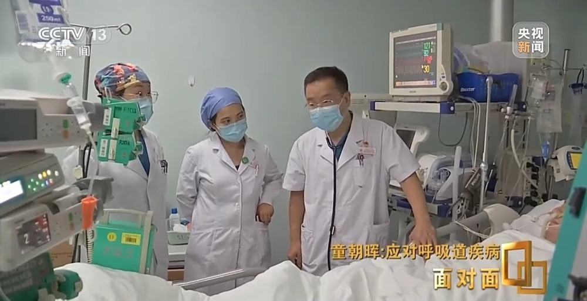

# 网传得过新冠的孩子免疫力低，致本轮感染反应激烈？专家：无因果关系

12月1日，在首都医科大学附属北京朝阳医院本部，朝阳医院副院长、北京市呼吸疾病研究所所长童朝晖，在向护士了解儿科当天的门诊情况。

而就在紧接下来的12月2日，国家卫生健康委再次举行新闻发布会，介绍冬季呼吸道疾病防治有关情况。发布会上介绍，根据监测，目前流行的急性呼吸道疾病均由已知病原体引起，都有相应的成熟治疗手段，未发现新病毒或细菌导致的新发传染病。

**记者：** 为什么今年会突然得到这么多人的关注？而且在医院里面排队就诊的状况如此集中？

**北京市呼吸疾病研究所所长 童朝晖：**
我觉得可能是这样，我们这三年的防控还是比较严的，大家戴口罩的习惯也是比较好的，而且从防控要求上大家减少了出门，所以我们面对的是一个很干净的环境。人体对外界的呼吸道微生物接触得少了，对外界的各种微生物抵抗力就差了，免疫耐受就差了。常态化以后，再去接触这些，冬天病毒来临的时候，就容易出现一些呼吸道症状。

其实自入冬以来，中国大部分地区都已进入流感流行季节。身在临床一线，童朝晖认为，人们仍需对预防给予高度重视，而疫苗仍是最有效的预防手段。

**童朝晖：**
因为本身它是秋冬季高发，而且我觉得自己的防护最重要。比方说到了秋冬季的时候，还是减少出门的机会，比方说小孩要上学，还是戴口罩、洗手，它不光防支原体，还有像流感、其他的病毒。尤其是小孩上学，一个班好几十人这种，还是要戴口罩、手卫生。如果说有发热的就可以在家待着，不要去上学，所以良好的呼吸道保护的生活习惯还是应该有。流感疫苗应该说是很成熟了，而且也建议特别是一老一小，每年9到11月份提前接种，包括肺炎疫苗也是有的。

每年秋冬季节进入呼吸道疾病高发期，老人和孩子都是最容易受到病毒和细菌攻击的群体。但在如何应对上，童朝晖认为很多家长的处置并不得当。

**童朝晖：**
说到小孩儿童，大家可能就是往儿童专科医院跑，比方说北京儿童医院、首儿所这种，都集中在那。家长的心情可以理解，小孩是最重要、最珍贵的，有病就一定要到儿童专科医院去治，其实我觉得像一些大型三甲医院的儿科也不错。另外就是家里附近的一些二级医院，社区医院。

**童朝晖：**
现在的社区医生，都是经过规范化培训的全科医师，儿童的呼吸道感染，包括上呼吸道感染，还有肺炎，这就是常见多发病，不是疑难杂症。所以我觉得如果孩子发烧，其实可以首诊直接到就近的社区医院，完全是可以解决的，而且药物也是一致的，社区也都配备了。所以及时就近就诊，及时做一个很好的判断和诊断，及时把药物用上，这样就避免都跑到这些大的专科医院然后排。你在这等好几个小时，甚至都是发烧的孩子，在这等着，其实这样还容易互相地交叉。

**记者：** 但对于家长来讲，怎么来分辨孩子在什么样的情况下应该分级，在家就诊，或者是去医院就诊？

**童朝晖：**
刚开始发烧就可以到社区医院，因为那个时候病情刚起来，刚发烧，不可能是重症。再就是现在社区医院都是能及时做抗原检测的，抗原是马上就出结果的，包括很多家里也备有抗原。所以说你是病毒还是支原体，其实到就近的二级医院也好，社区医院也好，它能给你马上鉴别出来。只是在上呼吸道感染，那就对症处理，或者拿一些抗病毒药和相应的药物来吃，这就可以。当然如果说有些孩子，比方说他已经烧了好几天了，就是高热好几天，三天以上，然后孩子也出现了一些憋气、气促这种，那还是应该去专科医院。

**童朝晖：**
第二个问题，发烧，家长见不得孩子发烧，一发烧就往医院去。其实温度的高低不代表病情的轻重，不是体温越高病越重。所以说实际上如果还是在上呼吸道，没有肺炎的话，只是39度、39.5度、40度，只是体温高。有时候相反，比方那些身体好的人反应强烈，体温显示更高，如果在上呼吸道，就用一些退烧药。有些退烧药没有效的情况下，可以用物理降温，比如说在冰箱里冰上几条冷毛巾，脑门上敷上，身上敷上，这种物理降温效果有时候比药物还好，其实只要不烧了，小孩的精神状态就很好。

据国家卫健委的监测显示，近期国内呼吸道感染性疾病仍以流感为主。此外，还有鼻病毒、肺炎支原体、呼吸道合胞病毒、腺病毒等。分析认为，入冬以来急性呼吸道疾病的持续上升，与多种呼吸道病原体叠加有关。于是叠加感染也成为很多人的隐忧。

**童朝晖：**
到了冬季，这些病毒都存在，但是感染一个人不是说我又感染流感，又感染合胞。一个人身上是不可能叠加的。第二个，比如我发烧了，去做一些抗原或者核酸检测，可能会测出两种三种都是阳性的。但不是上呼吸道有痰，或者咽拭子是阳性，就说明都感染了。我们在平时工作中，不管是门诊病人还是住院病人，我们都会去做病原学检测，做了病原检测往往也不是说一种，尤其是长期住院的人，我们可以测出两种，甚至测出三四种。但是医生要判断，不是说我测出阳性就一定是致病菌，很多是在上呼吸道定植的，因为本身呼吸道是有防御机能的，如果是做了核酸，它会显示一些病毒载量，有一些病毒载量高，有些低，医生会帮你判断，比方说他通过你的这些抗原、核酸、胸片CT、血常规，包括一些其他的化验，医生来综合分析主要治疗是哪一种。所以说如果仅仅是这些病原学就在上呼吸道，对症处理就可以了，或者说有相应的抗病毒药是可以用的。像流感、支原体有相应的药物，像合胞病毒、腺病毒这些病毒目前还没有明显针对抗这些病毒的药物，所以往往还是靠对症处理，处理发热、咳嗽，对症处理，一周两周就恢复了。

**记者：** 这次很多病患者在退烧之后，咳嗽一直持续不断，这个可能会引发肺炎吗？

**童朝晖：**
其实咳嗽的原因有很多，我们在平时看病中有急性咳嗽、慢性咳嗽，慢性咳嗽原因有好几百种，所以要医生帮你鉴别。有的人就是一个感冒，他会咳上半个月、一个月、三个月，甚至半年都有，就是因为他之前得了气管炎、肺炎以后，支气管黏膜受损，稍微有点刺激会咳，它会形成气道高反应。

**记者：** 那应该怎么做？

**童朝晖：**
对症处理，止咳，这个在临床上是有办法的。我们有一些止咳药，有一些降低气道反应的药，有时候需要把这个止咳药和降低气道高反应药同时吃，效果还是非常好的。

**记者：** 因为我们注意到现在社会上，从刚开始的发烧，到后期的咳嗽，在整个的阶段过程中反反复复就诊，比如发烧好了，然后一咳嗽又要再去就诊。

**童朝晖：**
感染期已经控制住了，后期留的只是一些症状，所以只要你治疗好了以后不再发烧，不再出现体温又上来了，不再出现这些黄痰，不再出现像前面急性期的一些呼吸道的改变，用一些止咳药对症处理就可以了。而且特别是干咳，没有出现痰多，没有出现黄痰，它就并不代表又感染了，我又加重了。

**记者：** 但是在这次整个的呼吸道疾病高发期，很多人也会担心孩子这么小，得了这样的疾病之后，即使治疗好了，将来会不会有类似的后遗症或者其他的一些伤害？

**童朝晖：**
其实我觉得这一点大家就不应该担心，因为成人也好，小孩也好，一到冬天出现了感冒、咳嗽、肺炎、气管炎，是很常见的。但是这些前面说了，很多疾病很多病毒，包括上呼吸道感染是有自限的，好了就好了。包括即便是出现肺炎，肺炎对于医生来讲是最好治的。而且肺炎是能够治愈的疾病，完全不会说因为出现了上呼吸道或者下呼吸道感染留下了后遗症。好了就好了，不会有什么问题。

在众多媒体的报道中，输液成为常见的场景。但对于很多人一发烧咳嗽就习惯马上进行输液治疗，童朝晖强调这是一种误区。

**童朝晖：**
其实治任何病，医生是会根据你的疾病轻重来判断是否需要输液。当然如果到了下呼吸道，比如有肺炎了，是流感也好，是其他病毒也好，实际上输液还是一种支持治疗。再就是如果说病毒感染到了下呼吸道，有一部分孩子会出现继发，在病毒感染的基础上继发细菌感染，那是应该输液的。也就是说到了肺炎，到了一些细支气管炎，这个往往不管是成人，还是孩子，可能都会输液的。

中国这一轮呼吸道疾病的高发也引起了世卫组织的关注，11月23日，世卫组织在社交媒体上发文说，自10月份以来，世界卫生组织一直在密切关注中国上报的卫生系统情况。根据现有信息，世卫组织未发现任何异常或新型病原体，也没有发现异常临床表现，只是出现了上述由多种已知病原体引起的呼吸道疾病的普遍增多。

**记者：** 为什么国际的卫生组织会对我们这次整个呼吸道疾病这么关注？

**童朝晖：** 他们还有一句话，大家可能没有注意，他们说还是常见病原体。

**记者：** 这句话意味着什么？

**童朝晖：**
他们就是说并不是出现了一种新的感染、新的病原体，就是尽管说我们这个冬季，我们的呼吸道感染会显得多一些，病毒也好，支原体也好，但还是常见的病原学，没有新出现病原学，这个我觉得也是为了打消老百姓的一些猜疑。

**记者：** 那对于得过这样的一些呼吸道疾病的患者来讲，是否内在的身体会产生抗体，可能在这样一个阶段里面得过一次以后不会再得？

**童朝晖：**
是这样，比方说流感病毒会这样，支原体也会是这样，他至少在近期得了不会再得。比方说在近期感染以后先产生IGM抗体，然后再产生IGG抗体，所以说它会在短时间内有一个保护作用，当然慢慢抗体就消失了，还会再感染。

在今年入冬呼吸道疾病进入高发期后，基于过去三年的经历，人们也在关注新冠病毒的活跃程度，以及这一轮呼吸道疾病是否和新冠病毒有关联。

**记者：** 还有一种声音认为这次的集中还有交叉的感染，有没有可能是新冠病毒的一种变异，或者是其他方式的延伸？

**童朝晖：**
这个应该不是的。我们今年这个冬天出现了一些发热病人也好，出现这些呼吸道疾病也好，和过去没有差别，还是那些病原体。第二个，支原体也并不是新出来的一种病原体，它还是常见的，而且支原体的治疗也是在日常工作中，不光冬天有，平时也有。这都是有科学证明的，大家不要去臆猜。

**记者：** 但是很多人也有一种观点，比如说之前得过新冠的一些孩子，免疫力造成了低下，所以这次的呼吸道疾病才会如此快速和激烈的反应。

**童朝晖：**
其实两者应该没有什么因果关系。当然说我前面得了新冠，我现在还有一些症状还没好，我又得了一个流感，或者我最近又得了支原体，这种情况是可能的。但是我想这都还是属于能够治疗、能够控制的范围。

作为国内知名的呼吸与危重症医学专家，北京市呼吸疾病研究所所长童朝晖和他的同事们每年都会对来自北京乃至全国的流感样病例进行监测，并依据病原学的变化在诊疗手段上进行调整。对于这一波呼吸道疾病高发，童朝晖有自己的看法。

**记者：** 你对社会上有什么样的建议？

**童朝晖：**
我觉得也可能是像我们都是专业人员，很理智，很冷静地看待这个问题。所以我觉得首先老百姓还是该相信科学，老百姓应该正确对待这个问题。首先，冬季这种呼吸道疾病是很常见的，包括发热，不管是成人、儿童。第二个，就是我们并没有出现新的病原体，这个大家也不要去担心。而且这些病原体的特点，包括我们临床诊疗，各级医院对常见的呼吸道感染都还是很有经验的。

来源：央视新闻

