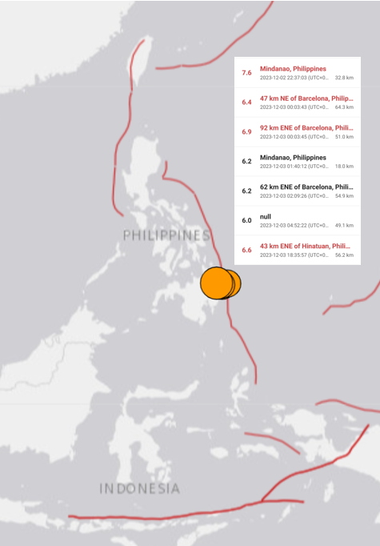
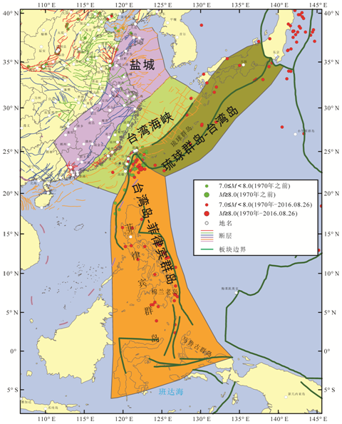
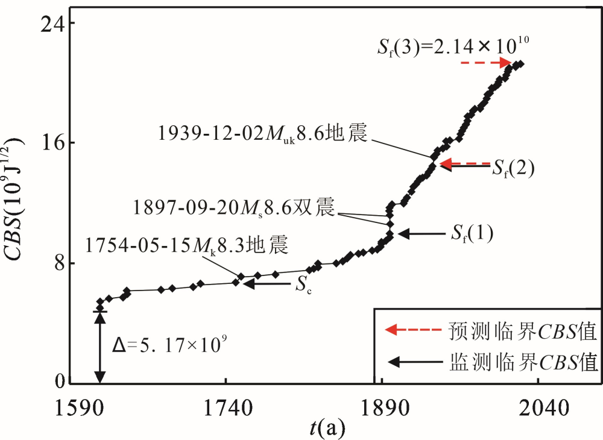

# 菲律宾发生7.6级地震，这是下一次巨震的前震吗？

台湾岛-菲律宾群岛地震区，已十分接近下一次标志性地震（MW9.0左右）的临界状态，故这样的特征预示着在未来几年内该震将发生。

据USGS报道，2023年12月2日-3日，菲律宾发生7.6级(通常为MW标度)震群事件（图1），其发生在台湾岛—菲律宾群岛地震区（图2）。

何谓震群呢？在一个较小范围内、较短时间内，发生的一连串关联地震统称为震群。震群是基本的地震活动方式，这是因为：某次地震发生后，震源破裂必然产生应力转移，其能引起震源周围岩石应力重分配，导致后续关联地震的发生。当然，如果应力转移量级较小而不满足后续地震的发生条件，或后续地震的震级太小，则只能观测到单个地震。

**图1 菲律宾** MW **7.6震群事件（** MW **≥6.0地震的震中位置及其震级）**

**图2 台湾岛-菲律宾群岛及其邻近地震区的地震构造图**

该MW7.6地震发生后，有不少网友问我，该震是什么事件？其意欲何为呢？鉴于该震涉及到前震序列，而我之前的博文较少谈及此，故借此机会，我简单科普下首发前震与前震序列，以起到抛砖引玉的作用。

要知道某次地震是否为下一次地震的前震，前提是后者可预测。由于前人并未解决地震预测科学难题，因而事前无法判明某次地震为前震。

我们的研究表明，构造地震（尤其是较大地震）主要源自锁固段的脆性破裂，其不同规模破裂产生不同量级地震。以此为抓手，我们发展了孕震断层多锁固段脆性破裂理论。在该理论框架下（图3），定义在锁固段体积膨胀点和峰值强度点处发生的地震为标志性地震，期间发生的地震为预震，临近标志性地震的预震为前震。因为标志性地震的演化遵循确定性规律，故可预测；进而，可给出标志性地震的前震判识方法。下面，将予以简介。

**图3 锁固段破裂产生的地震事件类型**

**1、标志性地震演化规律**

我们指出，标志性地震的临界CBS值满足如下特定规律（指数律）：

（1）

式中，Sc为第1锁固段体积膨胀点处标志性地震的临界CBS值，Sf(k)为第k锁固段峰值强度点处标志性地震的临界CBS值。

**2、首发前震判识方法**

实际上，不小于锁固段破裂门槛震级（Mv）的前震只有一个；然而，由于监测数据误差与数据处理误差不可避免，建立前震判识方法必须考虑之，于是催生了首发前震概念，其判识方法为：不小于Mv的预震发生后，若CBS监测值Sm满足

（2）

则称其为标志性地震的首发前震。首发前震与后续标志性地震之间的地震为前震序列。

**3、台湾岛—菲律宾群岛地震区的地震趋势与前震序列**

3.1 地震趋势

在该地震区接近下一次标志性地震的临界状态时，我于2018年发文《我国南海诸岛应部署应对巨震海啸的举措》（链接：https://blog.sciencenet.cn/blog-575926-1137773.html）指出：不能排除还将发生MW8.0左右的前震。目前看来，这个判断基本正确。

自此以后，该地震区的地震活动势头不减；尤其2021年，台湾岛-菲律宾群岛-
印尼一带的地震此起彼伏——呈现整体响应特征。于是，我再次发文《南海的古海啸与未来地震海啸风险》（链接：https://blog.sciencenet.cn/blog-575926-1301838.html）指出：从我们已分析的板间地震区地震活动看，临近标志性地震前，地震区均呈现整体响应特征，这是其对应的构造板块刚性较强的缘故。台湾岛-
菲律宾群岛地震区，已十分接近下一次标志性地震（MW9.0左右）的临界状态，故这样的特征预示着在未来几年内该震将发生。一旦该震发生在海中，则能引发大规模的海啸；巨震及其引发的海啸，均能造成严重损失。因此，有关国家提前采取针对性的减灾措施，十分必要，且已十分迫切。

3.2 前震序列

根据式（2），易知2012年8月31日菲律宾苏朗甘以东MW7.6地震是首发前震；此后，又分别于2017年、2018和2023年，发生了MW7.3、MW7.5和MW7.6前震。这四次前震构成了前震序列。2023年MW7.6前震发生后，该地震区当前CBS监测值约为2.13
×10^10（J^1/2），已十分接近临界值2.14
×10^10（J^1/2）（图4），但仍有一丁点距离；因此，在下一次标志性地震前，仍不能排除发生MW7.5左右前震的可能。

**图4 误差修正后台湾岛-菲律宾群岛地震区当前地震周期1619~2023.12.02之间ML≥7.3地震的CBS与时间（t）关系**

**参考（略）**

**相关：**

地震们要脸不？

http://blog.sciencenet.cn/blog-575926-1228253.html

如何厘定孕震构造块体和相应地震区的边界？

http://blog.sciencenet.cn/home.php?mod=space&uid=575926&do=blog&id=1273015

科学探索之旅：寻找大地震前兆的艰辛历程

http://blog.sciencenet.cn/blog-575926-1122732.html

寻找普适物理常数的一种途径

http://blog.sciencenet.cn/blog-575926-1265503.html

如何理解地震周期？

http://blog.sciencenet.cn/blog-575926-1266410.html

“地震能否被预测”是科学命题吗？

http://blog.sciencenet.cn/blog-575926-1134122.html

中国及其周边M≥8.0地震孕育过程分析大全

http://blog.sciencenet.cn/blog-575926-1142222.html

全球M≥9.0地震是如何炼成的？

http://blog.sciencenet.cn/blog-575926-1141661.html

地震产生机制学说的统一

https://blog.sciencenet.cn/blog-575926-1236927.html

什么样的断层会出现蠕滑/黏滑现象？

https://blog.sciencenet.cn/blog-575926-1208302.html

为什么说弹性回跳机制是冗余的？

https://blog.sciencenet.cn/blog-575926-1304850.html

Hongran Chen, Siqing Qin, Lei Xue, Baicun Yang, Ke Zhang, 2022. Universal
precursor seismicity pattern before locked-segment rupture and evolutionary
rule for landmark earthquakes.Geoscience Frontiers, 13(3).
https://doi.org/10.1016/j.gsf.2021.101314

https://www.sciencedirect.com/science/article/pii/S167498712100178X

