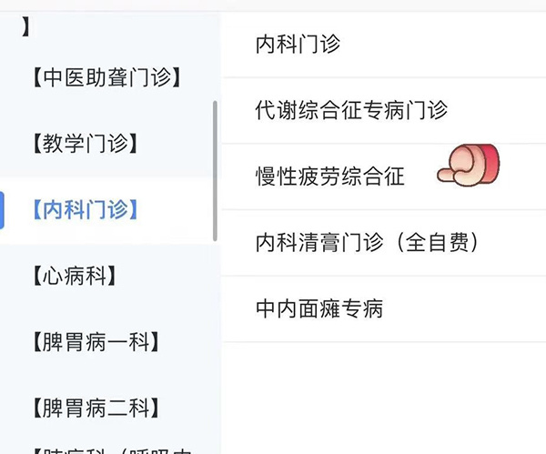
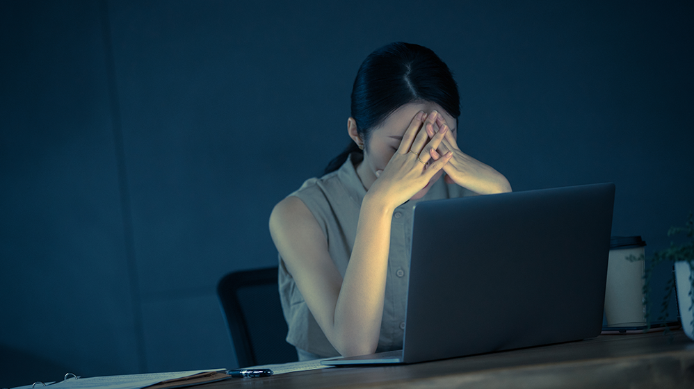
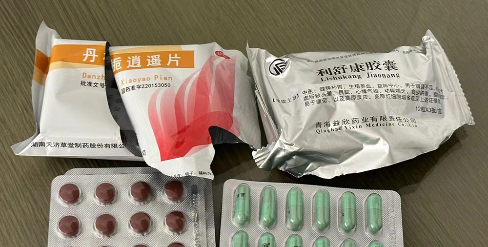

# 被疲劳缠住的人：休息后得不到缓解，直到被确诊为慢性疲劳综合征

身体最先发出的信号是从无尽的疲劳开始的，虽然没有剧烈的疼痛，但头晕、肌肉酸痛、疲劳、抑郁、睡眠障碍等症状叠加在一起时，慢性疲劳综合征足以成为一个人正常生活的绊脚石。

李智英患上这个疾病时，辞掉了工作，试图让身体得到足够休息。但她最大的感受是，这个病不被人看见。和病友互相聊天时，她发现大家有孤独感，“很多人最大的苦闷是没办法跟别人解释这个病”。

秦伊患上这个“小众”的疾病时，大多数时间躺在床上度过，家人都觉得她是“变懒了”，直到确诊后，她才知道自己是生病了。

按照病因区分，疲劳可分为生理性和病理性。病理性的疲劳被美国疾病控制与预防中心于1987年正式命名为“慢性疲劳综合征”。据统计，全球至少有1700万人受到该疾病影响，20~50岁的中青年较多。中国健康教育与促进协会的初步调查显示，大多数慢性疲劳综合征患者患病时间在一年半以上，30%左右人群有长达5年的疲劳感。

美国疾病控制与预防中心2022年的研究表明，慢性疲劳综合征的特征是卧床休息也无法缓解的长期疲惫，体力劳动和脑力劳动会加剧症状，可能长期出现也可能短期停留，女性比男性更容易受到影响。同时，该病的严重性容易被忽略。

我们采访的几位慢性疲劳综合征患者都经历了高强度的工作节奏、生活作息的混乱、无休止的疲劳及伴随症状等，而最初，他们都忽略了这种疾病。

_秦伊在一家中医医院去的科室。本文图片除特殊标注外，均为 受访者供图_

**【以下是他们的口述：】**

**“这个病不被看见”**

**李智英，34岁，患病2年**

2020年3月新冠感染后，我的身体一直没有好透。5月份，我做膝盖的治疗时，做了全身的检查，当时检查结果是心率偏快。我的体育医生给的建议是加强有氧训练，把心、肺活量给练起来。

我原以为是心理压力，所以就想通过亲近大自然的方式缓解。两个月后，我在德国登了楚格峰。当时爬到我感觉命都快没了，没想到会这么累。那时我在德国创业，其实没有什么压力，因为项目刚开始，各方面都挺顺的，纯粹就是身体不舒服。

到了10月，我开始出现睡眠障碍，腿疼。医生说我是压力过大，但是我真没觉得当时有什么压力，可能唯一的压力是新冠导致了一些不确定性，那时候我在欧洲，他们正在经历第二波疫情，又开始有一些封锁措施。健身房关门了，我就在家做瑜伽跟拉伸，每天不超过半小时。而且我每天会出门散步，一天工作时间不超过8小时，还挺轻松的。

我以为是压力，就去旅行、徒步。徒步跟爬山不一样，爬山有海拔高低，徒步就是一直在走，我平时也在运动。但徒步过程，我明显感觉自己的体力跟以前没法比，特别吃力。在那之后身体就更加不适了。

那段时期约医生都难，所以也查不出所以然，我就选择回国了。回来后我看了第一个中医，他说是气血虚，给我抓了一些药，回家喝了，也没有什么效果。

回来三个星期后，新工作是奢侈品行业，出差比较多。我也是第一次在国内工作，对工作节奏不习惯，每天至少工作十小时，晚上因为时差的关系还得加班，私人时间被大大压缩，因为总有人会在下班之后找你，对我当时的身体很不利。有时间我会去健身房，每个星期保持两到三次的健身。

但是没多久，我的腿麻发展为腿疼，睡眠障碍更严重，疲惫不堪，吃东西容易拉肚子。我记得是2021年4月份，腿疼到没法正常走路，睡眠障碍严重到一整夜睡不着，骨科医生却说我没问题。5月我去了西藏，以往我有过高海拔经历，但那次感觉心脏负荷很大。

从西藏回来之后，有一个很厉害的中医告诉我，说我的腿疼是免疫系统的问题，我就转去免疫科。这个时候我心脏不舒服，腿疼到打不直，头晕眼花，睡眠障碍全都展现，还伴有数不尽的疲惫和消化系统障碍。

6月，我发出了辞职信，一周后确诊了慢性疲劳综合征。

我确诊是靠一个美国医学院的老师，她研究的方向是免疫医学。我把所有症状都告诉她，然后做了一些检查，西医检查是没有什么疾病。她跟我说是慢性疲劳综合征，目前没有什么医治方法。我自己查了一些关于这个病的信息，主要是看病友记录，翻英文网站。

7月我的症状又多了中度抑郁、呆滞，持续一周，每天下午5点准时发烧。这个病其中一个症状是抑郁。吃东西会吐，拉肚子，还有睡眠障碍，你说能不抑郁吗？我中途吃过一个星期的抗抑郁药，当时睡眠障碍很严重，我一吃药，睡到第二天下午。吃了不到一个星期，我又得了新冠，特别嗜睡，反倒把我的睡眠障碍给治好了。

我又找了心理医生做了几次治疗，后来我连说话的力气都没有了。我这个医生知道这个病，所以我很信赖他。心理治疗主要是辅助作用，避免我走极端。

10月份我整个月都在出差。先是感冒，然后发烧，接着又出现睡眠障碍。出差期间各种汇报，在上海参加一个展会，每天人特别多，整个脑子嗡嗡嗡嗡嗡，回到自己的房间也没有办法睡。

同事们都知道我的情况，领导也知道，他跟我说，最后一趟出差在三亚，你去好好晒晒太阳，所以工作上没有特别大的压力。但是10月中旬我就辞职离开了。

那个月觉得自己仿佛经历了死亡，内心非常脆弱，没有办法见人，一见人对方说个半个小时不到，我就感觉跟喝了两大瓶酒似的，整个人晕乎乎。对外面世界特别敏感，比如一个人开心不开心了，我全都能感受到。

从这种“死亡”的感觉出来后，我身体变得更加敏感，更加没办法“参与”外界和社会，大多数时候我都独自待着，去美术馆看看画什么的，还是能被艺术疗愈。

那段时间我每天吃什么喝什么，身体对食物的连锁反应，上了多少次厕所，我全部记录下来，然后会不停观察和反思其中的一些规律，及时去调整。

从2021年11月到现在我已经两年没有工作了，身体算是好得差不多了。这两年最大的一个感知和收获是，我修复了我和我自己身体、以及食物的关系。很多人对吃一点都不在意，我发现吃对身体影响太大了。很多食物看起来像食物的样子，但是已经没了食物的味道。我现在吃东西都尽量选有机的，本地产，应季的。

我在youtube上面分享这个病和我的自我疗愈后，有很多朋友留言让我接着分享，但我不想折腾，第一次拍视频的时候我哭了，一把鼻涕一把泪，因为讲的时候会把我带回生病时的情景。这个病是没病的病，英文里把这个病叫做“隐性残废”，你看起来好像不残废，但是你的生活功能是缺失的。

今年我遇到一个病友，他是大学生。我跟他讲我过去几个月好像康复了，他问我怎么康复的，我跟他分享了一些。中文内容关于这个病的信息的确不多，所以我才把我的经历分享到网上。

我的建议是人一定要跟自己的身体建立紧密联系，当身体发出信号的时候，你一定要听，毕竟健康才是我们在这个世界上生活最基本、最根本的东西。

这种病没有医学证明，没有具体治疗方法，怎么引起的也没有被医学所证明，我感觉很无助。人一旦无助，就会各种尝试，比如早上洗冷水澡增加免疫力，狂吃维生素 。

我主要是从心理层面去疗愈的。那段时间我没办法跟人接触，但是跟狗在一起我感觉很舒服，很治愈，就领养了一条狗。小动物太可爱了，它那么纯净，无条件地信任你。

经历了这一遭，真的发现什么都可以放下，很多事我已经不会在意了。既然身体好了，我就有自己想要去做的事情，我会去研究星象。

我现在要是不出现突然的睡眠障碍，情绪都比较稳定。一段时间里有一两个星期，完全不知道为啥，就有睡眠障碍。所以对我来讲这个病最折磨人的是，没有太多规律可言。

病友互相聊天时会发现很孤独，因为这个病不被看见，很多人最大的苦闷就是没办法跟别人解释他的病。生病不是自己的错，这个病还没有被研究透，所以每个人的经历都有个体性。任何一段黑暗的背后都是宝藏，我身边的人其实很少有人真正了解我在经历什么，为什么一病就两年？大家可能都没听过这个病，听过也很快就忘了，但也正常，这个病被人看见有一个过程。

上个星期二的晚上，我对自己正式宣布结束这段历程。当时在游泳池游了快四五十分钟，游完我躺在那儿，自己像做了一场梦，那种结束的感觉特别强烈，我内心非常清晰地知道。

安静了两年之后，自己内心的声音是很容易听见的，当下那一刻我很激动，恨不得出去跑两圈。我想，天呐，好像封锁结束了，我自由了，可以重回人间了。

我这两天开始摸索。我这刚刚才出来，得慢慢来。现在在准备另一个项目，会忙碌起来，但是感觉很开心和满足。

现在跟其他人的交往没什么问题，不过之前的状态肯定回不去了。但是我会重新去拓展和建设自己的世界。

**身体发出的警钟**

**汪敏，25岁，患病1年**

当我意识到这可能是一个疾病时，已经是半年后了。

从今年春节到现在，我工作一直比较忙，密集加班到晚上11点，周末也一样，因为一些项目需要赶时间。所以我长期处于非常疲劳的状态，作息也混乱，我没有时间自己做饭，就会点一些比较重口的外卖。

疲惫不堪、头晕、体力衰弱是感觉最明显的，爬两步楼梯或者走两步路，就开始喘。这个病是综合征，也跟我平时没有怎么锻炼有关系，因为没有时间。

意识到不对劲后，我试着通过睡眠、锻炼，以及吃更健康的东西来调整，以前睡一觉就会恢复过来，但现在睡一觉也没有好转，我睡眠质量很差，深度睡眠很少。

我有记录每个星期加班多少个小时，以及当周的感觉，最后发现超过某个时长时，我会明显感觉到身体不舒服。之前有两个月加班时间80个小时，相当于每一个月多做了一周。

工作导致我疲劳，疲劳又反过来影响我的工作以及我的生活。

睡不好上班就会比较累。因为我的工作要求非常集中注意力地去处理一些数据，加班以及慢性疲劳综合征会导致我容易出错。有一些问题在我正常工作状态下是可以发现的，睡一觉起来我能看出来，但是前一天晚上
10 点钟的我就是看不出来。所以我后来的办法就是，如果那个东西是晚上9 点之后完成的，我会忍住不要当天发出去，第二天早起再看一眼，没问题再发。

这个病对我生活的影响更大，这也是我去就医的原因。以前不那么忙的时候，我会玩滑板，看书，跟朋友约饭，看看展之类的。看病之前，我没有时间做这些事情，只想躺着，躺了一天，觉得还是很累。哪怕不工作的时间，也会想工作上的事情，平时也很少跟朋友或家人互动。

开始我还以为自己是抑郁症，有几个月我没有动力去做任何事情，对什么都不感兴趣。于是我测了一下量表，中度抑郁，但测完之后我也没有去医院看，因为挂不上号，也没有时间去看病。我觉得可能是短暂的，休息充足就好了。

 _资料图_

当我到很疲劳的状态，我会把自己想象成一个机器人，这样才可以抹去一切不舒服的感觉。我7月份二阳的时候，发着高烧还在公司写报告。我坐在椅子上心跳都有140，手表报警，持续了一个下午，但是那些报告当天一定要交出去，所以我降噪耳机里放着重金属音乐，疯狂地写。

那天是星期五，是我症状最严重的一天，一直写到傍晚7点，领导说要不你休息一会儿，但我休息了可能就做不完了。写完报告回去的地铁上，我已经完全站不住，到家后就倒下了。那次经历也给我敲响警钟，没有必要自己不把自己当人。

看病之前我自己调整了一个多月，但效果甚微。我有去英国旅游，跟那边的朋友聊了聊，看到了英国人的工作状态，他们下午 5
点下班，大家都去酒吧喝酒。地铁上看书的人很多，感觉他们完全不累，脸上的气色和表情跟我在上海地铁看到的上下班的人很不一样。

我跟我的朋友跟家人都聊过，他们建议我换一份工作。给我最大动力的其实是我的朋友，朋友说最近都不知道你在干嘛，也没有消息了。我自己照镜子发现，加班真的是会让人变丑的。

学生时代也有过压力比较大的时候，我是在美国读的社会学本科，每学期阅读量很大，写论文的时候压力非常大。临毕业因为疫情不好找工作，跨时区国内国外都在找，还要写毕业论文，又买不到回国机票，最后都撑过来了。当时应该还不算慢性疲劳，因为不是工作，而是我自己选择的方向和未来要走的路，有自驱力和主观能动性。

一个年长的朋友建议我看医生，那时我才发现有一个慢性疲劳综合征的专门科室，之前完全不了解。中医医生先问我有哪些症状，我说胸闷，喘不上气，睡完还是很累等等。当我说胸闷的时候，他问我有没有拍过心电图，心电图有没有什么问题，也会结合西医。我说没有什么问题，然后把了一下脉，中医诊断是脉细，脾虚，肠胃脆弱，诊断书上写着慢性疲劳综合征专病，就开药了。

之后我开始吃中药，同时对自己的生活方式和工作进行调整，现在感觉身体恢复了些。我首先解决的是加班的问题，跟领导和同事沟通，明确说加班最晚到晚上7点钟，超过时间我就下班。如果我没有在工作时间内完成任务，公司可以辞退我。上班时间让我做什么，我会尽量做好，但是下班时间是属于我的个人时间。而且我们没有加班费，也没有调休。

现在我会自己做饭，吃得比较健康，还有一周运动两次，恢复了一些社交，约朋友出来聊天，吃饭玩耍。经历一周的到点下班，再加上平常的锻炼以及吃药，身体慢慢调整过来了。

国庆期间我的症状消失了一部分，但还是会觉得累，睡眠质量也不是很好。

现在至少有出门动力了，之前去楼下倒垃圾都觉得很累。

**“生病不是难以启齿的事情”**

**秦伊，22岁，患病半年**

我在10月份挂了中医内科，确诊的慢性疲劳综合征。去医院是因为我 8
月份得了病毒性脑膜炎，根据要求的疗程住了14天院。大概四五天，我就要抽一回血和生化，生化上面显示我的肝功能不太好。

其实出院的时候我的数据也不是正常人的数值，脑蛋白还没有完全降下来，白细胞也过高了一点点，脑压是降下来了。医院床位比较紧张，医生说一个疗程挂完了，先回家休养看看吧。回家之后我也在吃西药的护肝片。

因为一直吃西药感觉效果不大，所以就去了中医内科。再加上我自己整个人昏昏沉沉的，就想看中医调理一下会不会好一点。

_秦伊在医院就诊慢性疲劳综合征医生开的药，两周疗程_

那时我没有意识到自己可能得了这么小众的病，以前也没有听说过。我在社交平台上发了篇帖子，说“确诊了，我不是懒”。我一直没有长时间的睡眠需求，晚上大概睡六七个小时，但现在白天整个人都昏昏欲睡，白天能睡个四五次，每次睡一个小时左右。醒过来后，我的疲劳感并没有得到缓解。

这种情况持续了两个多月，还是从病毒性脑膜炎开始的。但慢性疲劳综合征到底是不是脑膜炎引起的，医生也并不能确定，也可能因为我身体素质不是很好。

得病毒性脑膜炎跟我一次爬山有关。爬山前我做了很多驱蚊准备，但没想到山上蚊子还是很多，我全身上下被咬了很多包。过了7天的样子，有一天早上醒来，我头特别疼，那时候天气很热，我以为是中暑了，就试了刮痧和吃中暑的药，大概两天之后，晚上我开始发烧，37.8度，第二天头特别疼，人完全不能动，一动就疼，像有人拿着榔头捶我的头一样。我妈妈觉得这个情况不对，要去医院，这个时候是8月底。

我当时看的是急诊医生，也并没有觉得有什么问题，因为验血下来是正常的。他说可能是神经性疼痛，建议我去神经内科。神经内科的医生觉得我状态不对，建议我住院，住院的时候做了一个诊治，医生让我把头低下去，下巴抵到胸口那一块。我下巴低不下去，他说我可能得了脑膜炎。

我妈不相信，马上带我去了更大的医院，当天我住院做了腰穿，晚上就确诊了。医生根据我发病前15天的活动轨迹，最终推测出来，在山上被蚊虫叮咬可能更符合我这个病的诱因。从这时起，我每天都昏昏沉沉的，跟行尸走肉没什么区别。每天醒来头很晕，站起来更晕。

确诊慢性疲劳综合征的时候，中医说我血虚，气虚，身体状态不是很好。建议我好好休息，不要熬夜，晚上十点就睡觉，然后要锻炼身体，但是也不能剧烈运动，否则会导致症状更严重。

医生提到，我可能年初就有这种症状了，只是没有现在这么明显。当时精力更足一点，也因为忙所以没有怎么休息。年初的时候我在项目组实习，经常每天加班到深夜。二三月份的时候阳了，之后慢慢出现了一些症状，医生当时说可能是阳了的一些后遗症，而且我阳康之后很快就投入了高强度的工作。

当时我又写论文又加班，要弄到晚上12点或者更晚，第二天早上再去上班，持续了一个多星期，出现了很明显的心悸，不明原因心跳快，走个路就能到140的心率，晚上睡觉的时候心跳也会快。我去医院做了一系列心脏的检查，但没查出原因。除了心跳快，也没有其他心脏上的症状。医生只让我好好休息，但是那时有毕业的压力，加上项目组也到了关键的时间点，就硬着头皮加班。

到4月底的时候，我又加班又实习前后快一个月了，实在心跳太快了，到了要吃速效救心丸的程度。有一天晚上下班回家，走到公交车站的那一段路，我平时只需要走10分钟，但那天我觉得好累，走了20来分钟，心率飙到了180。我靠在那个公交车站的时候，觉得不太对劲，需要放慢节奏，最后决定跟公司请假了。那时我感觉整个人像紧绷的皮球突然被戳了一个洞，一下子泄了气。

5月不到，我跟朋友去了长沙旅游，心情放松了，压力没有原来那么大了。其实我当时还是害怕的，担心旅游完之后我会更累，甚至速效救心丸一直带在身边。旅行回来后感觉症状好转了，心跳也没有那么快了。

但是到了7月，我每天除了吃饭就是睡觉，睡醒后疲惫也没得到缓解，整个人巨累，记忆力很差，有一段时间我甚至怀疑自己是不是得了老年痴呆。我会记不住前一天别人跟我交代的事情，比如你前一天约我，第二天早上起来我会觉得什么事情都没发生，你来找我的时候，我才会想起来。我出门的时候，门也不一定会关。去超市里买东西，出发的时候记得，但到超市就忘了我到底要买什么，有一包番茄酱我花了半个月才成功买到。

当时我没有去看医生，感觉不配得到大家的理解。我有跟家人说，我怎么感觉好累，也好困，有时候睡多了还会肌肉酸痛。家里人只是说，你每天都在睡觉，怎么会累？他们说我可能是睡得太多了。后来他们叫我每天出去走路，我妈妈晚上也会陪着我去江边散散步，我也试了，走路那两天确实精气神会提上来一点，但是整体来说还是丧丧的、困困的。后来也听医生说了，适当的运动会让症状得到一定的缓解。

这个状态持续到8月份，我觉得我需要做出改变了，就在上班和上进之间选择了上香。就是那么凑巧，去山上之后得了脑膜炎。从夏天到现在我的状态时好时坏，好的时候有精力去想其他的事情，差的时候对所有事情都不感兴趣。我怀疑过自己是不是得了抑郁症或者焦虑症，也去诊断过，但医生说没有到抑郁症的程度，可能就是精神压力大，建议我寻找新的兴趣。

9月的时候，我尝试过改变这种状态，于是买了乐高，但并没有什么兴趣。我原来很喜欢看电视剧、看小说，但现在我打开电视机也不知道看什么，只能在那边发呆，能呆很久。因为我现在确诊了慢性疲劳综合征，所以我觉得没有什么特定的丧的原因也挺正常，只是醒来之后，有种漫无目的感觉，没有任何精力。

生病在家时，我做任何事情或者稍微运动一下，都感觉很累，大多数时间在睡觉，家人就觉得我太懒了。我是应届毕业生，因为身体状况，家人没要求我出去找工作，但是每天念叨我，给我造成一些心理压力。加上周围的人都找到工作了，我却在家里蹲。不过我压力也没有那么大，在找工作上，我是顺其自然。以我现在的状态去上班的话，对自己和老板都是不负责任。

现在我也会主动去了解这个病，最不能忍受的是疲劳，在休息或睡眠之后，疲劳感也不能得到缓解。我对它的治疗和恢复期不是很了解，医生也没怎么跟我说，说能调理就调理，慢慢来，叫我好好休息。

我的家人知道我确诊了，但可能觉得这个病太小众，或者听起来不像个病，会觉得我得这种病是所谓的“矫情”。但是也会在意我的，比如让我多晒晒太阳。

我可以接受他们目前的态度，这是观念上的问题。之前我实习和毕业那段时间压力很大，也和家里人讲过，他们的观点是：“大家都是这么过来的”、“人家怎么没有你怎么会有？”

我最近在看中医，也在吃药，看看一个多月后我的症状会不会有所缓解。如果没有的话，我可能会去看看西医。等精神上来了，再去找一份相对没有那么大压力的工作。

六七月份时我面试过一些公司，被三四个HR问过空窗期的事。他们觉得我的空窗期有点长，比较在意这段时间到底发生了什么。我当时的解释是说，我身体不是很好，从他们表情上来看，这个回答没有得到他们的认可。

所以我现在觉得，他们既然在意这一点，那我空窗期长跟短好像并没有什么区别，还是想先把状态调整好，让病症缓和一点，更有精力去应付工作上的问题。以后找工作，如果被问到空窗期，我打算实话实说，毕竟生病也不是一件难以启齿的事情。

（为保护受访者隐私，文中人物均为化名）

