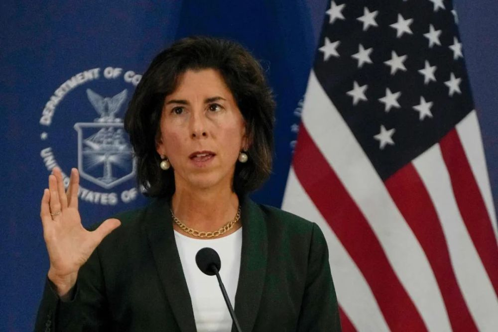
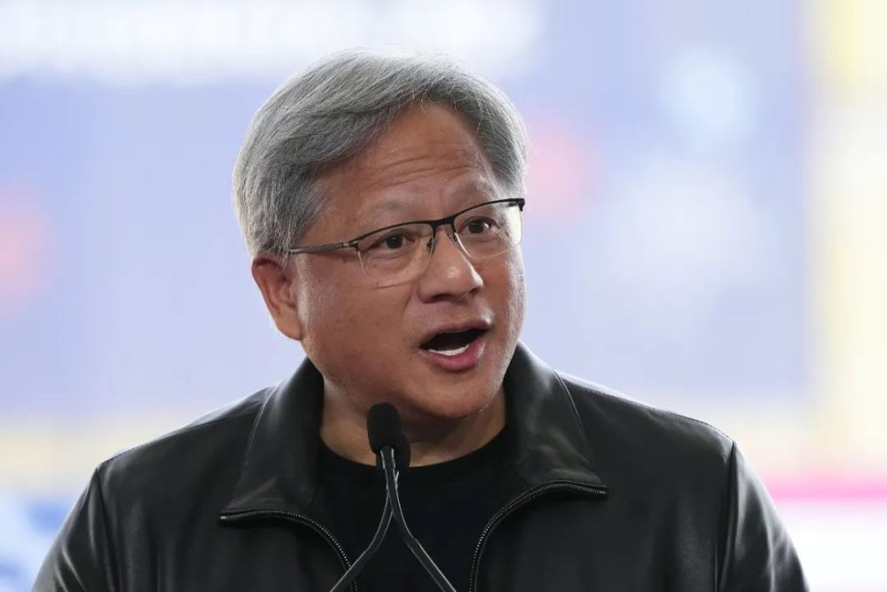

# 雷蒙多，要得多

“美国商务部需要更多资金，以阻止中国在尖端半导体领域赶超。”当地时间12月2日，在美国加州举行的里根国防论坛上，美国商务部长吉娜·雷蒙多再次把矛头指向中国，敦促国会“打钱”。

据官网介绍，本届里根国防论坛汇集了美国多个政治派别的人士及国防领域人员等，包括国会议员、现任和前任政府官员、军队高层、行业高管、技术人员等，以“审查和评估如何在全球威胁环境下加强美国的国防政策”。

长安街知事注意到，雷蒙多在论坛首日上午的“炉边谈话”中，面向上述人士发表了讲话。她喊话国会“加钱”、炒作“中国威胁”，甚至对相关企业直接点名并发出威胁。

_雷蒙多 资料图_

当天，围绕“打钱”诉求，雷蒙多发表了一系列耸人听闻的言论。

炒作“中国芯片威胁”，她称：“中国每天一觉醒来就在想方设法绕开我们的出口管制。这意味着我们时时刻刻都必须加强管控，并和我们的盟友更认真地加以执行。”

对“国家安全”问题老调重弹，她声称，与中国的沟通有助于稳定两国关系，但“在国家安全问题上，我们必须对威胁睁大眼睛”。

喊话国会向负责美国出口管制的商务部工业和安全局提供更多资金，她称：“我有2亿美元预算的计划，这就是几架战斗机的价格，拜托了。让我们为这项行动提供需要的资金，这样才能开展行动，开展我们保护美国所需要的行动。”

“要钱”心切的雷蒙多，还喊出了“北京是我们有史以来面临的最大威胁”，声称“中国不是我们的朋友”。

台上的雷蒙多公开“要钱”，但她反复强调的出口管制，恰恰阻碍了台下企业赚钱。面对现场的企业高管，雷蒙多使出了一招“胡萝卜加大棒”。

她先是对美国企业肯定一番，称：“美国在人工智能和先进半导体设计方面是全球领导者，这要归功于美国的企业，也要归功于我们的公共部门的投资，让我们领先中国数年。我们不能让他们迎头赶上。”

接着，雷蒙多又直接提出要求，称美国企业“需要适应有关美国国家安全的优先事项”，包括美商务部对半导体产品实施的出口管制。

“我知道，在座听众当中有芯片公司的首席执行官，我这么做，你们对我很不满，因为你们的收入正在受到损失。但生活就是这样，保护我们的国家安全比短期收入更重要。”

值得注意的是，雷蒙多在会议上还点名了美国知名芯片企业英伟达，后者此前被传“面向中国市场设计符合美国出口规定的芯片”。

雷蒙多威胁称，如果英伟达采取某种措施重新设计一款芯片，让中国能够实施人工智能项目，“我第二天就会采取控制措施”。

英伟达是开发最新一代人工智能所需最先进芯片的主要公司之一，此前有媒体报道称，为了应对美国扩大出口管制措施，英伟达为中国市场推出了数款“定制”芯片产品。

长安街知事注意到，雷蒙多此次点名美国芯片企业之前，芯片领域早已对美政府愈演愈烈的出口管制措施怨声载道，而这根弦还在不断绷紧。

上述英伟达公司首席执行官（CEO）黄仁勋此前在接受采访时表示，中国市场不可代替，退出中国市场不是一种可行选项。

他警告说，拜登政府对华半导体技术实施的出口管制导致公司“束手束脚”，无法在其最大的市场之一中国开展销售。“美国必须谨慎行事，中国是科技行业一个非常重要的市场。”

英伟达首席财务官科莱特·克雷斯此前则直言，美国限制人工智能芯片对华出口“将令美国这一行业永久丧失机会”。

_黄仁勋 资料图_

不止英伟达，美国政府持续收紧对华半导体产业政策，同样引起了另外两家芯片巨头英特尔、高通的反感。

今年7月，上述三家芯片巨头CEO在华盛顿举行会谈时，向拜登政府官员表示，美国政府应当研究收紧对华出口限制的影响，并在实施新限制之前暂停实施有关举措。

英特尔公司CEO帕特·基辛格当时表示，如果没有中国客户的订单，英特尔计划在俄亥俄州建设工厂等项目的必要性就会大大降低。

黄仁勋同样表示，限制该公司芯片在华销售，只会让替代产品更受欢迎。

可惜的是，尽管美国商界质疑声、反对声不断，但美国政府对华半导体出口管制措施力度不减反增。

就在今年10月，雷蒙多公布了一系列限制对华出口先进芯片的措施，以阻止“中国把这些芯片用于军事目的”。

雷蒙多10月初还称，美商务部需要采取更多方法强化出口管制，在力度上必须“要多强硬就有多强硬”。“我们需要不同的工具……我们需要更多执法资源。”

与此同时，美国商务部和企业之间的龃龉其实早已显现。今年早些时候，美国硬盘制造公司希捷科技“因违反出口管制条例向华为公司销售硬盘的指控”，与美国商务部达成史上最大单笔处罚金额的和解协议。而雷蒙多却公开称，她本人对此“感到自豪”。

_美国总统拜登（左）、商务部长雷蒙多 资料图_

华盛顿逆市场规律而动，其对华半导体产业政策会顺利推进吗？

有分析指出，恰恰相反，美国相关管制措施可能陷入了困境。一方面，企业与美政府部门摩擦不断，本身就证明了人为出口管制措施违背市场规律的本质；另一方面，此次为了2亿美元预算，雷蒙多跑去年度论坛公开喊话要钱，分析指出，这恰恰暴露了华盛顿内部在实操遏华措施上举步维艰。

事实上，当天在接受媒体采访时，雷蒙多坦言，她的部门在执行芯片出口管制政策时陷入了“打地鼠”的游戏之中。

在尖端半导体领域不断围堵中国，靠“加钱”就能奏效吗？

尤记得，雷蒙多今年8月访华期间，饱受美国制裁的华为公司推出可进行5G通讯的新款手机，这一让雷蒙多十分“不悦”的消息，也引发了美国舆论的强烈关注。

《华盛顿邮报》当时报道称，美国的制裁未能阻止中国取得关键技术进步，“这似乎应验了美国芯片制造商的警告，即制裁不会阻止中国，而是会刺激中国加倍努力，打造美国技术的替代品。”

图源：视觉中国

