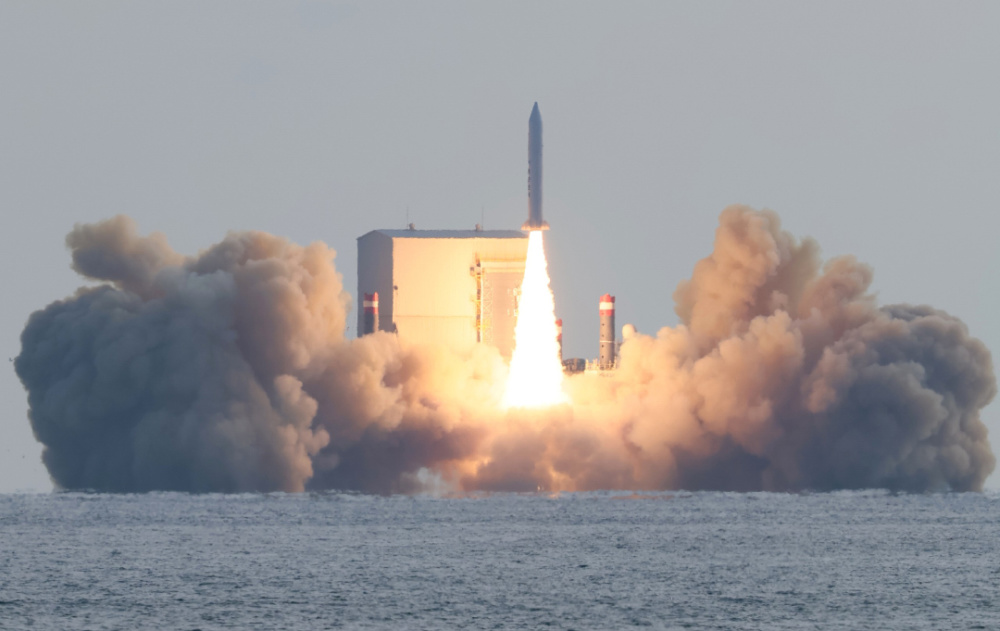

# 首颗侦察卫星被送入太空后，韩国再次发射雷达遥感卫星

韩国自研固体火箭进行第三次发射，将一颗雷达遥感卫星送入太空。

据央视新闻报道，当地时间12月4日，韩国军方在济州岛附近海域进行第三次固体燃料运载火箭试射。发射后不久，韩国国防部宣布本次火箭试射成功。

 _当地时间12月4日，韩国济州岛，韩军自主研发的固体燃料火箭第三次试射成功，图为试射现场。 IC 图_

该运载火箭在距离济州道中文海岸4公里外的驳船上搭载韩华Systems研制的合成孔径雷达（SAR）遥感卫星发射升空。该卫星将在入轨后与地面站通信，以执行对地球的观测任务。这是继去年3月、12月后，该固体燃料火箭进行的第三次试射。前两次试射均搭载模拟卫星，此次是首次发射实体卫星。

央视新闻12月2日报道称，韩国自主研发的首颗军事侦察卫星于北京时间2日凌晨2时在美国加州范登堡太空军基地发射升空。这颗名为“侦察卫星-1”号的韩国侦察卫星是一颗低轨卫星，在400～600千米高度环绕地球运行，搭载了电子光学（EO）和红外线（IR）侦察设备。据称，该卫星拍摄的影像分辨率达到0.3米。

根据韩国国防部公布的计划，这颗卫星在内，韩国防部计划到2025年共将5颗侦察卫星送入太空，届时韩军可以2小时的周期对朝鲜的特定地点进行监视和侦察。

