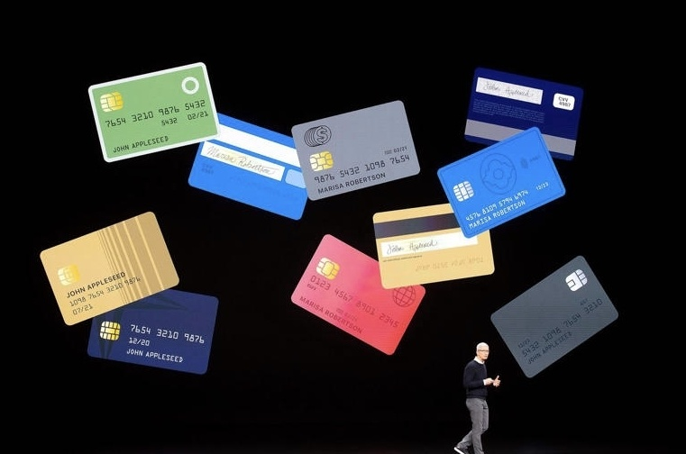

# 高盛与苹果“分手”内幕曝光：多元化努力受挫，内部冲突不断

**划重点**

  * _1_ 苹果已经向高盛提议，在未来12到15个月内解除双方在消费者业务方面的合作。
  * _2_ 高盛披露的数据显示，其消费者借贷业务损失了数十亿美元。
  * _3_ 与苹果的合作终结意味着，高盛的业务多元化努力遭遇重挫。

腾讯科技讯 据外媒报道，美国投行高盛集团首席执行官大卫·所罗门（David
Solomon）最近向合伙人承认，该公司在消费者借贷领域犯了错误，并在寻找退出的机会。这意味着，其与苹果的合作将终结，业务多元化努力也遭遇重挫。

据知情人士透露，苹果已经向高盛提出了一项建议，希望在未来大约12个月至15个月内解除合作关系。合作的终止将涵盖双方的整个消费者合作伙伴关系，包括两家公司在2019年推出的信用卡和今年推出的储蓄账户以及先买后付服务。

苹果提出“分手”，实际上将终结高盛成为大众银行的宏伟计划。大约10年前，高盛就开始了这一尝试，目的是在全球金融危机后成为一家与众不同的银行。但新与旧永远无法融合，从硅谷招来的工程师抱怨高盛的企业文化过于沉闷。作为高盛的传统业务，交易和投资部门的高管们对其亏损的消费者业务也表示不满。

据知情人士透露，就连所罗门也开始认为，这项业务拖累了高盛的业绩。不过，所罗门认为，如果高盛为消费者业务找到外部投资者，股价可能会走得更高。据悉，高盛曾为此与私募股权公司银湖谈判，看能否将消费者业务分拆成合资企业。但由于双方无法就各自对新合资企业的控制权达成一致，谈判破裂。

苹果信用卡于2019年大张旗鼓地上线，承诺提供现金奖励。这一合作从一开始就矛盾重重。要想达成这笔交易，高盛需要接受苹果提出的许多非常规条款。例如，高盛同意不收取滞纳金或出售客户数据，从而放弃了两大收入来源。

苹果信用卡最初的表现令人振奋，但高盛合伙人抱怨称，高盛这是在白白砸钱，也无助于实现业务多元化。很快，其他问题接踵而至。2022年，美联储发现高盛的消费者业务存在问题，担心高盛没有适当的监督和控制系统。

同年，高盛披露，美国消费者金融保护局正在调查其信用卡业务，包括该银行如何解决账单纠纷和向持卡人退款。这些调查仍在继续。

有些人将监管问题归咎于苹果：大多数信用卡公司会分批向持卡人发送账单，但苹果坚持要求持卡人在每个月初收到账单。这意味着，每个月的头几天，高盛的客服人员都会被大量的投诉和请求淹没，很难满足客户的需求。

雪上加霜的是，受利率上升和股价大幅下跌的影响，高盛和竞争对手的投行业务在2022年急剧下滑。高盛的权力掮客们对高盛把钱花在他们不想要的消费者业务上更加愤怒。后来，高盛披露其消费者贷款业务损失了数十亿美元。

取消消费者业务实验的内部呼声越来越高。所罗门的副手人物约翰·沃尔德伦（John
Waldron）下令对整个消费者业务进行审查。评估得出的结论是，消费者业务无法在短期内产生高盛想要的回报。

到今年年初，高盛高管开始寻找摆脱与苹果合作的方式，甚至联系了美国运通公司，询问他们是否对此感兴趣。

尽管心存疑虑，但高盛还是帮助推出了新的苹果产品，包括储蓄账户以及先买后付服务。但高盛内部最糟糕的预测显示：在计入运营费用后，储蓄账户业务将在未来10年处于亏损状态。

高盛目前仍负责发放苹果卡和通用卡，包括提供客户服务。但高盛员工正准备将工作转移到接管这些信用卡的公司。此外，高盛已经通知从事消费者业务的员工，如果他们的工作被取消，许多人将有资格获得相当于他们一年的薪酬。
（编译/金鹿）

