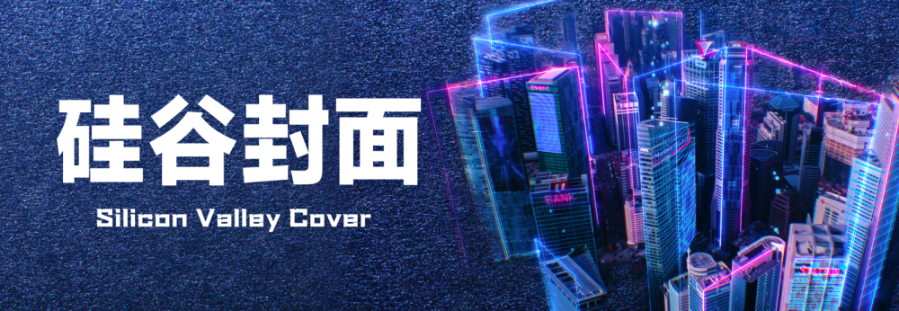
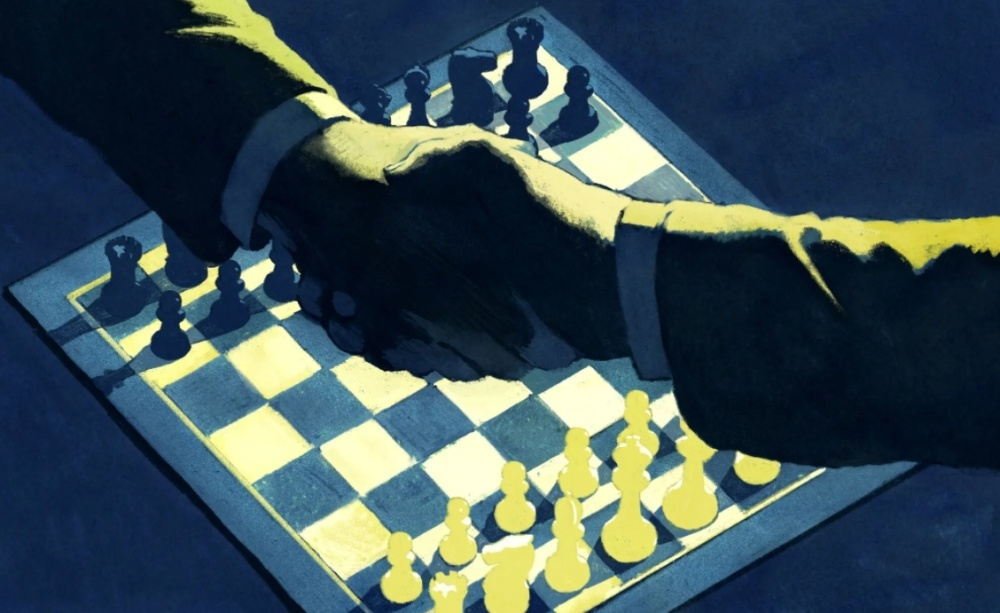
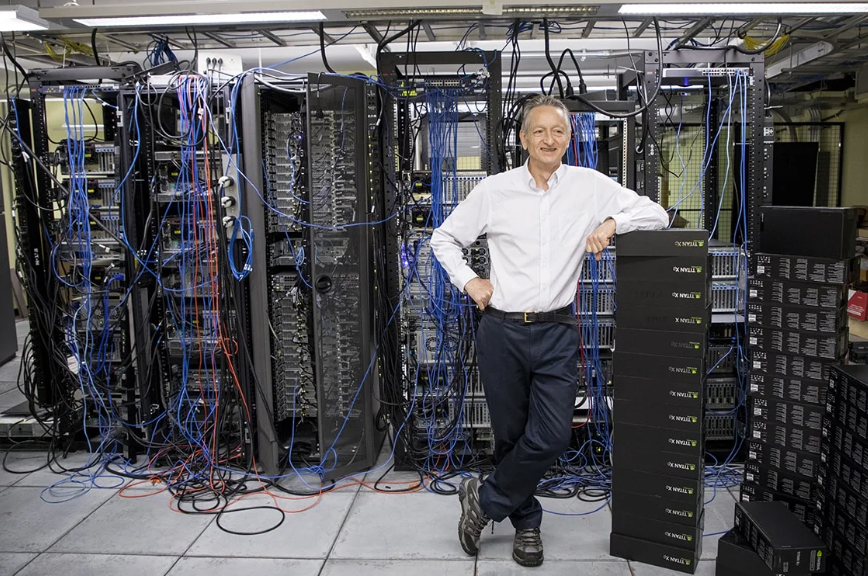
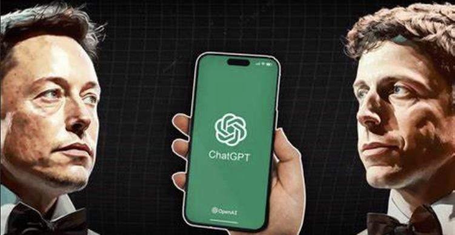
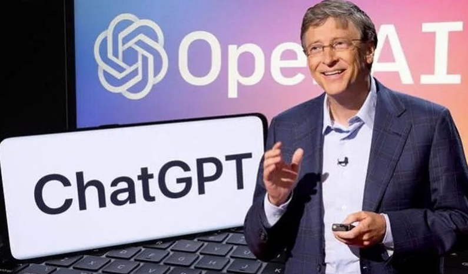

# AI的星星之火是如何燎原的？始于生日派对上马斯克与佩奇的一场激辩

**划重点：**

  * _1_ 在2015年, 马斯克44岁生日派对上，他与谷歌联合创始人佩奇曾就AI产生严重分歧，甚至终结了十多年的友谊。佩奇认为人类最终将与AI机器融合，将会有许多种智能争夺资源, 马斯克则担心机器可能会毁灭人类。
  * _2_ 在收购AI创企DeepMind时，佩奇领导的谷歌与马斯克进行了第二次针锋相对的较量。收购DeepMind失败后，马斯克帮助创建了OpenAI，但试图接管该公司失败后，他离开了董事会。
  * _3_ 马斯克的离开给OpenAI带来了巨大的资金缺口, OpenAI为了寻求新的融资，奥特曼前往太阳谷参加会议，并在那里偶遇了微软首席执行官萨蒂亚·纳德拉, 最终促成了微软的收购。
  * _4_ OpenAI前员工阿莫代伊不满意微软收购OpenAI带的做法，他和其他研究人员曾前往董事会，试图将奥特曼赶出董事会但未能成功。于是选择离开并创建了名为“Anthropic”的新实验室, 两年后成功获得亚马逊和谷歌的投资。

_《硅谷封面》系列聚焦硅谷科技大公司动态、科技大咖访谈、重磅研究报告等，旨在为科技资讯爱好者提供全球最前沿的深度好文。_

目前，最新的人工智能（AI）热潮几乎改变了整个科技行业，并导致关于其最终将能帮助人类还是毁灭人类的争论愈演愈烈。那么，最新的AI星星之火是如何燎原的？这个领域的先驱者们最初是如何看待它？他们之间存在着哪些分歧？未来AI将走向何方？将时间倒回8年前,
我们从一场“激辩”说起。

01 “人们的目标方向越接近，就越容易产生分歧”

2015年7月，埃隆·马斯克（Elon Musk）当时的妻子妲露拉·莱莉（Talulah
Riley）在加州纳帕谷举办了长达三天的派对，以庆祝他44岁生日。参与派对的都是马斯克的亲朋好友，孩子们在高档豪宅里尽情玩耍，而大人们则享受着这个难得的聚会。

那时，人工智能刚刚进入公众视野，被用来识别YouTube上的猫，但准确率仅为16%。当时，马斯克的好友、谷歌首席执行官拉里·佩奇（Larry
Page）也出席了这次派对。两位亿万富翁已经是十多年的朋友了，他们坐在游泳池附近的火堆旁，谈论的主要话题就是人工智能。

两人就人工智能最终会增强人类还是毁灭人类展开了辩论，气氛逐渐变得紧张起来。佩奇带着他一贯的乐观态度，描述了他对数字乌托邦的愿景。
**他认为，人类最终将与人工智能机器融合，将会有许多种智能争夺资源，而最好的将会获胜。然而，马斯克则持有更为悲观的看法。他认为，如果发生这种情况，机器可能会毁灭人类。**

佩奇对马斯克的看法感到沮丧，他坚持追求自己理想中的乌托邦。最后，他甚至称马斯克为“物种专家”，暗示马斯克更喜欢人类，而不是未来的数字生命形式。马斯克后来称，那次侮辱是“压倒两人友谊的最后一根稻草”。

这场争论似乎并没有引起周围人的太多关注，他们认为这只是硅谷聚会上经常爆发的另一场深奥的辩论。然而，八年后，人工智能的发展使得这场争论逐渐扩大。人工智能将帮助世界还是摧毁世界，这个问题在硅谷创始人、聊天机器人用户、学者、立法者和监管机构之间引发了一场持续的辩论。

在这场辩论中，世界上多位最富有的人相互对立，除了马斯克、佩奇，还有Meta首席执行官马克·扎克伯格（Mark
Zuckerberg）、科技投资者彼得·蒂尔（Peter Thiel）、微软首席执行官萨蒂亚·纳德拉（Satya
Nadella）以及OpenAI联合创始人山姆·奥特曼（Sam
Altman）等。所有人都希望从这项业务（有朝一日可能价值数万亿美元）中分一杯羹，并为攫取该领域的权力而战。

有关人工智能发展的辩论，其核心似乎是一个令人费解的悖论：那些声称最担心人工智能危险的人，恰恰也是坚决要创造并享受其所带来财富的人。这似乎揭示了科技行业的某种矛盾心理，即既对创新的潜力感到兴奋，又对其可能的后果深感忧虑。

2015年夏天的派对结束后不久，马斯克和佩奇就开始各奔东西。几周后，马斯克在加州门洛帕克的罗斯伍德酒店，与当时正在经营加速孵化器的奥特曼以及几名研究人员共进晚餐。这里是非常热门的交易场所，靠近沙丘路（Sand
Hill Road）的风险投资机构。

那次晚宴促使OpenAI于当年晚些时候成立。在马斯克和其他资助者提供的数亿美元资金支持下，该实验室承诺保护世界不受佩奇愿景的影响。凭借ChatGPT聊天机器人，OpenAI从根本上改变了科技行业，并向世界展现了人工智能的风险和潜力。据熟悉OpenAI融资情况的两名人士透露，该公司估值超过800亿美元。

然而，OpenAI的成立过程也并非一帆风顺，马斯克和奥特曼之间也充满了分歧。奥特曼后来表示：“这其中存在分歧、不信任和自负。人们的目标方向越接近，就越容易产生分歧……就连最亲密的人之间也会有激烈的斗争。”

最终，这种矛盾在上个月OpenAI董事会的内讧中达到了顶点，四位董事试图迫使奥特曼下台，因为他们不能再相信他能制造出造福人类的人工智能。在充满动荡的五天里，OpenAI看起来好像要崩溃了，直到董事会迫于投资者和员工的巨大压力做出让步。这场内讧让外界看到了人工智能领域内部的激烈争斗，以及对于人工智能未来的不同看法和期望。

但在OpenAI几近崩溃几年前，硅谷就曾发生过一场鲜为人知但却十分激烈的竞争，以争夺对这项技术的控制权。从儿童教育方式到战争方式，这项技术正在迅速重塑世界。《纽约时报》采访了80多位高管、科学家和企业家，讲述了这个关于雄心、恐惧和金钱的故事，其中包括2015年参加马斯克生日派对的两个人。

02 DeepMind诞生，马斯克与佩奇第二次对决

在纳帕谷那场著名的派对五年前，34岁的神经科学家德米斯·哈萨比斯（Demis
Hassabis）在一次鸡尾酒会上，意识到自己终于找到了机会。这场酒会在科技投资者彼得·蒂尔的旧金山别墅举行，哈萨比斯曾是世界排名第二的14岁以下棋手，他利用自己的这一优势，以棋会友，成功引起了蒂尔的兴趣。

2010年，哈萨比斯和两名英国同事开始寻找资金，试图开发“通用人工智能（AGI）”。当时，人工智能领域依然未能提供任何接近人类大脑的东西，因此很少有人对人工智能感兴趣。尽管如此，有些科学家和思想家已经开始关注人工智能带来的负面影响。

许多人都与互联网哲学家、自学成才的人工智能研究员埃利泽·尤德科夫斯基（Eliezer
Yudkowsky）有联系。尤德科夫斯基是一个自称为理性主义者团体的领袖，在后来的几年里，他们称自己为有效利他主义者。他们相信人工智能可以找到治疗癌症或解决气候变化的方法，但他们担心人工智能机器人可能会做些它们的创造者意想不到的事情。理性主义者认为，如果机器变得比人类更聪明，可能会背叛它们的创造者。

通过早期对Facebook的投资，以及在PayPal早期与马斯克的合作，蒂尔变得非常富有。他对奇点产生了浓厚的兴趣，奇点是科幻小说中的一个比喻，用来描述智能技术不再受人类控制的时刻。在蒂尔的资助下，哈萨比斯成功创立了DeepMind。这是对“深度学习”、神经科学的致敬，即人工智能系统通过分析大量数据来学习技能的一种方式。他们的目标是建造一台可以完成人类大脑所有事情的机器。

到2010年秋天，哈萨比斯开始建造自己的梦想机器。他们坚信，因为他们了解风险，可以在保护世界方面处于独特的地位。DeepMind三位创始人之一穆斯塔法·苏莱曼（Mustafa
Suleyman）说：“我不认为这自相矛盾，这些技术会带来巨大的好处。我们的目标不是消除它们或暂停它们的发展，而是减轻负面影响。”

在赢得蒂尔的支持后，哈萨比斯的公司开始引起其他科技大佬的关注。马斯克很快就和蒂尔共同投资了DeepMind，这样他就能更接近这项技术。马斯克解释说，他的计划是殖民火星，以逃离地球上人口过剩及其他危险。哈萨比斯回答说，这个计划是可行的，只要超级智能机器不跟随并摧毁火星上的人类。

资金充裕的DeepMind聘请了专门研究神经网络的研究人员，这些人可以根据人脑的图像创建复杂算法。神经网络本质上是一个巨大的数学系统，它需要花费数天、数周甚至数月的时间来识别大量数字数据中的模式。这些系统最早是在20世纪50年代开发的，它们可以学会自己处理任务。例如，在分析了潦草地写在数百个信封上的姓名和地址后，它们可以阅读手写文本。

DeepMind进一步发展了神经网络的概念。它建立了一个系统，可以学习玩经典的雅达利游戏，如《太空入侵者》、《乒乓》和《Breakout》等。这引起了硅谷巨头谷歌的注意，尤其是佩奇。在看到了DeepMind的机器玩雅达利游戏的演示后，佩奇决定加入其中。

03 辛顿“自我拍卖”，不知道自己到底值多少钱

2012年秋天，多伦多大学教授杰弗里·辛顿（Geoffrey
Hinton）和他的团队向世界展示了人工智能的潜力，他们通过训练一个神经网络识别常见物体，比如花、狗和汽车，震惊了科学界。这一创新性研究吸引了众多科技巨头的关注，其中就包括百度。

百度向辛顿教授及其团队提供了1200万美元的诱人报价，邀请他们加盟。然而，辛顿教授虽然婉拒了邀请，但他对这笔巨额资金产生了兴趣。这笔资金不仅意味着他患病的孩子可以获得经济保障，更让他意识到自己团队的价值。辛顿博士当时称：“我们不知道自己到底值多少钱。”因此，他决定组织一场拍卖，将自己和团队“卖”给最高出价者。

这场拍卖在当年的年度人工智能会议期间举行，吸引了谷歌、微软、百度等科技巨头的参与。这些公司开始相信，神经网络是一条通往不仅能看，而且能听、能写、能说话，并最终能思考的机器的道路。

佩奇曾在旗下人工智能实验室Google
Brain看到过类似的技术，他认为辛顿的研究可以提升他手下科学家的工作水平。他给了谷歌高级工程副总裁艾伦·尤斯塔斯（Alan
Eustace）一张空白支票，让他聘请自己需要的任何人工智能专家。

除了谷歌，微软也参加了拍卖。随着价格的上涨，DeepMind很快退出了。详细介绍拍卖的文件显示，这两家行业巨头将出价提高到2000万美元，然后是2500万美元。当价格超过3000万美元时，微软退出了，但它以3700万美元的价格重新加入了竞标。辛顿回忆道：“我们感觉像是在拍电影！”

随着价格的飙升，竞争越来越激烈，微软第二次退出，只剩下百度和谷歌，他们把出价推到了4200万美元，4300万美元。最终，辛顿教授和他的团队以4400万美元的价格选择了为谷歌工作。

这一事件清晰地表明，财力雄厚的大公司决心收购最优秀的人工智能研究团队。与此同时，DeepMind的哈萨比斯等人也面临着类似的压力。他一直坚称DeepMind将保持独立公司的身份，以确保其技术不会被用于危险的目的。然而，随着大型科技公司纷纷加入人才争夺战，哈萨比斯认为出售公司可能是唯一的选择。

据知情人士透露，到2012年底，谷歌和Facebook都在寻求收购DeepMind。哈萨比斯和他的联合创始人坚持两个条件：DeepMind的技术不能用于军事目的，它的人工智能技术必须受到一个由技术专家和伦理学家组成的独立委员会的监督。谷歌出价6.5亿美元，Facebook向DeepMind创始人提供了更高的薪酬，但不同意上述条件。

最终，DeepMind选择了谷歌。随后，扎克伯格决心建立自己的人工智能实验室，他聘请了同样从事过开创性人工智能研究的法国计算机科学家杨立昆（Yann
LeCun）来管理。此外，扎克伯格还亲自面试了许多顶尖的研究人员，并为他们开出数百万美元年薪和股票奖励。

人工智能曾一度被人一笑置之，但现在，硅谷最富有的人为了不被落在后面，不惜砸出数十亿美元。这是一场关乎未来科技制高点的激烈竞争，而这些科技巨头们正在用真金白银来确保自己在人工智能领域的领先地位。

04 迷失的道德委员会

马斯克投资DeepMind，打破了自己不投资非亲自经营公司的规则。这一决定带来的负面影响在不久后显现出来，导致他与曾经的朋友、亿万富翁佩奇再次对立。DeepMind伦理委员会的第一次会议于2015年8月14日召开，旨在确保该公司出售后其技术不会造成危害。然而，当谷歌收购DeepMind时，马斯克被淘汰出局。

现在，谷歌三名高管牢牢控制着DeepMind，他们包括佩奇、谷歌联合创始人、特斯拉投资者谢尔盖·布林（Sergey
Brin）以及谷歌董事长埃里克·施密特（Eric Schmidt）。其他与会者包括PayPal的另一位创始人里德·霍夫曼（Reid
Hoffman）、研究“存在风险”的澳大利亚哲学家托比·奥德（Toby Ord）。

在会议上，DeepMind的创始人报告了他们正在推进的工作，并意识到了人工智能技术的潜在风险。DeepMind联合创始人苏莱曼表示，人工智能可能会导致虚假信息泛滥。他担心，随着这项技术在未来几年取代无数的工作，公众会指责谷歌窃取了他们的生计。他认为，谷歌需要与数百万找不到工作的人分享财富，并提供“全民基本收入”。

马斯克对此表示赞同。然而，谷歌高管并不认同这种看法。施密特说，他认为这些担忧完全被夸大了。佩奇也表示赞同，并认为人工智能创造的就业机会将超过它夺走的就业机会。

八个月后，DeepMind的人工智能AlphaGo在围棋比赛中击败了人类世界冠军，人工智能社区乃至全世界。这场比赛通过互联网直播，全球有2亿人观看。大多数研究人员认为，人工智能还需要10年的时间才能做到这一点。然而，这一胜利证实了理性主义者和有效利他主义者的担忧，即人工智能的发展速度超过了专家的预期。此后，越来越多的人开始关注人工智能的安全问题。

DeepMind的创始人们也越来越担心谷歌会如何利用他们的发明。2017年，他们曾试图脱离谷歌，但谷歌提高了他们的薪资和股票奖励，成功地留住了他们。不过，道德委员会再也没有召开过第二次会议。

05 奥特曼与马斯克、阿莫代伊的决裂

马斯克对佩奇关于人工智能的乐观立场表示强烈质疑，并对未能收购DeepMind感到愤怒。因此，他决定亲自投身这一领域，成立了自己的实验室。

2015年底，就在与奥特曼在硅谷罗斯伍德酒店会面几个月后，马斯克等人创立了OpenAI。他不仅自己投入了大量资金，还得到了PayPal前伙伴霍夫曼和蒂尔的支持。这三人及其他投资者共同承诺为这个项目注资10亿美元，而年仅30岁的奥特曼将负责项目的运营。为了推动项目的进展，他们还成功挖角了谷歌的伊利亚·苏茨凯弗（Ilya
Sutskever），他是辛顿博士的高徒。

马斯克最初希望将OpenAI定位为一个非营利组织，不受经济利益的驱使，与谷歌等公司有所区别。然而，当谷歌通过围棋程序AlphaGo震撼全球时，马斯克改变了对OpenAI运营方式的看法。他迫切希望该公司能够创造出一些能够吸引世界想象力的成果，以缩小与谷歌的差距。但是作为一个非营利组织，OpenAI难以实现这一目标。

据四名知情人士透露，2017年底，马斯克策划了一项计划，试图从奥特曼和其他创始人手中夺取实验室的控制权，并将其转变为一家商业机构，与特斯拉合作，并利用特斯拉正在开发的超级计算机。然而，这一计划遭到了奥特曼等人的反对，导致马斯克最终选择离开OpenAI，并专注于自己在特斯拉的人工智能工作。

马斯克的离开给OpenAI带来了巨大的资金缺口。为了寻求新的融资，奥特曼前往太阳谷参加会议，并在那里偶遇了微软首席执行官萨蒂亚·纳德拉（Satya
Nadella）。双方的合作似乎是天作之合，而且奥特曼与微软颇有渊源。他认识微软首席技术官凯文·斯科特（Kevin
Scott），微软曾从OpenAI董事会成员霍夫曼手中收购了职业社交网站领英。在你情我愿的情况下，双方于2019年正式达成合作协议。

通过这一合作，奥特曼在原有的非营利组织基础上成立了一家营利性公司，并获得了10亿美元的新资本注入。而微软则获得了一种将人工智能融入其庞大云计算服务的新途径。这一转变为OpenAI的发展注入了新的活力，并推动了人工智能技术的不断创新与应用。

然而，OpenAI内部并非所有人为此都高兴。达里奥·阿莫代伊（Dario
Amodei）是一名与有效利他主义社区有联系的研究人员。OpenAI诞生时，他就在罗斯伍德酒店，当时正在领导实验室建立名为“大语言模型”的神经网络，该网络可以从大量的数字文本中学习。通过分析无数的维基百科文章、电子书和留言板，它可以自己生成文本。这个模型被称为GPT-3，于2020年夏天发布。

OpenAI、谷歌和其他公司的研究人员认为，这种快速改进的技术可能是通往通用人工智能的一条道路。但阿莫代伊对微软的这笔交易并不满意，因为他认为这会把OpenAI带向真正的商业化方向。据五位知情人士透露，他和其他研究人员前往董事会，试图将奥特曼赶出董事会，但未能成功。于是，他们选择了离开。就像DeepMind之前的创始人一样，他们也担心新的企业霸主会把商业利益置于人工智能的安全之上。

2021年，由大约15名工程师和科学家组成的团队创建了名为Anthropic的新实验室，他们的计划是按照有效利他主义者认为应该有的方式来构建人工智能，让其处于非常严格的控制之下。

Anthropic的女发言人莎莉·奥尔德斯（Sally
Aldous）说：“Anthropic的联合创始人并没有试图把奥特曼从OpenAI中赶出去，他们得出的结论是：他们希望离开OpenAI去创办自己的公司，并将这一想法告知了OpenAI的领导层。在几周内，他们就双方同意的退出条款进行了谈判。”

两年后，达里奥·阿莫代伊（Dario
Amodei）是一位与有效利他主义社区有关联的研究人员，他在OpenAI成立之初就在罗斯伍德酒店，负责领导建立一种名为“大语言模型”的神经网络。这种网络能够从大量的数字文本中学习，并通过分析无数的维基百科文章、电子书和留言板来生成自己的文本。这个模型被称为GPT-3，并于2020年夏天正式发布。

OpenAI、谷歌和其他公司的研究人员认为，这种技术的快速发展可能是实现通用人工智能的一条途径。然而，阿莫代伊对微软与OpenAI的交易感到不满，担心这会将OpenAI带向商业化的方向。据五位知情人士透露，阿莫代伊和其他研究人员曾前往董事会，试图将奥特曼赶出董事会，但未能成功。于是，他们选择了离开，并担心新的企业霸主会把商业利益置于人工智能的安全之上。

2021年，大约由15名工程师和科学家组成的团队创建了名为Anthropic的新实验室。他们的计划是构建一种处于严格控制之下的人工智能，按照有效利他主义者所认为的方式来进行。Anthropic的女发言人莎莉·奥尔德斯（Sally
Aldous）表示：“Anthropic的联合创始人并没有试图把奥特曼从OpenAI中赶出去。他们得出的结论是：他们希望离开OpenAI去创办自己的公司，并将这一想法告知了OpenAI的领导层。在几周内，他们就双方同意的退出条款进行了谈判。”

两年后，Anthropic成功吸引了亚马逊和谷歌的投资，分别获得了40亿美元和20亿美元的资金支持。

06 GPT-4演示镇住盖茨，相信其是革命性技术

在OpenAI又从微软获得20亿美元资金之后，奥特曼和另一位高管格雷格·布罗克曼（Greg
Brockman）前往比尔·盖茨位于西雅图郊外华盛顿湖畔的豪宅拜访了他。这位微软创始人不再参与公司的日常事务，但仍与公司高管保持定期联系。

晚餐期间，盖茨告诉他们，他怀疑大语言模型是否可行。他说，他会一直持怀疑态度，直到这项技术完成一项需要批判性思维的任务，比如通过生物预修考试。五个月后，即2022年8月24日，奥特曼和布罗克曼再次造访，并带上了OpenAI的研究员切尔西·沃斯（Chelsea
Voss）。沃斯在高中时期就曾在国际生物奥林匹克竞赛中摘得奖牌，此次会议也得到了微软首席执行官纳德拉等其他高层的参与。

在盖茨豪宅起居室外的一个巨大数字显示屏上，OpenAI团队展示了一项名为GPT-4的新技术。布罗克曼向该系统提交了一份有关高级生物的多项选择题，沃斯则对答案进行了评分。当系统不仅正确回答了第一个涉及极性分子的问题，还解释了选择的原因时，盖茨震惊了。在60道问题中，GPT-4只答错了一个。

盖茨坐在椅子上，眼睛睁得很大，就如同1980年研究人员向他展示成为现代个人电脑基础的图形用户界面时的反应一样。他认定GPT是一项革命性的技术。

到了10月份，微软已经将这项技术整合到其在线服务中，包括必应搜索引擎。两个月后，OpenAI发布了ChatGPT聊天机器人，现在每周有1亿人使用它。这一技术的成功使得OpenAI在与Anthropic的有效利他主义者的竞争中占据了上风。谷歌的乐观主义者匆忙发布了他们自己的聊天机器人Bard，但普遍认为他们在竞赛中输给了OpenAI。在ChatGPT发布三个月后，谷歌股价下跌了11%。马斯克也再次失声。也许，这只是个开始。

此次技术的突破不仅证明了OpenAI在人工智能领域的领先地位，也引发了公众对于人工智能技术的进一步关注和讨论。盖茨的反应以及微软对OpenAI的投资都表明，大型科技公司对于人工智能技术的重视和投入正在不断增加。然而，这也引发了人们对于人工智能技术的安全和伦理问题的更多担忧。在这个领域，未来的发展充满了无限的可能性和挑战。

编 / 陆屿 译 / 金鹿

