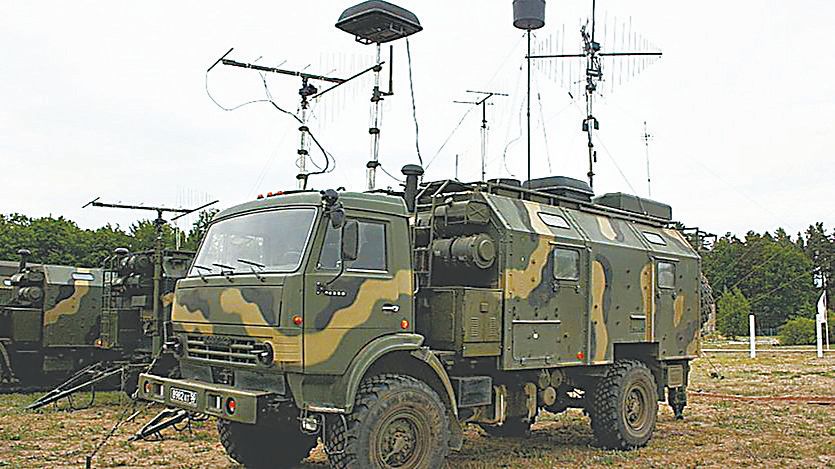

# GPS信号受干扰，无线电通信被中断……俄乌在“看不见的电磁领域”激战

【环球时报特约记者
晨阳】西方最近注意到，曾在俄乌冲突中名噪一时的美欧精确制导武器，近来却少有战果。乌克兰方面的数据显示，无论是“海马斯”远程火箭炮、“杰达姆-
ER”卫星制导滑翔炸弹，还是“神剑”制导炮弹，都出现命中率大幅降低的情况。西方分析家认为，这种现象的背后是俄罗斯电子战系统在大显身手。在电子对抗这个看不见的战场上，俄乌正在展开激烈争夺。

**电磁领域的“猫鼠游戏”**

美国有线电视新闻网（CNN）称，俄罗斯电子干扰设备将西方提供给乌克兰的智能制导武器技术优势变成了弱点。“制导导弹和‘海马斯’制导火箭系统本质上比非制导武器更容易受到电子战的影响，因为它们依靠GPS提供的制导数据才能命中目标。”乌克兰第59摩托化旅无人机指挥官帕夫洛·彼得里琴科表示，摧毁俄罗斯的电子战系统对于乌克兰的战争努力至关重要。“俄乌冲突开始时，他们使用电子战系统干扰我们的对讲机、无线电通信、电话、无人机，但是当我们开始接收外国设备时，他们开始使用电子战系统来压制我们的武器。”

_俄军拥有多种电子对抗设备。_

英国《经济学人》网站称，乌军从3月开始发现美国援助的“神剑”GPS制导炮弹经常会错过目标，另一种“杰达姆-
ER”制导炸弹也出现类似的情况。“在某些地区，‘海马斯’发射的大多数制导火箭弹都没有能命中目标”。乌军总司令扎卢日内承认，莫斯科仍然保持着“显著的电子战优势”，由于GPS信号受到干扰，“神剑”制导炮弹等依赖全球卫星定位系统提供坐标的精确制导武器作战效能明显下降。五角大楼发言人查理·迪茨少校表示，已经发现美国提供的“海马斯”等系统受到俄军电子战干扰的影响，美军正在重新设计和更新这些系统，以抵消不利影响。

美国《纽约时报》称，俄乌正在看不见的电磁领域进行激烈战斗：无人机和地面指挥中心之间的通信链路被干扰、定位目标的制导武器被欺骗……电子战已经演变成俄乌之间的“猫鼠游戏”。例如德国量子系统技术公司一直在向乌克兰提供无人机，但从去年年底开始，这些无人机返航时突然开始从空中坠落。该公司工程师调查后发现，是俄军干扰了GPS信号，导致无人机迷失方向而坠毁。

**俄电子战能力到底如何**

对于俄军电子战能力到底如何，西方专家此前意见不一。美国智库战略与国际问题研究中心研究员塞思·琼斯认为，俄罗斯多年来一直极其重视利用本国军工复合体发展强大的电子战实力，从而对抗北约高度网络化的武器系统。2022年2月俄乌冲突爆发初期，“当俄军坦克冲向基辅时，俄罗斯一度兑现了世界上最擅长电子战的国家之一的声誉”，俄军使用强大的干扰和诱饵设备压倒乌军防空系统。但英国智库皇家联合军种研究所2022年11月的报告称，“电子自相残杀”（指己方部队遭到电子系统的意外伤害）在俄乌冲突初期是俄军遭遇的普遍问题。例如俄军战机携带的“西比内”电子战吊舱可以自动探测乌军雷达并实施干扰，但它同样也会干扰俄军自己的飞机。“挂载该系统出击的俄军双机编队不得不在使用机载雷达和获得电子战保护之间二选一，这反映出俄军电子战系统缺乏兼容性，在实战中产生大量的混乱和相互干扰，并且在俄军防线上产生很多容易穿透的漏洞。”

不过随着俄乌冲突的延续，西方观察家承认，俄军电子战部队的作用越来越大。《经济学人》称，皇家联合军种研究所今年5月发表的报告认为，如今俄军在前线每10公里就部署一套重要的电子战系统。报告认为，在俄罗斯部署的诸多电子战系统中，车载“野蔷薇-
航空”系统对乌克兰无人机尤其具有杀伤力。该系统的作战范围为10公里，可接管乌军无人机的控制权，同时获取无人机驾驶员所处位置的坐标，可以精确到1米范围内，并将这一信息发送给炮兵部队。在俄军电子战系统的干扰下，乌军无人机每周损失超过2000架。《纽约时报》采访的乌军无人机操作手也承认，无人机控制器和天线发射的无线电信号会引来俄军炮火，“想要完全隐藏是不可能的”。

_美制“海马斯”系统命中率易受电子干扰影响。_

俄罗斯自由媒体网站称，俄军电子战部队最重要的任务之一是电子压制，即令敌军的指挥系统瘫痪，使其无法对部队下达命令。报道提到，“摩尔曼斯克-
BN”短波岸基系统在特别军事行动区的工作给人留下深刻印象，“它仿佛是科幻电影里的装备，于2014年开始在俄军服役。它能够制造无线电干扰，让敌方侦察工具变成聋子和瞎子，压制西方智能武器的传感器。它还进行无线电侦察，拦截信号，令敌方侦察机束手无策。系统的作用半径约5000公里。相比之下，大多数电子战系统不超过300公里”。印度《欧亚时报》称，俄军电子战系统覆盖了所有已知的无线电频段。其中“克拉苏哈-4”和“居民”被认为是目前强大的电子战系统之一，是俄军电子战攻击时不可或缺的精良装备。“克拉苏哈-4”电子战系统配备自动化设备，能自动寻找和分析信号源，除了干扰无人机外，它还能影响敌方飞机的机载预警和控制系统，使其分不清敌我位置，从而增加对手的误伤概率。

**乌军想办法应对**

CNN称，早先乌军使用的武器大都是苏联时代延续的装备，不太容易受到俄军电子战系统的影响。但随着原有装备的逐步战损、越来越多先进西方武器的抵达以及大量民用标准的无人机投入使用，俄军电子战系统的影响日益突出。

为应对俄军电子战的压力，乌军开始尝试利用各种手段优先摧毁俄军电子战装备。报道称，11月初的一段无人机视频显示，一座公寓楼顶上的三个天线被炸毁。乌克兰无人机指挥官声称，这次袭击摧毁了顿涅茨克附近、旨在干扰卫星导航信号的俄军“波列-21”电子战系统。乌克兰数字化转型部长米哈伊洛·费多罗夫表示，目前最重要的任务是让乌军无人机能大规模瞄准敌方电子战设备。他还表示，乌克兰需要西方盟友在提供设备和专业知识方面持开放态度。但外界认为，实施电子对抗需要大量专业技术人才，后者可能是当前乌军难以满足的。

