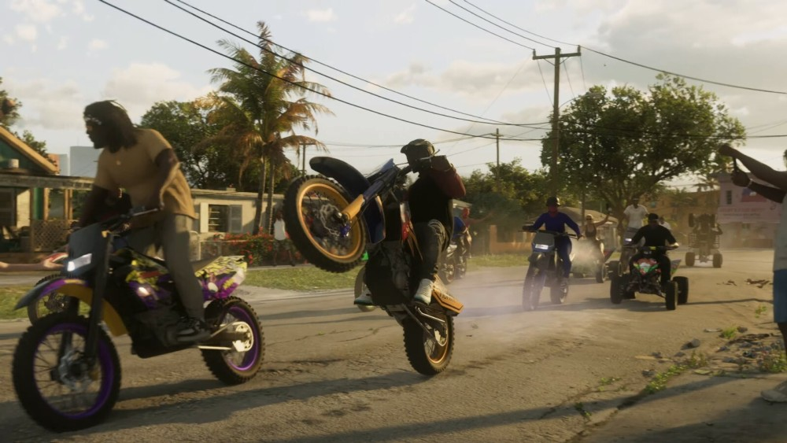

# 《GTA 6》首个预告片提前发布，2025年发售

IT之家 12 月 5 日消息，尽管《GTA VI》预告片原定于北京时间 12 月 5 日星期二晚上 22 点首映，但 Rockstar 已经提前在其官方
YouTube 频道上发布了完整预告片。

预告片证实了过去两年中泄露的《GTA
VI》的许多信息，包括游戏将以罪恶都市为背景，以及该游戏将带来该系列的第一位女性主角，并具有受邦妮和克莱德启发的故事元素。

IT之家注意到，预告片称该游戏将于 2025 年发售，但没有具体说明发售平台。

