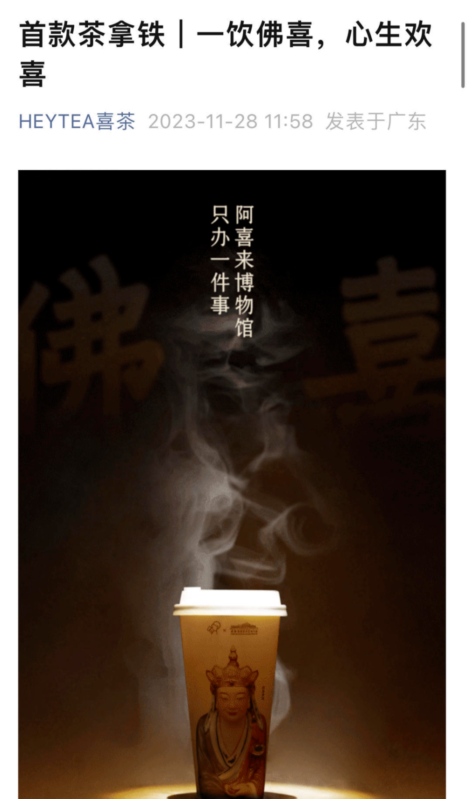

# 喜茶被约谈“佛喜茶拿铁”已全部下架，深圳民宗局、景德镇民宗局相继表态

11月28日，喜茶和景德镇中国陶瓷博物馆联名款“佛喜茶拿铁”及周边包装上线，在线下和网上受到追捧。同时，因其外包装的宗教元素，也遭到众多批评。

12月4日，深圳市民族宗教事务局工作人员反馈称，该局于12月1日约谈了喜茶公司，该公司于12月3日做了下架处理，同时就相关情况作出检查。目前，“喜茶GO”小程序上目前已无法搜寻到“佛喜茶拿铁”这款产品。

12月5日上午，景德镇市民族宗教事务局工作人员告诉红星新闻，为了消除影响，针对此事他们已经积极及时地进行了处置，但处置的具体内容不便透露。《宗教事务条例》《关于进一步治理佛教道教商业化问题的若干意见》（国宗发〔2017〕88号）《互联网宗教信息服务管理办法》等明确规定，禁止以宗教名义进行商业宣传。

**外包装的宗教元素招致批评**

**喜茶网红联名款产品被下架**

公开信息显示，11月28日景德镇中国陶瓷博物馆和喜茶联名推出了“佛喜茶拿铁”，此外还有3款不同的定制款联名杯和冰箱贴。此次的联名杯上，分别有伏虎罗汉、沉思罗汉和欢喜罗汉的形象，这三位罗汉是佛教中十八罗汉的一部分，分别代表了勇猛、智慧和喜悦。联名杯的杯身，则绘制了相应的罗汉故事，以及景德镇陶瓷博物馆的标识和喜茶的Logo。

彼时，该联名产品一经发布便引发网友的争相购买，登上热搜，一时间社交媒体上尽是网友晒出的“买家秀”。 同时，因其外包装的宗教元素，也遭到众多批评。

12月4日，深圳市民族宗教事务局工作人员反馈称，该局于12月1日约谈了喜茶公司，该公司于12月3日做了下架处理，同时就相关情况作出检查。

上述工作人员表示，经过民宗部门和市场监管等部门会商研究，认为他们（喜茶）其实打的是个“擦边球”，“现在只能约谈他们，约谈也是法律手段之一，而且他们公司也很配合，认错态度很好，周五晚上就给我们发了整改报告，12月3日已经全部下架了。”

食品产业分析师朱丹蓬分析称，喜茶所涉及的这个事情给很多的企业提了个醒，也就是我们在做产品跨界联名时，要全方位、多维度的全盘考虑，这样才能让企业的跨界联名更加成功。

**相关法律法规**

**明确禁止以宗教名义进行商业宣传**

红星新闻查询发现，早在1997年4月，国家工商行政管理局就发布了关于加强对含有宗教内容广告管理的通知。通知明确规定，任何单位和个人不得在大众传播媒介及非宗教活动场所发布有关宗教活动、宗教用品、宗教活动纪念品的广告，以及以讲经、传道等为内容的图书、音像制品的广告。如确实由于特殊需要在大众传播媒介及非宗教活动场所发布上述广告，须经省级以上宗教事务部门同意并报同级工商行政管理机关备案。对违反本通知的，依据《广告法》第七条第二款规定处理。

四川一上律师事务所合伙人林小明律师告诉红星新闻，喜茶被约谈下架的依据主要是根据我国《宗教事务条例》《关于进一步治理佛教道教商业化问题的若干意见》等法律法规，在这些法律法规中明确规定了禁止以宗教名义进行商业宣传。

河南泽槿律师事务所主任付建认为，喜茶与景德镇中国陶瓷博物馆联名推出的“佛喜茶拿铁”因为外包装上的宗教元素而引发了公众的批评，存在引用宗教元素宣传商品的嫌疑，因此被约谈下架。从法律层面来看，喜茶的行为虽然没有直接违反《宗教事务条例》等相关规定，但是其产品设计中的宗教元素引发了社会争议，可能涉及到宗教商业化问题。因此，喜茶需要对其产品包装设计进行审查，以避免再次引发类似争议。

付建称，喜茶公司在被约谈后，积极配合并迅速采取了下架措施，对相关产品进行了整改。但具体的后续处理情况，如整改措施、罚款等，需要根据相关部门的调查作出认定。同时，这也是一个警示，企业在进行商业活动时，需要充分考虑到可能涉及的法律风险和社会影响。

红星新闻记者 李毅达

编辑 郭庄 责编 官莉

