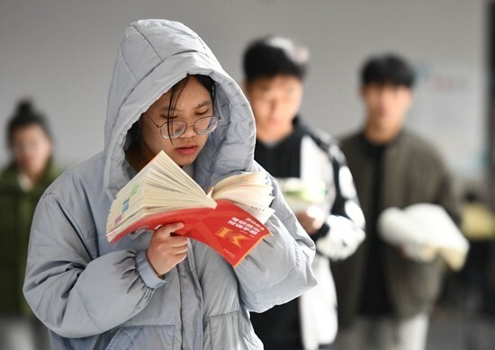

# 困在“第一学历”的年轻人：感觉一步都不能踏错

_11月26日，在河南省安阳市曙光学校东门口，参加中央机关及其直属机构2024年度考试录用公务员安阳考区笔试的考生走出考场。视觉中国供图_

“‘第一学历’是我的伤疤。”

林奇找工作时，把所有想要投递的岗位信息都列在了一张表格上，在招聘要求那一栏，一些岗位明晃晃地标注着：“各学历层次所在学校均为‘双一流’建设高校。”

这些岗位与林奇无缘。他本科就读于省内一所“双非”院校，考研那年“拼了命”，才考上位于城市另一边的“985”。林奇本以为他拿到的是“逆袭”的剧本，却在看到这些招聘要求时有点泄气，“高中不该‘混’的，到了找工作的时候才知道第一学历的重要性。”他无奈地和记者说，“感觉一步都不能踏错。”

但让林奇疑惑的是，人的发展是动态变化的，仅从“第一学历”来判断应试者的能力是否有所偏颇。“在学习氛围更松散的大学环境中考研成功，为什么不能证明自己的能力？”

2020年中共中央、国务院印发的《深化新时代教育评价改革总体方案》明确提出，树立正确用人导向。党政机关、事业单位、国有企业要带头扭转“唯名校”“唯学历”的用人导向，建立以品德和能力为导向、以岗位需求为目标的人才使用机制，改变人才“高消费”状况，形成“不拘一格降人才”的良好局面。

但是在前不久中国青年报社社调中心发布的一项有1000人参与的调查中，仍有超过八成的受访者认为“第一学历”的重要性被过度放大了。交互分析发现，“第一学历”是专科院校的受访者对此认同的比例更高，为88.6%，之后是二本院校的受访者，占比为83.4%。

毋庸讳言，当下“第一学历”仍然在各类招聘中起着重要的筛选作用。为了摆脱“第一学历”的烙印，这些就读于“双非”院校的学子开始“自救”。

_11月24日，武汉，考研倒计时30天，湖北商贸学院的图书馆内，大学生认真备考。视觉中国供图_

**自救**

摆脱“第一学历”的桎梏，很多“双非”学子的第一选择就是提高学历，他们通过考研进入评价更高的学府，希望用“最高学历”拉平差距。

林奇学的是一个工科专业，在他就读的本科院校里，大多数学长学姐毕业后都选择进入工厂，“说是技术工种，但实际上也都是体力活儿”。同样就读于此专业的“双一流”高校学生毕业后的选择则更加多元，“大多数会升学，还有一些比较优秀的可以直接进入研究院工作”。

一些学者认为，就读于名牌大学的学生从本科开始就享受着更加优质的师资和更为丰富的科研资源，这能够帮助学生获取更多的社会资本，提高人才培养质量，从而获得更高的社会认可度。

林奇记得自己在本科期间找实习都很困难，几乎每次都会有面试官问他这样一个问题：“你的学校与其他同学相比可能是弱项，那你认为你的突出优势是什么，可以补足自己的短板？”

尽管林奇评估自己的专业能力并不弱，但客观存在的招聘要求昭示着想要获得一份“体面”的好工作，他唯一的选择就是考研。

东北师范大学博士研究生李伟、教授邬志辉对“二本学子”的学历困境和“自救”实践进行了网络民族志考察，他们发现“考研”一词占据豆瓣网“二本学子自救协会”小组帖文高频词榜首。“通过考取精英高校的研究生，实现学历层次和学校层级的双重提升，成为‘二本学子’摆脱学历‘原罪’的首要途径。”但是，他们也指出，随着考研人数逐年递增，考取名牌大学研究生的难度显著增大。

对于林奇而言，考研最难的部分是对抗学校里松散的学习氛围，“课堂很水，老师大多数时间在读PPT，下面的学生都在玩手机，没有多少人在学习”，大学期间，林奇的大多数专业课都需要靠网课补课，每周还会去同城的“985”大学“蹭讲座”。除了深夜，宿舍不存在安静的时刻，图书馆的位置却不用抢。在他看来，比起千军万马过独木桥的高考，考研更像是独自行走在漆黑的隧道，身边没有并肩作战的战友。

为了能沉下心学习，林奇住进了考研宿舍，制定了严格的作息时间表。他想要考取的专业此前扩招了一批保研的学生，留给考研学生的“坑位”不多了，“去年的录取分数线比前些年涨了20分”，当时的他翻阅着社交网站上“双非”学姐学长考研上岸的视频和笔记，寻找着经验和鼓励，期待半年后的自己也能逆袭成功。

_11月18日，安徽阜阳，阜阳师范大学西湖校区，考研学子在紧张备考。视觉中国供图_

“就算考上研究生，求职出路是否会受到第一学历的影响也未可知，相对来说，考公考编对第一学历的要求没有那么严格。”这是另外一场“自救”考试，财务管理专业的张伟欣把进入体制内工作当作自己上岸成功的标志。

只要通过简历筛选，后续流程基本上不会有人特意询问学历，考公的“结构化面试”给了张伟欣“安全感”。

张伟欣记得自己参加过一场实习面试，有面试官问他如何看待自己的“二本”身份，他一时间语塞，继而开始罗列大学时考取的证书和参加的实习。“其实真正因为高考发挥失常进入二本院校的人并不多，我确实是上了大学才开始觉醒要为自己的人生负责。”

李伟和邬志辉在研究中发现，为了在考研、考编和求职竞争中脱颖而出，很多“二本”学子通过参加各种课外活动、企业实习等丰富履历积累经验。通过考取各类证书（包括大学英语四六级、教师资格证、普通话证书等）将能力进行“符号化”。有受访者表示：“这样在考研、考编、留学或是找工作上，都能给人留下‘虽然你是二本，但是非常有上进心的印象’。”

**分级**

作为一名本科就读于“二本”、硕士研究生就读于“211”院校的计算机专业学生，秦阳起初不觉得自己在招聘中遇到了歧视。目前，他在国内一家互联网大厂工作。

“只要有最高学历‘顶着’，过了简历初筛的门槛，后面就看技术了。”秦阳在找工作面试时有一个非常突出的感受，“他们需要一个立刻就能‘上手干活儿’的人。”因此，实习经历是比学历更为重要的筛选标准。

读研期间，秦阳在学长的介绍下，进入了一家头部互联网公司实习，在他看来，这份实习经历在简历上的分量远比“第一学历”要重得多。

但是很快，秦阳就发现了一些不一样。互联网公司的应聘者通过同一岗位薪水的差异，在社交平台上把大厂录用通知书的等级从低到高分为“白菜（普通录用）、SP（special
offer，即特殊录用）和SSP（super special
offer，即超级特殊录用）”，“白菜”的薪水最低，“SSP”的薪水最高，“在有的大厂，二者之间月工资的差距就有4000元。”秦阳拿的是“白菜价”，与他研究生毕业于同个院校但本科也就读于这所院校的同学却拿到了“SP”，每个月的工资比他多2000元。秦阳无奈地说：“可能是觉得我潜力不足吧。”

目前一名就职于该大厂的HR告诉记者，对于技术类岗位的招聘，首先考虑的就是个人能力，“我们不会招聘一个空有学历但干不了活儿的人”，但是，如果双方具有同样的技术水平，“‘第一学历’和‘最高学历’确实都会成为公司评估薪水的参考”。

对于校招中的非技术类岗位，对“第一学历”的层次划分则更为严格。“相比于技术类，人事、运营等岗位会更在意应聘者各级学历就读院校的含金量”。这位HR观察到，这一届人力资源部门招聘的应届生绝大多数本硕均在“985”高校就读，还有部分是海外名校的毕业生。

新闻传播专业的王琴在本科刚入学时就了解到，“北人大，南复旦，加中传”的格局由来已久。她通过考研进入其中一所大学，在硕士期间“拼命”参加各类专业领域的实习，以期在毕业时找到一份好工作。

硕士毕业时，她已经有了财经专业媒体、互联网大厂和电影节的实习经历，感觉自己尽了最大的努力，但秋招时，很多同门同学都能通过互联网大厂的简历初筛，她却过不了，这让她感到有些受挫。

上述HR坦言，应聘者在招聘过程中有“公司过度放大‘第一学历’重要性”的心理感受，主要是因为近年来岗位释放有限，应聘者竞争压力变大。“在个人能力和岗位适配度差不多的情况下，‘第一学历’是肯定要参考的。”

这种关于前置学历的分级现象不仅发生在企业招聘中，博士应聘高校教师时也常常会面对“金本、银硕、铜博”的前置学历歧视。即使硕士和博士均就读于顶尖大学，仍可能面临“本科学历卡脖子”的问题，即因本科毕业于地方普通高校而无法获得名校教职的面试机会。

今年北京大学教育经济研究所的一项实证研究结果也显示，“金本”“银硕”和“铜博”在学术职业获得方面的差异一定程度上反映出前置学历歧视。在读期间科研发表实力相似的情况下，“铜博”选择非正式教职（博士后）的概率最高，“金本”获得高层次大学正式教职的概率显著更高。人文社科专业中“金本”在高水平大学获得正式教职的机会显著更高。

这意味着博士毕业生在寻求学术职业时，不管是否存在科研能力上的差异，“铜博”都处于劣势地位，需要在毕业时从事博士后工作来进一步“镀金”，以弥补前置学历的劣势。

但一些聚焦大学教师科研能力的实证研究却发现，大学教师的本科学校层次与其科研能力间并没有显著相关性，本科学校层次不能有效反映博士的科研能力。

北京大学教育学院副教授马莉萍认为：“如果仅用‘金本’‘银硕’和‘铜博’这些前置学历来识别科研能力，尤其是在人文社科领域，可能会造成人才误用的风险。”

**形成全社会参与的力量**

张宇本科毕业于“双非”院校，硕士研究生毕业于国内顶尖高校。前不久，因为公司架构调整，他们一个部门都被裁员了。张宇陆续应聘了几家公司，有一家已经走到终面，但HR明确表示，“因为‘第一学历’的问题，老板觉得不太合适。”

经历过大学、研究生和第一段工作，10年前的“第一学历”仍像挥之不去的阴影，笼罩在张宇的人生中。

他将自己的经历写成帖子发到网上，在评论区，他发现走到终面后又因为“第一学历”被拒绝的应聘者不在少数，他们共同的疑问是，如果对“第一学历”有明确的要求，为什么会通过简历筛选？

有HR给出了回应，有两方面的原因：“一方面是内部理由向外归因，可能是有其他原因但不便明说，所以归结到应聘者的‘第一学历’；另一方面，‘第一学历’作为筛选条件，到终面时才发挥作用，在与能力近似的应聘者的竞争中，用‘学历硬条件卡人’。”

中国人民大学公共管理学院教授马亮表示：“‘第一学历歧视’可以说是一种社会层面的‘普遍违法’，容易导致法不责众和违法不究。求职者可能会私下抱怨，但却投诉无门，也缺乏有力证据支持劳动权益诉讼。‘第一学历歧视’的观念根深蒂固，甚至连求职者自身都可能默认和接受。”

张宇认为，对于已经有工作经验的人来说，应该更加注重工作产出的对比，以“第一学历”作为理由淘汰应聘者不合理，“这意味着他们考察我的标准还停留在10年前，而没有关注我这10年的成长和发展。”

有专家认为，过度重视学历有可能形成某种“阶层固化”。在李伟看来，弱势阶层家庭子女受限于家庭教养方式和资源投入水平的劣势，更难在高考竞争中获胜。家庭经济、社会、文化资源的劣势也将继续限制他们摆脱学历困境的机会。“让学历成为一个阶段性的教育结果，而不是将人分成三六九等的身份标签，才能真正破除学历歧视。”

马亮表示，想要破除“第一学历歧视”，最行之有效的办法就是加大劳动违法的惩处力度，“让用人单位不敢越雷池半步”，想要做到，则需加大对劳动执法部门的资源倾斜和政策支持，让他们敢于“亮剑”。

西南政法大学经济法学院讲师杨雅云在接受采访时表示，应由立法机关对就业促进法相关条款予以解释，或者在修订就业促进法时将学历歧视予以列举，为社会提供明确的法律指引。

北京外国语大学法学院教授姚金菊提出，各级政府劳动行政主管部门可以通过派员检查、抽查等形式，对用人单位招聘情况进行监管；可以依职权或依申请，对招聘过程中确实存在“第一学历歧视”的用人单位给予一定程度的行政处罚，并将处罚情况作为典型案例予以公示，以起到引导示范作用。

对于那些“暗箱操作”的“学历歧视”，要鼓励求职者警惕并举报、投诉，相关单位理应加强反馈和处理力度。用人单位也应该意识到，将“第一学历”视作选才的唯一标准，不仅难以保证获得真正的人才，还可能损害自己的公信力和声誉。

马亮建议，形成一种全社会参与的集体力量，建立、健全对人才的多元评价体系。

林奇说不清楚自己想要的“真正的公平”是什么，他只是希望能通过每一次专业相关的简历初筛——哪怕只是获得一个用“海选笔试”证明自己的机会。

过去，他遮遮掩掩，只要面试官不问，他绝不会主动讲述自己的“第一学历”，但就像“遮掩不住的疤痕”，如果无法避免被一次次提起，就不如让它成为自己成长的见证。

后来，林奇在自我介绍里总会加上：“我本科就读于一所二本院校，但即使在松散的学习氛围里，我也努力地考上了研究生，这证明了我的学习能力和坚忍的意志。”

（应受访者要求，林奇、秦阳、张伟欣为化名）

中青报·中青网见习记者 王雪儿 记者 黄冲

