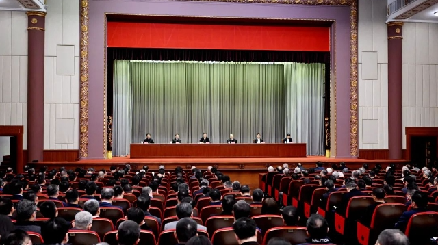
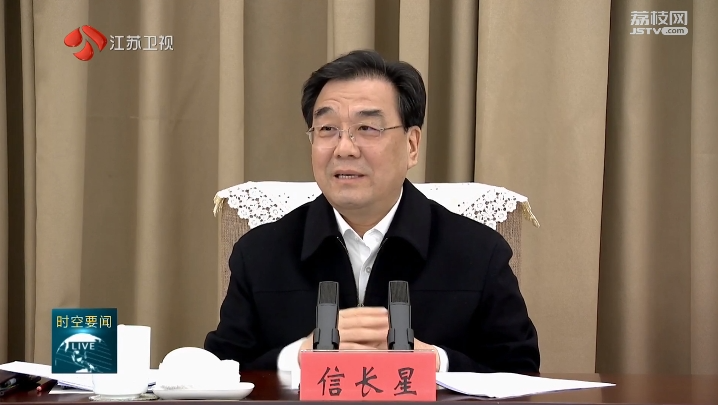
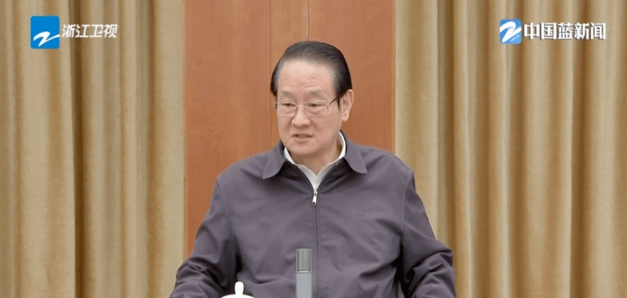
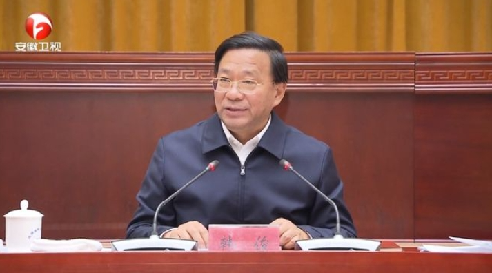

# 在沪参加重磅会议后，陈吉宁、信长星、易炼红、韩俊密集部署

**撰文丨高语阳**

11月30日，中共中央总书记、国家主席、中央军委主席习近平在上海主持召开深入推进长三角一体化发展座谈会并发表重要讲话。

国家发展改革委主任郑栅洁、上海市委书记陈吉宁、江苏省委书记信长星、浙江省委书记易炼红、安徽省委书记韩俊先后发言，就推进长三角一体化发展汇报工作情况、提出意见建议。

政知君注意到，连日来，参会的三省一市共4位省级党委“一把手”都已经召开会议部署落实相关工作。

**重大国家战略**

《人民日报》曾撰文称， **长三角一体化发展是习近平总书记亲自谋划、亲自部署、亲自推动的重大国家战略。**

**2018年11月，习近平总书记在首届中国国际进口博览会上宣布，支持长江三角洲区域一体化发展并上升为国家战略。**

**2019年12月，中共中央、国务院印发了《长江三角洲区域一体化发展规划纲要》。规划范围包括上海市、江苏省、浙江省、安徽省全域（面积35.8万平方公里）。**

《规划纲要》指出，要进一步发挥上海龙头带动作用，苏浙皖各扬所长。到2025年，长三角一体化发展取得实质性进展；到2035年，长三角一体化发展达到较高水平。

**2020年8月，在安徽合肥，习近平主持召开扎实推进长三角一体化发展座谈会。**

新华社报道称，这是长三角一体化发展上升为国家战略以来，习近平总书记首次就这一重大战略专门召开座谈会进行重要部署。

习近平在会上指出，长三角一体化发展新局面正在形成。

时隔3年多，今年11月30日，习近平在上海主持召开深入推进长三角一体化发展座谈会。

中共中央政治局常委、国务院总理李强，中共中央政治局常委、中央办公厅主任蔡奇出席座谈会。

**习近平指出，长三角一体化发展战略提出并实施5年来，长三角区域整体实力和综合竞争力持续位居全国前列，为构建新发展格局、推进高水平对外开放赢得了战略主动。**

**“取得新的重大突破”**

**习近平在座谈会上要求，要推动长三角一体化发展取得新的重大突破，在中国式现代化中走在前列，更好发挥先行探路、引领示范、辐射带动作用。**

新华社发文写道，长三角地区以4%的国土面积，集聚了全国约17%的人口，创造了全国近1/4的经济总量，是经济最活跃、开放程度最高、创新能力最强的区域之一。

数据显示，今年前三季度，长三角GDP总量逾22.1万亿元，占全国GDP总量比重较2022年同期有所提升，三省一市经济增速均超过了全国平均水平。

**习近平在座谈会上指出，深入推进长三角一体化发展，率先形成更高层次改革开放新格局，对于我国构建新发展格局、推动高质量发展，意义重大。**

政知君注意到，座谈会结束后，参会的三省一市共4位省级党委“一把手”都已经召开会议部署落实相关工作。

12月2日，浙江省委书记易炼红主持召开省委常委会会议；

12月3日，上海市委书记陈吉宁主持召开市委常委会扩大会议；

12月4日，江苏省委书记信长星主持召开省委常委会扩大会议；

12月4日，安徽省委书记韩俊主持召开省委常委会会议。

另外，12月4日，上海市召开全市领导干部会议，专题动员部署相关工作。中央第五巡回指导组组长李锦斌、副组长任正晓出席会议。

在上海市全市领导干部会议上，陈吉宁指出，上海要更好发挥引领、辐射和带动作用，更好代表国家参与国际发展与合作。

“聚焦裉节难题，勇于挑最重的担子、啃最难啃的骨头，拿出更多具有突破性的创新举措，形成更多实打实的发展成果。”

**“一盘棋上落子布局”**

**习近平在座谈会上还指出，同时也要看到，长三角一体化发展有许多深层次问题有待进一步破解，发展质量效率和辐射带动作用仍需提升，重点领域、重点区域一体化尚需努力，产业链供应链分工协作水平有待提升，建立全国统一大市场的龙头带动作用有待进一步发挥，改革开放还需进一步向纵深拓展，超大特大城市治理和发展还有不少短板。**

**“推进长三角一体化发展是一篇大文章，要坚持稳中求进，一任接着一任干，不断谱写长三角一体化发展新篇章。”**

政知君注意到，4省市在本省市召开的会议上都在强化“协同协作”方面作了重点部署。

上海市委书记陈吉宁在上海市全市领导干部会议上表示，要紧扣一体化和高质量两个关键词，强化主动担当、强化对标意识、强化制度创新、强化协同攻关，更好以一体化助力现代化。

“要推动完善一体化发展的体制机制，更好激发长三角高质量发展的市场化内生动力。”

江苏省委书记信长星在部署工作时指出，要在强化协同上下功夫，把“自己的事”“我们的事”“大家的事”统筹起来考虑，一盘棋上落子布局，主动贡献长板、加快补齐短板。

同时，要在完善机制上下功夫，加大体制机制创新力度，提高政策制定统一性、规则一致性、执行协同性。

 _资料图_

浙江省委书记易炼红在省委常委会会议上说，要提高政策制定统一性、规则一致性、执行协同性，大力实施自贸试验区提升战略，引导产业链合理有序跨境布局；推进公共服务制度衔接、政策协同、标准趋同。

 _资料图_

安徽省委书记韩俊在省委常委会会议上要求，要全面推进高层次协同开放，分类推进各领域公共服务便利共享，循序渐进推进基本公共服务制度衔接、政策协同、标准趋同。

**资料｜上海发布 浙江日报 新华日报 安徽日报 新华社 央视**

**【版权声明】本文著作权归政知新媒体独家所有，未经授权，不得转载。**

