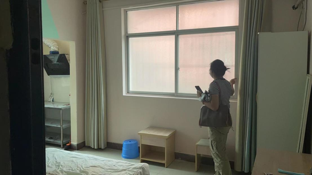
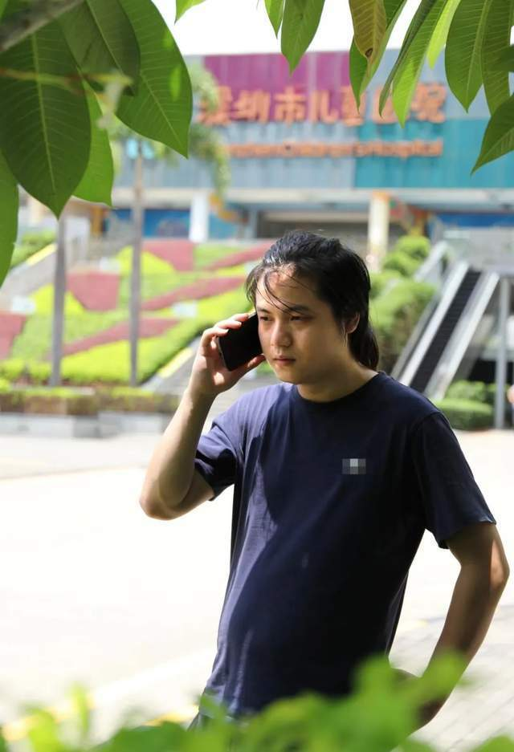
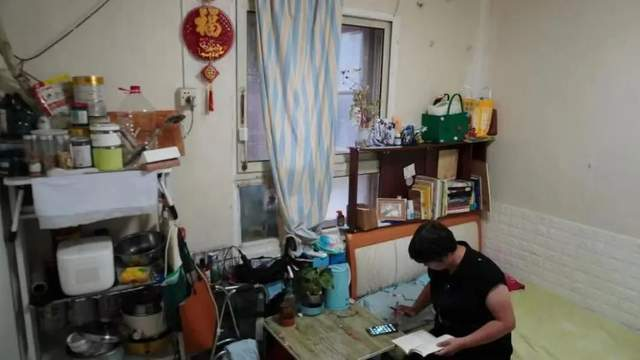
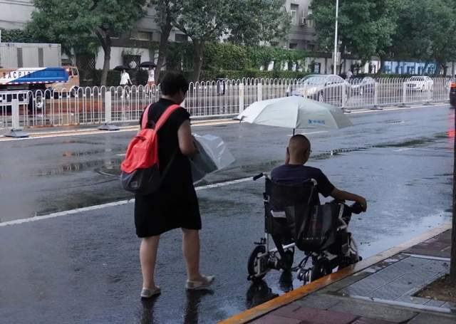

# 戴着公益的面具挣大钱？真实的大病筹款顾问究竟是什么样的

作为新兴的互联网救助渠道，第三方大病筹款平台自诞生之日起就备受争议。

一方面，它为身患重疾的弱势群体打通了一个高效便捷的募捐渠道。国内首份《个人大病求助互联网平台研究报告（2022）》显示，据不完全统计，2014年9月至2021年底，累计超过500万人次的大病患者分享了800亿元的捐赠资金。

另一方面，伪造病历诈捐，违规黑中介高额抽成等事件，也常常击穿捐赠人的心理防线。

在社交媒体上，讨伐大病筹款平台的音浪，要远高于辩白和支持。4月，有媒体曝出，一位患者筹到的10000元救命钱被中介以推广费的名义抽走8000，该中介甚至表示，如果不配合，就让筹款原路退回。

作为联结患者、捐赠者和第三方平台的关键角色，筹款顾问一直处于负面舆论的漩涡中心。“扫楼”、“推广”、“抽成”，是网络上对他们工作内容的高度概括。

近日，《健闻咨询》跟三位筹款顾问聊了聊。他们有的履历光鲜，可以匹配更体面的工作；有的个性不擅营销，不会挑目标客户，甚至有些佛系；他们的收入并不算高，报酬要低于一线城市平均工资线。

站在病人与厄运缠斗的第一线，他们常被怀疑戴着公益的面具赚钱，也见证了生死以及诸多人性的灰色地带。

半个护士

早上9点，走进广西医科大学第一附属医院儿科楼后，黄妹莉就成了所有人口中的“花妈”。

“花妈，11床来新病人了，你快去看看有什么要帮忙的。”一位护士对黄妹莉说。

还没等到回话，对面病房的家长探出了头说，“花妈花妈，我们家孩子想剪个头发，你什么时间方便？”

走廊上，擦肩而过的保洁阿姨往她手里塞上一把奶糖，“拿着，给孩子吃的”。

仅凭这些场景，很难把黄妹莉和“筹款顾问”这个身份联系在一起。3年前，黄妹莉的女儿艳花确诊再生障碍性贫血（极重型），需要做骨髓移植。当时，黄妹莉和丈夫刚刚用打工攒下的钱在老家开了一家小工厂，做纽扣加工的生意。为了给女儿治病，她折价卖掉了工厂和设备，却还差着10万块的缺口。

通过医院里一名筹款顾问的帮助，黄妹莉在大病筹款平台上发起求助。令她意外的是，发起筹款第一天，几千条捐款信息涌来，10万元善款火速到位。

这件事改变了黄妹莉的生命轨迹。一年后艳花痊愈出院，她却以筹款顾问的身份在医院扎下根来。“我当时就想着我的小孩好了，我应该为医院做一点公益的事，去帮助别的患者。”

实际上，黄妹莉干的大多数事儿都和筹款没什么关系。取药、送饭、安抚家属——这些是最基本的操作。除此以外，她给做化疗的病人理过发，给生日的孩子送过长寿面，替外地来的患者找房子住。她还在医院边搭建了一间爱心小屋，供患者家属临时居住。

后来，连护士都会嘱咐新来的病人，“有事找花妈，她什么都能搞定。”

差不多时间，距离黄妹莉600多公里外的深圳市儿童医院，另一位筹款顾问余胜已经开始帮着医生查房了。

他比黄妹莉早入职一年，此前是互联网大厂的一名员工。入行后，他惊讶地发现，这份工作跟自己原本预想的不一样：几乎所有筹款顾问都能算得上半个护士。

如果单从业绩角度来说，有些群体余胜无须接触。比如经济条件好一些、达不到筹款标准的患者；或者已经发起过筹款，短期没有费用压力的。但事实上并不是这样。他和同事们，都是先让自己泡在病人群里面，日常关注和服务对方。

这和他们的工作场景有关。每天在医院泡上8个小时，接触的又都是重症患者，这类人群日常需要的帮助本身就多。他很快领悟到入职培训的第一原则——“患者第一”：筹款顾问的本质是服务，是能帮得上忙。至于需不需要筹钱，能不能筹到钱，是最后一环的事——有时候，也就水到渠成了。

_图1：黄妹莉在“爱心小屋”_

人性灰色地带

如果说有什么是筹款顾问的职场必修课，大概是厚脸皮，简单来说就是“要习惯被拒绝”。

这在外人看来有些难以理解。从患者及其家属的角度出发，发起一个筹款申请并不复杂，只需要提供相应的疾病诊断、资产证明和治疗概述，再根据综合治疗花费设定一个合理筹款目标金额，提交平台风控进行核查确认，一旦申请通过，就有机会获得救命钱。

而实际情况却是，拒绝发起筹款申请的患者和家属不在少数。

一个常见原因是家属的病耻感。“很多患者是有病耻感的，担心筹款会影响以后的生活。”李金瑛说。她是驻点在北大人民医院白塔寺院区的一名筹款顾问。前几天，她对接的一名骨肉瘤患者要求撤回刚刚提交的筹款申请，对方是一名20岁出头的女孩，因为害怕公开病情带来的后果，最后还是决定举债治病。

同为骨肉瘤患儿的母亲，李金瑛理解这种顾虑。她是甘肃人，儿子刚上初中，今年6月确诊的骨肉瘤。在借遍亲戚朋友后，她选择发起筹款，目前已经筹得款项近40万。

“骨肉瘤患者都是要做化疗的，对未来的生育能力会有些影响。担心结婚对象会介意，这也是很多年轻患者的顾虑。”李金瑛说，每次碰到这种患者，她都会尊重对方的选择。如果他们一直来医院，她就知道这家人还扛得住。如果他们不来了，她也不会再多打扰。她从不为了业绩游说谁。在她看来，筹不筹钱，以何种方式筹钱都是自由选择，谁也没有资格评判谁。

只有一种情况，筹款顾问会尽力促成——患者有意愿，但家属不同意。这种情况常见于老年患者。一个具体的场景是，老人希望能够延续治疗，留住生存的希望，但子女——一般是多个子女，既不愿意出钱，又不想被这种事搞没了面子。

因为这份工作，余胜常能见到真实人性的复杂地带。曾经有一个故事让他尤其难忘：这家人一共两个兄弟，兄长出了车祸，在重症监护室抢救。他试图向患者的爱人介绍筹款流程，却被对方的弟弟和其他亲戚拦在了五米开外。

“他们知道筹款是有用的，但就是污蔑我是骗子，其实是用这种方式赶我走。”余胜不甘心，偷偷给患者爱人留了名片，最后还是成功发起了筹款，共筹到了8万多元。至于患者兄弟为何拒绝帮助，以及背后的家庭故事，他无法知晓。

 _图2：余胜在打电话联系病人_

代价的承受者

今年9月的一天，李金瑛突然发现自己被移出了北大医院的骨肉瘤患者群。

这是一个近400人的大群，里面汇集了来自全国各地到北京求诊的骨肉瘤患者。在这里，李金瑛能够及时掌握患者的病情进展，甄别需要筹款的对象。“他（群主）的理由就是，你不能赚病友的钱。”

这是近年来大病筹款平台遭遇负面舆论后的一个缩影——不管是多次审核不严的诈捐案例，还是中介抽成传言，这些刺痛公众敏感神经的事件，无论问题出在哪一环，其代价最终都会转嫁到第一线的筹款顾问身上。

事实上，筹款顾问的真实收入比大众想象的要低。据《健闻咨询》了解，一名正规平台的筹款顾问，月收入分为两部分：底薪和筹款奖金。以其中一名顾问为例，底薪在4000元左右，筹款奖金和当月发起的有效筹款数量有关：比较理想的情况是在2000元上下。最后扣除五险一金，到手5000多元。

特别重要的一点是：奖金部分和筹款数额没有必然关联，不存在按比例抽成。

余胜告诉《健闻咨询》，入行三年，他对这类事件已经见怪不怪了。第三方筹款是一个新兴事物，公司治理和行业规范都还在不断完善中，再加上和钱款直接相关，所以很容易被不法分子盯上。

尽管外界的声音存在偏颇，但余胜很少为此伤心。在他看来，要保持心态的平稳，关键原因还是病友的支持：每次有负面新闻出来，那些熟悉的病友很少对他避而远之，反而是主动关心。“他们会问，你们又得罪谁了？”

他曾经在自己的病区里见识过这些“违规黑中介”的手段：这些人不敢露面，都是电话沟通。要到患者的信息资料后，他们会做一个假的筹款链接让患者转发，然后进入黑箱运作。

有一次，当着患者的面，余胜和几个同事往里捐了100块钱，但最后页面上显示的数字只增加了30。“这样的黑中介，我能给你报100个出来，你打死这个，又会出来那个。”

一个不可否认的事实是，只要这些漏洞依然存在，公众的负面情绪就会传导给整个行业，筹款顾问的境况也会更加艰难。李金瑛说，当收入和尊严都无法从工作中获得兑付时，多数人会选择离开。

_图3：李金瑛在出租屋里整理病人材料_

跟厄运斗争的意志力

职业生涯中，绝大多数筹款顾问都被病人怀疑过目的不纯。留下来的人必须有耐心，搭建信任需要时间——就像本文前面所言，时间久了，他们慢慢地就成了“半个护士”。

做跟重疾相关的行业，心最好大一些。李金英想起一个细节，一位来自四川的病友带着孩子来北京治病。当天，小坤化疗住院，李金瑛买了西瓜，邀请她们到自己的出租屋过夜。出发前，一家人半信半疑，担心被骗。住进来当夜，虚弱的小女孩，躺在床上拉着母亲衣角，用稚嫩的四川话说，“妈妈，没有被骗。”

这事还需要真诚，这既没有想象中常见，也没有那么稀缺。具体来说，每个人维持真诚的动力都不太一样。

比如，对余胜来说，见多了生死面前的无力，反而多了一层助人的意愿。

2020年他刚入职时，被派到惠州一家医院驻点。到医院的第一天，正当他茫然四顾时，一位开朗健谈的大哥主动和他搭话，大哥得的是什么病已经忘了，只记得大哥有筹款意愿，也符合条件，他们约定第二天碰面汇总资料。可第二天当余胜赶到医院时，大哥的床铺已经空了，护士告诉他，大哥是在凌晨去世的，走得很突然。

几乎每个筹款顾问都有过这样的遗憾。很多正规筹款平台都有针对一线顾问的心理疏导服务。“说白了，其实也没有太好的办法。只能安慰自己，正因为有那么多人间疾苦，才更需要我们的帮助。”余胜说。

而李金瑛和黄妹莉一样，动力来源都是因为自己的孩子被救过。有34位同事的动力跟她一样。她们最在乎的是这事带来的价值感。跟病人、家属、医生和护士一样，他们知道跟厄运打交道究竟是怎么一回事。

可以说，因为自身经历的缘故，他们没有失去跟厄运不懈斗争的意志力，而是更加不愿轻易败下阵。反过来，这也能安慰到她们自己。

李金瑛讲起一个小故事。

一个偏远农村的孩子被查出得了白血病，家里人带他去城里求医，得到的答案是，有可能治好，但花费很高，一个对他们来说的天文数字。

这户人家还有另一个儿子，年龄稍小一些。全家人商量后决定，把哥哥带回村里。

他们不想冒险，不想人财两空，更重要的是，他们还可以把希望寄托在另一个孩子身上。

那天晚上，月亮特别亮，这家的大人们坐在屋外乘凉，生病的孩子因为难受，脱光了衣服，赤条条地躺在屋里的窗台上，月光洒在他身上，又白又亮。他和弟弟说，他要死了。这是他这辈子说的最后一句话。

“你问我为什么干这行，我只是不想再听见这样的坏事了。”李金瑛说。目前，李金瑛的孩子，也仍在治疗中。

_图4：李金瑛和儿子走在雨中_

撰稿｜毛晓琼

责编｜钟文

