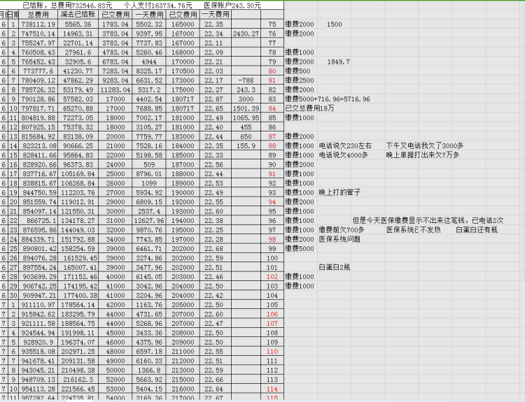
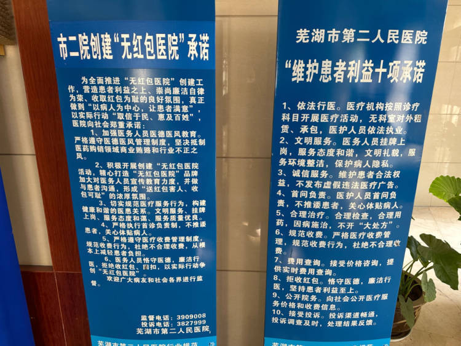
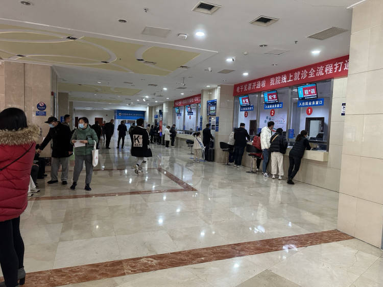
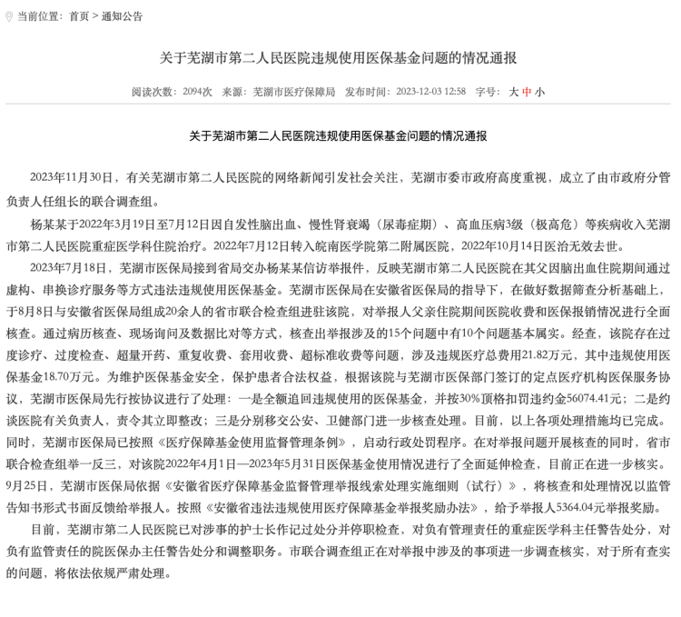

# 旋涡中的安徽芜湖二院：超收21万医疗费事件后，扩大核查缴费明细年限

安徽省芜湖市第二人民医院（以下简称芜湖二院）第一住院部的大厅内放置着一个易拉宝，上面印有“合理治疗不开大处方”“严格医疗收费管理，杜绝不合理收费” ……

但这个易拉宝并没有引起患者及家属的注意，他们讨论的焦点集中在了医院超收医疗费21万元的事情。

12月4日和5日，上游新闻（报料邮箱：cnshangyou@163.com）记者在芜湖二院看到，有患者和家属在咨询台询问如何核查过往住院缴费明细的情况，也有刚刚办完出院手续的患者家属在仔细核查每一笔支出。

_12月5日的安徽芜湖市第二人民医院。上游新闻记者 时婷婷 摄_

**当会计的姑妈发现“门槛费”端倪**

住院117天，使用138支胰岛素；血透监测时间是连续性血液净化时间的1.6倍多……看着打印出来的缴费和用药明细，杨先生一家感到疑惑，在和医院的交涉、维权中，医院违规诊疗、套取医保资金的行为逐渐被梳理清晰。

杨先生的姑妈告诉上游新闻记者，杨先生的父亲生前是糖尿病、糖尿病肾病尿毒症期患者，需要定期注射胰岛素和透析。2022年3月19日，杨先生的父亲因突发左侧肌体无力伴意识障碍，被紧急送往芜湖二院入院治疗。“住院117天，经历了3次开颅手术，期间一直住在ICU重症监护病房，而且大部分时间处于昏迷状态，我们家人无法陪护，只能早晨和晚上到医院询问当天情况。”杨先生的姑妈说。

医院可能违规收费是杨先生的姑妈杨女士发现的。“我是会计，有记账的习惯，最初只是想给家人列个明细，知道钱花在哪里。后来我注意到几乎护士每天都打电话说我们欠费，有一次上午交了费下午就说我们欠费。还和我们说医保报销到了一定费用就不能运转了，要不自己先垫付，要不就人不出院但要到窗口再办理一次出入院手续。可我到医保局的窗口问过，从没有医保报销金额封顶的说法。”杨女士说，在此后一段时间，医院的催费电话内容她也会随手记下，并在“门槛费”上发现了问题。“2022年7月1日，我和家人还看到一位黄姓患者的儿子在和ICU病房的护士争论多收了钱，后来还给退了。”杨女士称，这件事也让她有了警觉。

在杨女士整理的结算清单中上游新闻记者看到，出现多次“实际支付起付线900元”字样。对此，江苏某三甲医院医生解释，900元是医保住院报销的起付线最低标准，也就是俗称的“门槛费”，一般办理住院时都会先预先划扣这部分费用，但住院期间只允许划扣一次。“重症监护病区的病人没有康复，频繁办理出入院明显是不合理的。”该医生说。

_患者家属梳理的缴费情况。受访者供图_

以此为线索，杨女士一家梳理了住院117天的收费条目和用药情况。“医院公众号上住院一日清里有每天的收费清单，有时我看到里面有透析的项目就会问护士当天是否做了透析，有几次护士说没做但我们交了费用。同时，还发现了住院117天开了138支胰岛素注射剂等问题。”杨女士说，138支平均下来每天要用1.18支胰岛素，芜湖二院的胰岛素一支是400个单位，而杨先生父亲平时在家一天最多用48个单位，即便按照一天1支的量，也超开了21支。还有一次医院打出了一张近日结算7万元的单子，拿到后护士长以金额不对为由撕毁了。

转院后，杨女士对比发现，芜湖二院与其它医院相比一个月类似的诊疗项目花掉的费用差别也很大。于是，根据发票、明细单等信息，杨先生利用统计软件分析了每个项目的变化趋势，重点关注上升快、波动大的时段和项目后发现，血透和抗生素等也都有明显异常。

“《费用明细清单》上显示血透监测的总时间是697.5小时，而连续性血液净化时间为433小时，只有做血液净化时才需要做血透监测。我爸爸的血透监测时间竟然是连续性血液净化时间的1.6倍之多，多出的费用为10580元。”杨先生说，他还发现其父亲在住院期间接受过运动疗法，而在《病程记录》《长期医嘱单》《临时医嘱单》《护理记录》等病历资料上从未记载甚至提及康复项目。

_12月5日，芜湖二院住院部的“维护患者利益十项承诺”。上游新闻记者 时婷婷 摄_

**多次举报后查清多收21万元**

杨女士说，经统计，治疗117天医保结算75.9万元，患者自费21.9万元。预估出多收取的费用后，他们从2022年8月起，先后与芜湖二院进行了3次交涉，医院表示组织了自查，最终结果是否认用药和结算清单上有出入。

2023年7月，杨先生一家向国家医保局举报。9月25日，芜湖市医疗保障基金监管事务中心向其送达《芜湖市医疗保障局基金监管线索处理结果告知书》，明确“医保部门追回186914.7元医保基金”，同时要求芜湖二院退还31287.29元患者自付费用，但并未对涉事人员进行处理。

11月30日，杨先生将此事通过媒体曝光引发关注后，12月3日，芜湖市医保局在《关于芜湖市第二人民医院违规使用医保基金问题的情况通报》中对此事的调查和处理情况予以公布。其中提到，芜湖市医保局在安徽省医保局的指导下，在做好数据筛查分析基础上，于8月8日与安徽省医保局组成20余人的省市联合检查组进驻该院，对举报人父亲住院期间医院收费和医保报销情况进行全面核查。通过病历核查、现场询问及数据比对等方式，核查出举报涉及的15个问题中有10个问题基本属实。经查，该院存在过度诊疗、过度检查、超量开药、重复收费、套用收费、超标准收费等问题，涉及违规医疗总费用21.82万元，其中违规使用医保基金18.70万元。

 _12月5日，住院部工作人员称缴费窗口可以打印近年来入院明细。上游新闻记者 时婷婷 摄_

根据该院与芜湖市医保部门签订的定点医疗机构医保服务协议，芜湖市医保局先行按协议进行了处理：一是全额追回违规使用的医保基金，并按30%顶格扣罚违约金56074.41元；二是约谈医院有关负责人，责令其立即整改；三是分别移交公安、卫健部门进一步核查处理。目前，以上各项处理措施均已完成。同时，芜湖市医保局已按照《医疗保障基金使用监督管理条例》，启动行政处罚程序。并对该院2022年4月1日—2023年5月31日医保基金使用情况进行了全面延伸检查，目前正在进一步核实。

通报中提到，目前，芜湖市第二人民医院已对涉事的护士长作记过处分并停职检查，对负有管理责任的重症医学科主任警告处分，对负有监管责任的院医保办主任警告处分和调整职务。市联合调查组正在对举报中涉及的事项进一步调查核实，对于所有查实的问题，将依法依规严肃处理。

上游新闻记者了解到，该通报发布后，有关部门尚未就收费问题与家属取得联系。

_芜湖市医保局通报了该事件情况。芜湖市医保局_

**为何ICU多收费能瞒住家属？**

随着事件的发酵，芜湖二院也陷入了套用医保基金的旋涡。

12月4日、5日，上游新闻记者在芜湖二院看到，医院门诊和住院缴费区常有患者讨论医院违规收费问题。一位刚刚办理过出院手续的患者家属一边核对缴费明细一边告诉记者：“之前没有注意过，这几天看到网上的消息才特别留意了缴费的明细清单。”有家属说：“来看病的都是老百姓，没想到治病救人的地方还要坑我们救命钱。”

上游新闻记者在走访中了解到，自12月1日起，该院取消了普通门诊挂号收费。官方信息显示，12月1日—31日的“惠民月”活动期间普通门诊免挂号费（专家门诊、急诊等除外）。

有个明显的变化的是，住院窗口缴费明细打印、核查也不再仅限于当年，“近几年只要在医院住过院的，提供住院号都可以查询。”住院缴费窗口工作人员说。

在ICU重症监护病区，在等候区的患者家属们讨论最多的就是“医保基金怎么进了涉事医护人员的口袋”。

这是大众最关心的话题之一。

对此，江苏、上海多家医院相关科室负责人向上游新闻记者披露：“一般来说，ICU病区的家属比普通住院患者的家属更着急，重症监护是医院花钱最多的病区也是大家都知道的事情，因此家属大多不会仔细核对明细和缴费情况。而之所以能瞒过家属的另一个原因是ICU不允许家属进入，因此明细中的药品是否都会用到患者身上，家属无法核对。这就让个别医护人员有了可乘之机。”江苏某医院相关科室负责人说。

_重症监护病区还张贴着涉事护士长的感谢信。上游新闻记者 时婷婷 摄_

多名医院相关科室负责人表示，根据流程，医生开出医嘱后，会通过内部系统流转到收费处，患者家属缴费后，药房根据医嘱拿药出库，ICU的药一般会直接送到病区，由医护人员为患者用药。以输液管为例，有的医院系统中会设置开出一瓶注射药剂就自动添加相应的医疗器材，而在实际输液中却不会为患者频繁更换输液管，这样患者已购买的输液管就留在了病区。同样，多开出且没有用在患者身上的药品、器械也同样留在了病区。

那多出的药品和医疗器材又去了哪？“其实，开医嘱、缴费、拿药从流程上来说是合规的，患者自费和医保划扣费用也全部进入了医院财务账户，在账面和审计上是没有问题的。但医院每天的人流量大，药品和医疗器械的流通很快，特别是重症病房，因此很少会核查开药和用药的合理性。而这些多出的医疗器械和药品，有些被个别医护用在了亲朋好友看病中，有些低价卖了出去，成为其‘创收’的手段。”上海某医院相关科室负责人说。

对于芜湖二院骗取医保基金的行为，北京京本律师事务所主任连大有律师表示，根据《医疗保障基金使用监督管理条例》相关规定：定点医药机构骗取医疗保障基金支出的，由医疗保障行政部门责令退回，处骗取金额2倍以上5倍以下的罚款；责令定点医药机构暂停相关责任部门6个月以上1年以下涉及医疗保障基金使用的医药服务，直至由医疗保障经办机构解除服务协议；有执业资格的，由有关主管部门依法吊销执业资格。而其中涉事医护人员情节严重、数额较大的还将面临刑事处罚。

上游新闻记者 时婷婷

