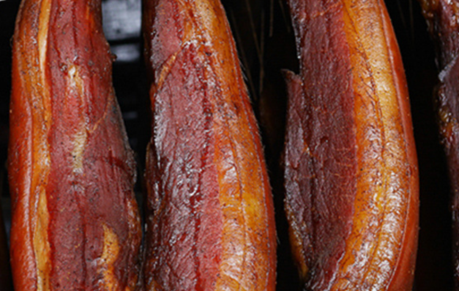
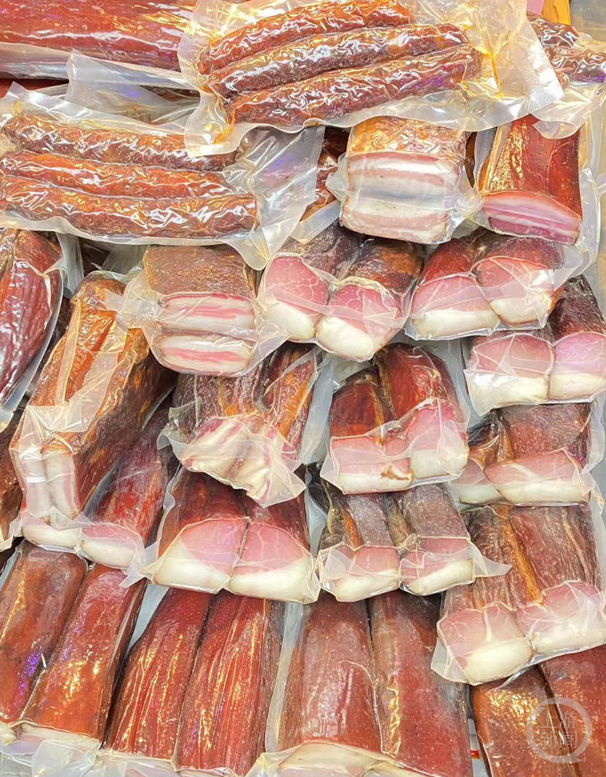
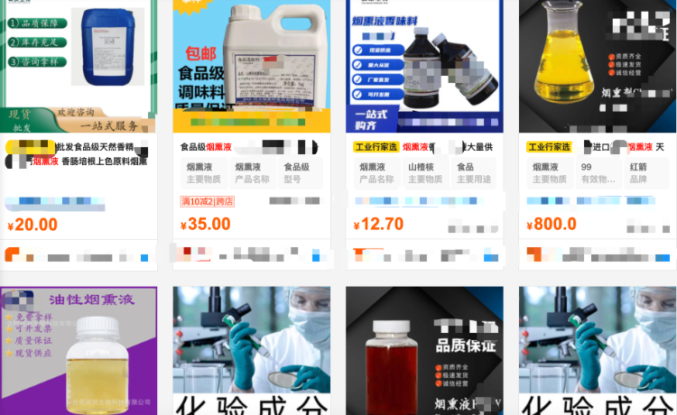

# 科技狠活还是“违背祖宗的决定”？“烟熏液腊肉香肠”上市引争议，摊贩：根本看不出来

入冬后，熏制的川味腊肉香肠又成为人们餐桌上的常见食物，这些香气扑鼻、味道浓郁的熏制肉品，让人根本没有办法拒绝。最近，四川一市民刘先生（化名）在跑供应链要为货架上一批腊肉香肠，他得到了一个此前都不知道的冷知识“烟熏液腊肉香肠”——目前市面上有腊肉和香肠加了着色烟熏液或烟熏液香精模拟出来的烟熏色和烟熏味，并不是真正的烟熏。他将自己的发现与感受发上网，引发热议和关注。

上游新闻（报料邮箱baoliaosy@163.com）记者注意到，刘先生发帖吐槽并非个案，“液熏腊肉香肠也是科技狠活”一直是网络热点话题。四川一地“禁止私自烟熏腊肉”的话题讨论也在网上热了起来。虽然传统烟熏习俗延续上千年，但随着科技发展与环保意识增强，液熏法制品逐渐进入市场，不少网友评论：“不管是什么科技狠活，跟真的烟熏比是不是还更健康点？”真相究竟如何？上游新闻记者对此进行了调查。同时，专家提醒，在购买前一定要擦亮眼睛，选择可靠品牌，不要被便宜或色泽好看所蒙蔽，谨防不法商家兜售低劣产品。

中间商：烟熏液制作腊肉香肠卖相更好

“我是准备在货架上四川的腊肉和香肠，最近跑供应链获得一个此前都不知道的冷知识。”12月3日，刘先生告诉上游新闻记者：“模拟烟熏其实就是涂抹色素来伪造烟熏色，然后用涂抹、浸泡、注射等方式加入烟熏液香精，然后通过烘烤来获得烟熏味，和真的烟熏很难分辨出来，腊肉香肠的卖相甚至会更好。”

刘先生把自己的发现发在网上，这个“烟熏与液熏腊肉香肠”的话题引发热议，“腊肉香肠也有加工标准流程”“刚买的，价格便宜，有点担心”，有网友感到疑惑：“不少烤肉都是刷一点就很香，不知道真的烟熏和科技的液熏，哪个更不健康。”

 _腊肉。网络图_

12月4日，上游新闻记者在重庆主城区一些菜市场走访看到，不少腊肉香肠都已摆上货架，一名曾姓摊主告诉记者：“香肠腊肉属于大众喜欢的川味，色泽好看，肉质紧实，闻起来有熏香味，30元一斤还是挺实惠的。”对于如何辨别烟熏还是液熏，曾姓摊主表示：“这些腊肉香肠都包装好的，看是看不出来。食品一直都检查得很严格，卖出来的都是符合市场监管要求的。”

烟熏液厂：最贵800元/公斤含200余种化学成分

上游新闻记者以“烟熏液”“液熏”为关键词，在国内最大第三方购物平台检索看到，刘先生口中的“冷知识”烟熏液并非个例，不少热销国产烟熏液售价在20元/公斤以上。这些烟熏液均以“食品添加剂”“天然香料”“品质保障”为广告标签。

12月5日，山东一烟熏液生产企业销售经理蒋女士告诉上游新闻记者：“烟熏液有国产和进口两种，国产的一般50多元/公斤，进口的最高800元/公斤。从环保要求和市场接受度出发，现在客户熏制腊肉香肠有两种工艺，要么是单纯用烟熏液加工，要么烟熏与液熏工艺相结合使用。”记者从烟熏液产品使用说明书看到使用方法有直接混合法、浸渍法、涂抹法、喷淋法、注射法。产品特点包括不含3,4苯并芘，代替传统的烟熏方法。

 _市场上售卖的香肠腊肉。上游新闻记者 冯盛雍 摄_

蒋女士强调：“烟熏液原料来自天然植物，制备过程中除去有害物质后提取的。液熏法有一点着色的功能，但是色泽偏淡，没有真正烟熏的深褐色，不过在风味上都是一样的。有些客户为了卖相好，褐色深一些，就会通过短时间烘烤来获得色泽。加工的工艺不同，烟熏液调配比例就不同。”

河南一家烟熏液生产企业销售人员还给记者发来一篇官宣网文，文章介绍了烟熏液含有200余种化学成分，有各种酚类、羰基化合物、有机酸等。其香味主要来源于酚类成分，众多的化学成分相互作用，使烟熏液的烟熏香味浓郁。

加工厂：使用哪种方法看工艺和客户接受度

上游新闻记者注意到，在烟熏液的产品宣传中，还宣传“烟熏口味浓郁”且“增进食欲”，那么腊肉香肠的加工企业是否使用烟熏液呢？

在四川经营腊肉香肠加工的王老板向上游新闻记者解释：“从产品卖相来看，烟熏与液熏法各有千秋，看厂家自己的加工工艺和用户接受度了。我们这边客户都喜欢原汁原味的烟熏腊肉，产品出厂均价20多元/斤，据我所知这边百分之八九十的加工厂都没用烟熏液。比如说，烟熏后的腊肉香肠，金黄的色泽会深一点点，我们的客户更能接受，更喜欢。相对来讲，先用液熏再用烟熏生产出来的香肠腊肉，色泽看起来没有完全烟熏出来的那么纯正，味道其实都差不多。”

_网络售卖的烟熏液。网络截图_

上游新闻记者从他展示的烟熏制品折页看到，色泽：熏好的腊肉，表里一致，煮熟切片后，透明发亮，色泽自然，黄里透红。配料：古法制作，汇聚多种香料，确保片片入味。

在成本方面，王老板算了一笔账，“菜市场一般香肠腊肉30元/斤，出厂均价20多元/斤，香肠腊肉的利润还是可以的，至于用什么样的制作工艺，只要消费者认可就行。”

食品专家：选择有信誉和良好口碑的品牌

以食品安全为标准，香肠腊肉是液熏的好，还是烟熏的好呢？食品科学博士、西南大学食品科学学院教师陈嘉告诉上游新闻记者：“从烟熏液厂家的产品检验检测报告看，液熏法又称为湿熏法或无烟熏法，它是利用烟熏材料干馏生成的烟气成分采用一定方法液化或者再加工形成的烟熏液，浸泡食品或喷涂食品表面，以代替传统的烟熏方法。工厂的生产设备通常具备良好的温度和湿度控制功能，能更精确地控制温度和湿度，更好地保持食材的营养成分和口感。而传统的烟熏过程中，如果控制不当，往往会使食材过度熏烤、过度干燥，导致营养价值的流失和口感的变差。”

陈老师强调：“土法烟熏，发烟燃料里面有可能混入塑料或其他有害废物，而且不容易控制燃烧发烟条件，可能会产生更多有害物质，如苯并芘、多环芳烃等。而液熏法的烟熏液都是工厂生产，有更严格的条件控制和质量检测；液熏法生产腊肉香肠的过程没有明火或燃烧，因此没有燃烧产生的有害化学物质和烟雾，相比土法烟熏更安全。但是，相对于传统的烟熏可能会导致一些味道和色泽上的差异。这是因为液熏法与传统烟熏相比，无燃烧炙烤过程，无法产生传统烟熏特有的烟雾和燃烧产物带来的味道和色泽。”

在如何正确选用腊肉香肠方面，陈老师提醒消费者：“在购买前一定要擦亮眼睛，不要被便宜或色泽好看所蒙蔽，谨防不法商家兜售低劣产品。首先，选择可靠品牌，选择有信誉和良好口碑的品牌，这些品牌通常对产品质量和安全性有更高的标准和控制。其次，选择在正规渠道、商店或超市购买，避免购买来路不明或没有相关检验合格标签的产品。第三，适量购买，确保在保质期内能吃完，避免过期和浪费。第四，妥善保存，在吃之前彻底加热。”

上游新闻记者 冯盛雍

