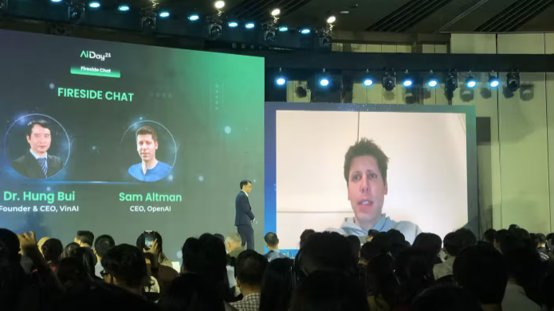

# OpenAI CEO奥特曼：董事会正在重新思考公司结构

腾讯科技讯 12月6日消息，据外媒报道，周三在越南参加人工智能活动时，人工智能研究公司OpenAI首席执行官山姆·奥特曼（Sam
Altman）表示，他正在考虑改变公司的治理结构，以修复“漏洞”。

几周前，奥特曼突然被OpenAI董事会解雇，后来重新复职。周三是该公司人事剧变以来，奥特曼首次公开露面。他告诉观众，他对自己被解职感到“震惊”，但拒绝回答有关OpenAI秘密人工智能项目的问题。据报道，该项目与董事会决定解雇他有关。

OpenAI最初是一家非营利机构，目前仍通过董事会进行管理，但它后来增加了一家营利性子公司，以帮助筹集巨额资金，其中包括来自微软的数十亿美元投资。

周三，奥特曼在Vingroup旗下公司VinAI的会议上通过视频表示：“目前的公司治理结构显然存在一些问题，我们的新董事会正在认真考虑最适合我们使命的公司结构。”

OpenAI董事会对解雇奥特曼的决定几乎没有做出任何解释，这引发了各种各样的猜测。据报道，在解雇奥特曼前几天，该公司的研究人员警告称，“一项强大的人工智能发现可能会威胁到人类”，也是此次解雇背后引发的“诸多不满之一”。

据报道，这一“发现”是个名为Q*的神秘项目。VinAI首席执行官Hung Bui问奥特曼是否可以给出更详细的说明。但他只给出了简单回答：“显然不能。”

在几乎所有OpenAI员工和投资者的强烈抗议下，奥特曼在被解职几天后，在新董事会的领导下复职。

这并不是奥特曼第一次与OpenAI同事就人工智能伦理问题发生争执。此前，联合创始人埃隆·马斯克（Elon
Musk）曾因此退出董事会，还有多位员工辞职组建了OpenAI的竞争对手Anthropic。技术专家之间已经形成了不同阵线，他们对通用人工智能的开发速度有多快，以及这项技术会有多大危险持不同意见。

奥特曼说，OpenAI经历了一个“疯狂”的时期，包括从非营利组织向部分营利组织的转变。他说：“我希望大家能有一点耐心，因为公司正在经历这种不自然的快速增长，这对我们来说非常困难，也非常痛苦。”

VinAI已经开发了名为PhoGPT的聊天机器人，使其成为为越南有能力训练大语言模型的少数公司之一。Vingroup公司还为电动汽车公司VinFast和其他子公司研究人工智能技术。

奥特曼表示，OpenAI将发布更多的开源模型，包括面向发展中国家的模型，以缩小与富裕国家的差距。（编译/金鹿）

