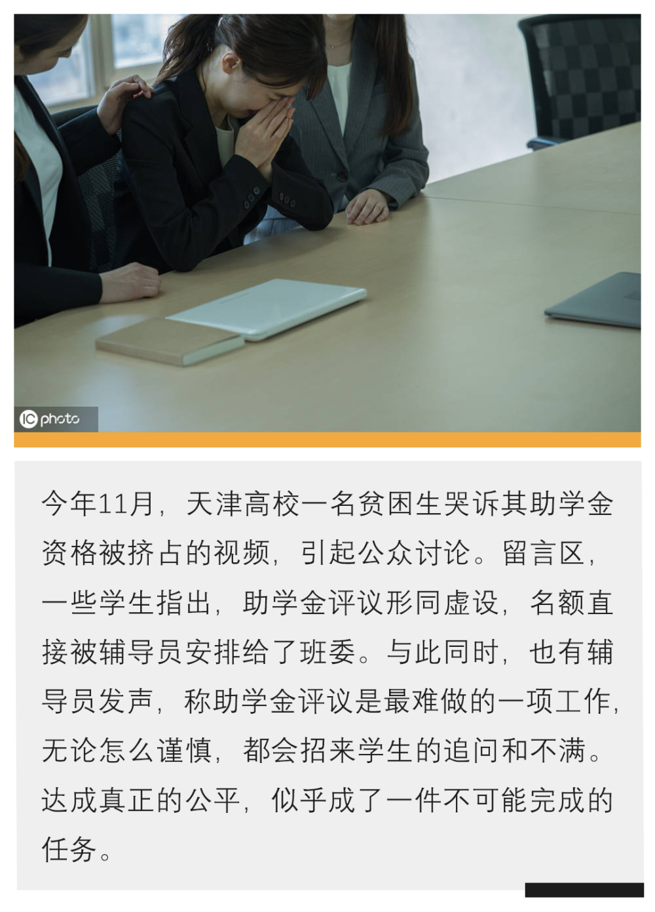
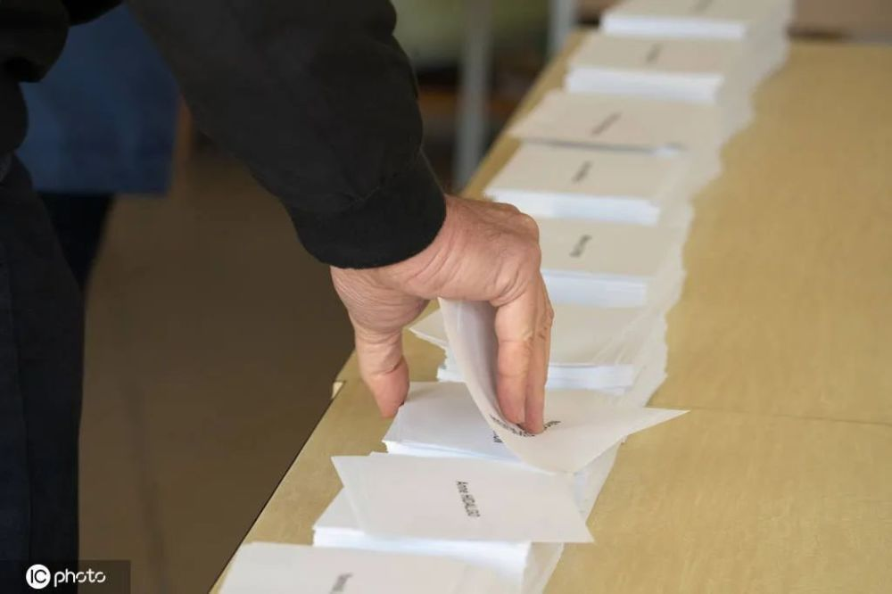
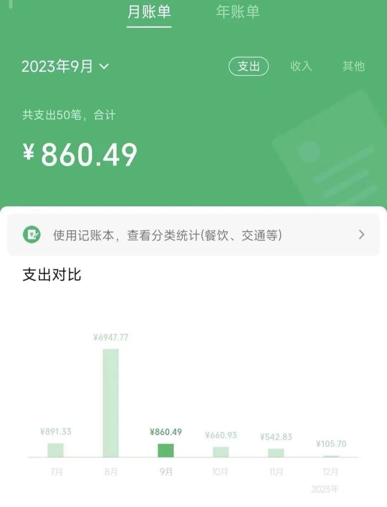
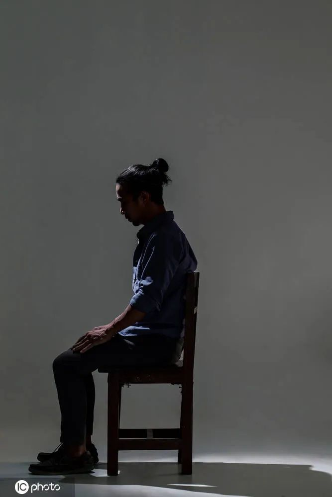

# “不把助学金发给‘有身份的贫困生’，就会被调查”

**文|** 吕煦宬

**编辑|** 陶若谷

**民主评议‍‍‍‍**

每年9月至10月，是刘洋最头疼的日子。身为北方一所二本院校的辅导员，他要在这个时段完成一年一度的助学金评选。班上，每年都有二十多名学生递交申请，角逐六个助学金名额。

助学金落到谁家，关键在民主评议。按照学校下发的助学金评议文件规定，刘洋要在班里挑选学生，组成评议小组，让学生根据申请者递交的材料投票，选出他们心目中认定的，最需要助学金的同学。

但文件没有告诉刘洋的是，要怎么组织民主评议，才能尽可能避免人情世故的干扰，保障公平。

2021年，工作第一年的刘洋选定了班干部和各宿舍长，组成评议小组。傍晚，把他们叫到办公室，发评议材料。匿名助学金申请者的家庭年收入、家里是否有重大疾病患者等信息，都在里面。看完资料，大家在纸上写下三位申请者的名字，匿名投票。最后，刘洋统计票数。依照票数排名，决定助学金的归属。

上大学时，刘洋当过班长，自认能客观投票给最需要助学金的学生。换位思考，他相信现在的学生也能。获选学生名单公示后，没人提出异议，他长舒一口气。

第二年，刘洋沿用班委做评议小组成员，情况却发生了改变。评议过程变得草率，不到十分钟，就结束了投票。结果令他感到讶异：三个班委占了助学金名额的一半。

追究原因，刘洋想，或许是一年相处下来，同学之间产生了更多联结，很难像第一年那样，刨除私情，根据材料，公正投票。刘洋不是没有想过，人情往来会影响评议，“但没想到会这么夸张”。

设立民主评议之初，是为了保障助学金公平发放。自2007年开始，我国财务部、教育部发布多个助学文件，规定大学生家庭经济是否困难、是否有获得助学金的资格，须经学校成立评议小组评定。一些研究助学金资助流程的论文指出，政策初衷，是希望通过同学日常和申请者的接触，了解其生活、消费的真实情况，也是为了评议在学生监督下推进，避免出现辅导员一言堂。

但在实践中，由于没有清晰的细则，多位大学辅导员称，他们只能在实操中一点点摸索、试错，民主评议很容易演变成一种“拼人缘”的竞技，失去了最初的意义。

天津助学金事件后，一名河北学生发帖称，判定贫困等级由班长一人说了算，评议小组被架空。在他的班级里，一位出身贫困户家庭的女孩理应拿到一档助学金，班长却因为和女孩的私人恩怨，把她判定为“一般贫困”，女孩只拿到了二档助学金。

_●资料图，源自东方IC_

在四川，大四女生郑薇薇也在不透明的民主评议中，错失了助学金。公示后，郑薇薇没能找到自己的名字。她找辅导员提出异议，想补充提交一份家里的低保证明。辅导员嘴上答应了，会再组织一次民主评议。

等了一两天，没有动静。郑薇薇给负责小组评议的生活委员发消息、打电话，没有回音。再找辅导员，辅导员没了耐心，在电话那头直接骂了郑薇薇，说她给自己找麻烦，“老是搞特殊”。

辅导员的态度打消了郑薇薇继续争取的念头。她猜测，大四这一年，班委们都在忙着考研、求职，平时开班级例会都见不着人影，更别谈费心思为一个同学重新组织评议，辅导员手下也有几百号学生要管，不会特意为自己争取。

郑薇薇家在农村，父亲在建筑工地打零工，工资不稳定，常年在讨薪。母亲在超市工作，月入2000元。家里除了她和正在上高中的妹妹，还有一个瘫痪在床的奶奶，五口人全靠父母打工养活。

身为长女，郑薇薇上大学后，很难开口问家里要生活费。助学金是她的指望：3000元足够覆盖三个多月的生活开销。今年没拿到，她只好在上课之余，在校外辅导机构当美术老师，拿一节课100元的工资，赚生活费。

失去助学金后，郑薇薇才意识到，从大一开始，她从来都不知道班里民主评议是谁在参加，评议流程是什么，评分标准又是什么……这些本该透明的规则成了少数人才掌握的内幕。站在模糊规则的外围，像郑薇薇一样的助学金申请者们处境被动。

而在规则内部，辅导员刘洋在尝试做出改变，把民主评议的细则描摹得尽量清晰一些。

担心班委占一半名额会招来不满，刘洋撤销了那次评议结果。他不再任用班委，而是随机抽10位同学重新评议。

再次投票前，刘洋嘱咐，要降低人情因素，尽量基于平时对申请者的消费和生活了解投票。最后，一名经济情况更窘迫的学生代替了最初入选的班委，得到助学金。在那之后，刘洋沿用了随机抽选的方法，也会公示小组成员名单，以便监督。评议结束后，刘洋会专门拿出票数居高者的助学金申请信，比对评议结果和学生家境是否吻合。

不过，无论如何优化流程，仍会参杂不可控的人情影响。闲谈中，一位同事和刘洋提起，班里有一位家境贫寒的学生，过冬的衣服都买不起，但他性格内向，不太和班里的人来往。或许出于自卑，他也从未向别人吐露过自己遇到的困难。

这样的同学在民主评议中往往不占优势。出身农村，和城市里的孩子没什么共同话题的贫困生不在少数，互联网上不难找到他们的发帖。“况且，交朋友也是一笔不小的开销。”一位在辽宁读书的农村学生留言称，出门逛街、吃饭，她的钱包禁不起这样的折腾。

刘洋总结出民主评议的规律：在客观材料相差不大的情况下，民主评议成员通常会倾向熟悉的同学一边。最后，学校里那位性格内向的贫困生没拿到助学金，他的同事看不下去，自掏腰包给学生买了一件棉衣。

**三张残疾证 vs 打零工的父母**

低保证、残疾证等材料在助学金申请中拥有沉甸甸的分量。通常，辅导员们没有机会亲自调查学生的家庭情况，因此，经过认定的客观材料被看作是衡量贫困程度的重要指标。

2021年大学毕业后，刘洋来到这所北方二本院校做辅导员。有不少来自农村的学生，光是在刘洋当班主任的50人班级里，就有13个符合国家七类贫困生标准的学生，有的来自低保家庭，有的是孤儿。

刘洋把这类学生称为“有身份的贫困生”——他们经过相关部门层层审核，确认过家境，学校会保障这类学生只要申请、不必经过民主评议就能获得3300元一年的二等助学金。除了这部分学生，其他人都要通过递交申请信，陈述家庭状况，以此为依据，申请助学金。

刘洋发现，表达能力强的学生，能把申请信写得很动人，“让人看了就觉得可怜”。而那些仅仅在申请信里客观罗列家里几口人、收入有多少的学生，会很吃亏。

学校没有硬性规定，要求学生上交佐证家境的材料。因此，刘洋也没法核实学生们的情况孰真孰假。为了剔除人为因素干扰，他会把申请信里的关键词，“单亲家庭”“家人重病”等信息手动摘出来，汇总在一张纸上，供投票学生参考。

刘洋羡慕南方一些高校有更明确的量化标准和体系。他听说，广东一些高校有评议助学金专用的平台。上传学生资料后，系统能自动评判学生的贫困等级，略过人为评判的过程。

还有一些学校把学生日常的消费习惯也纳入考量标准。《澎湃新闻》报道，2016年，南京理工大学通过追踪学生在食堂的消费次数，将那些每月在食堂吃饭超过60顿，总消费不超过420元的学生，列为助学金的资助对象。

在西北一所公办院校担任辅导员的郭晓琪，为了“量化贫困”费了不少心思。他在知网浏览有关困难认定的论文，搜集了一些学术上用来评定困难等级的指标，如是否来自农村，是否是独生子女，家里是否遭遇突发困难等。

他把这些指标罗列成一张“贫困量化表”，打印出来，根据情况打分。如果学生来自农村家庭，又有兄弟姐妹，他的得分就会比来自城镇的独生子女要高，拿到助学金机率更大。

但现实远比“量化表”来得复杂。郭晓琪发现，有学生家里虽然没有经历突发事故打击，但家人患慢性病，长期服药，开支积少成多。很难比较他与家里突发变故的学生，谁更需要帮助。

错综复杂的家境，也并非一两张纸质材料能够说明。在江西学生白菁的家庭，做纱窗生意失败后，白菁父亲去工地打工，工资一年才结一次。母亲到附近的服装厂上班，清晨五六点出门，凌晨回到宿舍，周而复始，一个月最多挣3000块。

白菁和弟弟的学费、治疗外婆心脏病的医药费……一笔笔开支让家里陷入经济无法周转的泥沼。大一时，因为一时半会儿掏不出6000元，白菁的学费是父亲借网贷付的。但这一切，白菁都开不出像样的证明。按照老家习俗，为外婆治病的医药费单是要被烧掉的。白菁问班长，能否提交日常的流水账单佐证，班长摆了摆手，说不行。

_●白菁的流水截图。讲述者提供_

在白菁的班里，能用来申请助学金的材料都是低保证、残疾证这样具像化的材料。今年9月底，没有任何有效证明的白菁没有拿到助学金，但在公示名单上，她发现了班长的名字。

按白菁的描述，一次晚自习，她翻看自己的微信消费记录，班长在旁边瞥到了，感慨她生活节俭，还打开自己的消费记录，月支出都有四、五千元，“班长还补充说，在支付宝还有流水。”白菁回忆，用着价值上万的苹果笔记本和手机，以班长的情况，怎么能评上助学金呢？

她提出异议。班主任没多说话，拿出了班长提交的申请材料。三张残疾证摆在眼前：他爷爷奶奶、妈妈都是残疾人，家里只有父亲一个劳动力。白菁不再申辩，嘴好像被堵住了一样，离开了办公室。

**好像有补不完的漏洞**

参与助学金评议工作两年，对27岁的年轻老师郭晓琪来说，是一个不断打补丁的过程。他讲述自己所在的学校，管理不规范，纪律松散，班主任对助学金评议并不上心，总敷衍了事。

之前，学校按班级贫困生“入库”比例分配助学金。所谓入库，指的是申请助学金的学生递交材料后被纳入到统一的数据库里，库里的学生才有资格申请。入库的学生越多，一个班能分到的助学金数目也就越多。

第一年参与评定，郭晓琪在审核中发现，有一个班几乎全班都申请入库，令他印象深刻。“怎么可能一个班四十多人，都是贫困生呢？”他把申请打回去，让班长重新核查。结果，那位班长跑到办公室质问，为什么没有全体入库？郭晓琪问他，你们一个班的同学都是贫困生吗？男生回答，不是啊，但以前不是都能全班入库，拿到更多助学金吗？

这是郭晓琪第一次意识到，之前助学金评议如此不规范。郭晓琪没有责怪学生，“毕竟他也是在为班级利益着想。”他和男孩讲道理：如果都全班入库，“入库”就失去了筛选的意义。

事后，郭晓琪找到校领导，提议直接按照班级人数比例分配助学金，不要再盲目提高入库人数，挤占助学金份额。意见得到采纳，郭晓琪成了学院里负责助学金评议的辅导员。在他的讲述中，钻空子的学生时不时就会出现。

今年，同事班上一名学生在申请书里称家人有慢性病，还附了一张桌面上堆满药物的照片。同事放大图片，看到药盒上注明的疾病，和学生声称的慢性病根本没有关联。同事找学生谈话，学生才坦言，图片是在网上下载的，家里没有人生病，他只是想试试看，这样能不能申请到助学金。

针对助学金制度做出的改良，令郭晓琪没少听到，学生在背地里埋怨他太严格的话。最初，这样的评价令他难过。他不明白，为什么自己做了这么多努力，保证公平，换来的却是责怪？内耗的情绪影响到了工作。那时，他每做一项决策、每发布一个通知，脑子里冒出的第一个念头就是：会不会有学生骂我？

但他渐渐发现，每个人都只是站在自己的利益出发点去看，很少能做到从事实出发评价他人。去年助学金评议，自己班上的班长也申请了。小组评议，班长参与了全过程，也看到了其他同学比她更困难，但她仍因为没能评上助学金，给郭晓琪打电话，抱怨到半夜。

郭晓琪意识到，就算按规则办事，也总会有既得利益者和利益受损的人，自己不可能讨来所有人的认可。

最近，郭晓琪又发现了新漏洞。按规定，只要符合国家七大类评困生类型的学生，就一定能拿到助学金。但在这些学生中，又有成绩不好、品行有问题的学生。郭晓琪班上就有一位，是孤儿，每年都能评上。但这个同学作业完成得糟糕，频繁挂科，在退学边缘徘徊。

“助学金不是烂慈善，钱还是要给到认真学习的。”郭晓琪说，但不把助学金发给这些“有身份的贫困生”，上面就会派人调查，作为辅导员，自己也会经历一个漫长繁琐的、被调查的过程，郭晓琪称之为“劫难”。

 _●资料图，源自东方ic_

为了让助学金落到真正需要帮助的学生手里，郭晓琪提出新的规则：如果“有身份的贫困生”日常表现糟糕，班主任提交说明后，可以不把助学金给这些学生。但落实起来，这项工作又存在困难。

提交说明需要班主任收集繁复的证明资料，包括学生成绩单、旷课记录或是处分单。除此之外，班主任还要提交一份申请书。有些老师嫌麻烦，索性还是把名额分给了这些同学。

找到了漏洞，打上补丁，但执行的人不配合，郭晓琪也没有办法。助学金评议的工作复杂，好像有补不完的漏洞，郭晓琪有时会希望，干脆取消助学金，推广勤工俭学制度。

在社交平台上，不少辅导员发出和郭晓琪一样的感慨，每年助学金评议后，自己都会被学生追着问，不断回答一个个“凭什么？为什么？”

做了两年辅导员，刘洋总结的经验是，要制定规则，但不参与其中，做旁观者。他从不在小组评议时投票或发表意见，只在一旁充当主持者的角色。

领导对助学金评议工作抓得紧，如果过程中出现任何问题，对辅导员的职业生涯都可能造成轻则处分，重则开除的影响。学校开会时，领导也会强调，让老师们保护好自己，不要过分干涉，更多的还是交给学生评议。

至于谁来维护真正的公平，刘洋心里没有答案，“这种事肯定保证不了绝对的公平，也不可能让所有人满意”。

**举报通道**

在这样的环境中，学生们能够最直接参与的反击就是举报。湖北女生何田逸，在去年11月，为自己讨回了公道。

按何田逸的说法，当时她评上了二等助学金，一天中午，她突然接到辅导员电话，说要去操场单独聊。何田逸感觉奇怪，告诉了比她大两岁的男友，他嘱咐何田逸，全程录音。

在操场上，辅导员带来了一个坏消息——由于操作失误，自己在上报助学金名单时，漏掉了何田逸的名字，只报了班上其他四个人，害她没能拿到助学金。何田逸心里冒出失望，但看着老师愧疚的样子，又心软了。两人分开前，辅导员嘱咐，不要声张此事，“明年我会重点考虑你”。

晚上，何田逸和男友复盘，男友觉察到“操作失误”中的一些不对劲。第二天，他登陆何田逸学校官网，发现已经公布获选名单，显示有5名学生拿到了助学金，不像辅导员说的，漏报了一个名额。原本属于何田逸的位置，被一个姓钟的同学占据。

钟同学是班里的纪律委员，平时和辅导员关系紧密，常帮老师跑腿。申请助学金时，也没有看到钟同学的名字。何田逸和男友哭诉，男友也很不满，他想到了举报。

用了一天时间，他们收集了录音、公示截图等证据，写了实名举报信，分别发到市级、省级教育局和学校的举报邮箱。不久就收到反馈，学院院长告诉何田逸，校方会把助学金名额归还给她，也承诺给辅导员处分，取消评优、评先资格。何田逸的名字重新出现在公示名单上，结束了这场风波。

很多人都知道，举报这条监督通道是好用的。媒体报道，近日，中山大学一名获得助学金的学生，因使用价值两万的“苹果全家桶”、花上千元买演唱会门票而被举报。调查后学校发声明称，该生助学金认定过程没有问题，但因其过度消费，决定终止其助学金发放。

但在实际操作中，这条通道也会被人恶意挤占。辅导员郭晓琪去年处理过一次，励志奖学金结果公示后，学院邮箱收到一封实名举报信。举报的同学给获选班长扣了许多帽子，最主要的一条，“品行不端”。郭晓琪被委任处理，向当事班的班主任了解情况。与此同时，学院还开展了一次民意调查，让班上除两位当事人以外的人投票表决，举报信中的内容是否属实。

郭晓琪说，调查结果显示，奖学金评议没有问题。班里也没有同学认为，班长的品行如举报信所说。老师们把调查结果整理成册，拿给举报的学生看。但二十多页的反馈报告没有说服这位学生，她在此之后又分别向校方、教育厅举报了两次。

郭晓琪后来从女生的班主任处得知，举报女生和班长有私怨——按照郭晓琪的说法，女孩的男友曾是班长，后来换成了被举报的那位，加上班长有一次给她旷课记过，最后，举报成了她报复的方式。

利益的混战有时会造成误伤。社交平台上，有辅导员发帖称，自己屡次被没有拿到助学金、怀有不满的学生投诉到省教育厅，一轮又一轮经受校方核查，因而萌生了辞职的念头。

郭晓琪从今年开始，不再担任原先班级的班主任了，原本在路上和自己热情打招呼的学生，再也没有主动打过招呼，“说得不好听的，现在利益不相关了，他没有必要讨好了。”

相较客观指标，郭晓琪觉得，贫困更像是一种内在的感知，“每个人都觉得自己更需要这笔助学金”。去年，班上一位女同学因为没评上助学金，半夜打电话给他，哭诉到凌晨四点。

女生告诉郭晓琪，母亲失业，家里只有父亲一个人赚钱。为什么以自己的情况，评不上助学金。郭晓琪先是一阵安抚，接着又告诉她，拿到助学金的学生，来自西北农牧家庭，家里还有患重病的老人。相比之下，这位家在安徽、家庭年收入有七八万的学生，家境不算差了。

（为保护隐私，文中人物均为化名。）

版权声明：本文所有内容著作权归属极昼工作室，未经书面许可，不得转载、摘编或以其他形式使用，另有声明除外。

