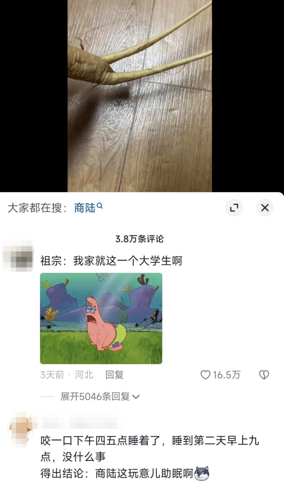
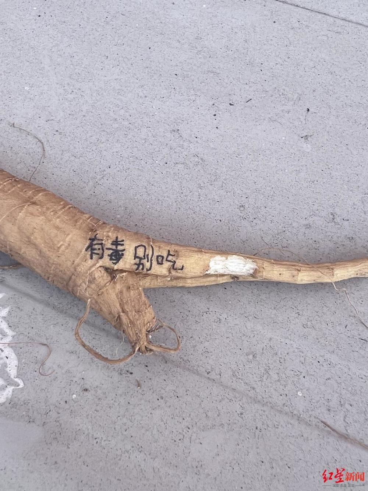
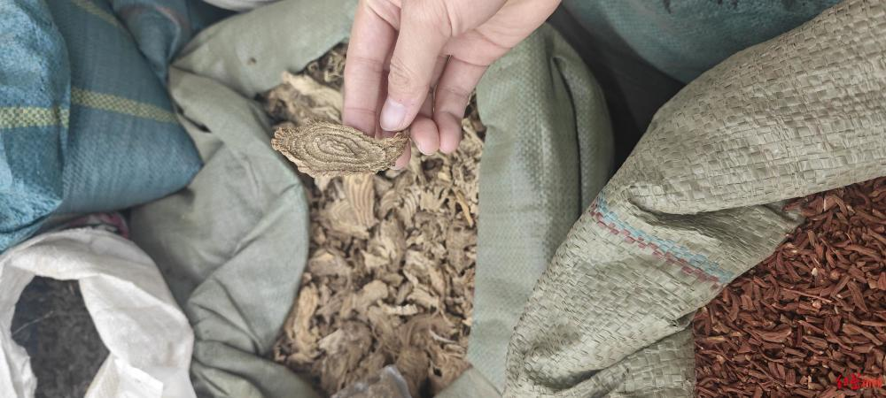

# “大学生把商陆当人参误食后睡17个小时”引热议，当事人称在韩留学 中药师：中毒反应

近日，一则大学生“错把商陆当作人参，误食后睡了17个小时的视频”在短视频平台广泛传播，引发热议。视频中，当事人表示，她以为在校园里挖到了“人参”，咬了一口后，从当天下午4点左右一直睡到第二天早上9点。有人告诉她，她吃的不是人参，而是商陆，有毒。

红星新闻记者联系上发视频的当事人小艺，她表示，自己是一名在韩留学的中国人。随后，小艺向记者提供了她所食植物的切面、根茎照片。

_▲网友的评论_

成都中医药大学附属医院药剂科主管中药师张婧在看了照片和视频后告诉红星新闻，从目前提供的根与原植物资料来看，是商陆无疑。商陆大量服用可出现中毒反应，表现为恶心呕吐、腹痛腹泻、心动过速，继则言语不清、躁动、抽搐、昏迷、心肌抑制，引起心搏受阻、血压下降、瞳孔散大，出现心肌麻痹而死亡。

“这个学生看似睡了一觉，实际是中毒反应，其实很危险的。后面醒来可能与食用量不是很大，以及毒性本身会通过人体自身进行代谢。随着身体机能逐步恢复，本人也开始清醒恢复意识。”张婧解释道。

**当事人称以为挖到“人参”，好奇心驱使下咬了一口**

小艺向红星新闻记者回忆了11月29日的事发经过，“那天是跟朋友去学校松树林里面拍照，我平常爱观察一些东西，地上有很多野菜什么的，我们拍着拍着就走神了，开始看这些东西。有一个东西长得像萝卜，我们就想着挖一下。土很松散，一扯就扯出来一个‘人参’，我们当时都觉得是人参。”

_▲小艺挖到的商陆 受访者供图_

小艺告诉红星新闻，最初还有些担心，“怕是把哪个学长的作业给拔出来了”，后来得知那片地上的植物是野生的，就以为是“人参”。

“没吃过人参，好奇心驱使我，我就咬了一口。有点涩，感觉像是生土豆。回宿舍后，我感觉特别困，很想睡觉。我之前以为是下午4点睡的，后来算了一下，可能3点那会儿就睡着了。睡得很快，沾上枕头就睡着了，衣服也没来得及换。然后早上9点，上课的闹钟响了才醒来。我起来后除了觉得有点睡不醒外，没其他什么事儿。”小艺说。

小艺表示，她在睡觉之前就把自己挖到的“人参”发在社交媒体上，睡醒之后，看到有人留言，“人参是须根，你这个是商陆，还是红茎的，就是全株都有毒。”

在看过照片和视频之后，成都中医药大学附属医院药剂科主管中药师张婧表示，从目前提供的根与原植物资料来看，是商陆无疑。商陆为商陆科商陆属植物，为多年生草本，具有肥大的肉质根，又被称为章柳根、夜呼、山萝卜、见肿消。根部可作药用。

**视频引发网友热议，中药师解读商陆毒性**

在小艺分享的短视频下面，网友们议论纷纷，“你以为睡了17个小时，实际上是昏过去了”“免疫系统都杀疯了”“这好像是神农尝的最后一种草”……

_▲小艺所食商陆切面 受访者供图_

对此，张婧表示，神农尝百草是一个传说故事，“尝百草之滋味，水泉之甘苦，令民知所避就”，相传最后一种是断肠草，不一定指某一种具体的植物，而是有毒植物的一种代称。

张婧介绍，我国药典收载商陆的来源有两种，商陆（Phytolacca acinosa Roxb.）以及垂序商陆（Phytolacca americana
L.）。商陆最早见于《神农本草经》，谓其“味辛，平，主水胀，疝瘕，痹，熨除痈肿，杀鬼精物。一名荡根，一名夜呼。生咸阳川谷。”商陆（Phytolacca
acinosa Roxb.）我国历来有之，又被称为本土商陆；垂序商陆（Phytolacca americana
L.）又称美洲商陆，原产北美，为引入栽培品种，因其环境适应性极强，繁殖力强，生长迅速，已被列入中国自然系统外来入侵物种名单，四川多地分布即为此种。

“从所提供的图片看不能确认为哪种商陆，但二者可以从花序、果序生长形态，花，心皮分离或合生，雄蕊数量，种子特征进行区别。”张婧说，两种商陆均有毒，但垂序商陆的毒性更强。在中毒的事件中多数误将商陆当作人参或野菜食用，垂序商陆（Phytolacca
americana L.）作为引种物种现在我国广泛分布，其全株有毒，主要存在于根、茎叶及果实中，如误食很容易引起中毒反应。商陆（Phytolacca
acinosa Roxb.）有作为蔬菜食用，选择株高20cm时的绿色、肥厚嫩茎采摘，过了清明节,
茎叶木质化，麻味增加就不可再食用。如不能准确地区分哪种是本土商陆，均不建议食用。

“有研究认为商陆毒素和组织胺为商陆的主要毒性成分，垂序商陆毒性明显大于商陆，商陆毒素在商陆原药材中的含量明显低于垂序商陆原药材，且垂序商陆中的毒性成分组织胺，在商陆中并未发现其的存在，这一结果也与传统商陆毒性小于垂序商陆的看法相符。”张婧说。

**误食商陆并非个例，有人错把商陆“叶”当野菜**

红星新闻此前曾报道，今年4月26日，居住在成都市温江区的一对老年夫妻，因为误食“野菜”双双中毒。而患者食用的“野菜”，经温江区疾控中心化验，证实为商陆。

人民网曾报道，有些不法商贩会用商陆来冒充人参，如果服用，其中含有的商陆碱和商陆毒素可让人出现喉咙痒、腹泻、头痛、语言不清、肌肉抽搐等中毒症状。

对此，张婧表示，以前可能会存在“不良商家将商陆充当人参售卖”这种情况，但是现在很少有这种情况发生。“首先商陆是有毒的，食用后出现中毒反应，甚至导致死亡，是要承担相应法律责任的。从近年的相关报道来看，更多的是个人采挖，由于缺乏植物学和药物学知识，误将商陆根当作人参食用。商陆根的形状有点类似人参，但它有一个很明显的特征，断面是有一圈一圈同心性环纹，中药鉴定上称为罗盘纹，味道初尝时微甜，久嚼有麻舌感。”

12月5日，红星新闻记者走访昆明市中药材专业市场发现，商陆虽然是一味中药材，但是实际的销售、使用份额并不大。多名中药材批发商表示，在容纳上百家中药材商户的市场里，只有一家有商陆。售卖商陆的中药材批发商提醒记者，要注意商陆“有毒性”。同时，该名中药材批发商称，大家在市场上只能看到干商陆，视频中这样新鲜的商陆她也没见过，但绝对不是人参。

 _▲中药材市场所售商陆_

张婧提示，如果发生误食商陆中毒的情况，可以采取催吐和洗胃、输液、服用中药煎汤等方法。“送医院时，注意带上可疑的食物或残渣，便于医师及时判断进行治疗。”

红星新闻记者 王辰元

编辑 张莉 责编 任志江

