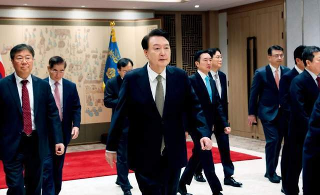

# 为了挽回低迷的支持率，韩国总统尹锡悦来了一次“缩水”的内阁改组

当地时间12月4日，韩国总统尹锡悦宣布改组内阁，更换6位部长。这是尹锡悦在任期即将过半时，进行的任内目前规模最大的一次内阁人事调整。此前，尹锡悦总统室也在11月底进行改组，所有首席秘书都被更换。

 _12月4日，尹锡悦（中）在韩国内阁改组仪式现场。图/视觉中国_

在国会选举年来临前改组内阁，放出部长们到地方选区“战斗”，是韩国政治的传统。又因为政府官员必须在明年1月11日前辞职，才能参加国会选举，所以12月是内阁改组的最后期限。

本次改组中卸任的最重要人物，经济副总理兼企划财政部长官秋庆镐，今年8月就预告了自己将重返国会选战。专业经济官员出身的秋庆镐在大邱广域市声誉较好，曾多次担纲保守阵营在这座韩国第四大城市的国会选战负责人。秋庆镐出山，显示出执政党人民力量党对2024年国会选举的重视。毕竟，按照多数民调结果，在野党共同民主党很可能维持甚至扩大在国会的多数党地位。这意味着尹锡悦可能在整个总统任期内都面临国会掣肘，几乎是“宣判政治死刑”。

面对艰难的选情，内阁改组虽然必须实行，但也有一定风险：大规模人事调整可能引发选民对执政党政策延续性的怀疑，甚至认为执政党内部不稳定；另一方面，如果启用太多新面孔，短期内又难以取得施政成效，将降低选民对执政党的评价。有鉴于此，尹锡悦本次内阁改组全面“求稳”。韩联社评论称，尹锡悦在11月底调整总统室高级官员时，任命韩国央行的现任官员朴春燮为经济首席秘书，而卸任的经济首秘崔相穆在内阁改组中接任经济副总理兼企划财政部长官。这种“都用现政府人士”的做法意味着，即使外界对政策变革和结构改革的呼声高涨，政府依然“把政策的一贯性和经济团队内部沟通置于最优先地位”。

此外，本次履新的6位部长，半数为女性，大多为职业官员和业界专家，也被韩国媒体评论为“显然考虑了平衡”，以免影响选民观感。新任部长除崔相穆外，都没有太多政党经历。

然而，精明的选择并不能掩盖本次改组背后的人事动荡。今年以来，尹锡悦政府多个高层部门都出现韩国“民主化”以来罕见的大规模调整。3月，韩国总统室国家安保室长、尹锡悦政府外交安保及统一事务的最高负责人金圣翰突然宣布辞职，这位尹锡悦竞选时的“外交总顾问”离任的原因，至今众说纷纭。

6月底，尹锡悦采用三位“外部人士”替换统一部长官、第一次官和总统室统一秘书，标志着韩国政府对朝高层“大换血”。韩国媒体报道称，统一部内“人心惶惶”，当前的改革“是要求统一部彻底改变职能、做事方法以及思想”，共同民主党更指统一部已变成“统一破坏部”。

11月26日，韩国最高情报机关国情院院长金奎显和第一次长、第二次长同日向尹锡悦递交辞呈并获准。尹锡悦总统室至今没有披露继任院长的提名人选，也没有说明这场国情院史无前例的“高层总辞职”原因何在。

值得注意的是，这几次人事动荡发生的部门，都涉及外交、统一、安保事务，且在过去都相对超然于党派政治。历任国情院次长、院长的著名“朝韩特使”徐薰，就连续受到朴槿惠、文在寅重用。但尹锡悦上任总统后，韩国检方已就一系列对朝决策问题对徐薰发起检控。

或许正因为动荡过于剧烈，尹锡悦政府本次内阁改组的幅度比原计划小很多。11月底，执政党消息人士曾对媒体透露，19名内阁成员的“一半以上”要在12月被替换，而且内阁改组和总统室的人事调整将同步进行。但事实上，本次发布的内阁改组晚于总统室人事变更，也只涉及6位部长，其中不包括此前传闻要更换的外交部长朴振。在釜山竞选世博会主办城市失败的外交事件发生后，这尤其引人注目。

不管是缩减了改组规模还是进行“循序渐进”式改组，都表明尹锡悦希望对外表现出稳定的面貌。然而，在总统办公室一再回避“国情院发生了什么”时，依靠几位专家、女性“新面孔”，很难挽回低迷的支持率。

发于2023.12.11总第1120期《中国新闻周刊》杂志

杂志标题：尹锡悦的“缩水内阁改组”

记者：曹然

编辑：徐方清

