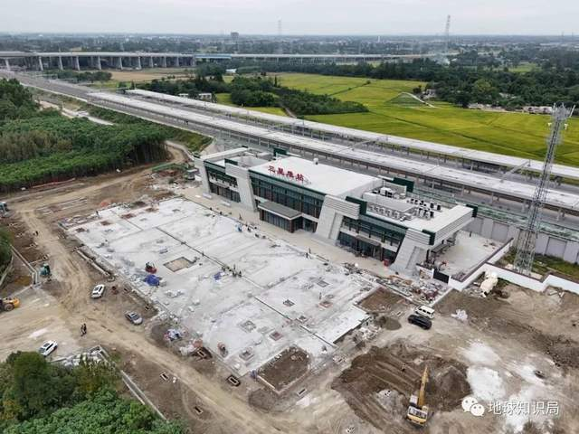
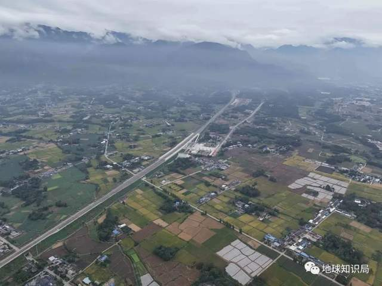
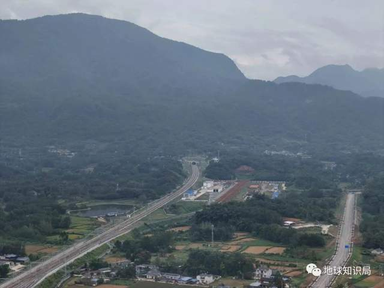

# 四川搞了一条去青藏高原的“超级地铁”，海拔高差2000米！|地球知识局

(⊙_⊙)

每天一篇全球人文与地理

微信公众号：地球知识局

NO.2570-川青铁路成镇段

文字：杔格

制图：澄澈 / 编辑：澄澈

**【致谢】本文的内容及图片得到了“中国铁路成都局集团有限公司”的大力支持，特此感谢。**

位于四川省西北部的阿坝藏族羌族自治州，是四川藏区的重要组成部分。在其境内，黄龙风景名胜区、九寨沟风景名胜区、四川大熊猫栖息地，三处知名的
**重磅级世界自然遗产** ，可谓如雷贯耳，吸引着无数游人前往寻访。

▲图注：又一条 **高原“天路”** 诞生了

阿坝州是一个以山区地形为主的自治州，其下辖的每一个县市，想要出入县域，一定无法避免翻山越岭。与大多数人平日里所习惯的平原地区的公路不同，这里的公路交通（除了已经开通高速公路的地区）往往是
**盘山、傍山公路** ，相关体验对绝大部分人实在是一言难尽。

▲图注：填补了川西北高原地区没有铁路的空白

2023年11月28日11时6分，随着C6008次动车组列车缓缓驶出茂县站，奔向成都东站，四川成都至青海西宁铁路青白江至镇江关段（ **川青铁路成镇段**
）正式开通运营。这是川西北的首条铁路，标志着群山深处的阿坝州，从此结束不通铁路的历史。

▲图注：不考虑来往县城以及主城区的时间

**成都茶店子客运站** 至 **茂县客运中心站** 需要 **约3个小时**

**成都东站** 至 **茂县站** 最快仅需 **55分钟**

铁路较公路行驶时间缩短了2个多小时

**简直就是从特大城市开往川西北高原的“超级地铁”！**

（图：杔格）

从成兰铁路，到川青铁路

2011年3月，新建成都至兰州铁路 **先期动工**
，包括三星堆至绵竹南段、川主寺至黄胜关段以及上漳至黄土梁段的池沟双线大桥、花儿坡双线中桥（甘肃段）等项目。这是四川省“5·12汶川地震”灾后
**最艰巨的恢复重建国家重点公益性交通基础设施建设项目** ，堪称“重要的生命线工程”。

▲图注：成兰铁路处于地震高发区

**广汉、什邡、绵竹、茂县等地**

曾经都是极重灾区，满目疮痍

（ **汶川漩口中学遗址** ，图：杔格）

成兰铁路选择了东、中、西三条线路方案中的 **西线方案** ，即起自成都青白江，经什邡、绵竹、茂县、松潘至九寨沟，向北延伸与 **兰渝铁路哈达铺站**
接轨至兰州。

▲图注：从大西南到大西北（图：杔格）

成兰铁路在建设过程中，青白江至黄胜关段设计方案有过变更。为减少对大熊猫的影响， **成兰铁路以隧道形式穿越大熊猫栖息地**
，在大熊猫栖息地内无露出工程，隧道进出口均在大熊猫栖息地以外，同时该线路将新增车站2座。

▲图注：高原段以峡谷长桥为主

黄胜关至哈达铺段，因途经 **九寨沟国家级风景名胜区** ，经专家多次研究、论证、评审，为避免对该区域的生态破坏，最终 **被取消**
。2017年，“8·8九寨沟地震”发生。

▲图注：实际上 **原九寨沟站** 的站址

与今日的 **黄龙九寨站** （原川主寺站）

两站距离相距并不远（图：杔格）

在“八纵八横”中，成兰铁路成黄段属于 **第八纵兰（西）广通道** 的重要组成部分。

▲图注：兰（西）广通道示意图

2022年10月29日， **西宁至成都铁路海东西至黄胜关段**
开工建设。兰新高铁西宁至海东西段、西宁至成都铁路海东西至黄胜关段、成都至兰州铁路黄胜关至青白江（东）段与宝成铁路青白江至成都段或西成高铁青白江东至成都东段，共同组成西宁至成都铁路。成兰铁路成黄段，被纳入西宁至成都铁路的一部分。

▲图注：将西南的 **成渝地区双城经济圈**

与西北的 **兰西城市群** 连在一起

2023年4月，新建成都至西宁铁路的名称正式被公布确定为 **川青铁路** 。川青铁路，也与 **兰合铁路** ，共同组成兰州至成都铁路大通道。

▲图注：兰渝铁路已部分实现成兰间的通道

新路径将更加快速与顺直

川青铁路成镇段

川青铁路成镇段起自青白江东站，途经成都市青白江区，德阳市广汉市、什邡市、绵竹市，绵阳市安州区，阿坝藏族羌族自治州茂县、松潘县，接入松潘县镇江关站，
**正线全长206公里，正线旅客列车设计时速200公里** ，货物列车设计时速120公里，为 **国家Ⅰ级电气化双线客货共线铁路** 。

▲图注：首发列车抵达终点——成都东站

海拔454米（ **横屏** 图：杔格）

全线共设 **10个车站**
，分别为青白江、三星堆、什邡西、绵竹南、安州（原安县）、高川、茂县、石大关（原龙塘）、叠溪（原太平）和镇江关站，其中青白江为既有车站，其余为新建车站。石大关和叠溪为
**铁路行车技术作业站** ，不办理客运业务。

▲图注：该线以新建的部分线路计

没有经过任何地级市主城区以及自治州州府

川青铁路成镇段处于成都平原向青藏高原东部边缘过渡的高山峡谷地带， **位于中国第二地貌阶梯向第一地貌阶梯急切过渡的高山峡谷区** 。

这段铁路途经 **盆地、高原、河谷、山区及十余条大断裂带** ，还要经过4个国家级自然保护区、1个省级和2个县级自然保护区。

海拔从安州站的634米攀升至镇江关站的2503米，高差近2000米，穿越了龙门山、岷山、西秦岭等 **众多山脉** ，跨越涪江、岷江、嘉陵江
**三大水系** ，至川西北高原，线路起伏巨大，沿线地质条件复杂，施工难度大。

川青铁路是 **中国北横断山脉第一条铁路** ，首次穿越地形最为陡峻的青藏高原东塬；是 **世界上第一条穿越8级大地震灾害核心区的铁路**
；11次穿越活动断裂，是我国穿越活动断裂最多的铁路之一；伴行活动断裂长达170公里，是我国伴行活动断裂最长的铁路。

▲图注：从平原区段，到川西高原区段

在安州横穿三条龙门山活动断裂带

进入阿坝州茂县，再平行于岷江活动断裂带

一路爬坡进入松潘县镇江关站

地质条件具有 **“四极三高五复杂”**
的显著特点，即地形切割极为强烈、构造条件极为复杂活跃、岩性条件极为软弱破碎、汶川地震效应极为显著；高地壳应力、高地震烈度、高地质灾害风险；复杂的构造运动历史、复杂多变的富理岩建造、复杂的地应力环境、复杂的地下水条件、复杂的结构型式。

高原气候环境复杂多变，气候条件恶劣、空气稀薄、昼夜温差大、强对流天气多发、雨雪天气频繁等。

穿山而行，造就了川青铁路的一大特点—— **隧道比极高** 。高原地带，沿线上百公里连续爬坡和隧道穿行，长大隧道群居多， **持续坡度在17.8‰**
。成镇段全线平均坡度15‰，最大坡度（限制坡度）18‰，高原段的最大特点是全线除了车站， **几乎没有一块平轨面，都带有坡度** 。

工程建设历时12年，架设了 **镇江关五线特大桥** 等 **33座桥梁** ，建成了 **跃龙门隧道** 等 **10座隧道**
。其中，安州到镇江关段134公里，集中修建了10座、总长127公里的隧道， **桥隧比达99%，仅隧道比就95.5%** 。

▲图注：川青铁路进山后是约130公里的隧道群

从成都平原到川西高原要翻越

中国最长、最宽、最典型的南北向山系群体——横断山脉

（平纵面示意图，图：杔格@镇江关站）

从四川盆地，到横断山区

三星堆站，川青铁路新建车站的第一站，位于德阳市广汉市 **三星堆镇与向阳镇交界处** ，在三星堆景区以南，基本位于广汉市西南角处，与成都市域距离不远，

▲图注：三星堆出土的青铜人面具

抽象为站房外立面的整体造型

局部点缀回字纹雕花的仿古元素

（ **横屏** 图：杔格）

在三星堆站的南咽喉，川青铁路正线接入 **宝成铁路的青白江站** ；通过青三联络线，川青铁路接入 **西成高铁的青白江东站** 。

▲图注：川青铁路沿线动车均经由 **青三联络线**

（ **横屏** 图：杔格）

西成高铁上的广汉北站，距离三星堆相关景区更近。三星堆站的开通，为游客去往 **三星堆相关景区** 又提供一条路径。

▲图注：外立面檐口为青铜色与基础色系碰撞

中间加上雕花的仿古元素

彰显了三星堆深远的人文背景

（图：杔格）

过了鸭子河不远，就是什邡西站。

▲图注：站房外立面局部采用雪茄色点缀

体现什邡 **“雪茄之乡”** ，远处就是龙门山

（ **横屏** 图：杔格）

什邡西站位于德阳市什邡市南泉镇境内，在什邡主城区以西。

▲（图：杔格）

几乎沿成万高速走行，就是绵竹南站。

▲图注：立面造型有绵竹年画的立面装饰

（ **横屏** 图：杔格）

绵竹南站位于德阳市绵竹市孝德镇境内，在绵竹主城区正南方向，射水河附近。

▲图注：站房两侧檐口为“酒杯”造型

代表以 **“剑南春”** 为主的白酒产业

（图：杔格）

安州站，位于绵阳市安州区睢水镇境内。距离安州区（花荄镇）以及安昌（安县老县城）都有一定的距离，所以也被称为所谓的“ **睢水站** ”。

▲图注：川青铁路的坡道主要是在安州站开始

（图：杔格）

安州站地处安州区与绵竹市交界处，由于距离非常近， **绵竹的拱星镇** 也可以充分利用该车站进行乘降。

▲图注：站房整体采用斜屋面造型

屋檐跌落起伏、错落有致

体现了川西建筑的特点

（ **横屏** 图：杔格）

同时，安州站的另一大特殊点，是成都平原和横断山系交界处的一站，也就是进山前的最后一站。过了这个站，就意味着 **成都平原段已经结束** ，一头扎进
**柿子园隧道** ，开始穿山越岭的行程。

▲图注：过了成都平原的安州站

前方就是横断山系的崇山峻岭了

候车厅内设计也有着

“雎水踩桥”传统习俗的抽象寓意

（图：杔格）

高川站，位于绵阳市安州区高川乡境内，也是 **川青铁路山区段** 第一站。

▲图注：站房采用三段式不对称建筑形式

造型汲取川西地区当地建筑元素

也凸显高海拔寒冷地区地域特色

（图：杔格）

高川站的站位特殊之处在于，其站内桥隧相连，夹在两个川青铁路沿线上著名的隧道之间—— **柿子园隧道（成都端）** 与 **跃龙门隧道（西宁端）** 。

▲图注：中间通过高川站左、右线双线大桥连接

（图：杔格）

跃龙门隧道是川青铁路全线控制性工程，隧道以四川盆地向川藏高原攀升起坡点为进口，开凿进入横断山脉东北边界龙门山脉高山区。它于2012年12月开始施工，在2022年4月25日，
**历时十年终于贯通** 。

▲图注：犹如在“豆腐渣中开隧道”（图：杔格）

跃龙门隧道位于四川省绵阳市安州区高川乡和阿坝藏族羌族自治州茂县土门镇之间，为 **双洞分修隧道** ，左线全长19.981公里、右线全长20.042公里，
**全长约20公里** 。

▲图注：作为在高海拔地区运行的铁路

首次配属了 **CRH2G型高寒动车组**

满足-40℃~40℃极端气候下

列车正常运营需求（图：杔格）

跃龙门隧道，穿越龙门山山脉， **地处汶川地震灾害核心区**
，地形陡峻，岭谷高差悬殊大，地质灾害频发，具有“四极三高五复杂”的特点，是中国铁路最为艰难的越岭隧道之一。

▲图注：跃龙门隧道成都端（图：杔格）

**该隧道创造多个全国第一**
：辅助坑道规模全国第一；早古生界非煤有害气体逸出段落长度全国第一；5亿年前寒武系高地应力软岩变形段落长度全国第一；单隧穿越地质地层时空长度全国第一。

▲图注：跃龙门隧道最大埋深达1445米

隧道单面上坡，进出口高差346.3米

（图：杔格）

**跃龙门隧道属于极高风险隧道**
，不良地质复杂多变，主要有高烈度地震活动断裂带、岩溶富水带、下穿激流沟壑、高地应力、高地温、软岩大变形、岩爆等不良地质，隧道中还有高瓦斯、硫化氢等有毒有害气体。
**隧道外部环境受2008年“汶川特大地震”影响** ，极易发生危岩落石、山体滑坡、泥石流等地质灾害。

▲（ **横屏** 图：杔格）

面对 **“软岩大变形群洞变形效应”** ，参建工作者将原有中间平导位置进行了外移调整，以减弱“群洞”影响。针对大变形采用“主动控制”，
**首创了软岩大变形两台阶带仰拱（短台阶）快速封闭成环施工法** 。

▲图注：高川站和跃龙门隧道成都端（图：杔格）

跃龙门隧道是川青铁路成黄段 **全线长度超过20公里的3个隧道之一**
，双洞加辅助施工通道总里程达71公里。建设高峰期，建设单位同时布设了20多个工作面，每天200多台施工车辆进出洞。跃龙门隧道的贯通为中国乃至世界高原山区铁路建设提供了宝贵经验。

▲图注：高川站和跃龙门隧道成都端（图：杔格）

茂县站位于阿坝州茂县富顺镇境内，与上关村紧临。

▲图注：片石墙面与木质窗格相互映衬搭配

建筑元素涉及到羌族的“碉楼”

（图：杔格）

它的布局与高川站相似，也是夹在两座隧道之间， **成都端为杨家坪隧道，西宁端为茂县隧道** 。

▲图注：中部分别设茂县车站5线特大桥和茂县站双线中桥

茂县隧道穿越龙门山后山活动断裂带核心部位长达700米

穿越3条断层、2条背斜、1条向斜

（图：杔格）

茂县站站台位于桥上，受地理原因影响，站点所处的位置和茂县县城 **有一定距离** 。

▲图注：茂县地处岷江和涪江上游的高山河谷地带

主要依赖G213、G347、G545沟通外界

在茂县站与镇江关站之间，有着 **榴桐寨隧道** （全长18公里，成黄段地应力最高的软岩大变形隧道，茂县渭门镇核桃村和叠溪镇桃花村之间）、
**平安特长隧道** （全长28公里，成黄段全线及西南地区最长隧道，最高埋深1720米，穿越茂县至松潘的岷江河谷地段）等控制性工程。

▲图注：川青铁路对于茂县的对外交通意义重大

境内段几乎沿着 **茶马古道松茂古路**

“天堑变通途”

镇江关站是本次川青铁路成镇段开通的终点，位于阿坝州松潘县镇江关镇境内。镇江关站因地势狭窄，需 **跨越G213国道**
并穿越铁路轨道梁，才能通过进站天桥将站房与站台连接。

▲图注：目前全国 **唯一** 一座进站天桥跨越国道的客运火车站

（图：杔格）

镇江关站就在岷江河岸，这里有着镇江关五线特大桥的建设工程。

▲图注：进站天桥为钢筋混凝土框架剪力墙结构

车站大部分设在镇江关车站1号四线特大桥上

（图：杔格）

由于川青铁路成黄段未全线通车，在铁路应急开通期间，当地由大九旅公司提供开通 **镇江关站至松潘县城（松州客运站）免费接驳专线** 。

▲图注：站房采用立面三段式的建筑形式

屋檐上采用了藏族文化相关元素

（图：杔格）

该线路开通运营后，将极大便利沿线各族人民群众出行，对于 **推动沿线经济社会发展、维护民族团结、服务西部大开发形成新格局** ，具有十分重要的意义。

▲图注：茂县站（图：杔格）

川青铁路成镇段开通运营后，成都东至镇江关段实现贯通运营，每日安排开行动车组列车 **18列**
，成都东站至三星堆、绵竹南、茂县、镇江关站，最快分别18分、31分、55分、86分可达。

▲图注：茂县站（图：杔格）

值得注意的是，川青铁路与中央红军“爬雪山、过草地”的路线 **高度重叠** 。

▲图注：一条充满红军印迹的路（图：杔格）

这是一条从成都平原攀升至川西北高原的铁路大动脉，途经的阿坝州是长征中红军经过 **人数最多、召开重要会议最多、驻留时间最长、自然环境最恶劣** 的地区。

▲图注：松潘地区就是代表之一

（ **横屏** 图：杔格）

目前，川青铁路成黄段仅剩德胜隧道（原云屯堡隧道）还未贯通。预计明年五月，红军长征重要途经地的 **松潘即将通上火车** ，川青铁路成黄段全线建成。

▲图注：到时候就能到 **黄龙九寨站** 了（ **横屏** 图：杔格）

未来，从黄胜关出发，往北经红原、班佑、若尔盖、阿西、花湖、郎木寺等地。这些熟悉的“红色”地名，背后又是一段段 **令人熟知的“长征路”** 。

▲图注：黄胜关站继续往北，往西宁方向

（ **横屏** 图：杔格）

*本文内容为作者提供，不代表地球知识局立场

**封面：杔格**

**END**

