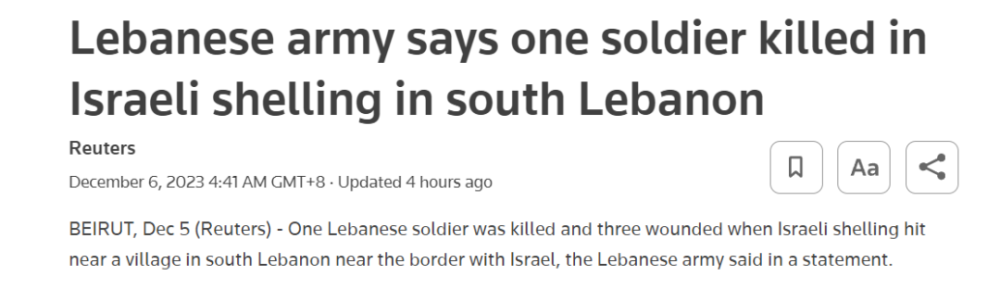
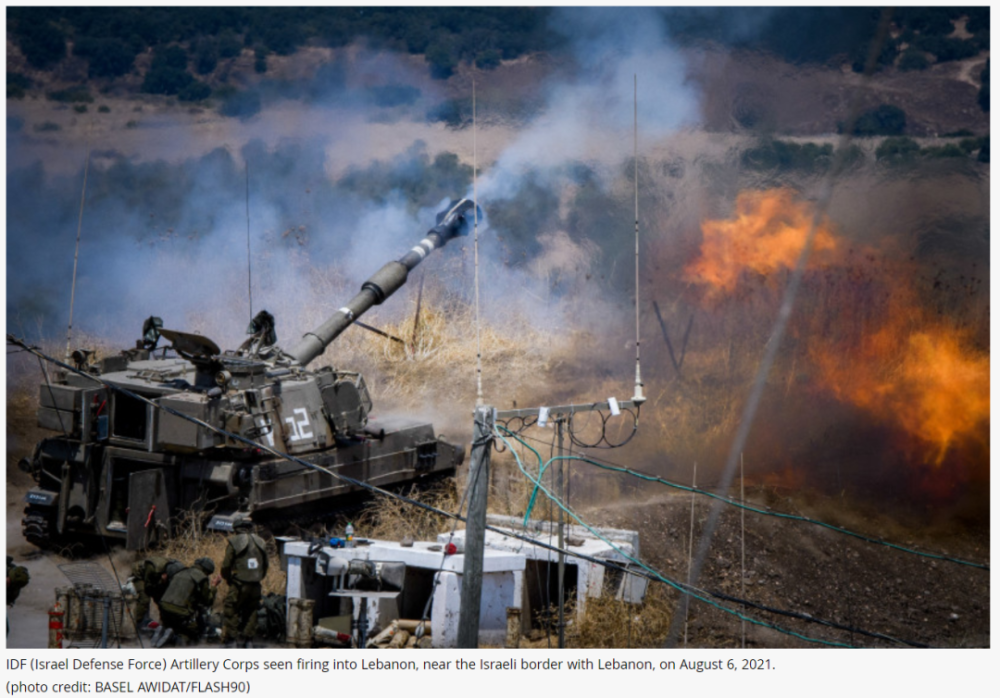
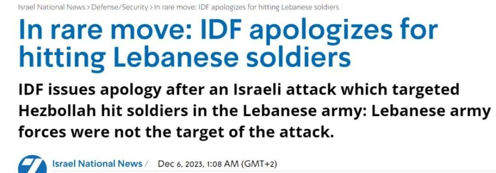

# 外媒：以色列轰炸导致黎巴嫩士兵伤亡，以军罕见道歉

据路透社报道，当地时间12月5日，黎巴嫩军方在一份声明中称，以色列军队炮击了黎巴嫩南部临近黎以临时边界的一个村庄，造成1名黎巴嫩士兵死亡，3人受伤。

联合国驻黎巴嫩临时部队(简称联黎部队)随后在社交平台X上发表声明称:“这是黎巴嫩军队士兵首次在这一关键时期被杀，他们没有参与和以色列的冲突。”

“在过去的几天里，我们看到暴力事件令人震惊的迅速增加。我们继续敦促那些沿黎以临时边界交火的人结束暴力行动，这可能会给临时边界两侧的人民带来毁灭性的后果，”声明补充说。

_以色列炮兵向黎巴嫩开火。（资料图）_

另据以色列国家新闻网报道，5日晚间，以色列国防军就以色列针对真主党的军事行动，造成黎巴嫩军队士兵伤亡发表了道歉声明。以色列国家新闻网称，这是一个十分罕见的举动。

_以色列国家新闻网报道截图_

以色列国防军发言人表示：“今天早些时候，以色列国防军士兵采取行动，试图消除从黎巴嫩领土上检测到的真实威胁。随后，以色列国防军收到报告称，黎巴嫩军队的一些士兵在袭击中受伤。黎巴嫩军队不是我们袭击的目标，以色列国防军对这一事件感到遗憾。该事件正在调查中。”

陈葭

