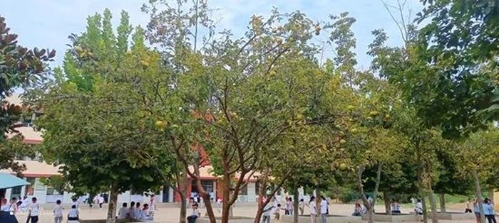

# 小学生眼中的“牛郎”，让老师们哑口无言

作为在中华大地流传了几千年的故事的主人公，牛郎大概很难想到，自己会被21世纪的小学生当成“流氓”。

这争议源于他“对美好生活的追求”。在教育部统编版（以下简称“部编版”）小学语文五年级上册的课本里，他本来人生困苦：父母双亡，被哥嫂欺负，没分得家产，只和一头老牛相依为命。

直到有一天，老牛突然开口说话：“明天黄昏时候会有些仙女在湖里洗澡……你要捡起那件粉红色的纱衣，跑到树林里等着，跟你要衣裳的那个仙女就是你的妻子。”次日，牛郎欣然前往。

课堂上，一位男生马上站起来指证：“我觉得牛郎是能吃官司的。拿别人衣服就算了，还偷窥别人洗澡。”他说这话的时候，前排有个男生一直把脸埋在胳膊里笑。

一位戴眼镜的女生不理解织女为什么要嫁给牛郎：“我觉得牛郎他要文化没文化，要钱没钱，要颜值也没颜值。”学生们又笑了。

一位重庆的小学老师曾将这段课堂实录发到了社交媒体上。台下的笑声和疑问让老师们犯了难：这样的课文该怎么讲？

 _李华丽班上的学生。受访者供图_

**一**

河南南阳的教师李华丽起初不明白。她问学生：“笑啥？”

“老师，我觉得牛郎好好色。”有个女生回答。

3年前，刚当上语文老师的李华丽从来没预想过这个问题，她甚至忘记了当时是怎么跟学生解释的。今年，又有学生提问：“难道织女没穿衣服，就跟牛郎说话了？”

孩子们在底下发笑时，江苏连云港的乡镇小学教师杨琴芝也在台上笑了。这是她教语文28年以来，第一次在这个情节笑。

她手上的课本是新换的。2017年，学校根据全国统一要求，把沿用已久的江苏教育出版社的教材（以下简称“苏教版”）换成部编版。《牛郎织女》是整个五年级上册最长的一篇课文，大约2200字。它的教学重点是让学生们了解民间故事口耳相传的特点，能创造性地复述故事。

杨琴芝在备课时，发现了牛郎织女相会部分的变动——在苏教版课文里，没有盗衣结缘的情节。老牛只是告诉牛郎：“湖边有一片树林。在树林里，你会遇到一位美丽的姑娘。”织女走来后，两人通过对话相识。

杨琴芝隐约觉得，部编版的情节“可能会引起孩子们的（反应）”。她明白了孩子们为什么笑，于是解释道：这是个民间故事，有想象和虚构的成分。“我们生活在现代社会，如果遇到自己心爱的姑娘，是不能这样做的，尤其从道德法治的角度。”

致力于课程创新的万物启蒙教育创始人钱锋曾在课上向男生提问：“如果你是娶不到老婆的牛郎，你要不要偷衣服？”

一个胖胖的男生回答：“不偷，这不道德。”

“如果不偷，或许你一辈子也娶不到老婆，也过不了男耕女织的美好生活，你偷不偷？”

那位男生再次起身：“做人要有道德。”

钱锋又问女生：“如果你是织女，后来知道了牛郎拿走衣服的真相，你还愿不愿意和他男耕女织？”

有女生说：“不愿意，不能欺骗感情。”

“愿意的女生请举手？”他问。

没有一个人举手。

牛郎大概会觉得委屈。据文献记载，他的故事从先秦时期始，历经无数版本，大多都以勤苦形象示人，直到1910年，才偷拿起织女的衣服——当时的《牛郎织女传》在前代文献的基础上，融入了民间的“毛衣女”故事。

“毛衣女”出自东晋时期的《搜神记》，其中记载：“豫章新喻县男子，见田中有六七女，皆衣毛衣，不知是鸟。匍匐往，得其一女所解毛衣，取藏之。即往就诸鸟，诸鸟各飞走。一鸟独不得去。男子取以为妇，生三女。”

民国时期，京剧名家编排戏曲《天河配》，在此基础上强化了盗衣逼嫁的情节：牛郎窃取仙衣不肯归还，胁迫织女结婚，在老牛死后牛郎外出之际，织女才“披衣而逃”。

1955年起，牛郎织女“受邀”进入新中国的教科书。时任人民教育出版社社长的叶圣陶先生对其进行改造，让牛郎主动将衣服还给织女，双方互诉衷肠，自愿结婚。2001年审定教材时，苏教版又将盗衣情节彻底删去，学生们与牛郎相安无事十几年，直至新教材出现。

从学术角度来看，“毛衣女”类型的故事在世界范围内广泛存在，也被称为天鹅处女型、羽衣仙女型故事。中国拥有现存最早的文本。学者们认为，这个故事的流传或许与女神崇拜、飞鸟图腾崇拜、禁忌母题、抢婚习俗等有关。但问题是，孩子们能不能理解？

近几十年间的社会发展，就足以造成几代人之间的隔阂。出生于1976年的作家黄俏燕致力于整理、重述中国民间故事。在她小时候，“压根没发现”牛郎与河里洗澡的织女相遇有什么问题。

“不是脱光的呀！只有3岁以下的小孩才会光着屁股洗澡。”她出生在广东东莞的乡村，那时候村民们结束农作，都去河里洗澡。男男女女，穿着布衣，往水里一泡。洗好了，湿淋淋地出水，走回家才换干衣服。

“现在的小孩会提这样的问题，也是自然而然的，他们没有以前农耕生活的常识，以为洗澡肯定是光着身子的，那（盗衣结缘）这一点就是需要改的。”黄俏燕说。

这3年间，李华丽老师察觉到了一些小心翼翼的改动。发下来的课本上，先是“衣裳”变成了“纱衣”。今年，“洗澡”又被改成了“戏水”。但这仍不能使学生们满意，在1个月前的课堂上，还是有人说：“感觉牛郎很变态。”

李华丽根据课文的逻辑进行解释：脱掉的纱衣只是一件薄薄的外套，并不是没穿衣服；牛郎只是在树林里听着，没有偷看。

但当她把自己代入课文，也会觉得害怕：“为什么这里有一个人，他知道我的衣服在哪，还知道我是谁，说咱俩加个好友，明天就结婚——这个人是神经病吧？”

她又在想，“是不是不能用现代人的思维去评判过去的故事？”

_杨琴芝任教的小学校园。受访者供图_

**二**

课堂接着进行。新的问题又出现了。

牛郎归还纱衣后，两人聊了起来，织女表达了自己在天庭的劳累与不自由。牛郎于是说：“姑娘，既然天上没什么好，你就不用回去了。你能干活，我也能干活，咱们两个结了婚，一块儿在人间过一辈子吧。”

织女想了想，说：“你说得很对，咱们结婚，一块儿过日子吧。”

于是他们手拉着手，穿过树林，翻过山头，回到了草房。

有学生提出，这不符合现实：“一般得认识很长时间彼此熟悉了之后，而且还要看对方家里有没有车、有没有地位，才能决定嫁不嫁给他。”

在这场教学现场会中，全国特级教师窦桂梅设置了角色扮演环节。有几位女生扮演仙女，劝阻织女结婚：“天上的荣华富贵你不要，你去做人家的穷妻子，你图他什么呢？跟我们回去吧。”“万一牛郎变心了可怎么办呢，这样就回不到天上了。你考虑这样的后果了吗？”

杨琴芝想，怎么才能让学生理解织女愿意留下的原因呢？她班上有15个学生是离异家庭，“很多都是妈妈走了”。

杨琴芝告诉中青报·中青网记者，在课堂上最先质疑牛郎的女生，是个有些早熟的女孩。她喜欢一个六年级的男生，会主动给他写信，一下课就去教室门口找他。杨琴芝理解这种情感的萌芽，但为了让女生收拢心思学习，就跟她谈心：“你这么优秀，学习好，长得也好。你看那个男孩，学习不好，个人卫生也不好，脖子上积了一圈灰。你把精力放在学习上，考一个好的大学，里面优秀的男孩多得是。”

在深圳教师王俏俏的班上，有个女生说，织女是“白富美”，牛郎配不上她。这个女孩去年写下的新年愿望是“永远单身”。王俏俏和她聊过几句，“她觉得男孩子太耽误她了，她要考好成绩。”

学生们的想法变了，教研室里的讨论也一样激烈。“许多年轻老师都不认同这个故事。谁家养一个女儿，能让她嫁给这样一个穷的年轻人？别说王母娘娘，现在的丈母娘能同意吗？”杨琴芝的同事们商量着，要在课堂上提醒学生：“选择爱人，是不能这么匆匆忙忙的。”

这篇课文让28岁的王俏俏觉得“非常不舒服”，在她看来，“织女全程都处于被动的状态”。她决定把3课时合并成1课时来上。

备课时，她给牛郎求婚时的句子——“你能干活，我也能干活，咱们两个结婚”——下面划了条横线，批注：“牛也能干活，怎么不和牛结婚？”她想告诉学生们，“婚姻不是这么简单的一个东西”。

课上，她抛出问题，让大家找“令人不舒服的情节”。课后，又布置了一道习题：“织女贵为天帝之女，因婚后废织而被天帝所罚。对于天帝这一做法，有人赞同，有人反对，谈谈你的看法。”

有个女生写道：“我反对，织女是个女的，迟早都要嫁人，放她自由不行吗？”

也有一个女生“反对”：“因为每一个人都要结婚生子，不能因为她是神就不能结婚生子。”王俏俏记得，这个女孩曾告诉她，妈妈生了3个女儿，家里还想要弟弟，有时候会吵架。

她给这两个女生写下评语：“每个人都有自己的选择，也许这只是一门选修课。”

王俏俏与男友感情甚好。她十分看重亲密关系，认为这是人类情感中美好的一环，只是“可遇不可求”——她排斥把婚姻当成一个必须完成的任务。

对于小学生的教育，无论男孩女孩，她都希望先强调“独立自主”。

“美好的民间爱情故事有很多，梁山伯与祝英台就很好，为什么非要选牛郎织女？”王俏俏问。

**三**

黄俏燕认为，这是一个独到、本质的中国故事。

牛郎和织女的情意甚至先于情节建立——从它们作为两颗星星开始，就隔着银河迢迢相望。汉武帝刻立牛郎织女的石像，使他们具有人格，这是后来的事。

东汉时期，文人使牛郎织女发展出爱情，《古诗十九首·迢迢牵牛星》写出了恩爱夫妻备受分离之苦的意象，但没人知道他们为什么分开。魏晋南北朝时期，道教文化兴盛，玉皇大帝和王母娘娘也加入了牛郎织女的故事线，人们开始思考悲剧结局的成因。

有人写道，是牛郎为了迎娶织女，欠了天帝两万钱迟迟不还，被关入牢房而二人分离。有人说，牛郎织女受天帝指配成婚，但织女婚后因情废织，遭到天帝处罚，两人分离。唐朝风气更开，使织女成为花心放荡的形象，在与牛郎有婚约的前提下，仍下凡与人间书生郭翰私会。直至明清，多数时候，这个故事的主流情节仍然是相爱、成婚、分离。

清末“盗衣”情节的加入，使故事的走向转了个弯。有学者统计发现，新中国成立前，牛郎窃取仙衣强迫织女成婚、织女婚后设法逃离人间的文本占多数。直到新中国成立后，经过戏曲改良运动，牛郎织女的故事被确立为“劳动、爱情、反封建”的主题。作家艾青说：“要把牛郎和织女恢复到劳动人民的本来面目。”

这份爱情经过漫长的发育，到了今天，“四大民间故事之一”的地位已确立无疑。黄俏燕认为，这是古代漫长农耕生活的一个缩影，包括牛的意向、夫妇之爱、男耕女织的生活模式、勤劳的品德……“中国必然要有这样的故事，否则几千年的生活，我们凭什么去记忆它？”

她说：“我不知道是不是因为大家长大了，不再理解形象思维，而要用逻辑思维解读神话故事。”

在一次聚会上，她的朋友们聊起丑小鸭的故事。“有人就说，那些童话故事，真是应该灭绝掉。鸭子怎么就会变成天鹅？肯定是鸭妈妈跟一个天鹅在一起，出轨了，才有了一个私生蛋。”黄俏燕想，“如果我是个语文老师，这样的理解我是不会给分的，他根本读不懂这个故事。”

在她看来，解读童话和神话的唯一钥匙是象征。

希腊神话中有一个三头蛇怪，任何人只要看到她都会变成石头。黄俏燕上大学时读到，“我同学就说，古希腊不是已经有科学的萌芽，怎么会产生这种故事？”黄俏燕恰好觉得，这是一个极好的故事，它象征着恐惧。“当一个人看到这么恐怖的东西，被吓呆了，就像石头一样，失去了某种生命的活力，这就是隐喻和象征。”

“牛郎拿走织女的仙衣是不道德的行为，这只是非常表层的解读。”黄俏燕认为，仙衣象征着女性的自由。失去某种自由，是成为妻子、母亲后，必然要承担的重任。“这就是婚姻的过程。”

四

关于织女的婚后生活，今年，李华丽决定上一堂辩论课。主题不再聚焦于爱情，而是“织女有没有得到她想要的自由”。

她组织学生站到教室后排的空地上，自由选择，分列两队。发言的要求是要为自己的观点找出依据，无论是从课本中还是从现实中。

一开始，两队人数相当。

“自由队”引用了课文——“天上虽然富丽堂皇，可是没有自由，她不喜欢。她喜欢人间的生活：跟牛郎一块儿干活，她喜欢；逗着兄妹俩玩，她喜欢；看门前小溪的水活泼地流过去，她喜欢；听晓风晚风轻轻地吹过树林，她喜欢。”——这里有一个“不喜欢”和五个“她喜欢”，所以织女获得了自由。

另一些学生不同意：天上要织彩锦，人间也要织布。除了织布，还要带孩子，织布的时候孩子在旁边吵，还要给牛郎做饭。他们联想到自己的妈妈，好像人间的生活更累。

这一回合，现实论据打败了课本论据，有两三个学生开始倒戈，站到了“不自由队”里。“这个班半数以上的小孩都是妈妈在家，爸爸在外面打工，他们接触爸爸的时间比较少，只能看到妈妈每天都很忙。要么就是父母都在外打工，爷爷奶奶照顾。”李华丽说。

两队的孩子跑来跑去，最终人数还是差不多持平。

最后，李华丽表达了自己的立场：织女对自己的生活是有选择权的。她不想在天庭生活，就下凡来，是她选择了在人间的生活方式，而不是选择了牛郎这个人。从外人的角度看，她没有单身时自由，但从她自己的感受而言——自由和幸福或许就是一种感受——那么“她喜欢”。

有学生点了点头。

李华丽觉得，对于五年级的小孩来说，老师的引导是有用的。这也是杨芝华眼里“老师的智慧”——在具体的教学情境中，用分析和讨论填平问题的沟壑，把美好留下，把糟粕丢掉。

“教育是一个长线的过程，有时候对一篇课文产生强烈的认识是在很久以后。”李华丽觉得，没必要在这一时删去它。

“当一个文学作品产生争议，就是它代表的那个时代与当下流行的社会思潮产生了碰撞。社会在变，观念在变，说不定再过几年，又会有一些不一样。”李华丽说，教师最好不要站在一种观点的对立面，在把握真善美的基础上，任孩子们自由发挥，多给他们提供不同版本的故事，让他们了解到民间故事口耳相传的特点——这才是这一课的语文要素。

口耳相传的故事，终究是会变的。“只要它是活生生地存在着，而不是变成古籍记载或是化石，那它终究是会随着人类历史进程的推动而变化的。”黄俏燕说，她担心的不是变成什么样，而是“还会不会有民间故事”。这是她这十几年来重述民间故事的初衷。

黄俏燕的爷爷是位盲人，讲得一口精妙绝伦的故事。小时候，她不愿让妈妈出门干活，哭哭啼啼时，爷爷就把她抱起来，跟她讲蟾蜍仔、狗耕田、卖香屁的故事。讲完，他便说：“现在轮到你讲。”这样小孙女就没法跑出去玩，不会掉进江里被水冲走。

“民间故事是真正需要在生活中讲述的，现在好像已经没有这种土壤了——在我们村的生活中，这些故事已经没有人在讲了。”黄俏燕说。

听着故事长大的黄俏燕，后来成为一名乡村中学教师。故事仍对她有魔力。怀孕时，她孕吐不止，就和丈夫去东莞市图书馆借故事集回来看。丈夫意外离世后，她独自抚育儿子长大，仍给他讲蟾蜍仔、狗耕田、卖香屁的故事，他很爱听。

直到上初中，儿子喜欢上物理、化学，对科学产生极大的兴趣，仿佛进入了一个新天地。他说：“妈妈，你以前讲的那些故事都是骗人的。我可以用化学方程式证明，屁根本就不可能是香的！”

黄俏燕哈哈大笑，她没去反驳这个科学少年。

“他总会找到某些时刻，看到这些故事的意义。我们终归是生活中的人。”

（应受访者要求，李华丽、杨琴芝、王俏俏均为化名）

来源：中国青年报

