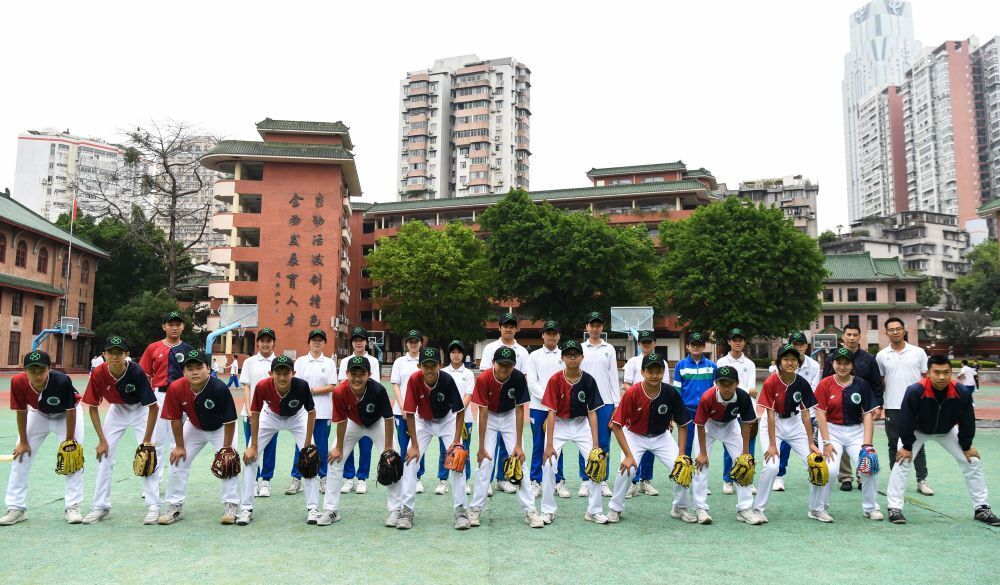
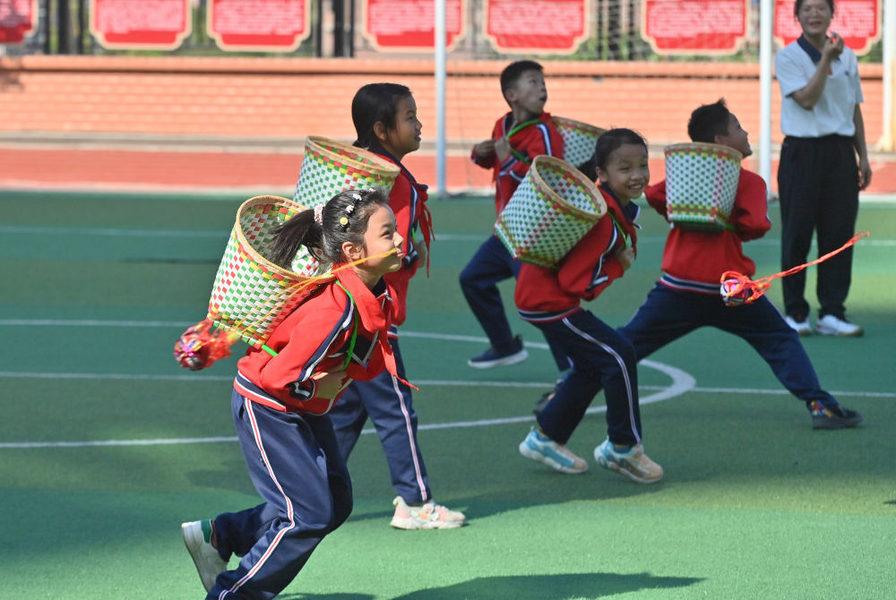
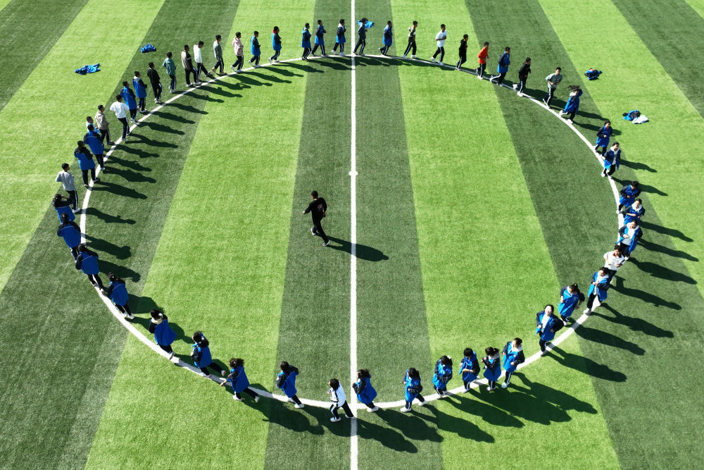
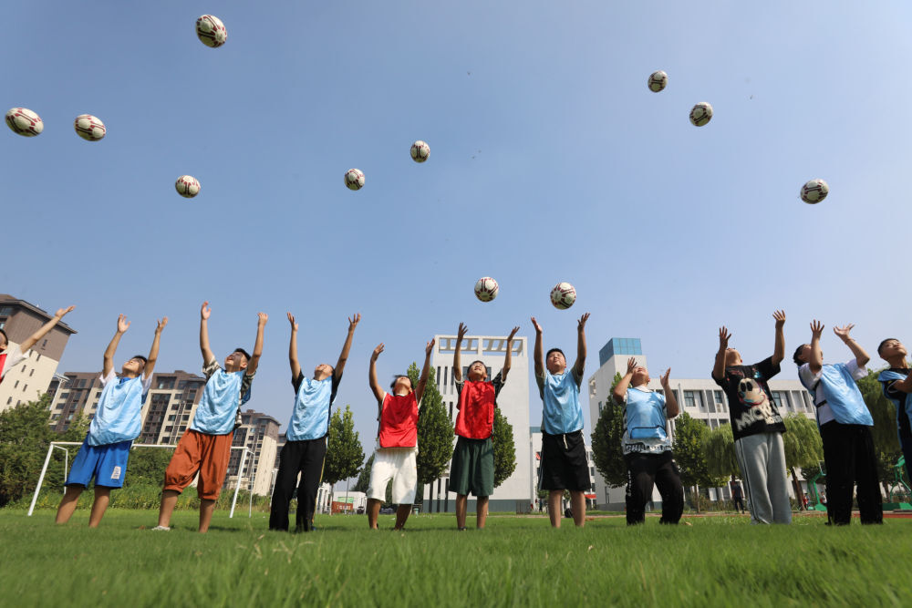
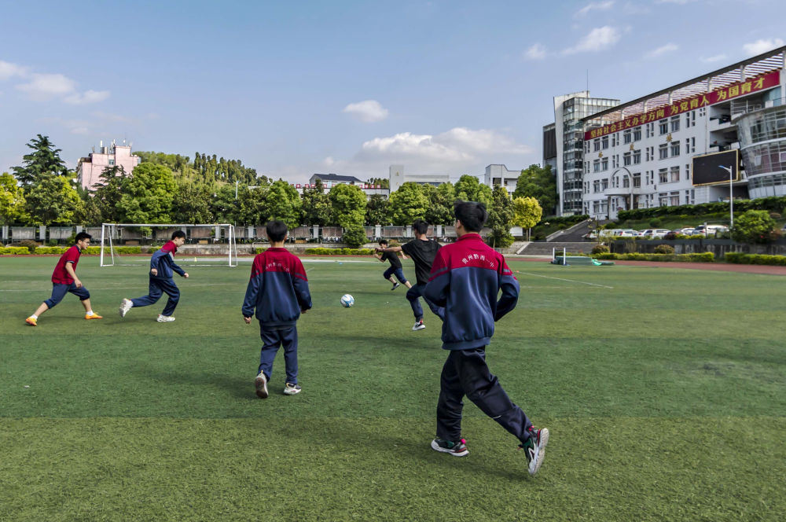

# 新华社：“每天一节体育课”太多了吗

深圳市教育局日前印发《深圳市加强和改进学校体育工作的实施意见》，要求从2024年1月1日起，义务教育阶段学校每天开设一节体育课。

为何要给体育课时设立刚性约束？“每天一节体育课”会不会太多了？学生的校外运动时长又该如何保证？

_4月10日，在广州市第七中学，棒球队球员训练结束后合影。新华社记者邓华摄_

**为何给体育课时设立刚性规定？**

近年来，从国家到地方出台多项政策，保证学生的校内和校外体育运动时间。教育部2021年出台的《关于进一步加强中小学生体质健康管理工作的通知》提到，着力保障学生每天校内、校外各1小时体育活动时间。《中华人民共和国体育法》第二十七条也明确规定，学校应当将在校内开展的学生课外体育活动纳入教学计划，与体育课教学内容相衔接，保障学生在校期间每天参加不少于一小时体育锻炼。

南京理工大学动商研究院院长王宗平说：“我国加强学校体育的政策体系已较为完备，但怎么把措施扎实落地到基层中、实际工作中，才是关键。因此，‘开齐开足体育课’仍需被反复提及。”

_7月22日，在四川华蓥市双河第二中学，参加暑期校园体育托管班的学生在练习排球。新华社发（周松林摄）_

事实上，在学校的具体实践中，体育课被语数英等科目占用、老师拖堂或布置课间练习、学校没有足够运动空间……种种因素让很多学校难以满足学生充足的体育锻炼时间。

“如果不是每天都有体育课，学校很难保障学生每天一小时的体育活动。根据我们目前的统计，全国能做到每天一小时体育锻炼的学校不到60%。”中国教育科学研究院体育美育教育研究所所长吴键说。

因此，从政府层面出台意见，给予体育课时以刚性约束，更有利于保障中小学生校内体育活动的时间。韩国也有类似做法，计划将一年级和二年级学生全年体育课时长从目前的80小时逐步增加到144小时。

 _10月16日，在广西梧州市长洲区龙平小学，学生们在体育课上进行抛绣球比赛。新华社记者黄孝邦摄_

**“每天一节体育课”多吗？**

教育部发布的《义务教育课程方案和课程标准（2022年版）》规定，从2022年9月起，全国九年义务教育学校各年级均要开设“体育与健康”课，其占总课时比例10%-11%，仅次于语文、数学。

据了解，目前大部分地区义务教育阶段的体育课时为小学一二年级每周4节体育课，三年级至初三每周3节体育课。

深圳此番出台的规定，无疑是在此基础上更进一步保证了充足的体育课时。然而，该规定也引发了热议——“每天一节体育课”会不会太多了？

“这是一项很好的政策，尤其是对提高初中和高中生体质健康水平非常重要。但必须明确，体育课不是课程总学时的增量，而是在现有课时总量不变的基础上，代替原有的文化学科课程。”华南师范大学体育科学学院教授李培说。

_10月16日，兰州新区高级中学的学生在上体育课（无人机照片）。新华社记者范培珅摄_

对于小学和初中增加体育课时，受访家长和业内人士普遍表示支持。近年来，中小学生久坐少动引发的健康问题备受关注。业内专家认为，开足体育课对中小学生的身心健康至关重要。

“孩子们体育锻炼时间不足，导致近视率、肥胖率越来越高，慢性病、心理疾病越来越多。”深圳市教育科学研究院体育研究员黄镇敏说。

业界专家普遍认为，体育运动能给孩子学习带来积极影响。深圳市福田区新沙小学校长陈志华说：“脑科学研究发现，运动是促进大脑发育、提高智力水平的最好途径。爱运动或习惯健身、每天活动量大的孩子，各方面能力表现都比较突出。”

黄镇敏表示，在国家“双减”政策背景下，体育学科更可以发挥优势，提高学生的学习效率，“课间活动能够提高大脑供血的速度，学生活动几分钟再回到教室，他们的记忆力、专注力、思维能力会更好，更有利于进行下一节课的学习。”

深圳市民毛女士说：“作为家长，我觉得孩子每天能够有一个小时在室外挺好的，可以减少小朋友的近视率，但接下来的考验是老师等教学资源如何匹配到位。”

也有专家对体育教师配足配齐的问题提出了担忧。“需要注意的是，这个制度出台后，可能出现体育教师紧缺问题，因此如何解决体育教师配足配齐至关重要。”李培说。

 _8月31日，河南省焦作市温县第四实验小学学生在体育课上学习足球技能。新华社发（徐宏星摄）_

**校外运动时长如何保证？**

“学生放了学后我就鞭长莫及了，怎么控制校外每天一小时的锻炼？”——不少基层教育工作者纷纷表示如何保障校外运动时长仍是问题。

深圳市出台的意见要求，义务教育阶段学校将开展体育活动作为课后服务的有效途径和重要载体。加强体育家庭作业设计，鼓励家庭制定学生课后和节假日体育锻炼计划。确保学生每天校内外体育锻炼各1小时。

吴键建议：“老师布置体育家庭作业时，要考虑到孩子们连续运动一个小时难度大。最好的办法是化整为零，通过学习间隙的微运动去完成。比如孩子晚上每学习45分钟，做10至20分钟的微运动，每晚有几个这样的微运动便可以达到一小时。”

_4月25日，在贵州黔西第一中学，学生在进行足球模块实战练习。新华社发（范晖摄）_

他表示，微运动值得研究和推广，可以成为陪伴孩子终身的体育习惯。“不会打篮球，不会踢足球，不会打乒乓球、羽毛球，终身体育就难以实现了吗？其实，微运动就是终身体育。如果我们孩子未来能养成习惯，每坐一个小时就起身到户外做几分钟微运动，能够持续一辈子的话，这就是他的终身体育。”

（来源：新华社）

