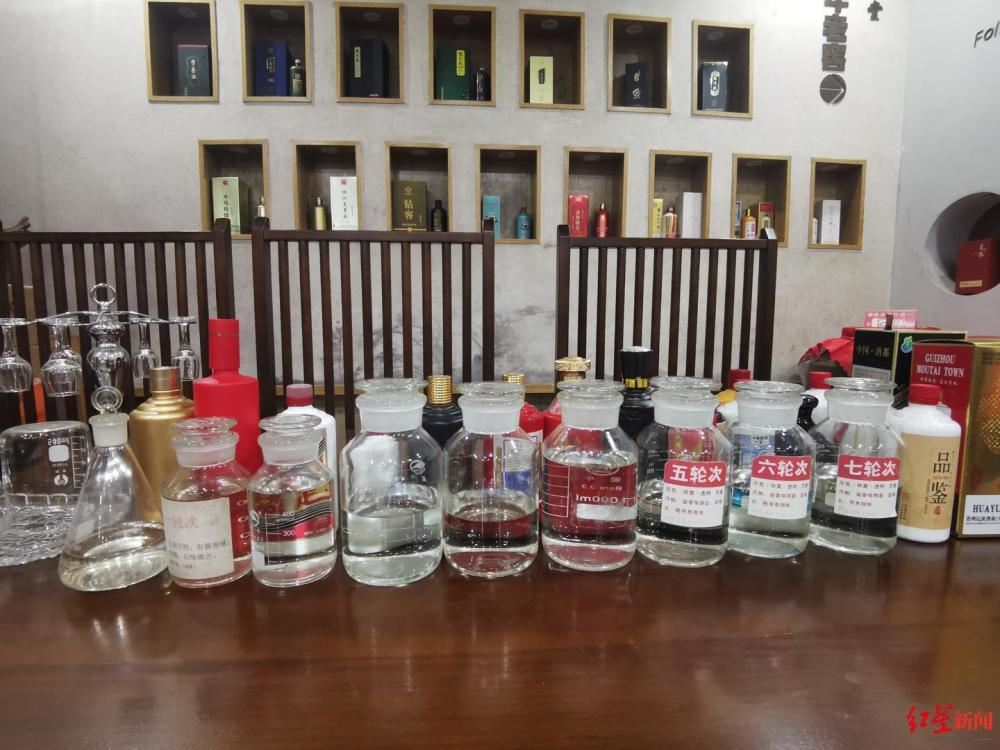
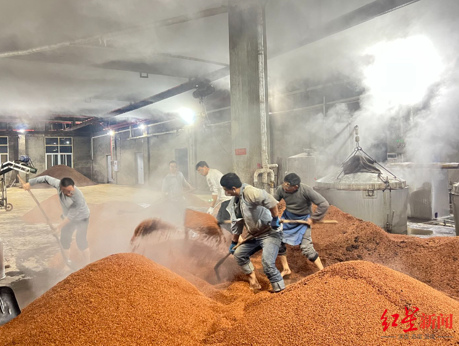
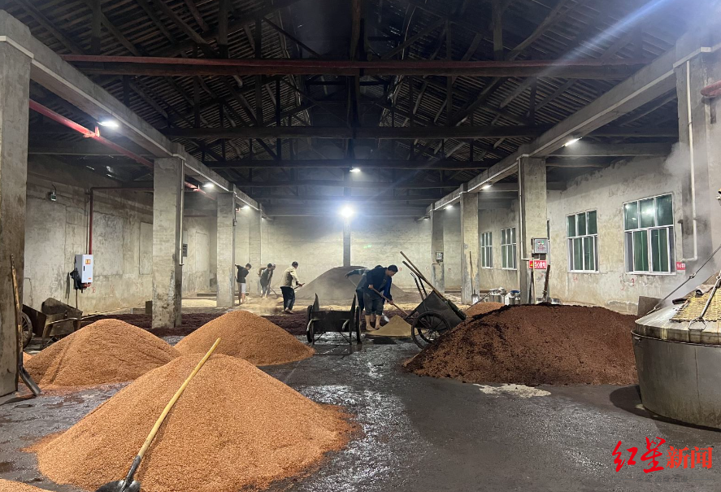
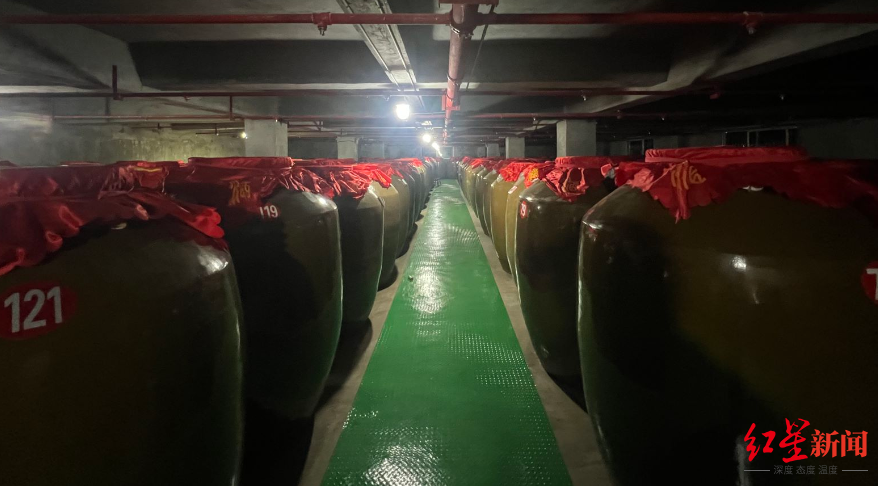

# 茅台镇酒厂大面积减产停产真相调查

“酱酒热”烧了几年后，温度逐渐下降，行业正趋于理性。

日前，有网传消息称，由于市场遇冷、客户返单不积极、社会库存过大等问题，茅台镇60%以上的酒厂出现了资金链问题，其中90%选择停产或减产。

真相究竟如何？12月初，红星资本局赶赴茅台镇调查采访。

经过几天的走访，红星资本局发现，茅台镇没有出现酒厂大面积停产、减产的现象，停产的酒厂属于少数，大部分酒厂已投粮。但部分窖池数量不足24个的酒厂已关停，也有酒厂顾忌行情，担心资金积压而主动选择今年不投产。

红星资本局注意到，从2020年至今，酱酒由“热”转“凉”，连茅台镇的窖池年租金也出现了明显下滑，下滑幅度约25%-33%，而酿酒所需的原料红缨子高粱单价同样有所下降。

**茅台镇“发酒疯”的2020年**

**当年投、当年卖，收益率高达100%**

近年来，在贵州茅台（600519.SH）的引领下，酱香型白酒（下称“酱酒”）受到市场热捧。

一组来自《2020-2021中国酱酒产业发展报告》的数据较完全的呈现了酱酒 **稀缺性、高利润**
的特点：2020年，酱酒实现产能约60万千升，约占整个白酒行业总产能的8%，但其销售收入约1550亿元，约占白酒行业的26%，而利润约为630亿元，约占整个行业利润的40%。

也就是说： **2020年，酱酒仅凭8%的产能，就贡献了白酒行业26%的收入、40%的利润。**

红星资本局注意到，约从2020年起，白酒行业内掀起了一股“酱酒热”，尤其是酱酒的核心产区——贵州省仁怀市茅台镇，更是受到了各路资本的热烈追捧。

茅台镇被誉为“中国第一酒镇”，凭借着赤水河沿岸独特的地理气候，这里不仅孕育出总市值超过2万亿元的上市公司贵州茅台，还有无数生产酱酒的酒厂、作坊在此扎根。

据不完全统计，融创中国（01918.HK）、海南椰岛（600238.SH）、众兴菌业（002772.SZ）、怡亚通（002183.SZ）和吉宏股份（002803.SZ）等上市公司都曾宣布布局茅台镇酱酒产业。

江先生（化姓）是2020年来茅台镇追逐风口的人之一，回忆起当年的情景，他用“发酒疯”来形容。

**“2020年，当年投、当年卖，基本上投100万赚100万，那个时候的（酱）酒就夸张到这种程度。”** 江先生对红星资本局回忆称。

需要说明的是，按照“12987”工艺，酱酒的生产周期长达一年，要经历两次投料、九次蒸煮、八次发酵和七次取酒。投料通常在重阳节前后进行，因此，正规生产不可能当年投、当年卖。

 _七轮次的酒液_

当红星资本局质疑为何能当年投、当年卖时，江先生回答称，
**“有人愿意买，为什么不卖？当时贴牌商到处收酒、找酒，生产出来的酒不愁卖，在老酒存量少的时候，大家自然会想着去打新酒的主意。”**

贴牌商四处找酒，这一场“酒疯”也曾席卷王女士所供职的H酒厂，他们甚至设置了门槛条件来“卡”贴牌商，比如，定制贴牌业务5000箱酒起做。

不过，随着“酱酒热”降温，王丽称，今年行情不好，竞争也大，H酒厂今年已经放低了与贴牌商合作的条件，不再卡定制数量，50箱、5箱都可以提供定制服务。

**年租金下降约25%-33%**

**窖池从“一窖难求”到 “租不出去”**

酱酒的热度确实已经冷下来了，最明显的是窖池租金的变化。

当资本涌入茅台镇时，摆在明面上的投资是入股或成立新公司，但也有人选择从当地人的手中租赁窖池、下料酿酒。

红星资本局走访茅台镇十余个酒厂了解到，前几年，窖池的年租金普遍在4万-5万元/个之间，有些优质窖池的年租金能超过6万元/个。甚至，一窖难求，有钱也未必能租到。

“前几年，你想租都很难租到，那个时候（酱）酒火嘛。现在租窖池，（酒厂）非常欢迎你们去租，因为有些酒厂的窖池租都租不出去。”江先生对红星资本局说。

在走访的过程中，红星资本局发现：即便现在是12月初， **距离传统投料“下沙”的重阳节已过去一个多月，但茅台镇仍有闲置的窖池，且年租金相对往年有所下降。**

_茅台镇某酒厂_

“今年的窖池好租，价格也相因（便宜）。”某酒厂的厂长李先生对红星资本局说，往年，他们那一片区域窖池的年租金约4万-6万元/个，而今年3万元出头就能租到一个窖池。

经广泛走访、采访后，红星资本局发现，当前，茅台镇窖池的年租金基本在3万元/个左右，少数窖池因特殊条件（如带行车、出酒品质高等）年租金相对较高，能达到4.5万元/个。

**也就是说，在过去几年中，窖池年租金的下降幅度大约为25%—33%。**

事实上，随着人们对酱酒的热情冷却，不仅是窖池的租金受到影响，酱酒的原料——红缨子高粱的价格也有所下降。

公开资料显示，红缨子高粱多种植于赤水河沿岸，其特点为硬质、干燥、支链淀粉含量高，能经受住九次蒸煮和八次发酵等工序，是酿造酱酒的重要原料之一。

有高粱商告诉红星资本局，2021年，红缨子高粱的卖价超过4元/斤，就连普通高粱的卖价也能达到3.7元/斤。而今年，品质最好的红缨子高粱卖价约2.7元/斤，单价减少30%。

**24个窖池以下小作坊需关停**

**也可以通过兼并重组获得“新生”**

在茅台镇走访的过程中，红星资本局发现，部分酒厂大门紧闭，从高处及侧面探望，厂区内没有任何生产作业的痕迹。

**有多家酒厂的负责人、经销商告诉红星资本局，根据当地政府的相关规定，今年，窖池数量不到24个的小作坊需要关停。茅台镇经发办相关负责人向红星资本局确认了这一消息属实。**

这实质上是2021年政策的延续动作。

早在2021年，红星资本局曾从知情人士处获取了一份《仁怀市白酒产业综合治理三年行动方案（送审稿）》（下称《行动方案》），该文件的落款时间为2021年7月。

《行动方案》中称，从2021年起，通过三年努力，仁怀市综合治理白酒生产小、散、弱企业600家以上；到2025年，全市白酒生产企业总数明显下降，规模以上企业不少于200家。

 _茅台镇某酒厂_

红星资本局了解到，过去，茅台镇的白酒产业呈现出“小散弱”的特点。其中，小酒厂、小作坊相对更容易出现低质高价、以次充好、虚假宣传（年份）、乱排污水等问题。

以酿酒过程中产生的污水为例，江先生向红星资本局透露， **“原来很乱，有些人会趁着暴雨半夜起来把污水放出去，暴雨一刷，鬼知道是谁放的，直接刷到河里了。**
”

红星资本局了解到，经过仁怀市茅台镇的综合治理，现在茅台镇的大小酒厂均需改造窖池底部、添加污水处理设备等，检查合规后方可获得相关证照，而后才可投粮生产。

同时，红星资本局从茅台镇经发办相关负责人处以及中小酒厂了解到，对于小酒厂、小作坊，当地政府并非一昧关停，它们可以通过兼并重组获得“新生”。

**卢先生称，他家开设的酿酒小作坊本只有20个窖池，但经过和另一家只有12个窖池的小作坊兼并重组，虽然现阶段仍是各管各的，但今年已顺利投粮，各类证照正在办理中。**

酒水行业研究者欧阳千里告诉红星资本局，从记者的采访情况看，茅台镇的白酒产业未来会更加趋于规范，让有限的资源发挥更大的价值。

**有酒厂主动选择不投粮**

**“行情不好担心积压大量资金”**

红星资本局了解到，刨除当地政府综合治理的因素，也有酒厂主动选择今年不投粮酿酒。

某酒厂的负责人胡女士告诉红星资本局，他们今年没有投粮，主要是因为今年酱酒的行情不好，而投产需要很多钱，一年的成本达到数百万元，这会导致大量资金积压。

综合多位受访者提供的数据，不同尺寸的窖池需要投入的红缨子高粱重量不同，而酿酒工人的日工资在300元-500元，普通窖池一年需要投入的成本在30万元/个左右。
**若以24个窖池计算，一年投入的成本约720万元。**

“ **每年烤出的酒要‘存’，像我们烤的酒要‘存’到下一年，甚至‘存’三年了才卖，这样资金就积压进去了。”** 胡女士对红星资本局说。

_茅台镇某酒厂的库房_

红星资本局注意到，区别于其他香型的白酒，酱酒主打的即为“时间价值”，存放的时间越长越值钱，这也导致酱酒在市场上的投放量往往受制于往年的生产量。

这曾是酱酒在市场上稀缺的原因，但现在也变相制约了酱酒生产企业的扩张。

**“人工、粮食、燃气费，这边正常的企业一年生产运营下来，没有1000万是烤不了酒的，资金压力很大，酒起码得放两年，如果不能形成一个循环周期——今年的销售收入不能赶上今年的成本，明年就没钱投，不是不想投，是已经没钱投了。”江先生对红星资本局说。**

欧阳千里对红星资本局分析称，当前，酱酒遇冷受到双重影响，即前期投资过热、当下消费遇冷，这导致渠道库存高企甚至核心消费者仓库亦不缺酒。

“受茅台酱香系列酒、业外资本的多重影响，前些年酱酒的热度居高不下，也带动了渠道的超前投入；受名酒企业‘存新酒、喝老酒’‘存酒胜过理财’的影响，多数核心消费者的仓库也囤积了不少酒。”欧阳千里对红星资本局说。

不过，欧阳千里认为，短期来看，此轮行业的下行周期短期与经济波动有关，等待经济稳定增长，周期自然结束。如果放在更长的周期来看，本轮下行周期还与人口结构、城市化进程等有关，这需要酒企调整产品结构、改变营销策略，才能尽快走出行业调整的影响。

**不过，红星资本局在走访中发现，停产的酒厂属于少数，茅台镇大部分酒厂已投粮。**

红星新闻记者 杨佩雯 摄影记者 冯泽洋

编辑 余冬梅

