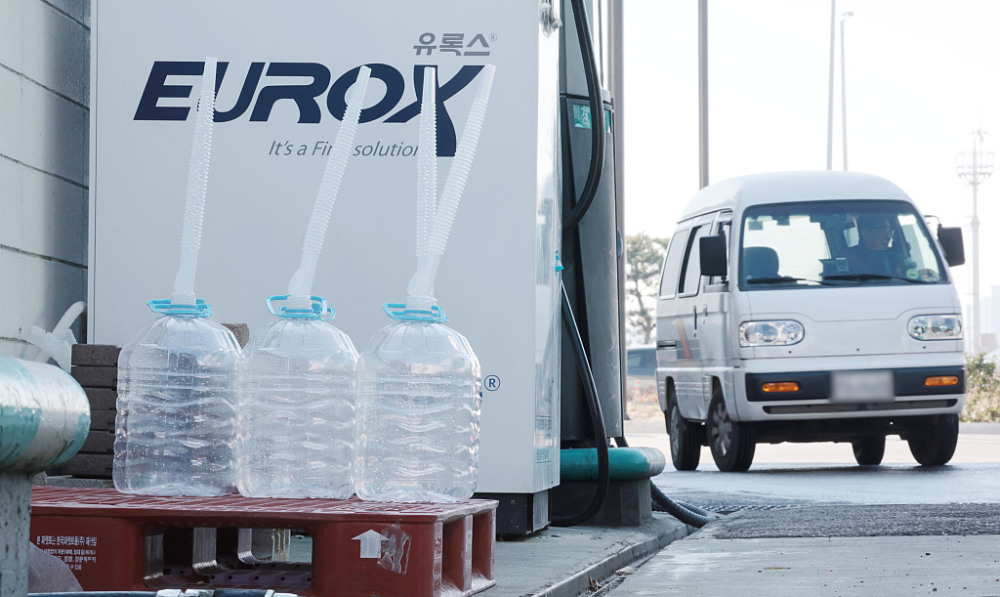

# 韩国担忧“中国调整尿素出口”，韩媒警告：韩国只有3个月库存

【环球时报驻韩国特派记者 张悦 环球时报记者
倪浩】“尿素荒”的话题在韩国持续升温。韩国媒体称，中国海关总署11月30日暂停中企向韩国出口尿素溶液的通关流程，韩国企业和官方对此反应敏感。据韩媒报道，12月1日，韩国政府就尿素溶液进口事项召开紧急会议，产业通商资源部产业供应链政策官主持，企划财政部、外交部等相关部门负责人出席。4日，韩国政府再度举行跨部门会议。同一天，韩国官员表示，中方举措是国内供应紧张所致，与政治因素无关。不过，韩国舆论的焦虑情绪未能因此消散，他们5日仍在提醒：工业用尿素溶液超过90%均为从中国进口，而进口多元化的措施被证明难以奏效。

_4日，韩国一座加油站里的车用尿素溶液空桶。（视觉中国）_

**韩国为什么紧张？**

尿素溶液在汽车产业的应用主要体现在两个方面：一是作为汽车尾气净化剂的主要成分，二是作为汽车发动机冷却液的主要成分。对于卡车、大客车等柴油车辆而言，尿素溶液属于必不可少的耗材原料之一。韩联社称，韩国以车用尿素溶液为主的工业用尿素溶液对华的依赖度高达约90%。

多家韩媒在5日的报道中提到，2021年，韩国曾因中国尿素出口管制，发生过一次持续一个多月的“尿素荒”。根据当时韩国政府的数据，韩国约有1000万辆柴油车，其中约400万辆需要使用车用尿素溶液，而这里面大约一半是货车。车用尿素溶液的短缺对物流行业造成了重大影响。有分析称，若货物运输中断，钢铁、水泥、汽车等制造业生产将出现严重混乱。更严重的是，这还可能造成电力生产及供给方面的问题。

今年1—10月韩国国内进口的车用、产业用尿素共29万吨，金额为1.28亿美元，相当于每吨400美元。韩国《朝鲜日报》5日称，韩国政府在2年前危机过后，曾表示已寻求卡塔尔、越南等替代进口地，但企业反映称，这等于在小区超市里能买到的东西，却让消费者付费打车去远处购买。小区超市里原本还可以买到稍微便宜或者价格差不多的东西，交了出租车费（物流费）后反而更贵了。最终，企业再次转向中国。据《韩民族日报》报道，韩国曾也有生产尿素的企业，但因缺乏竞争力，已在本世纪第一个10年前后停产。

**中国出于供应问题调整出口**

韩国产业通商资源部发言人崔南浩4日在记者会上表示，经与驻华外交机构和企业等多方渠道确认，中方推迟车用尿素溶液对韩出口通关流程是由国内供应紧张所致，与政治因素无关。

采访中，有知情人士5日向《环球时报》记者透露，尿素出口政策调整绝不是出于政治考虑，完全基于国内市场的保供。11月17日，中国氮肥工业协会发出了关于氮肥企业保障国内供应的倡议，提到近日中国氮肥市场出现较大波动，行业持续健康运行面临一定风险。

知情人士认为，现在正值明年春耕备肥阶段，化肥“稳价保供”在粮食安全的背景下愈发重要。该人士告诉《环球时报》记者，中国调整尿素出口是基于本国粮食生产角度出发的，是面向全球市场的调节。他认为，中国拥有14亿人口，与对外供应相比，保障国内粮食安全生产明显优先级更高。

金联创化肥分析师徐晓云5日告诉《环球时报》记者，今年6月中旬开始，尿素价格开始快速上涨，至7月底累计涨幅达到了30%左右。中国尿素出口突增，国内库存减少，刺激了价格在八九月进一步上涨。徐晓云认为，如果任由出口继续扩大，推升尿素价格进一步走高，最后势必影响国内供应。中国进行市场调整是必要的。

中国调整尿素出口的消息在9月就已有报道，彭博社当时引用消息人士的话称，为了维护中国化肥市场价格稳定，保障国内市场供应，中国已于9月初要求部分主要尿素出口商暂停新签出口协议。中国主要化肥出口商中农集团控股9月2日在其官网表示，将主动减少尿素出口数量，努力维护价格稳定。中国海洋石油公司9月4日也敦促其子公司在秋季播种季节前，优先保障国内尿素供应。

**中韩双方保持沟通**

据韩国媒体报道，韩国车用尿素溶液库存可供使用3个月。韩国政府也在从越南、日本等国进口尿素。但考虑到2021年因尿素短缺曾导致韩国国内物流几乎瘫痪的“蝴蝶效应”，韩国方面正在密切监测相关情况。

韩国媒体还称，韩国驻华使馆1日已向中国发改委、海关总署、商务部和外交部发送公文，积极寻求中方有关部门的协助，以确保已在中国海关完成货物检疫但尚未装船的尿素能够顺利通关。韩方还通过12月4日在北京举行的中韩自贸协定第五次联委会会议等外交渠道提出了稳定尿素供应链的必要性。在同日举行的外交部例行记者会上，新闻发言人汪文斌透露说，中韩双方有关部门就此保持着沟通。

韩联社5日引述消息人士的话报道称，韩国政府就尿素供应表达担忧后，中方表示，希望两国能持续顺利推进供应链合作，并将就韩方提出的问题寻求解决。报道透露说，中韩两国商定新设产业部门之间的司局级协商机制，共商稳控尿素溶液等多种品目供应链的方案，该机制最早将于月内启动。

徐晓云告诉《环球时报》记者，尿素涉及一个庞大的化工产业链，不是所有的国家都有这样的工业基础。对韩国来说，当前的现状只能是依靠海外供应，而“中国产量大，且海运距离近、成本低，韩国的上一次尿素危机最后也是依靠中国来解决的”。

上述知情人士告诉《环球时报》记者，此次中国出口调整是面向全球的，目前只有韩国对此表达了高度敏感。

