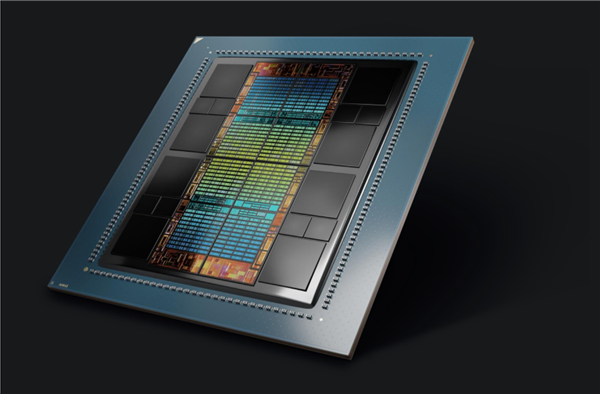
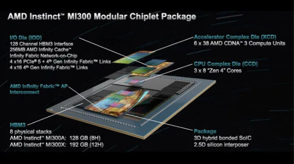
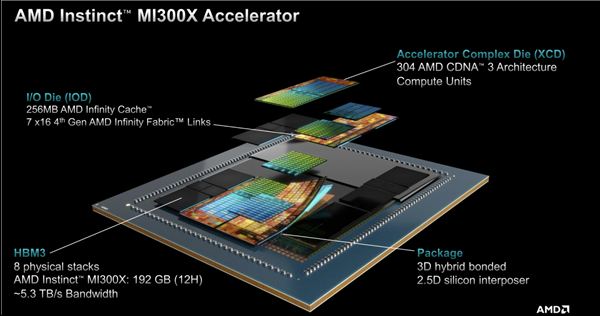
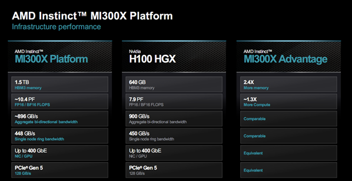
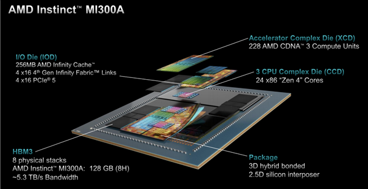
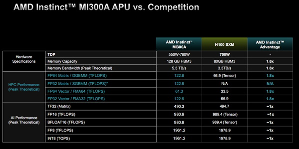
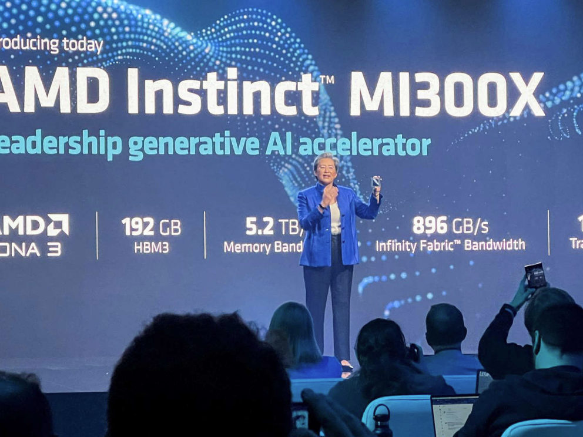

# 一文读懂AMD发布会：发布两款高性能芯片 瞄准英伟达AI王座

**划重点**

  * _1_ 在加州举行的发布会上，AMD发布了两款高性能AI芯片，将目标直接对准英伟达。
  * _2_ Instinct MI300X是传统的GPU加速器方案，晶体管数量多达1460亿个，是AMD投入生产的最大芯片。
  * _3_ Instinct MI300A是世界上第一个数据中心APU，将与英伟达的Grace Hopper Superchips直接竞争。
  * _4_ AMD新芯片的客户包括微软、甲骨文以及Meta等巨头，预计2027年AI芯片市场可能会增长到4000亿美元。

腾讯科技讯 12月7日消息，据外媒报道，当地时间周三，在美国加州圣何塞举行的Advancing AI大会上，芯片巨头AMD正式公布了Instinct
MI300系列加速器的详细规格与性能，以及众多的应用部署案例。这些芯片可用于支持人工智能（AI）、HPC高性能计算，帮助其在供应支撑人工智能热潮的半导体竞争中与英伟达展开竞争。

在Advancing AI活动上，AMD推出了Instinct MI300X人工智能加速器和世界上首款数据中心APU Instinct
MI300A，该公司希望利用蓬勃发展的生成式人工智能和高性能计算市场。AMD使用有史以来最先进的制程工艺来制造其MI300系列产品，采用“3.5D”封装等新技术来生产两款多芯片处理器，并表示在各种人工智能工作负载中提供超过英伟达的性能。AMD并没有透露其新型芯片的价格，但这些产品现在正在向众多OEM合作伙伴发货。

Instinct MI300X是一款可以改变游戏规则的设计，这款数据中心APU混合了总共13个芯片，其中许多是3D堆叠而成，创建了一个带有24个Zen 4
CPU内核、融合了CDNA 3图形引擎和8个HBM3堆栈的芯片。总的来说，这款芯片有1460亿个晶体管，是AMD投入生产的最大芯片。

AMD表示，其Instinct MI300X GPU在人工智能推理工作负载方面的性能比Nidia
H100高出1.6倍，在训练工作中也提供了类似的性能，从而为业界提供了英伟达GPU的高性能、急需的替代产品。此外，这些加速器的HBM3内存容量是英伟达GPU的两倍多，内存容量达到了192
GB，使其MI300X平台能够支持每个系统的大语言模型数量超过两倍，并且运行比英伟达H100 HGX更大的模型。

AMD Instinct
MI300A基于与MI300X相同的设计，但在设计中混合了CPU内核，同时剔除了部分GPU内核。AMD声称，在某些工作负载下，这款芯片的性能比英伟达的H100
GPU高出4倍，每瓦的性能是英伟达的两倍。

**01 Instinct MI300X：AMD芯片设计的巅峰**

MI300X代表了AMD芯片设计方式的巅峰，将8个12Hi的HBM3内存堆栈与8个3D堆叠的5纳米CDNA 3
GPU芯片（称为XCD）融合在4个底层6纳米的I/O芯片上，这些芯片使用AMD现已成熟的混合键合技术连接。

结果是一个750W的加速器，拥有304个计算单元、192GB的HBM3容量和5.3
TB/s的带宽。该加速器还具有256MB的无限缓存，作为共享L3缓存层，以促进芯片之间的通信。AMD将其封装技术称为“3.5D”，这意味着3D堆叠GPU和I/O芯片的组合，采用混合键合，其余模块采用标准2.5D封装。

MI300X加速器设计用于在AMD的生成式人工智能平台中以8组为单位工作，通过Infinity Fabric互连的GPU之间的吞吐量为896
GB/s。该系统具有1.5TB的HBM3内存，并提供高达10.4
Petaflops的性能（BF16/FP16）。该系统建立在OCP通用基板（UBB）设计标准上，从而简化了采用方式。

AMD的MI300X平台拥有比英伟达的H100
HGX平台（BF16/FP16）多2.4倍的内存容量和1.3倍的计算能力，同时保持相当的双向和单节点环带宽。AMD为MI300X平台配备了400GbE网络，并支持多种网卡，而英伟达则倾向于使用自己收购Mellanox后的网络产品。

AMD分享了一系列性能指标，显示其在HPC工作负载上的峰值理论FP64和FP32矢量矩阵吞吐量是H100的2.4倍，在人工智能工作负载上的峰值理论TF32、FP16、BF16、FP8和INT8吞吐量高达1.3倍，所有这些都没有稀疏性（尽管MI300X确实支持稀疏性）。

MI300X的巨大内存容量和带宽是支持推理应用的理想选择。AMD使用了一个1760亿参数的Flash Attention
2模型，声称在代币/秒吞吐量方面比Nvidia H100有1.6倍的性能优势，而一个700亿参数的Llama
2模型则突出了1.4倍的聊天延迟优势（从2K序列长度/128代币工作负载开始到结束测量）。

AMD的MI300X平台在300亿个参数的MPT训练工作量中提供了与英伟达H100
HGX系统大致相同的性能，但重要的是要注意，这个测试并不是加速器的一对一比较。相反，这个测试让8个加速器组相互竞争，因此平台级功能更多地成为一个限制因素。

说到这一点，AMD还声称MI300X平台的内存容量优势，允许托管多达H100系统两倍的300亿参数训练模型和700亿参数推理模型数量。此外，MI300X平台最多可以支持700亿参数训练模型和2900亿参数推理模型，这两个模型的大小都是H100
HGX支持模型的两倍。

当然，英伟达即将推出的H200
GPU将在内存容量和带宽方面更具竞争力，而计算性能将保持相似。英伟达要到明年才会开始发货，因此与MI300X的竞争比较仍有待观察。

**02 Instinct MI300A：性能全面超越英伟达H100**

AMD的Instinct MI300A是世界上第一个数据中心APU，这意味着它在同一个封装中结合了CPU和GPU，并将与英伟达的Grace Hopper
Superchips直接竞争，后者将CPU和GPU放在单独的芯片封装中，协同工作。MI300A已经在El
Capitan超级计算机中取得了显著的优势，AMD正在将这种芯片交付给其合作伙伴。

MI300A使用与MI300X相同的基本设计和制造方法，但在三个5纳米核心计算芯片（CCD）中分别替换了八个Zen 4
CPU内核，与EPYC和Ryzen处理器相同，从而取代了两个XCD GPU芯片。

这使得MI300A配备了24个线程CPU内核和228个CDNA 3计算单元，分布在6个XCD
GPU芯片上。与MI300X一样，所有的计算芯片都混合键合到四个底层I/O Dies
(IOD)上，从而实现比标准芯片封装技术所能实现的更高的带宽、延迟和能效。

AMD通过使用8个8Hi的HBM3堆栈来减少内存容量，而不是MI300X使用的8个12Hi堆栈，从而将容量从192GB削减到128GB。内存带宽保持在5.3
TB/s。AMD称，减少内存容量的决定不是因为电源或热限制，而是它为目标高性能计算和人工智能工作负载量身定制芯片。无论如何，128GB的容量和5.3
TB/s的吞吐量仍然是英伟达H100 SXM GPU的1.6倍。

MI300A有一个默认的350W TDP，但它可以配置到760W。AMD根据使用情况在芯片的CPU和GPU部分之间动态分配功率，从而优化性能和效率。

内存空间由CPU和GPU共享，从而消除了数据传输。这种技术通过消除单元之间的数据传输来提高性能和能源效率，同时也减少了编码负担。与MI300X一样，该芯片具有中央256MB无限缓存，有助于确保流经芯片的数据的带宽和延迟。

AMD声称在FP64矩阵/DGEMM和FP64/FP32矢量TFLOPS方面比H100有1.8倍的优势，而在TF32、FP16、BF16、FP8和INT8方面与H100不相上下。

在OpenFOAM高性能计算摩托车测试中，AMD声称其MI300A比英伟达H100快4倍，但这种比较并不理想：H100是一个GPU，而MI300A的CPU和GPU混合计算通过其共享内存寻址空间在内存密集型工作负载中提供了固有的优势。与英伟达Grace
Hopper
GH200超级芯片进行比较会更好，后者也将CPU和GPU紧密耦合在一起，但AMD表示，它找不到任何公开列出的英伟达芯片的OpenFOAM测试结果。

AMD确实展示了英伟达GH200的每瓦性能数据，以突出其2倍的优势，这些结果是基于有关H200的公开信息。AMD还强调了在Mini-
Nbody、HPCG和gromac基准测试中与H100的比较，分别领先1.2倍、1.1倍和1.1倍。同样，对于这组基准，与GH200的比较将似乎更为理想。

**03 AMD期待新芯片提振业绩，瞄准英伟达AI王座**

随着服务器制造商将这些芯片整合到自己的系统中，以及包括微软和甲骨文在内的云计算服务供应商开始提供对这些芯片的访问，AMD的芯片预计将得到广泛应用。

“这一年告诉我们，人工智能不仅仅是一种很酷的新事物，它实际上也代表着计算的未来，”AMD首席执行官苏姿丰（Lisa
Su）说，她将人工智能比作“互联网即将到来的黎明”。

AMD已经在期待这些芯片能够引发强烈反响。该公司在最新的财报中表示，预计第四季度人工智能芯片的收入将达到4亿美元，明年将超过20亿美元。原因是对算力永无止境的需求，而算力是开发OpenAI的ChatGPT或谷歌的Bard等先进人工智能系统所必需的。

此前，英伟达一直是人工智能芯片市场的主导者。该公司报告称，最近一个季度，其人工智能芯片部门的销售额约为145亿美元，高于去年同期的38亿美元。销售额的大幅增长推动英伟达的股价飙升，该公司成为6月份市值超过1万亿美元的少数公司之一。

与此同时，AMD是众多试图利用人工智能需求挑战英伟达的初创公司和大型科技公司之一。芯片制造商英特尔已经在市场上推出了一套人工智能芯片，亚马逊和谷歌也在制造自己的人工智能芯片。微软上个月表示，它也在制造一款名为Maia
100的人工智能芯片。

苏姿丰说，到2027年，大多数人工智能计算所在的数据中心需要的人工智能芯片市场可能会增长到4000亿美元。这远远超过了其他行业的预测，包括研究公司Gartner今年8月预测。当时，该公司预计，到2027年，人工智能芯片的收入将达到1190亿美元左右，高于今年的530亿美元左右。

然而，AMD和英伟达都不能在没有美国许可的情况下向中国客户销售其最先进的人工智能芯片，这限制了它们进入世界上最大计算市场之一的能力。不过，英伟达已经开发出了专门针对中国市场的芯片，这些芯片的性能低于需要许可证的门槛，而AMD还没有这样做。

AMD表示，配备其新芯片的系统在创建复杂人工智能工具方面与英伟达基于H100的顶级系统一样出色，但在从大语言系统生成响应方面速度更快，这一说法尚未得到独立证实。该公司声称其芯片带来的大量计算机内存，这使它能够处理更大的人工智能系统。

在人工智能热潮的早期阶段，英伟达一直占据主导地位，部分原因是它在需求旺盛到来几年前就投资了这项技术，而对生成式人工智能兴趣的激增令AMD等竞争对手感到意外。使用英伟达芯片进行人工智能计算的软件越来越多，使其成为行业标准，并导致需求激增，该公司有时难以满足需求。

此外，英伟达也并未因此满足。上个月，这家芯片巨头发布了一款名为HGX
H200的新系统，该系统具有更先进的计算机内存，以迎合大型人工智能语言系统的需求，预计明年将有进一步的改进。

英伟达无法满足需求促使客户积极寻找替代品，AMD希望利用好这个机会。苏姿丰在今年早些时候表示，她“不相信护城河的存在，因为市场的发展速度如此之快。”

**04 微软、OpenAI等宣布将用AMD芯片替代英伟达芯片**

微软、甲骨文、Meta以及OpenAI都已经表示，他们将使用AMD最新的AI芯片Instinct
MI300X取代英伟达图形处理器，尽管后者对于创建和部署OpenAI的ChatGPT等人工智能程序至关重要。

如果AMD最新的高端芯片在明年初开始出货时，足以满足构建和服务人工智能模型的科技公司和云服务提供商的需求，它可能会降低开发人工智能模型的成本，并对英伟达不断飙升的人工智能芯片销售增长构成竞争压力。

AMD表示，MI300X基于一种新的架构，这种架构通常会带来显著的性能提升。它最显著的特点是拥有192GB的尖端高性能HBM3内存，传输数据速度更快，可以适应更大的人工智能模型。

AMD面临的主要问题是，一直以英伟达芯片为基础的公司是否会投入时间和金钱来增加另一家GPU供应商。

AMD周三告诉投资者和合作伙伴，该公司已经改进了名为ROCm的软件套件，以与英伟达的行业标准CUDA软件竞争，从而解决了一个关键缺陷。这个缺陷一直是人工智能开发者目前更喜欢英伟达芯片的主要原因之一。

价格也很重要。AMD在周三没有透露MI300X的定价，但英伟达的芯片每块售价约为4万美元。苏姿丰表示，AMD的芯片必须比英伟达芯片的购买和运营成本更低，才能说服客户购买。

AMD已经与多家急需GPU的公司签订了使用其新芯片的协议。根据研究公司Omidia最近的一份报告，Meta和微软是2023年英伟达H100
GPU的两大买家。

Meta表示，它将使用MI300X GPU处理人工智能推理工作负载，如处理人工智能贴纸、图像编辑和操作其助手等。

微软首席执行官萨蒂亚·纳德拉（Satya
Nadella）上个月说，微软的Azure云计算服务将率先提供AMD新的MI300X人工智能芯片。该公司首席技术官凯文·斯科特（Kevin
Scott）也表示，该公司将于周三通过Azure网络服务开始向客户提供AMD芯片的预览。

甲骨文一位高管称，该公司旗下云计算部门也计划提供这种芯片。
OpenAI表示，它将在一款名为Triton的软件产品中支持AMD的GPU。Triton不是像GPT那样的大语言模型，但用于人工智能研究，以获取芯片功能。

AMD股价周三尾盘下跌1.3%，至116.81美元。英伟达股价下跌约2%。（编译/金鹿）

