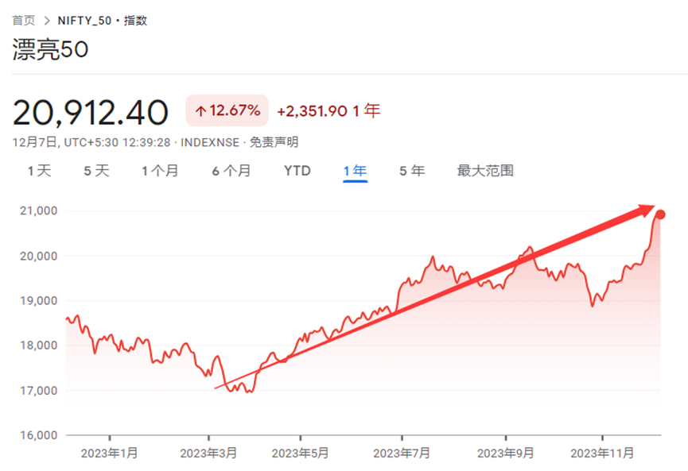

# 创了新高、涨了八年的印度股市，2024年还能买吗

今年印度股市的疯狂走势再次引人注意，在金融股和能源股的推动下，总市值逼近40000亿美元，仅次于美国、中国和日本。

**明星股们齐头并进，主要股指Nifty 50指数今年已上涨近13%，正向史无前例的八年连涨迈进。**

而且与2020年和2021年的流动性和科技引发的狂热不同，今年的反弹有更坚实的基础：

**经济增长强劲，企业利润率上升，估值看起来更加稳健。** 例如，根据FactSet的数据，iShares India MSCI
ETF的交易价格是未来12个月预期收益的21倍，略高于标普指数的19倍和新冠疫情前该ETF的平均市盈率，后者也在19倍左右。

而且，印度对投资者保护极为重视，比如，企业退市时必须回购投资者手上的股份，确保股东权益不受侵害，
**机构投资的T+3、个人T+0的交易机制对个人投资者更加友好。**

**2023年正在收尾，而2024年近在咫尺，几近疯狂的印度股票还值得买吗?**

人口超过

14

亿，印度正朝着全球第三大经济体迈进

从基本面上看，印度有很多优势支撑股市上涨，比如经济增长异常迅猛、通胀下降、政治环境相对可预测，科技行业蓬勃发展。

得益于制造业和政府支出的增长，印度三季度GDP同比增长7.6%，是成长最快的主要经济体。据国际货币基金组织（IMF）预测，
**到2027年印度将超过日本和德国成为全球第三大经济体。**

另据经纪公司里昂证券称，廉价的俄罗斯石油约占印度石油进口总量的45%，为央行抑制通胀提供了支持。

投资服务公司Hargreaves Lansdown的投资分析师Henry Ince表示：

印度经济的强劲势头已成为投资亚洲和新兴市场的投资者关注的焦点。

**印度还是世界上人口最多、最年轻人口的国家之一，正在迅速吸收跨国公司的制造业投资。**

“（经济）增长得益于良好的人口结构，印度14亿人口中有近70%处于工作年龄。”Ince指出，“消费，尤其是中产阶级的消费，将成为投资者的一个重要主题。到2050年，印度预计将为全球中产阶级消费贡献约40%，比目前的5%大幅增加。”

富兰克林邓普顿全球指数投资组合管理主管Dina Ting表示：

人们正在认识到（印度）是一个他们无法忽视的市场。

她认为，印度既受益于其自身的改革议程，也受益于全球经济的发展趋势。

Ting指出，印度政府进行了一系列促进增长的改革，例如在全国范围内推出商品和服务税，取代了多种地方税；以及基础设施建设，例如计划在未来五年内建设80个机场。

“改革和基础设施建设是关键，”Ting说，“在很多情况下，印度在基础设施方面十分落后”，但政府现在的重点是“通过对机场和飞机的巨额投资来促进运输业发展”。

Ting认为，人口、信息技术优势将帮助印度吸引更多投资者，使其在MSCI新兴市场指数占据更高的权重，目前这一数字为15.3%。

印股“功臣”外资或有更多流入空间

作为全球第五大股票市场，印度股市可能仍有更多外资流入的空间。

里昂证券的数据显示， **目前非居民投资者持有印度股票的比例为17.5%，仍远低于2021年2月20.6%的峰值。**

Kotak Mahindra资产管理公司指出，今年迄今为止，印度股市净流入120亿美元的外资，而去年则净流出170亿美元。

外资大幅流入，莫迪领导的印度人民党在州选举中取得了成功，推动Nifty50和Sensex股指在最近几天创下新高。

市盈率接近美股，印度股市上涨空间有多大？

自2020年初以来，Sensex指数已上涨了60%以上，而MSCI新兴市场指数已下跌12%。

**Sensex指数去年平均市盈率为21.4倍，与美股市盈率相似，相比之下，MSCI新兴市场指数和斯托克欧洲600指数市盈率分别为11.9倍和12.5倍。**

因此，Ince认为， **现在印度股市估值很高。** 他警告说：

考虑到印度相对于其他亚洲和新兴市场国家的表现，现在还不是在投资组合中超配印度的时候。

摩根大通资产管理公司新兴市场及亚太团队首席投资官Anuj Arora也警告称，过去30年，
**印度股市曾4次出现类似的估值，“每次都导致了5年的停滞期”。**

零售投资平台Interactive Investor基金研究主管Dzmitry
Lipski认为，目前印度股市的估值高于其他新兴市场，“并且在历史上处于较高的位置”，但他认为这不应该成为破坏交易的因素——除非有人纯粹是为了短线投资。

另值得注意的是，外国投资者在印度股票市场的收益会被稀释，持有印度股票不到一年的外国投资者需缴纳15%的资本利得税，持有时间更长的头寸需缴纳10%的资本利得税。

而且，印度对许多股票有外国所有权限制，限制外国投资者可以持有的股份比例。这给被动基金带来困难，因为他们需要构建合理分散的指数来跟踪，但外资限制使他们无法充分复制指数；对主动基金也是一种限制，因为他们无法根据只对一些最中意的股票进行充分投资。

其他风险因子：油价、通胀、公共负债…

当然，一些不确定因素将影响明年印度股市的走势。

印度几乎所有石油都依赖进口，油价反弹可能会迫使印度央行重返强硬立场， **如果美联储明年开始降息，印度央行将无法跟随降息。**

10月份印度通胀率同比触及5个月低点4.87%，但仍高于央行4%的目标，这表明印度央行在货币政策方面必须采取更谨慎的立场。

尽管印度也拥有大量外汇储备，但仍持续存在经常项目赤字。

三季度，印度经常项目赤字已从一季度的13亿美元（占GDP的0.2%）扩大至92亿美元，占GDP的1.1%。

公共负债也对印度经济造成压力。

咨询公司Gavekal表示， **印度政府债负担已占GDP的80%以上，是新兴市场中政府债负担最高的国家之一。**

政府债不断上升，意味着公共投资两位数的高增长率可能难以维持。如果印度想要真正的基建大国，政府债将是一个重大隐患。

