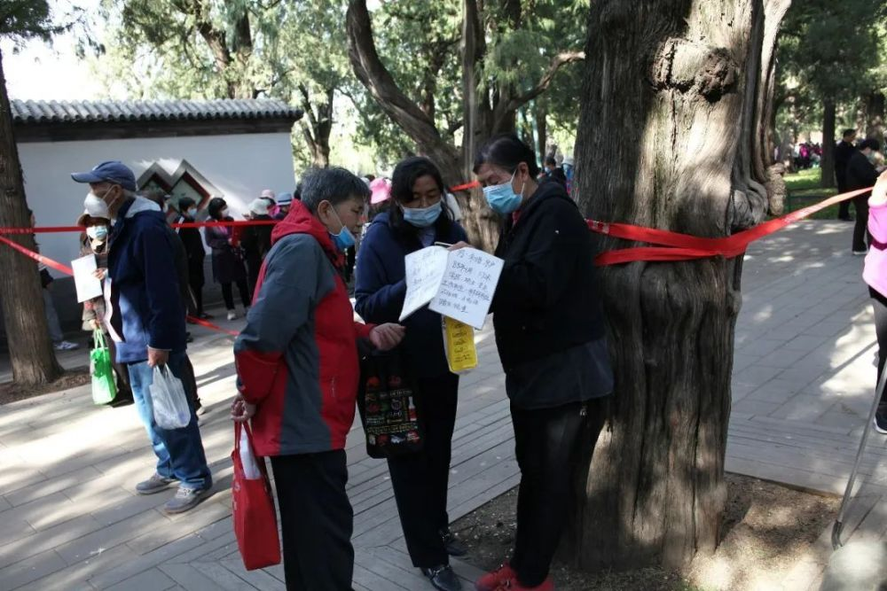
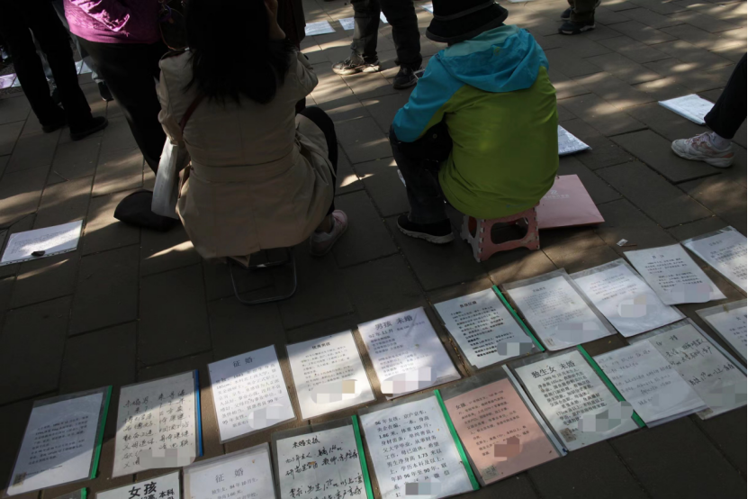
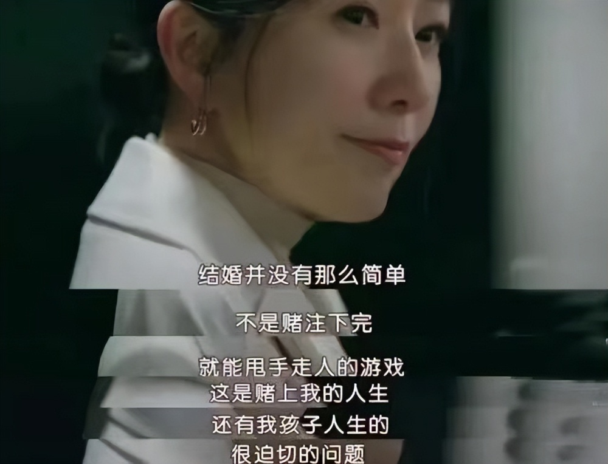
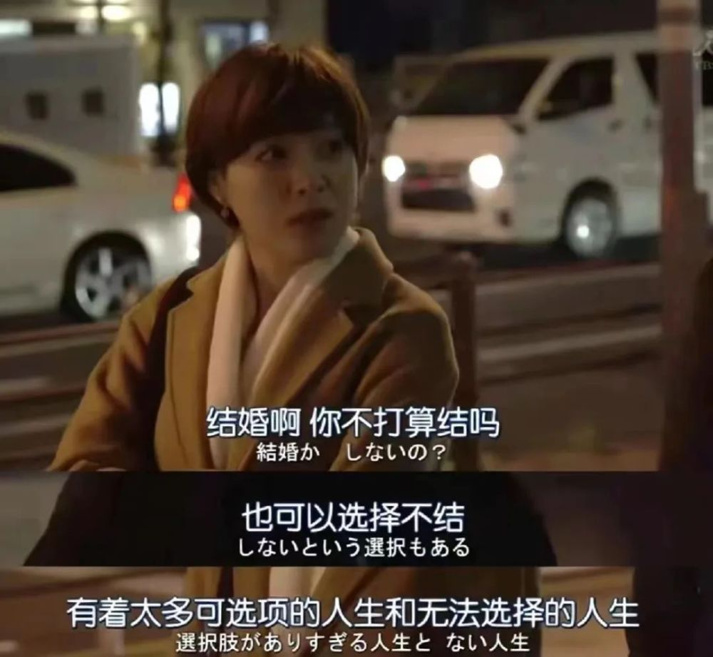
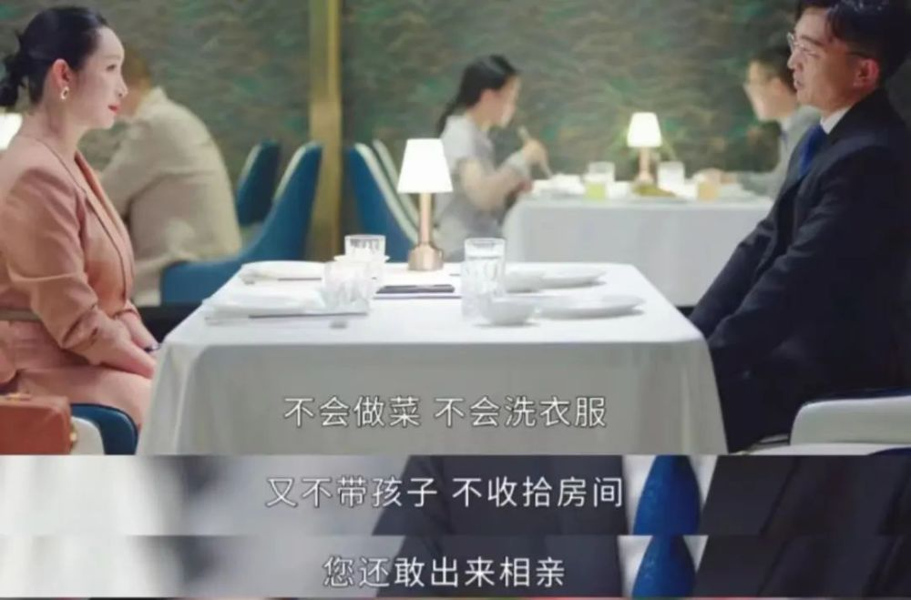
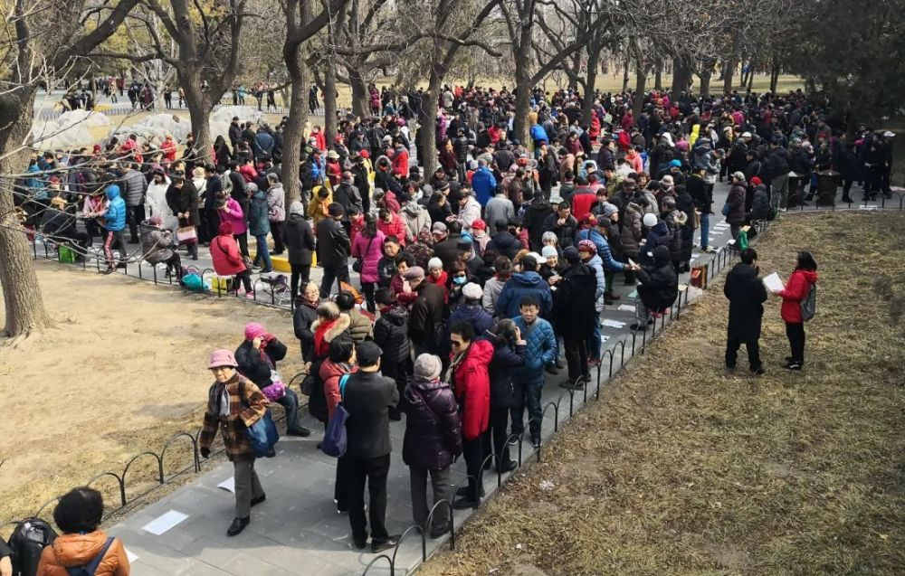

# 北京相亲公园图鉴：有人坚持五年如同上班，有人称“我像挂着的猪肉”

**中山公园的相亲角，是北京规模最大的一处，每周四和周日下午，超过八千份征婚启事在这里等待配对，数百名家长在此寻找、驻足。**

**北京还有两个同样出名的相亲角——玉渊潭公园和天坛公园。这三处相亲角开放时间不同，相错开放，涵盖一周七天。除了三大公园，海淀公园、朝阳公园等北京公园，也都有或有过相亲角。**

**相亲公园的共同特点是女生简历极多，能占到八成以上。另一方面，各自也有差别：中山公园规模最大，外地人也最多；天坛公园的北京本地人最多；玉渊潭公园的年龄层要更小，甚至“连00后都有”。**

**有人避之不及，有人则成了“相亲钉子户”。最后，无论人们常去的是哪一个相亲公园，一旦卷入这个系统，时间久了，就会慢慢被它改变。**

**文 |** 王潇

**编辑 |** 易方兴

**运营 |** 橙子

**“我好像一块挂着的猪肉”**

35岁的北京人张阵，已经相亲了不下一百个女生了。

他自己只去过一次相亲公园，但却早已是北京各大相亲公园的“老熟人”了。因为绝大多数时候，都是他妈妈去跑公园，他本人并不需要出现。张阵体重两百多斤，他说自己一定要找个瘦的。在公园里，他妈妈碰到合适的女生就会上去搭讪，介绍儿子的情况——老北京人、有房有车、年薪三四十万。然后，给女生看照片，同意之后，再约见面。这样的过程已经重复了无数次。寻找结婚对象就如同长跑，他们家这一跑，就是五年多。

这些年，张阵几乎试遍了所有相亲渠道：相亲公园、亲戚朋友介绍、相亲网站，就连“婚姻中介的盈利模式都要摸清楚了”，红螺寺、广济寺（主求姻缘的寺庙）都去了，连家里的冰箱贴都是月老。相比这种种渠道，最便宜、最直接、也能在短时间接触最多人的，无疑是相亲公园。在北京，作为传统，也作为公共空间的一种，不少公园都承载了相亲的需求。但论及相亲规模，中山公园、天坛公园和玉渊潭公园则排在前列。

不过，尽管相亲公园有诸多优势，但只去过相亲公园一次的张阵，却并没有留下什么好印象。那一天，他站在相亲公园里，满眼都是地上的一张张A4纸，短短数十字，囊括年龄、户口、学历、收入等多个维度，几十年的人生就被压成了一张纸。他觉得自己“好像一块挂着的猪肉，被挑挑拣拣”。

11月初，我也来到了中山公园去体验相亲。中山公园的相亲角是北京规模最大的一处，每周四和周日下午，超过八千份征婚启事在这里等待配对，数百名家长在此寻找、驻足。

进门向北走，尽头处是一道带拱门的石墙，像一道围城，隔开两个世界。跨过拱门，我才理解了张阵所说的“被挑挑拣拣的感觉”。这里在很多方面都像一个集市。大爷大妈们或支个马扎，或靠树根一站，摆摊一样，面前齐齐地码着一溜A4纸（相亲者简历），“摊主”热情地招呼着逛摊驻足的人。

一个坐拥十几张A4纸的大爷，向面前男孩的家长推荐，先是脚尖一点——“91年北京女孩”，男孩家长嘴角向下摇摇头，“大了”；大爷又把脚尖一挪，点点“94年央视京户靓女”，家长扫向纸面下方的择偶要求，轻皱眉头。大爷见状紧接一句“可以聊一聊，主要看缘分”。

除了有着热闹气氛外，正如集市上可以对商品进行评论，在相亲公园，但凡是写在A4纸上的条件，都可以被围观、审视、评价。

_▲北京中山公园相亲角。图 / 视觉中国_

比如，老北京人赵建国，就在他人的指点下，不断修改着儿子的简历。今年六月份，他看报纸上说中山公园有相亲角，寻摸着给28岁的儿子找对象。他文化水平不高，让打印店老板帮忙编了一段“描述”，一张纸密密麻麻，介绍了儿子的年龄、职高学历、柜台工作，详细得连职高读了几个项目，在阿迪达斯站柜台，都一五一十写了上去，右上角还印着儿子照片。

有热心家长看了直摇头，指点他：北京户口要在开头点出来；不用放照片，“这都没有用”；内容不要太啰嗦，“哪有人有工夫看这么细”；不用写专业，“就写专科大家就了解了”。

于是，一顿修改下来，简历上短短五十个字，就总结了儿子28年的人生和婚姻期待。

赵建国去的次数多了，有的家长给他透露了更多信息。不只中山公园，北京还有两个同样出名的相亲角——玉渊潭公园和天坛公园。三个公园的相亲角开放时间不同，相错开放，涵盖一周七天。

他也发现，这三个公园的共同特点是女生简历极多，能占到八成以上。另一方面，各自也有差别：中山公园规模最大，外地人也最多；天坛公园的北京本地人最多；玉渊潭公园的年龄层要更小。赵建国逛中山公园和天坛公园时，儿子算年纪小的，可到了玉渊潭，发现更多比儿子还小的，地上摆着96年、97年的，“连00后都出来了”。

对于给儿子找对象这事，赵建国投入了极大的热情。他原本坐公交车去相亲公园，有一次钱包被偷了，从那以后，腿脚不好的他开始蹬自行车去相亲角，连下雨天也要去，挨个相亲公园转悠，“多来看看，没准遇到合适的呢”。

但很显然，找到合适的，并不是件容易的事。在这背后，也有时代的隐忧。根据民政部统计数据，2022年，全国结婚登记数量为683.3万对，跌破700万对，较上一年减少80.3万对，下降约10.6%，结婚率已经连降九年。而北京的结婚率要更低一些，根据《中国统计年鉴2023》，2022年北京的结婚率在全国排名倒数第五，仅为4.18‰。

_▲图 / 《夫妻的世界》剧照_

**哪里人？**

在北京的这些相亲公园里，婚姻是可以被量化的，各种资源也是能被置换的。人们的搭讪也因此拥有了固定的模式，一般从一两个问题开启，比如，哪里人？

“哪里人”的问题，几乎算是个前置问题。很多时候，只有当这个问题达成了一致，后续的对话才能进行下去。

一开始张阵也是如此。五年前的时候，那会儿张阵才30岁。当时，张阵妈妈发愁起儿子的婚姻，对未来的儿媳妇有许多要求。他们一家都是老北京，其中最主要的要求，就是要求女方“必须是北京本地人”。

显然，户口是一种资源。以2023年为例，北京申报落户人数超十万，仅6003人成功“上岸”，且要求颇高。对于想拥有北京户口的普通人来说，结婚几乎成了最容易实现的方式。

30岁的南方女生王清，毕业于一所985院校，工作能力强。今年她想跳槽，好几家公司想挖她。不过，最后对方HR一听她未婚未育，就没了下文。

起先，王清没当回事，加上她所在的部门没有经理，她很有希望升职。但左等右等，一直没动静。直到有一次闲聊，总监感叹“感觉你总有一天是要离开北京，回老家的”。她这才不得不开始考虑“定下来”的事。她当周就直奔天坛公园，目标明确，对方最好有北京户口。

不过，在相亲公园，同样是北京户口，背后体现的价值也有分别。比如37岁的吴川，今年刚从老家浙江调到北京工作，工作会解决户口。他很想结婚，所以进京的第二天，他就带着印有“新北京人”几个醒目大字的简历，去了中山公园。

可到了公园，吴川才发现不是那么回事。他看到，有的简历择偶要求里，明确写着“要身份证110开头的”，这就排除了他这类新北京人。

_▲图 / 《上海女子图鉴》剧照_

相比之下，在北京相亲公园的评价体系之中，没有北京户口的人很多时候显得颇为尴尬。33岁的甘肃人李林，在相亲公园和家长们的聊天几乎不会超过两句，因为一旦得知他是外地人，家长们就会眼含失望地结束搭讪。有时甚至女方家长们一听他的口音，就掐了话头。

而京房，作为京籍的连带资源，通常也一起出现。但也有着细分要求，有的简历还明确印着“要房子在朝阳区、东西城区、海淀区的”。

赵建国就吃了这个亏。他在西城区买了套两居室回迁房，打算自己和儿子一起住，今年六月刚装修完，心想总算在主城区有楼房了，这才敢动身去相亲角。

可到了相亲角才发现“根本不是这么回事儿”。女方家长问得很细，不仅得有房子，房本上的名字还必须得是儿子一个人的。但是，平房拆迁，写着儿子名字的那套房得过两年才能分下来，女方家长一听，扬起嗓子，“过两年哪行？这根本不算”。

赵建国很感叹，因为他自己年轻时，和父母一起住，“屋里拉个帘就能结婚了”。

**被年龄捆绑**

“哪一年”在相亲角也是个重要问题，一般紧随“哪里人”之后。而这个问题通常和女性紧密捆绑。

张阵妈妈已经放弃了大多数条件，但有一个条件是张阵着重强调过绝不能让步的：女方一定要30岁以下。

说服过程并不容易，在张阵妈妈原本的一套严苛筛选条件下，竟真的找来了一个符合条件的，可张阵一联系，女方四十多岁，回去一问，张阵妈妈摆摆手“凑合一下也行”。

早些时候，张阵根据A4纸上的内容，特地做了一个PPT，取名“相亲纲领”，还列了个EXCEL表格，表格里列了三大考察维度：硬性价值、软性价值和情感价值。他拿着手机一条条跟妈妈解释，外貌、身材、生育能力等都是硬性价值，张阵在PPT里写下结论：随年龄增长（价值）下降，通常男性下降平缓，女性下降迅速。

要么找个比自己还有钱的，要么找个年轻的，张阵眼神恳切，“总得图一头吧”，比自己小五岁——是张阵能接受的女方年龄上限。

对于年龄的审视，也是许多去过北京相亲公园的人，体验不好的一个重要原因。某种意义上，这也是时代里婚姻价值评判的缩影。

“女性的价值随着年龄迅速下降”，这个观点作为一种刻板成见，几乎成了相亲公园的共识。在公园里，常常汇集了非常多优秀的女性简历。家长们一聊起女儿的条件，眼里是藏不住的骄傲——有的一路读到985院校博士，有的是大厂高P，还有在北京有两套房。一位大叔提到自己37岁的女儿时满脸的宠爱，“她可漂亮了，上学时还是礼仪队的呢”，说着就掏出手机给大家看照片。

但家长们的骄傲，会在听到有关年龄的评价时戛然而止。这里的女性绝大部分都是80后，是相亲公园系统中所谓的“大龄剩女”。有人颇为尖刻，“感觉37岁已经不是女生能挑的年纪了”；还有人直接吵了起来，一个“摊主”在摆摊时说了句“女孩四十多岁没嫁人，父母肯定‘不着调’”，旁边一个四十多岁女儿的父亲气得大口喘气，满脸通红，跨步到摊主跟前指着他鼻子理论。

在相亲公园，年龄直接指向的是生育条件。37岁的新北京人吴川，刚到天坛公园没多久，就坐在石桌边和一位阿姨对着简历攀谈起来。桌上摆着他和一个91年女性的简历，身旁还站着一个头发半白的大爷，胸前挎包上别着89年女儿的简历。如果把搭讪比做简历初筛，吴川现在已经进入了面试阶段。

他的择偶要求严格框定在1993年到1999年之间（几乎比他小十岁左右），原因只有一个：这个年龄段的女性生育条件最好，“除了年纪，什么都不看”。他进一步发表演讲，“在这里年轻就是降维打击”，学历、工作都不重要，他拍了拍简历，“只要年轻”。

身边的两位家长频频点头，“这说得在理”，聊到最后，两位家长像遇到知音一般希望吴川能和自己的女儿约个饭“劝劝她们”。

有的人把生育问题直接搬到了台面上。天坛公园过道站着一位“钉子户”爷爷，嘴里吆喝着“免费男人白送”，他从2007年儿子离婚后就在相亲角“驻扎”，一待就是十多年，儿子如今已快五十岁，有房有车，国企工作，对女方的要求简单粗暴：不管多大，只要还能生孩子就行。

_▲图 / 《东京贵族女子》剧照_

“子宫是在婚姻中出让的最大资源”，另一位女生周成，觉得在相亲公园里很多人评价她，都是在判断她的生育能力。不得已，她给自己制定了一套计划：两年内结婚、生子，33岁前恢复完，这样就能赶在35岁跳槽升职。于是，像打怪升级一般，结婚、生产都成了计划的一部分。

她像找工作一样去找对象。去相亲公园前，她会分析自己的条件，劣势是没有户口，年龄卡在30岁，“有点不上不下”，但优势是气质、谈吐和教养。为了展现优势，她制订计划：画个淡妆，本人去，当面和家长沟通。

这个方法也确实起到了一些作用。因为有些男生的家长不喜欢年纪太小，所以，那些儿子在1986-1992年的家长愿意和她聊聊。

相比之下，对相亲公园的男性来说，年龄太小的反而不受待见。

有一位37岁女博士的母亲来逛相亲公园，女儿一直都在忙学习，发文章，一路读到博士，如今当上研究员。生活中的异性不多，也几乎没有和异性相处的经验。这位母亲说，女儿“非常单纯”，最好找个比女儿大五岁以内的。

还有一个东北阿姨给自己40岁的女儿找对象，女儿一直忙工作，没想着结婚这回事。她希望男方比女儿大7岁以内，这样“更会照顾人，难道要找个小的养着他么”。

就这样，在相亲公园里，男女两方出现了供需不平衡，像在空集中寻找。与此同时，人们不断降低的结婚意愿，也让这种找寻变得更加艰难。

比如，世纪佳缘发布《2022-2023年中国男女婚恋观调研报告》显示，76%的男性认为婚姻是人生必须经历的事，而只有56%的女性这样想。分学历看，随着学历升高，女性心中婚姻的必要性明显下降。

对于相亲角的女性来说，婚姻确实不再像原本那样重要。一位逛相亲公园的女生用二次函数Y=aX2+b做比喻，a是工作，不能为零；b是婚姻，如果有，这条函数线就有了更多可能，但没有b也没关系。三十岁时，她用工作的积蓄给自己买了一套小公寓，就是保证当b=0时，自己的人生一样继续。

_▲图 / 《家族的形式》剧照_

**爱欲之死**

婚姻与爱难以分割，但在相亲公园，“爱”这个字眼几乎从未被提起。

在相亲公园，我见到了37岁的吴川。得知我想记录北京相亲公园故事的愿望后，他与我有过一次对话，这次对话，也展现出他的相亲方式，以及他对爱的态度。

谈话间，在听到我问“爱难道不是最重要的吗”之后，他像是听到了一个惊天笑话，嘴巴大张做出“爱”的口型，似乎由于太过震惊，他迟迟没有出声，伴着讽刺的眼神僵了好几秒，最终带着不可置信的语气说：

“爱？（此处拉长）成年人不谈爱情。”

在对话中，吴川还展现出了一种聊天模式。他试图说服我：作为一个外地姑娘，想在北京活下去，只能通过“结婚改变命运”。

他眼睛向上看，思考间，嘴里念叨：“你是1998年，属水，摩羯座。”然后突然眼睛转向我，斩钉截铁说了一句：“走钢丝！”

他的意思是，我未来的人生“会像走钢丝一般”——如果闯过去了，在北京会过得很顺利；可要是闯不过去，就会很痛苦。末了，他还说，“你把握不住生命中的贵人”。

后来，在听了很多相亲公园的聊天之后，我才发现，这种对对方的“打压”是普遍的，而且通常会包装在“为你好”的糖衣之下。公园里的家长们也会不自觉地采用打压技巧。比如有位叫徐南的32岁女生，在天坛公园时就遇见一个大爷，大爷掏心窝子地给她提建议：外地姑娘别太挑，有个京户京房就行了，“别把自己耽误了”。

_▲图 / 《做自己的光》剧照_

她向别人一打听才知道，大爷的儿子各方面条件都比她差很多，大专学历，身高一米七左右，“就只胜在京户京房”。

在这里，最重要的事不是爱，条件才是。而与外部的打压相对，有的自身优秀的人，甚至还会故意打压自己，让自己显得更加“亲民”。

比如徐南，她就从不和别人讲自己出国交换过，也不说自己在老家已经买了一套房，就连年薪也会故意少报几万。她觉得，刻意隐藏锋芒，才能显得“不容易脱控”，因为“家长们都想找稳定，能过日子的”。

不过，在相亲公园，有一条不容侵犯的底线，就是可以适当夸大，但不能撒谎。不过这一条属于道德标准，遵守全看个人。

赵建国也干过欺骗的事。开始跑相亲公园之后，最初每次只敢坐在玉渊潭相亲角的入口，不敢向里走，“人家都学历高，还够不上那个圈”。

有个家长给他出主意：把学历写成大学生。后来，学历一改，果然有人联系，一个中央财经大学的女生跟儿子聊了两天，还挺投机。二人约在奥森公园见面，可儿子等了两个小时都没等来。回来后赵建国一分析，“是不是女孩发现了”，儿子也想起，对方问自己哪个大学毕业的，他支支吾吾答不上来。

那之后，赵建国立马改了回来，不敢再谎报条件。

在《爱欲之死》一书中，韩炳哲也论述了当今社会里爱的消逝。“是什么将爱置于濒死的边缘？自然是当今时代的个人主义，一种将一切事物在市场上明码标价的必要性，一种可定义当今社会所有个体自私行为的逻辑。”从这个角度出发，韩炳哲探究了纯粹之爱遭遇的多种多样的威胁，“导致爱情危机的，不仅仅是对他者的选择增多，也是他者本身的消亡。”

不过，从另一种角度来讲，相亲公园的存在也有其深刻的合理性，因为爱过于抽象和不可控，如果只看条件，操作性要强得多。

比如相亲了一百多次的张阵，现在已经有了熟练的方法论。他用面试来定义相亲：三面定生死。一面看“货是否对版”，二面看聊不聊得来，三面就能决定要不要深入了解，他能在三面内迅速判断yes
或 no。

经历太多次之后，张阵变得愈发缺乏耐心，超过朝阳区的相亲对象他已不愿考虑，“太远了，最好是下班了顺便见一面”；初次见面也从请吃饭变成了喝咖啡，高效，还省钱，聊尬了立马结账走人，“像完成KPI”。

**困在无风之地**

在北京，无论常去的是哪一个相亲公园，时间久了，人们卷入相亲公园的系统，也会慢慢被它改变。

张阵妈妈原本就定了很多标准：北京人，身高170cm以上，工作稳定……结果，一年一年过去，儿子迟迟没结婚，张阵妈妈越来越急，“都要病急乱投医了”。

如今，她放弃了这个要求：“我们对户口都没什么要求，俩人聊得来就行。”

身处其中，每一次不愉快的相亲体验，都是一次对人的观念的塑造。有一次，一个相亲对象直接给张阵甩出四个指标：外地人、性格内向、国企体制内、身材瘦。张阵纳闷：自己明明一个都不符合，怎么还能见上面？这不是浪费时间吗？

才见第一面，就被“迅速且直白地拒绝”，张阵心想，“我也干脆直接点”。

于是，张阵开始掰着指头跟相亲对象辩论：就算北京2300万人，26-35岁之间的男性也就50万人，在国有企业工作的人就算按照1/5来算，也只剩下了10万。而在这10万人中，还要筛掉已婚、有女朋友的。最后在剩下的人里再挑选出身材瘦、性格内向的外地人，“还能剩下多少？”

这还不算完，哪怕上述“硬性”条件都满足，还得看两人聊不聊得来。这些条件就像木板一样，“如果把每个木板都合上，就会变成一个很小的水桶”。

还有一次，他和一个年纪相仿的北京本地人相亲。对方是京东的中层，二人家庭资产状况、年薪都相当，但见了不到五面，女方就拒绝了自己，还用了很多张阵听不懂的互联网行话。他知道，自己像一个项目那样，被对方否定了。

他又得出新的结论：门当户对的女性多半看不上自己，只能“向下求”。从一次又一次的相亲中，张阵觉得自己认清了许多道理，其中的重要一条，就是要学会妥协。现在他只要求两点——30岁以下、瘦。

而在相亲公园，这种随着年龄增长不断拖延下去的焦灼，使得这种“向下”的妥协，成了常态。许多家长们也在不断“向下”。一个来相亲角四年多的阿姨，原本想给女儿找个没有婚史的，最好是北京人。如今，四年多下来，条件降成了“有婚史也行，只要没孩子”，不是北京人也没关系，“人好就行”。

尽管相亲公园有时候令人体验不佳，但客观来看，相亲公园的存在，的确是一条亲民的婚姻之路：成本低，范围大，还相当便捷。

熬着熬着，相亲的家长们都熬成了摊主。有些家长说，什么方法都试了，才会被摆到这；还有一位女生觉得，不想再谈没有父母支持的恋爱，而相亲公园是先见对方父母，这更省时；还有的家长则是资源有限，只能寄托于相亲公园，自己一有空就会来逛，这是他为子女唯一能做的努力。

也确实有人在相亲公园成功了。在社交平台上，不时有这样的分享。比如，有人和妻子通过相亲公园相遇，已经在一起五年多，还有了小孩，在社交平台上感叹“相亲角也有靠谱的”；还有的人，记录自己和男朋友从暧昧到确定关系的过程，她在相亲角和男朋友一见钟情，“第一次勇闯相亲角就遇到了crush（心动对象）”。

_▲天坛公园相亲角人气旺。图 / 视觉中国_

十一月中旬的一天，一股冷空气席卷而来，气温也降到了零下。中山公园的相亲角旁有一个商店，来逛相亲角的父母们都挤在商店里搓着手取暖，每张脸都是布满皱纹，冻得红红的，互相聊各自的情况，不时冷得吸几下鼻子。“都是为了自家孩子。”对来到相亲公园的父母而言，给儿女找对象似乎变成了退休后的“再就业”。

有人甚至从个体熬成了职业的。比如，在中山公园，有个身着短绒中山装的爷爷，人称“老吴头”。老吴头体型瘦弱，随身携带的书包被简历撑得鼓鼓囊囊，比身体还要宽上一倍，背在身上，把身体压得歪向另一边。

五年前，他带着儿女的简历来这里，儿子一下就找到了，女儿却迟迟找不到。有家长拜托他帮忙带简历，五年下来，手里已经积攒了几百份简历，“里面好几对都成了”，但自己女儿的婚事依然没着落。有人会拿他逗闷子：老吴头，你要是卖废品，是不是能换两条中华烟了。

某种意义上，随着时间的推移，像许多因为各种原因期盼婚姻的人一样，他也被困在了相亲公园里。每天，老吴头都会扛着书包乘坐一个多小时的公交车，辗转各大公园——就像是上班。

这并非一段轻松的旅程。正如35岁的北京人张阵所经历的那样，他不断地寻找，不断地否定和自我否定，然后又不断的再出发。有段时间，他开始自我怀疑：“我这个人到底有什么问题？”就连相亲标准，甚至也进一步放低了——

“女生就行。”

_▲图 / 《东京贵族女子》剧照_

（文中受访者均为化名）

**文章为每日人物原创，侵权必究**

