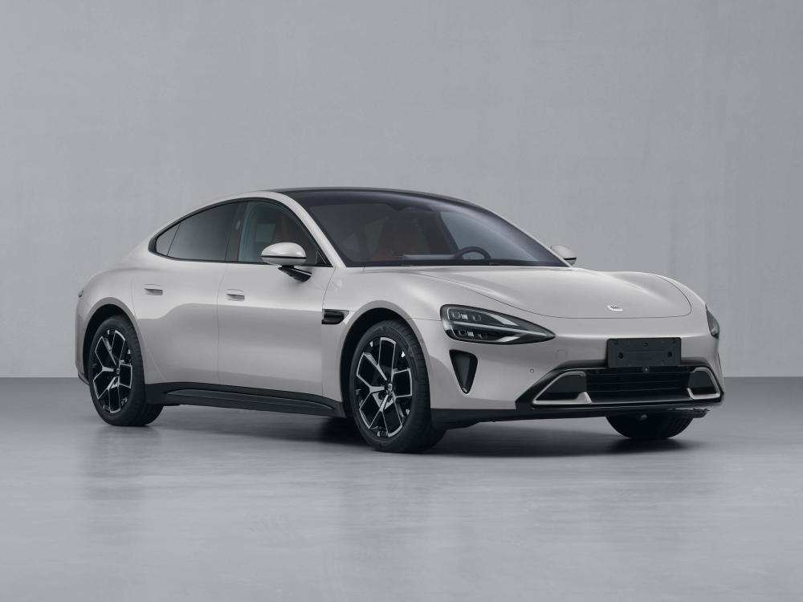
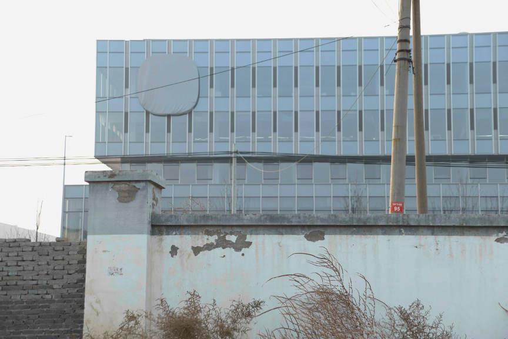
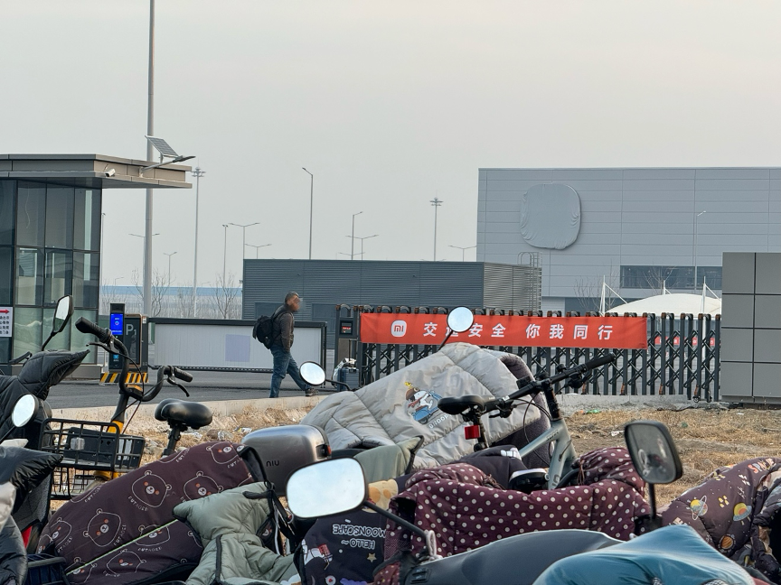
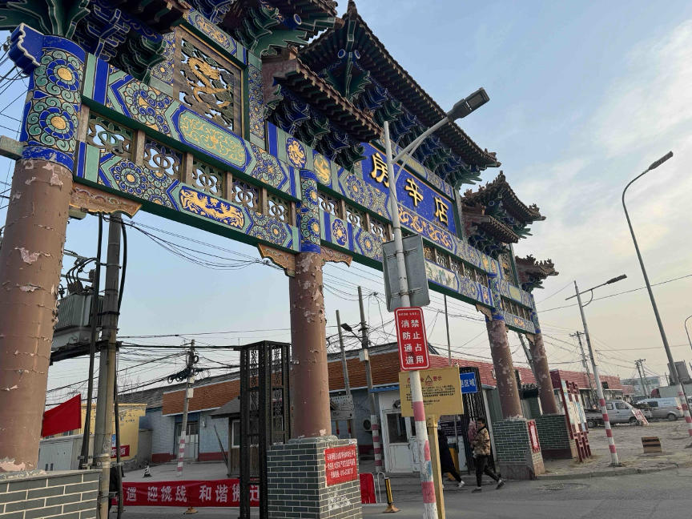
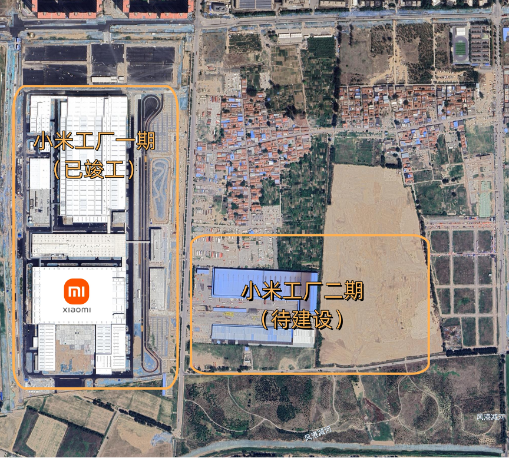

# 厂房扩建 外部扩招 小米汽车真要来了？

**财联社12月7日讯（记者 唐植潇）** 日前，有消息传出小米将会在近期再次举办一场发布会，而当下距离小米旗下子品牌红米Redmi
K70系列手机发布，不过数日。

外界猜测此次发布会登场的主角极有可能是小米汽车。记者走访了位于北京市亦庄经济开发区的小米汽车工厂，以及北京地区的小米之家线下门店。

小米汽车工厂目前已经建成一期，记者走访时，园区内部正在进行施工扩张，附近的商户表示，村里已经开始进行动员，他们所在的房辛店村地区将会被腾退出来，建设小米工厂二期工程。

小米之家的店员对记者表示，目前他们并未接到关于发布会新品的通知，即便发布新品，也不会是手机。有业内人士表示，以目前大部分小米之家的占地面积而言，尚不足以承载汽车展示和销售的业务，因此对现有门店进行扩张性装修，或者再开新店会是比较合理的选择。

**这一点也与此前小米集团总裁卢伟冰的发言相吻合。他曾表示，出于造车考虑，小米的新门店占地达到600平方米，未来小米的汽车会在小米之家销售。**

工厂施工，外部扩招

记者来小米汽车工厂附近时，发现工厂内部正处于扩张阶段。

小米汽车工厂规划地址位于马驹桥镇房辛店村西侧。原本工厂外部悬挂着的“MI”字标识，已经被蒙上一层布，此外多个出入口已经被砖石和铁皮封堵上。

与此同时，园区内部在进行大规模施工，期间有多辆工程用卡车、沙土车进出，内部挖掘机也在施工之中，施工人员对记者表示，目前园区仅留有北部入口。

附近商户对记者表示：“对面就是小米工厂，之前还挂着牌子，但不知道什么时候，他们把小米的标识用布盖上了，你要是询问招工信息，得去北面的入口。”

小米汽车工厂早先从9月份开始，就开始委托第三方人力资源公司招聘大量工人。记者从外包招聘公司获知，除了普工之外，包括测试、质检、设备维护等岗位都在扩招之中。

根据记者观察，小米汽车工厂所在的马驹桥镇房辛店村西侧，目前商户多数已经搬离，仅剩一些汽修厂和杂货商店。

房辛店待拆迁地区

该名商户对记者表示：“（小米工厂一期）最近那一片动静确实不小，可能是在扩建。附近的商户都在转让店铺，因为最近村里已经开始做动员工作了。包括我们这一片区域，还有东面的农田都要拆迁腾退，应该是给小米工厂扩展腾地方，但具体时间我也不清楚。”

按照规划，小米汽车项目将建设小米汽车总部基地和销售总部、研发总部，将分两期建设年产量30万辆的整车工厂，其中一期占地面积接近72万平方米，2022年4月开工，已于2023年6月竣工。

**商户口中的腾退区域将会被用于承载小米整车工厂二期项目。**
该项目规划面积6.06平方公里，计划2024年动工，2025年完建，各自产能均为15万辆，预计2024年首车将下线并实现量产。

此前有靠近小米汽车供应链的内部人士对记者表示：“长期来看，小米汽车的研发和生产都将会由小米自己的工厂承载，但也会复用北汽旗下的零部件供应商。”

小米之家或将成新车展厅

记者走访了北京地区的多个小米之家，发现部分小米之家确实正在装修之中，并且是扩张性的装修。

**此前小米集团总裁卢伟冰就已经透露，小米的新门店占地达到600平方米，是出于造车考虑，未来小米的汽车会在小米之家销售。**

有小米之家店员对记者表示：“最近红米Redmi K70刚刚举办完发布会，短时间内K70
Ultra不会上市，因此应该不会发布新手机产品了，至于发布什么产品，我们也没有接收到通知。”

此前数张小米之家零售店的设计图纸被公开在社交平台上，从图片中可以看出，小米之家新设计专门留出了两个区域，用来展示小米汽车。

**根据雷军此前在社交平台上发布的信息，截止到2021年10月底，全国范围内的小米之家线下门店超过一万家**
，并且第一万家小米之家门店占地面积达600平米，是首批采用小米之家4.0形象的门店之一，同时也是一家服务销售一体店。

与华为线下门店一样，小米汽车也将会成为店内展品，这也是小米汽车快速铺开销售网络最好的办法，但在渠道建设上，二者稍有不同。

根据按照华为与赛力斯分工，华为负责销售，赛力斯则负责交付和售后。具体到终端就是：体验中心、用户中心的销售展厅由华为负责，用户中心的售后及物流、仓储、交付环节由赛力斯负责。

有业内人士表示，小米的汽车零售业务同样也会采用零售中心+交付中心+服务中心的渠道形态， **但与华为不同的是，小米将会自建直营销售与服务体系**
。参考小米手机的销售模式，部分核心城市采取直营模式，其他城市采取托管直营或授权模式。全渠道规划会带来更统一和高效的服务。

记者从招聘应用中发现，小米最近开放小米汽车门店店长职位的招聘，涵盖北京、天津、广州、西安等多地。招聘方对记者表示：“需要（候选人）兼具销售和管理经验，并且最好有从零开始搭建团队的经验。我们比较偏好有新能源汽车行业一线销售经验的应聘者。”

此前小米汽车自今年7月已经开始交付中心筛选工作，首批城市包括北京、深圳、成都和西安等，要求候选场地至少有120个车位，建筑不能低于3000平方米。

**有小米内部人士对记者透露称：“现有小米渠道会只是小米汽车的销售渠道之一。”**

此前在工信部网站备案的两款小米汽车“SU7 Max”和“SU7
Pro”，均为纯电动，但小米并未放弃增程式技术路线。业内人士认为，此举是小米为了提升销量而做出的务实策略。

在招聘平台上，小米也针对增程相关的研发岗位开放招聘，包括增程系统设计开发工程师等。此外，混动相关的岗位还有燃油系统工程师、排气系统工程师等。

根据中国汽车工业协会的统计数据，今年前10个月新能源车合计销量728万辆，同比增速为37.8%，其中纯电动车型1到10月销量516万辆，同比增速25.2%，增速不及同比高达82.6%包括增程在内的广义插电式混合动力汽车。

在最近的小米2023年Q3业绩会上，小米集团总裁卢伟冰在接受新消费日报记者采访时表示：“雷总本人并未表述过初期小米汽车销量可达10万辆，但小米造车目标是花15-20年的时间进入世界前五。”

