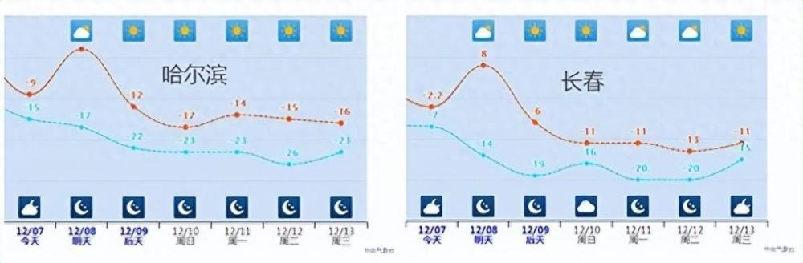
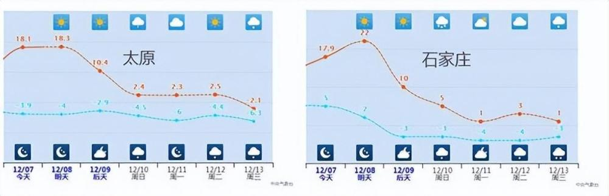
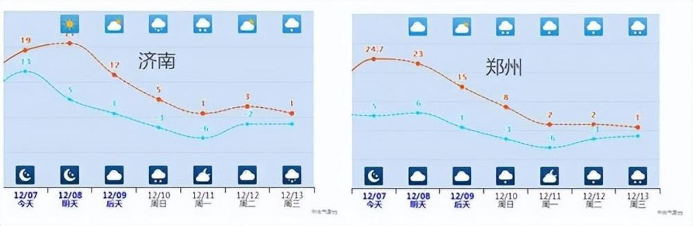
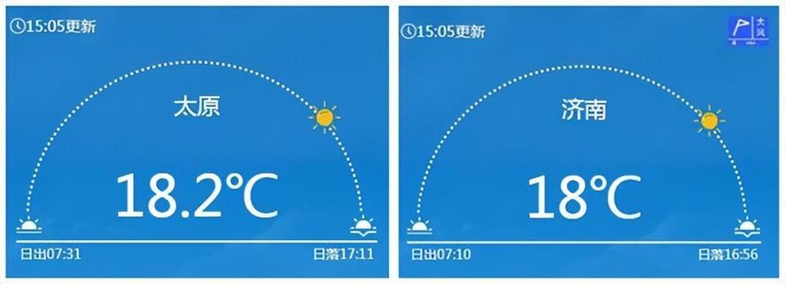
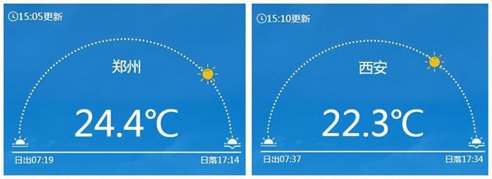
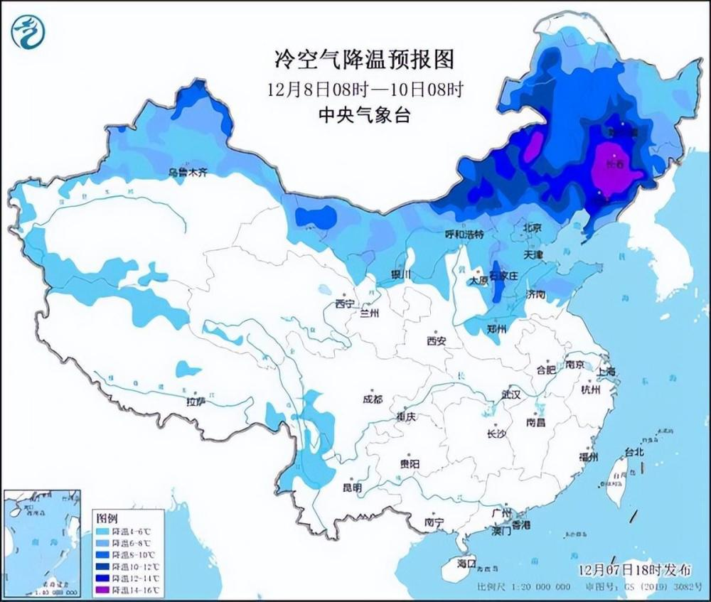
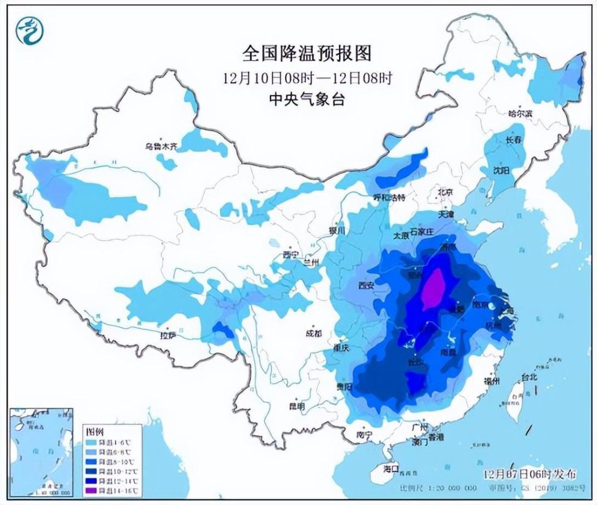
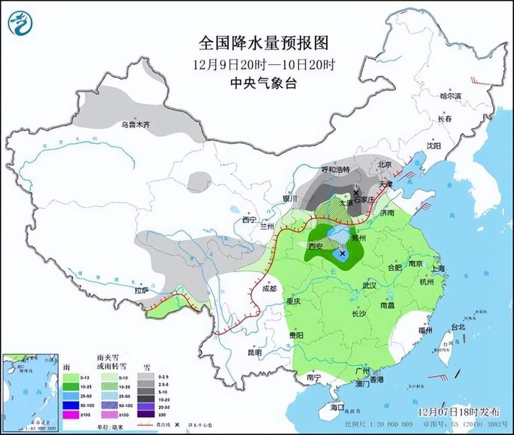
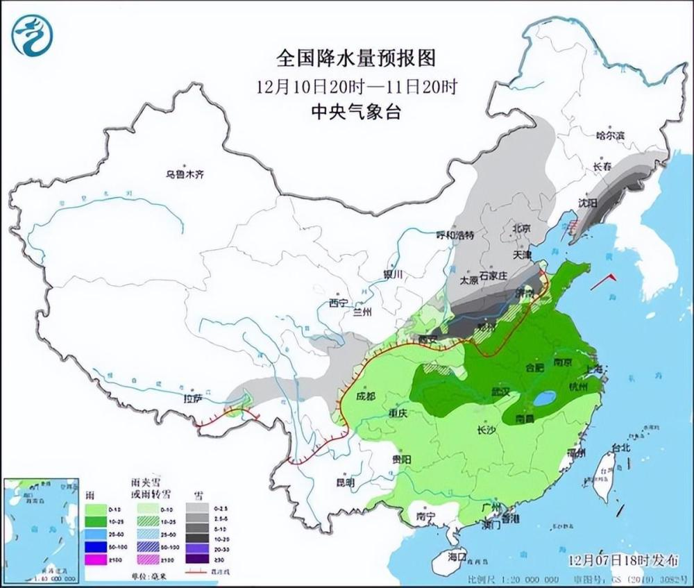

# 多地累计降温超20℃！俯冲式气温暴跌即将开启 大范围雨雪也将铺展开

欢迎来到天气游乐园，接下来，你将体验到的是超猛气温过山车。

气温过山车·步骤1

先经历破纪录式升温

坐过过山车的朋友都知道，过山车一开始，先会经历一段明显的爬升。气温过山车的套路也是一样的。

气温这一爬升，还升高到不得了的程度！截至今天16时，内蒙古西部、宁夏、陕西、山西、河北南部、河南、山东北部、湖北、湖南北部等地不少站点的气温都打破了当地12月最高气温纪录。

大城市中，像太原、济南、郑州、西安等都迎来了当地有气象记录以来12月最暖的一天。这是12月该有的气温吗？完全没有冬天的样子。

气温爬坡上升还没到顶点，明天，12月同期罕见的暖热还将持续，而且还可能更暖。最高气温10℃线将到达辽宁北部，20℃线深入到河北南部。

气温过山车·步骤2

俯冲式暴跌 多地累计降温超20℃

爬坡之后，过山车最刺激的时刻来了，在冷空气影响下，中东部多地将经历俯冲式降温。

周六，东北中南部、华北北部和东部、黄淮北部最高气温将普遍下降8~12℃，局地降幅超过15℃；周日华北南部、黄淮最高气温还会下降8~14℃。

11-12日降温重心继续南压，江淮、江南最高气温也会普遍下降8~14℃。

东北、华北南部、黄淮北部不少地方两三天最高气温累计降幅将超过20℃！

看看这些城市最高气温降温有多猛↓↓

长春8℃→→-13℃ 累计降幅21℃

石家庄22℃→→1℃ 累计降幅21℃

郑州23℃→→2℃ 累计降幅21℃

济南21℃→→1℃ 累计降幅20℃

沈阳13℃→→-7℃ 累计降幅20℃

哈尔滨2℃→→-17℃ 累计降幅19℃

（数据来源：中央气象台7日20时预报）

在气温俯冲式暴跌过程中，还有雪花、雨滴啪啪啪打在你脸上，那将是冷上加冷。

这次降温将伴随着大范围的雨雪，10-11日，陕西北部、华北、东北地区中南部有小到中雪，陕西北部、华北南部、东北地区东南部等地部分地区有大雪，局地暴雪；黄淮中北部、陕西中南部有雨夹雪；西南地区东部、黄淮南部、江汉、江淮、江南、华南北部等地有小到中雨，局地大雨。

气温过山车十分刺激，大家要准备好厚衣服坐稳了。还有雨雪来凑热闹，也要注意防范。

来源：中国天气网

