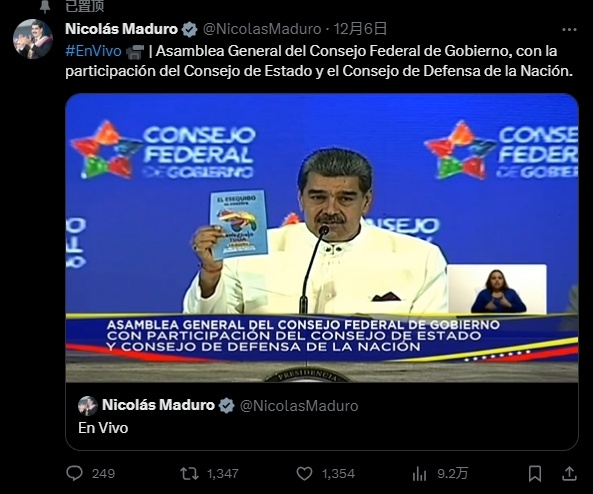
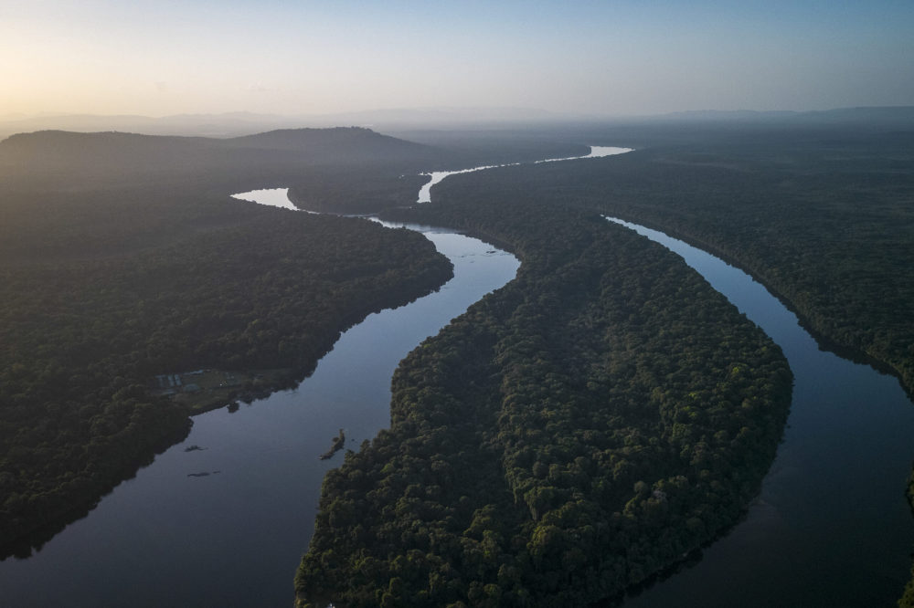

# 委内瑞拉就埃塞奎博地区颁布一系列措施，西媒：已调动军队

（观察者网讯）围绕着埃塞奎博地区的领土争端，委内瑞拉和圭亚那之间紧张局势持续升级。

据西班牙《国家报》和美国有线电视新闻网（CNN）12月6日报道，委内瑞拉总统马杜罗已向圭亚那边境派遣军队，准备对埃塞奎博地区提出主权要求。此前一天（5日），马杜罗公布了新国家地图，并宣布包括资源勘探开采权限制在内的一系列措施，以进一步申明对埃塞奎博地区的主权。

_委内瑞拉总统马杜罗5日发表全国电视讲话，推文截图_

当地时间12月3日，委内瑞拉就是否并入埃塞奎博地区举行全民公投。马杜罗在5日的演讲中表示，委内瑞拉全国有近1040万的民众投票支持国家对埃塞奎博地区的领土主张。

西班牙《国家报》报道称，随后，马杜罗政府采取一系列措施，努力执行全民公投的结果，其中就包括向圭亚那边境派遣一直军事特遣队。报道没有提及这支特遣队的具体数量和执行任务。俄罗斯媒体RT则以“委内瑞拉动员军队”为题，报道了这一军事活动。

“我们希望和平营救埃塞奎博人，我们的埃塞奎博地区实际上被大英帝国及其继承人占领，他们摧毁了这个地区。”马杜罗在全国电视讲话中，展示了一幅新的委内瑞拉官方地图，其中包括埃塞奎博地区。他表示，地图将分发到全国所有学校和公共建筑。

马杜罗签署了一项“总统令”，成立了“埃塞奎博地区国防高级委员会”。根据当天通过的一项特别法律，委内瑞拉还将在埃塞奎博地区建立一个新的行政单位。此外，委内瑞拉将在埃塞奎博地区进行人口普查，该地区内的所有居民都将获得委内瑞拉国籍。

值得注意的是，马杜罗指示委内瑞拉国家石油公司（PDVSA）绘制埃塞奎博地区的资源勘探和开采地图。他下令国民议会起草一项法律，禁止圭亚那在该地区划定石油开采权，并要求所有未获许可的公司限期三个月撤离。《国家报》提及，美国埃克森美孚公司在埃塞奎博地区有一个海上作业平台。

_埃塞奎博地区（资料图）_

同日，圭亚那总统阿里接受法媒“France
24”采访时称：“我们非常担心马杜罗和委内瑞拉政府在我们地区制造不稳定，在邻国的心中制造恐惧和恐怖……我们正在与美国国务院和国防部的伙伴合作，确保圭亚那对一切可能性做好准备，避免措手不及。”

另据法新社报道，圭亚那在6日的一份声明中表示，圭亚那和委内瑞拉两国外长当天通话，“讨论了领土争端”。声明称，这次讨论是应圭亚那的要求进行的，最终双方同意“保持沟通渠道畅通”。

 _埃塞奎博地区现为圭亚那实际管辖，西班牙《国家报》制图_

现为圭亚那实际管辖的埃塞奎博地区位于圭亚那中部埃塞奎博河以西，与委内瑞拉领土相连，面积约15.9万平方公里，占圭亚那领土面积三分之二。两国对埃塞奎博地区归属问题的争议由来已久，路透社称，圭亚那近年来在该地区海上边界附近发现石油和天然气后，两国的争端再度升级。

1899年，美英两国在巴黎谈判，将该地区管辖权划给英国殖民统治下的圭亚那。委内瑞拉历届政府均不承认这一“国际仲裁”。1966年2月17日，英国政府和委内瑞拉政府在日内瓦谈判，双方达成协议，决定成立一个委员会，处理和解决埃斯奎博地区的争端。同年5月，圭亚那摆脱英国殖民统治宣布独立，并承认1966年的《日内瓦协议》。委内瑞拉政府则承认圭亚那的独立，但是，保留对埃斯奎博地区的主权要求。

2015年3月，美国埃克森美孚公司在埃塞奎博地区发现储量超130亿桶的石油资源，并从5月开始与圭亚那政府合作在这一海域进行石油勘探和开采。委内瑞拉随后颁布法令宣布对埃塞奎博地区附近海域拥有主权，并将该海域纳入新的国防计划，引起圭亚那政府不满。

2018年2月，联合国秘书长古特雷斯表示，鉴于一直以来联合国调解未果，根据圭委签署的《日内瓦协议》授予联合国秘书长的职权，选择将圭委领土争端提交国际法院仲裁，联合国将作为补充机制。2018年4月，圭向国际法院提交仲裁申请书。委对此强烈反对，坚持以双边谈判解决有关争端。

2020年12月，国际法院裁定，该机构有权对埃塞奎博地区争议进行裁决。委内瑞拉对此表示谴责。2022年3月，圭亚那向国际法院提交与委领土争端法律依据的辩诉书。同年6月，委政府向国际法院递交《初步反对意见》书，否认1899年仲裁判决在国际法院上作为证据的可采性。2023年4月，委方《初步反对意见》书被国际法院驳回。

在此背景下，今年9月，委内瑞拉国民议会批准就埃塞奎博地区的归属举行全民公投；12月3日，全民公投正式举行。圭亚那方面则指责委举行公投是“吞并行为”。作为委内瑞拉和圭亚那的邻国，巴西也对紧张局势升级表示担忧。巴西国防部11月29日表示，正在监测局势，并加强了北部边境的“防御行动”。

当地时间12月6日，白宫国家安全委员会发言人约翰·柯比在记者会上表示：“这令人担忧，我们正在非常、非常、非常密切地关注此事。我们显然不想看到这里发生任何暴力或冲突。”当被问及美国总统拜登是否关注当前局势时，白宫新闻秘书让·皮埃尔回答称：“显然总统知道正在发生什么。”

12月6日，我外交部发言人汪文斌指出：“委内瑞拉和圭亚那都是中国的好朋友。中方一贯尊重各国的主权和领土完整，历来支持委内瑞拉和圭亚那两国通过友好协商，妥善解决边界划分问题，这符合委圭两国人民的利益，也有利于拉美和加勒比地区的稳定、合作与发展。”

**本文系观察者网独家稿件，未经授权，不得转载。**

